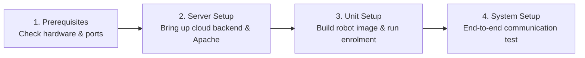

# Panduan Penyiapan dan Deployment

<RoleBadge role="technician" />

Bagian ini berisi dokumentasi teknis untuk **teknisi, insinyur sistem, dan installer lapangan** yang mengonfigurasi perangkat keras dan perangkat lunak MSD700.

Setiap prosedur menyertakan perintah shell langkah demi langkah, output yang diharapkan, template konfigurasi, dan penjelasan arsitektur.

<LinkCards>
  <LinkCard icon="✅" title="Prasyarat" details="Ukuran perangkat keras, kebutuhan komputasi, versi OS, dan aturan firewall port jaringan." link="/id/setup/prerequisites" />
  <LinkCard icon="🖥️" title="Penyiapan Server" details="Deployment cloud produksi langkah demi langkah: Docker Compose, reverse proxy Apache, dan SSL." link="/id/setup/server-setup" />
  <LinkCard icon="📡" title="Penyiapan Unit" details="Instal dan konfigurasi robot fisik pada SBC NVIDIA Jetson, build runtime, dan enrolment." link="/id/setup/unit-setup" />
  <LinkCard icon="🔗" title="Penyiapan Sistem" details="Checklist integrasi menyeluruh, verifikasi jaringan, dan serah terima ke operator." link="/id/setup/system-setup" />
  <LinkCard icon="🐳" title="Referensi Docker" details="Referensi lengkap untuk profil Docker Compose, variabel lingkungan, dan volume mount." link="/id/setup/docker-reference" />
  <LinkCard icon="📶" title="Hotspot Wi-Fi + Klien" details="Konfigurasi hotspot Wi-Fi onboard, mode Access Point, dan jembatan klien jaringan lokal." link="/id/setup/wifi-hotspot" />
  <LinkCard icon="🧰" title="Pemeliharaan" details="Rotasi log rutin, rotasi keyring JWT, pembaruan Certbot Let's Encrypt, dan backup." link="/id/setup/maintenance" />
  <LinkCard icon="🛠️" title="Pemecahan Masalah Teknisi" details="Diagnosis dan penyelesaian masalah perangkat keras, container, broker MQTT, dan sensor." link="/id/setup/troubleshooting" />
</LinkCards>

## Urutan Deployment yang Disarankan

Platform MSD700 menggunakan model dua mesin (Server + Unit Fisik). Ikuti urutan berikut untuk instalasi baru:

1. [Prasyarat](/id/setup/prerequisites): Verifikasi ukuran komputasi, perangkat periferal Jetson, dan aturan firewall jaringan.
2. [Penyiapan Server](/id/setup/server-setup): Aktifkan tumpukan (stack) server cloud terlebih dahulu agar unit fisik memiliki endpoint pusat untuk melakukan enrolment.
3. [Penyiapan Unit](/id/setup/unit-setup): Build container robot pada SBC Jetson dan selesaikan handshake enrolment kriptografis otomatis.
4. [Penyiapan Sistem](/id/setup/system-setup): Jalankan checklist verifikasi operasional menyeluruh dengan 10 poin.

Setelah instalasi awal, lihat [Pemeliharaan](/id/setup/maintenance) dan [Pemecahan Masalah](/id/setup/troubleshooting) untuk perawatan armada berkelanjutan.
