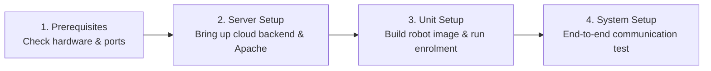

# Panduan Penyiapan dan Penerapan

<RoleBadge role="technician" />

Bagian ini berisi dokumentasi teknis untuk **teknisi, teknisi sistem, dan pemasang lapangan** yang mengonfigurasi perangkat keras dan perangkat lunak MSD700.

Setiap prosedur mencakup perintah shell langkah demi langkah, keluaran yang diharapkan, templat konfigurasi, dan penjelasan arsitektur.

<LinkCards>
  <LinkCard icon="✅" title="Prasyarat" details="Ukuran perangkat keras, persyaratan komputasi, versi OS, dan aturan firewall port jaringan." link="/id/setup/prerequisites" />
  <LinkCard icon="🖥️" title="Pengaturan Server" details="Penerapan cloud produksi selangkah demi selangkah: Docker Compose, Apache reverse proxy, dan SSL." link="/id/setup/server-setup" />
  <LinkCard icon="📡" title="Pengaturan Unit" details="Instal dan konfigurasikan robot fisik pada NVIDIA Jetson SBCs, build runtime, dan daftar." link="/id/setup/unit-setup" />
  <LinkCard icon="🔗" title="Pengaturan Sistem" details="Daftar periksa integrasi ujung ke ujung, verifikasi jaringan, dan serah terima operator." link="/id/setup/system-setup" />
  <LinkCard icon="🐳" title="Referensi Docker" details="Referensi lengkap untuk profil Docker Compose, variabel lingkungan, dan pemasangan volume." link="/id/setup/docker-reference" />
  <LinkCard icon="📶" title="Hotspot WiFi + Klien" details="Konfigurasikan hotspot Wi-Fi onboard, mode Titik Akses, dan jembatan klien jaringan lokal." link="/id/setup/wifi-hotspot" />
  <LinkCard icon="🧰" title="Pemeliharaan" details="Rotasi log rutin, rotasi keyring JWT, pembaruan dan pencadangan Certbot Let's Encrypt." link="/id/setup/maintenance" />
  <LinkCard icon="🛠️" title="Pemecahan Masalah Teknisi" details="Mendiagnosis dan menyelesaikan masalah perangkat keras, kontainer, broker MQTT, dan sensor." link="/id/setup/troubleshooting" />
</LinkCards>

## Kemajuan Penerapan yang Direkomendasikan

Platform MSD700 menggunakan model dua mesin (Server + Unit Fisik). Ikuti urutan ini untuk instalasi baru:

1. [Prasyarat](/id/setup/prerequisites): Verifikasi ukuran komputasi, periferal perangkat keras Jetson, dan aturan firewall jaringan.
2. [Pengaturan Server](/id/setup/server-setup): Tampilkan tumpukan server cloud terlebih dahulu sehingga unit fisik memiliki titik akhir pusat untuk didaftarkan.
3. [Penyiapan Unit](/id/setup/unit-setup): Bangun wadah robot di Jetson SBC dan selesaikan jabat tangan pendaftaran kriptografi otomatis.
4. [Pengaturan Sistem](/id/setup/system-setup): Jalankan daftar periksa verifikasi operasional ujung ke ujung 10 poin.

Setelah instalasi awal, lihat [Pemeliharaan](/id/setup/maintenance) dan [Pemecahan Masalah](/id/setup/troubleshooting) untuk pemeliharaan armada yang sedang berlangsung.