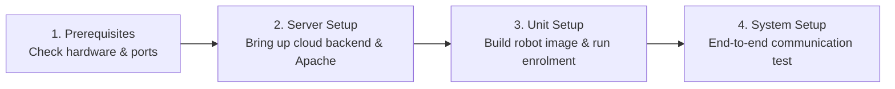

# Setup and Deployment Guide

<RoleBadge role="technician" />

This section contains technical documentation for **technicians, system engineers, and field installers** configuring MSD700 hardware and software.

Every procedure includes step-by-step shell commands, expected outputs, configuration templates, and architectural explanations.

<LinkCards>
  <LinkCard icon="✅" title="Prerequisites" details="Hardware sizing, compute requirements, OS versions, and network port firewall rules." link="/id/setup/prerequisites" />
  <LinkCard icon="🖥️" title="Server Setup" details="Step-by-step production cloud deployment: Docker Compose, Apache reverse proxy, and SSL." link="/id/setup/server-setup" />
  <LinkCard icon="📡" title="Unit Setup" details="Install and configure the physical robot on NVIDIA Jetson SBCs, build runtime, and enrol." link="/id/setup/unit-setup" />
  <LinkCard icon="🔗" title="System Setup" details="End-to-end integration checklist, network verification, and operator handover." link="/id/setup/system-setup" />
  <LinkCard icon="🐳" title="Docker Reference" details="Exhaustive reference for Docker Compose profiles, environment variables, and volume mounts." link="/id/setup/docker-reference" />
  <LinkCard icon="📶" title="WiFi Hotspot + Client" details="Configure onboard Wi-Fi hotspot, Access Point mode, and local network client bridge." link="/id/setup/wifi-hotspot" />
  <LinkCard icon="🧰" title="Maintenance" details="Routine log rotation, JWT keyring rotation, Certbot Let's Encrypt updates, and backups." link="/id/setup/maintenance" />
  <LinkCard icon="🛠️" title="Technician Troubleshooting" details="Diagnose and resolve hardware, container, MQTT broker, and sensor issues." link="/id/setup/troubleshooting" />
</LinkCards>

## Recommended Deployment Progression

The MSD700 platform uses a two-machine model (Server + Physical Units). Follow this sequence for new installations:

1. [Prerequisites](/id/setup/prerequisites): Verify compute sizing, Jetson hardware peripherals, and network firewall rules.
2. [Server Setup](/id/setup/server-setup): Bring up the cloud server stack first so physical units have a central endpoint to enrol against.
3. [Unit Setup](/id/setup/unit-setup): Build the robot container on the Jetson SBC and complete the automated cryptographic enrolment handshake.
4. [System Setup](/id/setup/system-setup): Execute the 10-point end-to-end operational verification checklist.

After initial installation, refer to [Maintenance](/id/setup/maintenance) and [Troubleshooting](/id/setup/troubleshooting) for ongoing fleet upkeep.
