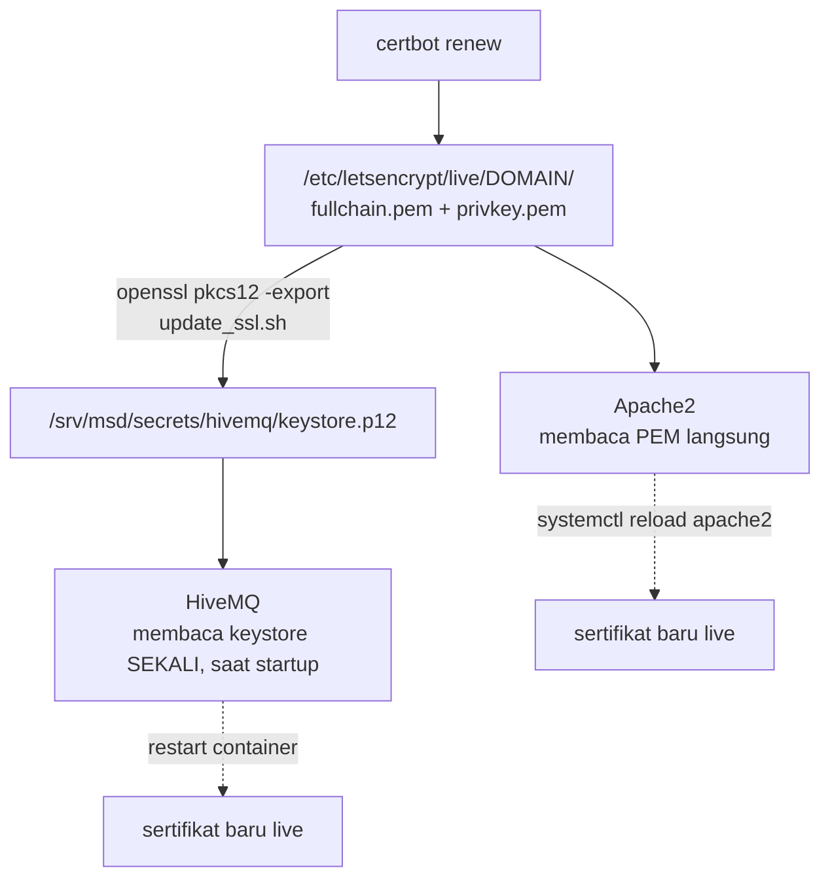

# Maintenance

<RoleBadge role="technician" />

Perawatan rutin sistem MSD700 yang sudah deploy. Tiap tugas menyebut mesinnya. Arti perintah Docker: lihat [Referensi Docker](/id/setup/docker-reference).

## Checklist rutin

| Tugas | Seberapa sering | Di mana | Catatan |
| --- | --- | --- | --- |
| Rotasi keyring JWT | Tiap beberapa bulan, atau segera setelah curiga bocor | Server | [Rotasi secrets](#rotasi-secrets) |
| Perpanjang sertifikat TLS | Sebelum kedaluwarsa | Server | [Sertifikat](#sertifikat). `certbot renew` saja **tidak** mengupdate HiveMQ |
| Cek relay armada jalan | Sesekali | Server | `docker ps --filter name=unit_relays`. Di mode fleet (default) satu relay mati menjatuhkan se-armada |
| Prune key kedaluwarsa | Setelah grace window rotasi | Server | `./scripts/secrets.sh prune --dev` |
| Cek disk Docker | Bulanan | Keduanya | `docker system df`, lalu prune image/build cache |
| Cek relay TURN | Setelah tiap ubahan jaringan/router | Server | [Relay TURN](#relay-turn) |
| Update software | Tiap rilis tiba | Keduanya | [Updating](#updating) |
| Cek ukuran log ROS | Manual hanya bila unit bermasalah | Unit | Janitor menanganinya otomatis ([bawah](#housekeeping-log)) |

## Housekeeping log

Container robot menjalankan janitor yang membatasi log ROS di 512 MB, dicek tiap 60 detik. Di atas batas, file terbesar dipangkas dulu. Yang diawasi folder log **di dalam container** (`ROS_LOG_DIR`, lalu `$ROS_HOME/log`, lalu `$HOME/.ros/log`).

Dari **host unit**, lihat sesi launcher aslinya (simulasi: `msd700-simulator`):

```bash
docker exec -it msd700 tmux attach -t robot_services
tail -F src/ros-web-ui/logs/log_janitor.log   # dari folder msd700_noetic
```

Dua sistem log lain, terpisah dari log ROS:

- Log launcher di `src/ros-web-ui/logs/`: lima file 10 MB per service bila `rotatelogs` ada, `tee` tanpa batas bila tidak.
- Stdout/stderr Docker: tiap service unit dibatasi 20 MB x 3. Di server, hanya `coturn` menyetel batas itu; service lain memakai default daemon.

`ROS_LOG_CAP_MB` dan `ROS_LOG_SWEEP_SECONDS` hanya mengonfigurasi launcher dalam. Menyetelnya di host atau `docker/.env` tidak berpengaruh.

## Rotasi secrets

::: info Kenapa rotasi, bukan ganti langsung?
Satu secret bersama berarti menggantinya me-logout semua operator dan robot sekaligus. Keyring menandatangani token baru dengan key baru sambil tetap **menerima** key lama selama grace window (default 48 jam). Rotasi tak terasa bagi yang sudah tersambung.
:::

Backend, media, dan signalling dev me-mount keyring **dev**. Dari `ros-web-ui`, memakai folder secrets yang sama dengan Compose:

```bash
./scripts/secrets.sh status --dev
./scripts/secrets.sh rotate --dev
```

Setelah grace window:

```bash
./scripts/secrets.sh prune --dev
```

Tanpa `--dev` yang tersentuh `jwt_keyring.json`, yang tidak di-mount produksi. Produksi tidak punya mount keyring; membuat keyring prod saja tidak mengonfigurasi apa-apa. Service lokal unit memakai `JWT_SECRET` terpisah di `docker/.env` unit.

File key dibaca sekali saat proses start. Setelah rotasi, recreate tiga consumer dev agar memuat file baru yang sama (restart biasa di dalam container tidak cukup):

```bash
docker compose --profile server_dev up -d --no-deps --force-recreate nakayama_cloud_dev nakayama_media_dev nakayama_signalling_dev
```

Ini juga me-restart relay dev, sempat memutus unit dev. Token tetap valid selama grace window, tapi socket tetap drop saat recreation.

## Sertifikat

Apache membaca file PEM Let's Encrypt langsung. HiveMQ membaca keystore PKCS#12 yang **dibuat terpisah**. Memperpanjang PEM tidak pernah mengupdate HiveMQ dengan sendirinya.



| Konsumen | Mendapat renewal dengan | Otomatis? |
| --- | --- | --- |
| Apache | reload setelah PEM diperpanjang | Tergantung setup certbot host |
| HiveMQ | rebuild keystore, lalu restart broker | Tidak. `update_ssl.sh` tidak me-restart apa-apa |

```bash
sudo ./source/dependencies/ssl_update/update_ssl.sh   # renew + rebuild keystore
docker compose --profile server_dev  up -d --no-deps --force-recreate hivemq_dev
docker compose --profile server_prod up -d --no-deps --force-recreate hivemq   # jam maintenance!
```

::: danger Restart broker memutus semua unit di broker itu
Kehilangan ping operator lebih dari 10 detik bisa menaikkan `/emergency_pause`. Jadwalkan restart broker mana pun di sekitar operasi aktif, bukan cuma operasi produksi. Kedua profile memakai file keystore yang **sama**, jadi renewal tidak pernah terisolasi dev.
:::

`update_ssl.sh` terkunci ke `msd.nglobal.jp` dan `/srv/msd/secrets/hivemq/keystore.p12`. Password export harus cocok dengan config broker. Jangan print di diagnostik. Cek expiry yang disajikan masing-masing untuk HTTPS dan MQTT sebelum dan sesudah.

## Relay TURN

`coturn` **hanya produksi**. Alasan lengkap: [Referensi Docker](/id/setup/docker-reference#coturn-service-hanya-produksi).

```bash
docker compose --profile turn up -d coturn      # start/restart hanya relay
docker compose logs -f coturn                   # awasi alokasi
docker compose --profile turn stop coturn       # stop hanya relay
```

Setelah mengubah `.env`, terapkan dengan `up -d coturn` (`restart` biasa mempertahankan environment lama).

| Yang berubah | Yang dilakukan |
| --- | --- |
| Alamat LAN host | Update `TURN_LISTENING_IP` + `TURN_EXTERNAL_IP`, restart relay, cek forward router |
| IP publik | Update separuh publik `TURN_EXTERNAL_IP`, restart relay |
| `TURN_USER` / `TURN_PASSWORD` | Restart relay, update env `camera_client` unit (`TURN_USERNAME`/`TURN_CREDENTIAL`), rebuild image dashboard cloud (bundle memanggang kredensial yang sama) |
| Router/firewall | Konfirmasi ulang UDP+TCP 3478 dan range relay UDP mencapai `TURN_LISTENING_IP` |

::: info Gejala yang dikenali
Kamera jalan di LAN yang sama, tidak pernah di luar. Itu relay, bukan kamera: signalling sukses, jalur media gagal.
:::

## Backup

| Data | Di mana | Bagaimana |
| --- | --- | --- |
| Peta, rute, area, playlist | MySQL + file peta di `/srv/msd/media/map` | **Profile backup** di admin console: satu `.tar.gz` per profile, restore aditif |
| Data satu unit (ganti hardware, arsip per-unit) | Sumber sama, satu unit | Kolom `scope` backup mengarsipkan satu unit |
| Keyring JWT / keystore TLS | `/srv/msd/secrets` | Tidak di backup aplikasi; backup di level filesystem |

::: warning
File backup masuk ke `/srv/msd/media/backup` (`/srv/msd/media/backup_dev` untuk dev). Bila folder belum ada atau tidak writable oleh user aplikasi, backup gagal (lihat [Troubleshooting](/id/setup/troubleshooting)).
:::

## Updating

### Server

```bash
git pull
docker compose --profile server_dev  build && docker compose --profile server_dev  up -d   # tes dulu
docker compose --profile server_prod build && docker compose --profile server_prod up -d
```

Recreate backend me-restart container `unit_relays` yang ada (default mode fleet). Tanpa langkah relay manual, tapi data plane tiap unit blip sebentar dan pulih sendiri. Relay yang hilang tidak pernah dibuat backend; hanya Compose yang membuatnya.

Mode legacy (`UNIT_CONTAINERS_ENABLED=true`): container `rosweb_unit_*` yang jalan diadopsi saat startup, tapi node ROS-nya tidak didaftarkan ulang ke master baru. List satu environment saja sebelum menyentuh apa pun (nama prod berakhir `_nakayama`, dev `_nakayama_dev`):

```bash
docker ps --filter "name=rosweb_unit_" --format '{{.Names}}' | grep '_nakayama_dev$'
```

### Unit

```bash
git pull
# src/ berisi clone biasa, bukan submodule: pull masing-masing
for d in src/*/; do git -C "$d" pull; done
git -C src/msd700_robot submodule update --init --recursive
```

Lalu rebuild/restart di jam maintenance, mempertahankan flag `--dev` / `--simulator` unit:

- **Container robot** me-mount `src/`: edit Python dan launch berlaku di run launcher berikutnya, tanpa rebuild. Ubahan C++, message, dan paket baru butuh build catkin (`up --build`); `up` biasa melewati build bila `devel/setup.bash` ada.
- **Stack server lokal** meng-copy source ke image: pakai `local-build` lalu `up` untuk edit itu.
- Container robot yang jalan mempertahankan image lama setelah `build`. Rencanakan `down` + `up -d` yang cocok (flag sama) untuk menggantinya. Ini memutus robot dan service lokal; tambah `--no-autostart` bila tidak ingin mengubah perilaku boot.

Tidak ada jalur firmware terpisah di sini untuk motor controller Arduino; itu re-flash manual.

## Housekeeping disk

```bash
docker system df                 # apa memakai space
docker image prune -a            # image tak dipakai container
docker builder prune             # build cache
docker volume ls                 # lihat SEBELUM menghapus apa pun
```

::: danger Jangan `docker compose down -v` sembarangan
`-v` menghapus named volume, termasuk `ros_webui_hivemq_data_prod` (retained message, sesi client, antrean QoS>0). Untuk membersihkan broker, hapus volume itu by name, dengan sengaja.
:::

## Terkait

- [Referensi Docker](/id/setup/docker-reference): arti tiap perintah di atas
- [Troubleshooting](/id/setup/troubleshooting): bila maintenance menemukan masalah
- [Setup Sistem](/id/setup/system-setup): referensi topologi
