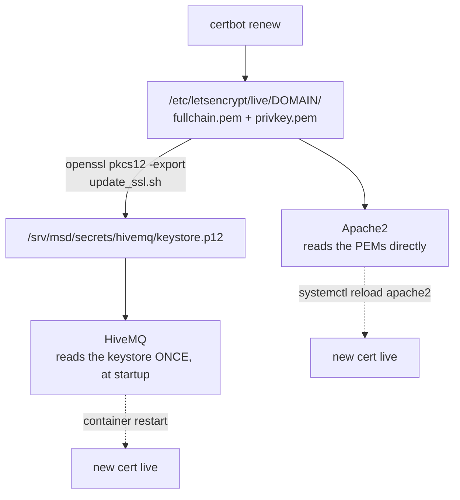

# Maintenance

<RoleBadge role="technician" />

Routine maintenance tasks for a deployed MSD700 system, split by which machine they apply to. For
what any of the Docker commands below are doing, see [Docker Reference](/id/setup/docker-reference).

## Routine checklist

| Task | Frequency | Where | Notes |
| --- | --- | --- | --- |
| Check `~/.ros/log` disk usage | Passive: a janitor does this automatically | Unit | See [Log housekeeping](#log-housekeeping); only worth checking by hand if a unit is offline for other reasons |
| Rotate the JWT signing keyring | Every few months, or immediately after a suspected leak | Server | See [Rotating secrets](#rotating-secrets) |
| Renew the TLS certificate | Before expiry | Server | See [Certificates](#certificates). A plain `certbot renew` does **not** update the HiveMQ keystore |
| Check for idle per-unit containers that should have been reaped | Occasionally | Server | `docker ps --filter name=rosweb_unit_`: one still running long after its unit went idle is worth investigating, not restarting blindly |
| Prune expired keys from the JWT keyring | After a rotation's grace window passes | Server | `./scripts/secrets.sh prune` |
| Check Docker disk usage | Monthly | Both | `docker system df`, then `docker image prune -a` and `docker builder prune` |
| Check the TURN relay is still relaying | After any network or router change | Server | See [The TURN relay](#the-turn-relay) |
| Update the software stack | As releases land | Both | See [Updating](#updating) |

## Log housekeeping

ROS 1 does not rotate its own logs (`~/.ros/log`), and left alone they grow without bound: one unit
with an unreachable cloud broker measured about 860 MB/day, almost all of it in `rosout.log`, written
straight onto the Jetson's root filesystem. Every unit runs a log janitor automatically as one of its
tmux windows, capping that tree (512 MB by default, swept every 60 seconds) and clearing the previous
session's logs at startup.

```bash
# Watch what it's doing:
tmux attach -t robot_services   # window: log_janitor
tail -f ros-web-ui/logs/log_janitor.log
```

You generally don't need to touch this. Raise `ROS_LOG_CAP_MB` only if you're deliberately chasing
something in `rosout.log` and have the disk budget for it.

## Rotating secrets

```bash
./scripts/secrets.sh status          # see what's active, without printing secret values
./scripts/secrets.sh rotate          # mint a new active key; the old one stays valid for a grace window
# after the grace window has passed:
./scripts/secrets.sh prune
```

::: info Why rotate instead of just replacing the secret?
A single shared secret makes rotation a blunt instrument: overwrite it, and every logged-in operator
and every connected robot is rejected at once. The keyring format signs new tokens with one active
key while still *accepting* the previous one for a configurable grace window (48 hours by default),
so a rotation is invisible to anyone already connected.
:::

After rotating, restart the services that read the keyring so they pick up the new active key:

```bash
docker compose --profile server_dev  restart nakayama_cloud_dev nakayama_media_dev nakayama_signalling_dev
docker compose --profile server_prod restart nakayama_cloud nakayama_media nakayama_signalling
```

## Certificates

Two different things consume the Let's Encrypt certificate, and only one of them renews itself.



| Consumer | Picks up a renewal by | Automatic? |
| --- | --- | --- |
| Apache | reloading | Yes, certbot's own renewal hook |
| HiveMQ | rebuilding the PKCS#12 keystore, then restarting the container | **No** |

```bash
sudo ./source/dependencies/ssl_update/update_ssl.sh   # renew + rebuild the keystore
docker compose --profile server_dev  restart hivemq_dev
docker compose --profile server_prod restart hivemq   # maintenance window, see below
```

::: danger A prod broker restart trips the safety watchdog fleet-wide
HiveMQ takes around 14 seconds to come back, which is longer than the 10 second ping watchdog. Every
robot mid-operation raises `/emergency_pause` and stops. Do prod broker restarts in a maintenance
window, not opportunistically. The dev broker has no such constraint.
:::

::: warning The keystore has never renewed itself
There is no certbot deploy hook wired to `update_ssl.sh`. Until there is, a certificate renewal
leaves Apache correct and the MQTT broker serving an expired certificate, and the visible symptom is
the whole fleet dropping offline at once with TLS errors in the robots' logs. Put the expiry date in
a calendar.
:::

## The TURN relay

`coturn` is **production only**. See
[Docker Reference](/id/setup/docker-reference#coturn-the-production-only-service) for the full
reasoning.

```bash
docker compose --profile turn up -d coturn      # start or restart just the relay
docker compose logs -f coturn                   # watch allocations
docker compose --profile turn stop coturn       # stop just the relay
```

Its logs are capped at three 20 MB files, so an unauthenticated scanner hammering port 3478 cannot
fill the disk. Nothing else in the stack has that cap yet.

| After this changes | Do this |
| --- | --- |
| The host's LAN address | Update `TURN_LISTENING_IP` and `TURN_EXTERNAL_IP`, restart the relay, re-check the router forward |
| The public IP | Update the public half of `TURN_EXTERNAL_IP`, restart the relay |
| `TURN_USER` / `TURN_PASSWORD` | Restart the relay **and** rebuild both dashboard images, since the credential is baked into the bundle |
| The router or firewall | Re-confirm UDP+TCP 3478 and the UDP relay range both reach `TURN_LISTENING_IP` |

::: info Symptom to recognise
The camera feed works for operators on the same LAN and never appears for anyone outside it. That is
the relay, not the camera: signalling succeeded (both peers found each other) and the media path did
not.
:::

## Backups

What needs backing up, and where it already lives:

| Data | Location | How |
| --- | --- | --- |
| Maps, routes, custom areas, playlists | MySQL (`db`/`db_dev` container) + map files under `/srv/msd/media/map` | Use the admin console's **profile backup** feature: it produces a single `.tar.gz` per profile, restore is additive |
| Per-unit data (for a hardware swap or a unit-specific archive) | Same sources, scoped to one unit | The backup system supports a `scope` column for exactly this: archive one unit without pulling in the whole profile |
| The JWT keyring / TLS keystore | `/srv/msd/secrets` | Not part of the app-level backup; back this directory up at the filesystem/infra level |

::: warning
Backup archives are written by the backend into `/srv/msd/media/backup` (`/srv/msd/media/backup_dev`
for the dev stack). If that directory doesn't exist yet or isn't writable by the app's user, backups
fail; see [Troubleshooting](/id/setup/troubleshooting).
:::

## Updating

### Server

```bash
git pull
docker compose --profile server_dev  build && docker compose --profile server_dev  up -d   # test first
docker compose --profile server_prod build && docker compose --profile server_prod up -d
```

::: danger Recreating the backend orphans every per-unit container
The `rosweb_unit_*` containers were started by the previous `backend_node` process. After the
backend is recreated, restart them too, or they run while the new backend does not consider them
adopted:

```bash
docker ps --filter "name=rosweb_unit_" --format '{{.Names}}' | xargs -r docker restart
```
:::

### Unit

```bash
git pull --recurse-submodules
./scripts/docker-manager.sh build
./scripts/docker-manager.sh up -d
```

::: info When a rebuild is actually needed
`src/` is bind-mounted into the **robot** container, so day-to-day script edits need no rebuild at
all: the container picks them up on the next launch. A full `build` is only needed when a dependency
or the base image changed.

The unit's own **server** stack is different. `Dockerfile.webui-local` copies the source into the
image, so those services always need a rebuild. `docker-manager.sh` compares image timestamps
against the source tree and rebuilds automatically, which is why an unexplained rebuild on `up`
usually just means somebody edited the backend.
:::

There is no separate firmware update path documented here for the Arduino-based motor controller;
that is a manual re-flash, not part of this Docker-based stack.

## Disk housekeeping

```bash
docker system df                 # what is using space
docker image prune -a            # images no container references
docker builder prune             # build cache
docker volume ls                 # inspect BEFORE removing anything
```

::: danger Never `docker compose down -v` on this project casually
`-v` deletes named volumes, including `ros_webui_hivemq_data_prod`, which holds retained messages,
client sessions and queued QoS>0 messages. If you want a clean broker, delete that one volume by
name, deliberately.
:::

## Related

- [Docker Reference](/id/setup/docker-reference): what every command above is doing
- [Troubleshooting](/id/setup/troubleshooting): if maintenance uncovers a problem
- [System Setup](/id/setup/system-setup): system topology reference
