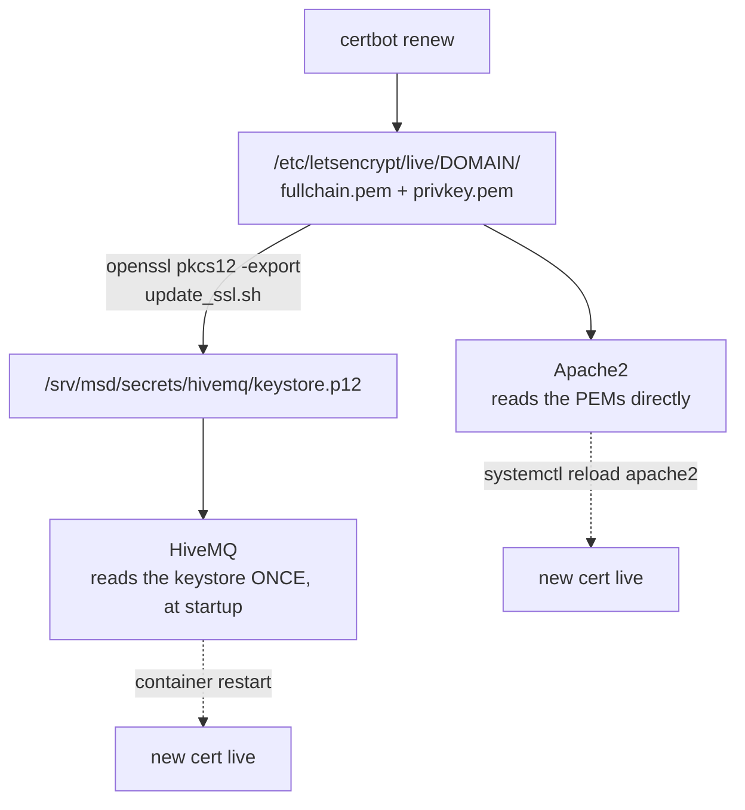

# Pemeliharaan

<RoleBadge role="technician" />

Tugas pemeliharaan rutin untuk sistem MSD700 yang telah di-deploy, dipisah berdasarkan mesin mana yang
berlaku baginya. Untuk mengetahui apa yang dilakukan perintah Docker mana pun di bawah ini, lihat
[Referensi Docker](/id/setup/docker-reference).

## Checklist rutin

| Tugas | Frekuensi | Di mana | Catatan |
| --- | --- | --- | --- |
| Periksa penggunaan disk `~/.ros/log` | Pasif: seorang "janitor" melakukan ini secara otomatis | Unit | Lihat [Pemeliharaan log](#log-housekeeping); hanya layak diperiksa manual jika unit offline karena alasan lain |
| Rotasi keyring signing JWT | Setiap beberapa bulan, atau segera setelah ada dugaan kebocoran | Server | Lihat [Rotasi secrets](#rotating-secrets) |
| Perpanjang sertifikat TLS | Sebelum kedaluwarsa | Server | Lihat [Sertifikat](#certificates). `certbot renew` polos **tidak** memperbarui keystore HiveMQ |
| Periksa container per-unit idle yang seharusnya sudah dibersihkan | Sesekali | Server | `docker ps --filter name=rosweb_unit_`: satu yang masih berjalan lama setelah unitnya idle layak diselidiki, jangan asal restart |
| Bersihkan (prune) key kedaluwarsa dari keyring JWT | Setelah jendela grace period rotasi berlalu | Server | `./scripts/secrets.sh prune` |
| Periksa penggunaan disk Docker | Bulanan | Keduanya | `docker system df`, lalu `docker image prune -a` dan `docker builder prune` |
| Periksa relay TURN masih me-relay | Setelah perubahan jaringan atau router apa pun | Server | Lihat [Relay TURN](#the-turn-relay) |
| Perbarui software stack | Saat rilis baru tersedia | Keduanya | Lihat [Memperbarui](#updating) |

## Pemeliharaan log

ROS 1 tidak merotasi log-nya sendiri (`~/.ros/log`), dan jika dibiarkan akan tumbuh tanpa batas: satu
unit dengan broker cloud yang tidak terjangkau tercatat sekitar 860 MB/hari, hampir semuanya di
`rosout.log`, ditulis langsung ke root filesystem Jetson. Setiap unit secara otomatis menjalankan
sebuah log janitor sebagai salah satu window tmux-nya, membatasi tree tersebut (default 512 MB, disapu
setiap 60 detik) dan membersihkan log sesi sebelumnya saat startup.

```bash
# Watch what it's doing:
tmux attach -t robot_services   # window: log_janitor
tail -f ros-web-ui/logs/log_janitor.log
```

Anda umumnya tidak perlu menyentuh ini. Naikkan `ROS_LOG_CAP_MB` hanya jika Anda dengan sengaja sedang
mengejar sesuatu di `rosout.log` dan punya jatah disk untuk itu.

## Rotasi secrets

```bash
./scripts/secrets.sh status          # see what's active, without printing secret values
./scripts/secrets.sh rotate          # mint a new active key; the old one stays valid for a grace window
# after the grace window has passed:
./scripts/secrets.sh prune
```

::: info Mengapa rotasi, bukan sekadar mengganti secret?
Satu secret bersama membuat rotasi menjadi instrumen yang kasar: timpa saja, dan setiap operator yang
sedang login serta setiap robot yang terhubung langsung ditolak sekaligus. Format keyring
menandatangani token baru dengan satu key aktif sambil tetap *menerima* key sebelumnya selama jendela
grace period yang dapat dikonfigurasi (default 48 jam), sehingga rotasi tidak terlihat oleh siapa pun
yang sudah terhubung.
:::

Setelah rotasi, restart service yang membaca keyring agar mereka mengambil key aktif yang baru:

```bash
docker compose --profile server_dev  restart nakayama_cloud_dev nakayama_media_dev nakayama_signalling_dev
docker compose --profile server_prod restart nakayama_cloud nakayama_media nakayama_signalling
```

## Sertifikat

Ada dua hal berbeda yang mengonsumsi sertifikat Let's Encrypt, dan hanya satu yang memperbarui dirinya
sendiri.



| Konsumen | Mengambil pembaruan lewat | Otomatis? |
| --- | --- | --- |
| Apache | reload | Ya, hook renewal milik certbot sendiri |
| HiveMQ | membangun ulang keystore PKCS#12, lalu me-restart container | **Tidak** |

```bash
sudo ./source/dependencies/ssl_update/update_ssl.sh   # renew + rebuild the keystore
docker compose --profile server_dev  restart hivemq_dev
docker compose --profile server_prod restart hivemq   # maintenance window, see below
```

::: danger Restart broker prod memicu safety watchdog di seluruh armada
HiveMQ membutuhkan sekitar 14 detik untuk kembali, lebih lama dari ping watchdog 10 detik. Setiap robot
yang sedang beroperasi akan mengangkat `/emergency_pause` dan berhenti. Lakukan restart broker prod
pada jendela pemeliharaan, bukan secara oportunistik. Broker dev tidak punya batasan semacam itu.
:::

::: warning Keystore tidak pernah memperbarui dirinya sendiri
Tidak ada deploy hook certbot yang terhubung ke `update_ssl.sh`. Sampai ada, perpanjangan sertifikat
membuat Apache tetap benar tetapi broker MQTT menyajikan sertifikat yang sudah kedaluwarsa, dan gejala
yang terlihat adalah seluruh armada terputus offline sekaligus dengan error TLS di log robot-robot.
Catat tanggal kedaluwarsanya di kalender.
:::

## Relay TURN

`coturn` **hanya untuk produksi**. Lihat
[Referensi Docker](/id/setup/docker-reference#coturn-service-khusus-produksi) untuk penjelasan
lengkapnya.

```bash
docker compose --profile turn up -d coturn      # start or restart just the relay
docker compose logs -f coturn                   # watch allocations
docker compose --profile turn stop coturn       # stop just the relay
```

Log-nya dibatasi pada tiga file berukuran 20 MB, sehingga scanner tak terautentikasi yang menggempur
port 3478 tidak bisa memenuhi disk. Belum ada bagian lain di stack yang memiliki batas seperti itu.

| Setelah ini berubah | Lakukan ini |
| --- | --- |
| Alamat LAN host | Perbarui `TURN_LISTENING_IP` dan `TURN_EXTERNAL_IP`, restart relay, periksa ulang forward router |
| IP publik | Perbarui bagian publik dari `TURN_EXTERNAL_IP`, restart relay |
| `TURN_USER` / `TURN_PASSWORD` | Restart relay **dan** bangun ulang kedua image dashboard, karena kredensial tersebut dipatri (baked) ke dalam bundle |
| Router atau firewall | Konfirmasi ulang bahwa UDP+TCP 3478 dan rentang relay UDP sama-sama menjangkau `TURN_LISTENING_IP` |

::: info Gejala yang perlu dikenali
Feed kamera berfungsi untuk operator pada LAN yang sama dan tidak pernah muncul bagi siapa pun di
luarnya. Itu adalah relay, bukan kamera: signalling berhasil (kedua peer saling menemukan) tetapi jalur
media-nya tidak.
:::

## Backup

Apa yang perlu di-backup, dan di mana sudah berada:

| Data | Lokasi | Caranya |
| --- | --- | --- |
| Peta, rute, area kustom, playlist | MySQL (container `db`/`db_dev`) + file peta di `/srv/msd/media/map` | Gunakan fitur **profile backup** di konsol admin: menghasilkan satu `.tar.gz` per profil, restore bersifat aditif |
| Data per-unit (untuk pertukaran perangkat keras atau arsip khusus-unit) | Sumber yang sama, dibatasi ke satu unit | Sistem backup mendukung kolom `scope` persis untuk ini: mengarsipkan satu unit tanpa ikut menarik seluruh profil |
| Keyring JWT / TLS keystore | `/srv/msd/secrets` | Bukan bagian dari backup tingkat aplikasi; backup direktori ini pada tingkat filesystem/infra |

::: warning
Arsip backup ditulis oleh backend ke `/srv/msd/media/backup` (`/srv/msd/media/backup_dev` untuk stack
dev). Jika direktori tersebut belum ada atau tidak bisa ditulisi oleh user aplikasi, backup akan gagal;
lihat [Pemecahan Masalah](/id/setup/troubleshooting).
:::

## Memperbarui

### Server

```bash
git pull
docker compose --profile server_dev  build && docker compose --profile server_dev  up -d   # test first
docker compose --profile server_prod build && docker compose --profile server_prod up -d
```

::: danger Membuat ulang backend membuat setiap container per-unit menjadi yatim
Container `rosweb_unit_*` dimulai oleh proses `backend_node` sebelumnya. Setelah backend dibuat ulang,
restart juga container-container tersebut, jika tidak mereka akan tetap berjalan sementara backend
baru tidak menganggap mereka teradopsi:

```bash
docker ps --filter "name=rosweb_unit_" --format '{{.Names}}' | xargs -r docker restart
```
:::

### Unit

```bash
git pull --recurse-submodules
./scripts/docker-manager.sh build
./scripts/docker-manager.sh up -d
```

::: info Kapan rebuild sebenarnya diperlukan
`src/` di-bind-mount ke dalam container **robot**, jadi edit skrip sehari-hari sama sekali tidak
membutuhkan rebuild: container akan mengambilnya pada peluncuran berikutnya. `build` penuh hanya
diperlukan ketika sebuah dependency atau base image berubah.

Stack **server** milik unit sendiri berbeda. `Dockerfile.webui-local` menyalin source ke dalam image,
jadi service tersebut selalu membutuhkan rebuild. `docker-manager.sh` membandingkan timestamp image
terhadap source tree dan melakukan rebuild secara otomatis, itulah sebabnya rebuild yang tidak
dijelaskan saat `up` biasanya hanya berarti seseorang mengedit backend.
:::

Tidak ada jalur update firmware terpisah yang didokumentasikan di sini untuk kontroler motor berbasis
Arduino; itu adalah re-flash manual, bukan bagian dari stack berbasis Docker ini.

## Pemeliharaan disk

```bash
docker system df                 # what is using space
docker image prune -a            # images no container references
docker builder prune             # build cache
docker volume ls                 # inspect BEFORE removing anything
```

::: danger Jangan pernah `docker compose down -v` di proyek ini secara sembarangan
`-v` menghapus named volume, termasuk `ros_webui_hivemq_data_prod`, yang menyimpan pesan yang
di-retain, sesi klien, dan pesan QoS>0 yang antre. Jika Anda ingin broker yang bersih, hapus volume itu
satu per satu berdasarkan nama, dengan sengaja.
:::

## Terkait

- [Referensi Docker](/id/setup/docker-reference): apa yang dilakukan setiap perintah di atas
- [Pemecahan Masalah](/id/setup/troubleshooting): jika pemeliharaan menemukan sebuah masalah
- [Penyiapan Sistem](/id/setup/system-setup): referensi topologi sistem
