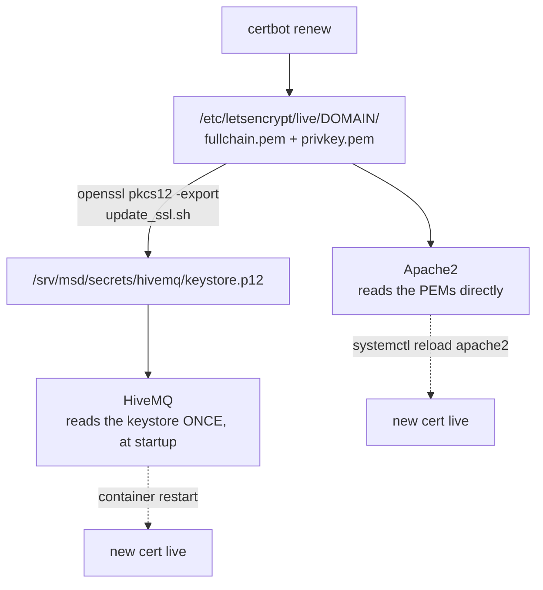

# Pemeliharaan

<RoleBadge role="technician" />

Tugas pemeliharaan rutin untuk sistem MSD700 yang diterapkan, dibagi berdasarkan mesin mana yang menerapkannya. Untuk
apa yang dilakukan oleh perintah Docker di bawah ini, lihat [Referensi Docker](/id/setup/docker-reference).

## Daftar periksa rutin

| Tugas | Frekuensi | Dimana | Catatan |
| --- | --- | --- | --- |
| Periksa penggunaan disk `~/.ros/log` | Pasif: petugas kebersihan melakukan ini secara otomatis | Satuan | Lihat [Pembersihan log](#log-housekeeping); hanya layak diperiksa dengan tangan jika unit sedang offline karena alasan lain |
| Putar gantungan kunci penandatanganan JWT | Setiap beberapa bulan, atau segera setelah dugaan kebocoran | Server | Lihat [Rahasia berputar](#rotating-secrets) |
| Perpanjang sertifikat TLS | Sebelum kadaluwarsa | Server | Lihat [Sertifikat](#certificates). `certbot renew` biasa **tidak** memperbarui keystore HiveMQ |
| Periksa kontainer per unit yang menganggur yang seharusnya sudah dituai | Kadang-kadang | Server | `docker ps --filter name=rosweb_unit_`: yang masih berjalan lama setelah unitnya menganggur patut diselidiki, bukan memulai kembali secara membabi buta |
| Pangkas kunci yang kedaluwarsa dari gantungan kunci JWT | Setelah jendela tenggang rotasi berlalu | Server | `./scripts/secrets.sh prune` |
| Periksa penggunaan disk Docker | Bulanan | Keduanya | `docker system df`, lalu `docker image prune -a` dan `docker builder prune` |
| Periksa relay TURN masih relay | Setelah perubahan jaringan atau router apa pun | Server | Lihat [Relai TURN](#the-turn-relay) |
| Perbarui tumpukan perangkat lunak | Saat rilis mendarat | Keduanya | Lihat [Memperbarui](#updating) |

## Log tata graha

ROS 1 tidak memutar lognya sendiri (`~/.ros/log`), dan dibiarkan tumbuh tanpa batas: satu unit
dengan broker cloud yang tidak dapat dijangkau berukuran sekitar 860 MB/hari, hampir semuanya di `rosout.log`, ditulis
langsung ke sistem file root Jetson. Setiap unit menjalankan petugas kebersihan log secara otomatis sebagai salah satu unitnya
jendela tmux, membatasi pohon itu (512 MB secara default, menyapu setiap 60 detik) dan menghapus yang sebelumnya
log sesi saat startup.

```bash
# Watch what it's doing:
tmux attach -t robot_services   # window: log_janitor
tail -f ros-web-ui/logs/log_janitor.log
```

Biasanya Anda tidak perlu menyentuh ini. Naikkan `ROS_LOG_CAP_MB` hanya jika Anda sengaja mengejar
sesuatu di `rosout.log` dan miliki anggaran disk untuk itu.

## Memutar rahasia

```bash
./scripts/secrets.sh status          # see what's active, without printing secret values
./scripts/secrets.sh rotate          # mint a new active key; the old one stays valid for a grace window
# after the grace window has passed:
./scripts/secrets.sh prune
```

::: info Why rotate instead of just replacing the secret?
Satu rahasia bersama membuat rotasi menjadi instrumen yang tumpul: menimpanya, dan setiap operator yang masuk
dan setiap robot yang terhubung ditolak sekaligus. Format gantungan kunci menandatangani token baru dengan satu yang aktif
kunci sambil tetap *menerima* yang sebelumnya untuk masa tenggang yang dapat dikonfigurasi (48 jam secara default),
jadi rotasi tidak terlihat oleh siapa pun yang sudah terhubung.
:::

Setelah rotasi, restart layanan yang membaca keyring sehingga mereka mengambil kunci aktif yang baru:

```bash
docker compose --profile server_dev  restart nakayama_cloud_dev nakayama_media_dev nakayama_signalling_dev
docker compose --profile server_prod restart nakayama_cloud nakayama_media nakayama_signalling
```

## Sertifikat

Dua hal berbeda menggunakan sertifikat Let's Encrypt, dan hanya satu yang memperbarui dirinya sendiri.



| Konsumen | Mengambil pembaruan oleh | Otomatis? |
| --- | --- | --- |
| apache | memuat ulang | Ya, kait pembaruan certbot sendiri |
| sarangMQ | membangun kembali keystore PKCS#12, lalu memulai ulang container | **Tidak** |

```bash
sudo ./source/dependencies/ssl_update/update_ssl.sh   # renew + rebuild the keystore
docker compose --profile server_dev  restart hivemq_dev
docker compose --profile server_prod restart hivemq   # maintenance window, see below
```

::: danger A prod broker restart trips the safety watchdog fleet-wide
HiveMQ membutuhkan waktu sekitar 14 detik untuk kembali, lebih lama dari pengawas ping 10 detik. Setiap
robot di tengah pengoperasian menaikkan `/emergency_pause` dan berhenti. Apakah prod broker restart dalam pemeliharaan
jendela, bukan secara oportunis. Broker pengembang tidak memiliki batasan seperti itu.
:::

::: warning The keystore has never renewed itself
Tidak ada pengait penerapan certbot yang dihubungkan ke `update_ssl.sh`. Sampai ada, perpanjangan sertifikat
membiarkan Apache benar dan broker MQTT menyajikan sertifikat yang kedaluwarsa, dan gejala yang terlihat adalah
seluruh armada offline sekaligus dengan kesalahan TLS di log robot. Cantumkan tanggal kadaluwarsanya
sebuah kalender.
:::

## Relai MENGHIDUPKAN

`coturn` adalah **hanya produksi**. Lihat
[Referensi Docker](/id/setup/docker-reference#coturn-the-production-only-service) untuk selengkapnya
penalaran.

```bash
docker compose --profile turn up -d coturn      # start or restart just the relay
docker compose logs -f coturn                   # watch allocations
docker compose --profile turn stop coturn       # stop just the relay
```

Lognya dibatasi pada tiga file berukuran 20 MB, sehingga pemindai yang tidak diautentikasi yang memalu port 3478 tidak dapat
isi disknya. Belum ada hal lain di tumpukan yang memiliki batasan itu.

| Setelah ini berubah | Lakukan ini |
| --- | --- |
| Alamat LAN host | Update `TURN_LISTENING_IP` dan `TURN_EXTERNAL_IP`, restart relay, cek ulang router forward |
| IP publik | Perbarui separuh publik `TURN_EXTERNAL_IP`, mulai ulang relai |
| `TURN_USER` / `TURN_PASSWORD` | Mulai ulang relai **dan** buat ulang kedua gambar dasbor, karena kredensial dimasukkan ke dalam bundel |
| Router atau firewall | Konfirmasikan ulang UDP+TCP 3478 dan jangkauan relai UDP keduanya mencapai `TURN_LISTENING_IP` |

::: info Symptom to recognise
Umpan kamera berfungsi untuk operator di LAN yang sama dan tidak pernah muncul untuk siapa pun di luarnya. Yaitu
relai, bukan kamera: pensinyalan berhasil (kedua rekan menemukan satu sama lain) dan jalur media berhasil
tidak.
:::

## Cadangan

Apa yang perlu dicadangkan, dan di mana lokasinya:

| Data | Lokasi | Bagaimana |
| --- | --- | --- |
| Peta, rute, area khusus, daftar putar | MySQL (`db`/`db_dev` container) + file peta di bawah `/srv/msd/media/map` | Gunakan fitur **cadangan profil** di konsol admin: ini menghasilkan satu `.tar.gz` per profil, pemulihan bersifat tambahan |
| Data per unit (untuk pertukaran perangkat keras atau arsip khusus unit) | Sumber yang sama, tercakup dalam satu unit | Sistem cadangan mendukung kolom `scope` untuk hal ini: arsipkan satu unit tanpa menarik seluruh profil |
| Gantungan kunci JWT / keystore TLS | `/srv/msd/secrets` | Bukan bagian dari pencadangan tingkat aplikasi; kembalikan direktori ini ke tingkat sistem file/infra |

::: warning
Arsip cadangan ditulis oleh backend ke `/srv/msd/media/backup` (`/srv/msd/media/backup_dev`
untuk tumpukan pengembang). Jika direktori tersebut belum ada atau tidak dapat ditulis oleh pengguna aplikasi, buatlah cadangan
gagal; lihat [Pemecahan Masalah](/id/setup/troubleshooting).
:::

## Memperbarui

### Server

```bash
git pull
docker compose --profile server_dev  build && docker compose --profile server_dev  up -d   # test first
docker compose --profile server_prod build && docker compose --profile server_prod up -d
```

::: danger Recreating the backend orphans every per-unit container
Kontainer `rosweb_unit_*` dimulai dengan proses `backend_node` sebelumnya. Setelah
backend dibuat ulang, mulai ulang juga, atau jalankan saat backend baru tidak mempertimbangkannya
diadopsi:

```bash
docker ps --filter "name=rosweb_unit_" --format '{{.Names}}' | xargs -r docker restart
```
:::

### Satuan

```bash
git pull --recurse-submodules
./scripts/docker-manager.sh build
./scripts/docker-manager.sh up -d
```

::: info When a rebuild is actually needed
`src/` sudah terpasang ke dalam wadah **robot**, jadi pengeditan skrip sehari-hari tidak perlu dibuat ulang sama sekali
semua: kontainer mengambilnya pada peluncuran berikutnya. `build` lengkap hanya diperlukan ketika ketergantungan
atau gambar dasar berubah.

Tumpukan **server** unit itu sendiri berbeda. `Dockerfile.webui-local` menyalin sumber ke dalam
citra, sehingga layanan tersebut selalu perlu dibangun kembali. `docker-manager.sh` membandingkan stempel waktu gambar
terhadap pohon sumber dan membangun kembali secara otomatis, itulah sebabnya pembangunan kembali yang tidak dapat dijelaskan pada `up`
biasanya hanya berarti seseorang mengedit backend.
:::

Tidak ada jalur pembaruan firmware terpisah yang didokumentasikan di sini untuk pengontrol motor berbasis Arduino;
itu adalah flash ulang manual, bukan bagian dari tumpukan berbasis Docker ini.

## Pembenahan disk

```bash
docker system df                 # what is using space
docker image prune -a            # images no container references
docker builder prune             # build cache
docker volume ls                 # inspect BEFORE removing anything
```

::: danger Never `docker compose down -v` on this project casually
`-v` menghapus volume bernama, termasuk `ros_webui_hivemq_data_prod`, yang menyimpan pesan yang disimpan,
sesi klien dan pesan QoS>0 yang antri. Jika Anda menginginkan broker yang bersih, hapus satu volume itu
nama, dengan sengaja.
:::

## Terkait

- [Referensi Docker](/id/setup/docker-reference): apa yang dilakukan setiap perintah di atas
- [Pemecahan Masalah](/id/setup/troubleshooting): jika pemeliharaan menemukan masalah
- [Pengaturan Sistem](/id/setup/system-setup): referensi topologi sistem