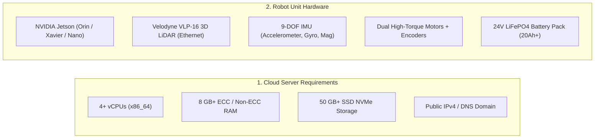
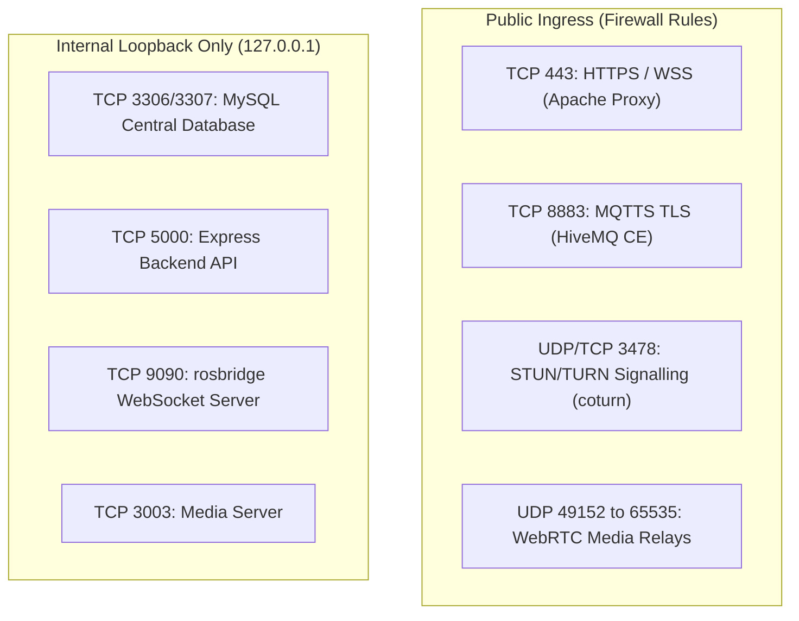

# Prasyarat

<RoleBadge role="technician" />

Dokumen ini merinci spesifikasi perangkat keras, persyaratan sistem operasi, aturan jaringan, dan ketergantungan perangkat lunak yang diperlukan sebelum menerapkan **Server MSD700** atau **Unit Robot Fisik MSD700**.

## Ukuran Sistem dan Spesifikasi Perangkat Keras

### 1. Spesifikasi Perangkat Keras Server (Cloud Host)

| Komponen | Spesifikasi Minimal | Produksi yang Direkomendasikan |
| --- | --- | --- |
| **Prosesor** | 2 vCPU (x86_64 / amd64) | 4 hingga 8 vCPU |
| **Memori Sistem** | RAM 4GB | RAM 8 hingga 16 GB |
| **Penyimpanan Disk** | SSD 30GB | NVMe 100 GB (untuk arsip peta dan log media) |
| **Masuknya Jaringan** | IPv4 Publik Statis dengan Port 443, 8883 diteruskan | 100 Mbps+ Tautan Dupleks Penuh |

### 2. Spesifikasi Unit Robot Fisik (Jetson SBC)

| Komponen | Spesifikasi Perangkat Keras | Tujuan |
| --- | --- | --- |
| **Komputer Papan Tunggal** | NVIDIA Jetson (JetPack 5.x / 6.x) | Menjalankan runtime ROS Noetic di Docker, fusi sensor, dan tumpukan web lokal. |
| **LiDAR 3D Utama** | Velodyne VLP-16 (16 Saluran, Ethernet) | Pemetaan lingkungan 360 derajat dan deteksi rintangan jarak 100 m. |
| **IMU Negara** | Sensor MEMS 9-DOF (I2C/UART) | Disatukan dengan odometri roda melalui filter Madgwick untuk orientasi kecepatan tinggi. |
| **Mikrokontroler Motor** | Arduino / Pengontrol Tertanam Kecil | Menjalankan kontrol kecepatan PID loop tertutup dan interupsi tick encoder. |
| **Sasis & Penggerak** | Penggerak Diferensial dengan 4 Kastor Putar | tapak sasis fisik 0,90 x 0,70 m; Kecepatan desain maksimum 2,5 m/s. |
| **Panggung Kekuatan** | Paket Baterai LiFePO4 24V | 4 hingga 6 jam operasi otonom terus menerus; relai E-Stop perangkat keras. |

---

## Firewall Jaringan dan Matriks Port

Pastikan router jaringan dan grup keamanan mengizinkan lalu lintas berikut:

| Pelabuhan | Protokol | Ruang Lingkup | Layanan | Diperlukan Untuk |
| --- | --- | --- | --- | --- |
| **`443`** | TCP | Publik | Proksi Terbalik Apache2 | Dasbor web HTTPS, REST API, dan aliran WebSocket rosbridge. |
| **`8883`** | TCP | Publik | Pialang TLS HiveMQ | Perintah MQTT terenkripsi dan jembatan telemetri yang menghubungkan robot ke cloud. |
| **`3478`** | UDP + TCP | Publik | kembali MENGHIDUPKAN Server | Traversal video kamera WebRTC ketika pukulan NAT peer-to-peer diblokir. |
| **`49152 - 65535`** | UDP | Publik | Rentang Media Dinamis coturn | Muatan video WebRTC diteruskan melalui NAT simetris. |
| **`3307`** | TCP | Host Lokal | DB Produksi MySQL | Toko relasional pusat untuk akun, peta, rute, dan profil persewaan. |
| **`5000`** | TCP | Host Lokal | API Backend Ekspres | REST API internal dan orkestrator kontainer Docker. |
| **`9090`** | TCP | Host Lokal | rosbridge WebSocket | Kanvas web pengumpan deserializer topik ROS frekuensi tinggi. |

---

## Sistem Operasi & Ketergantungan Host

### Untuk Server Awan:
1. **Sistem Operasi**: Ubuntu 22.04 LTS atau Ubuntu 24.04 LTS (x86_64).
2. **Mesin Docker**: Docker CE 20.10+ dengan Plugin Compose (`docker compose` v2).
3. **Server Web**: Apache 2.4+ (`a2enmod ssl proxy proxy_http proxy_wstunnel headers rewrite alias`).
4. **Sertifikat SSL**: Certbot diinstal untuk pembaruan Let's Encrypt otomatis.

### Untuk Unit Fisik Jetson:
1. **Sistem Operasi**: Ubuntu 20.04 / 22.04 LTS (JetPack 5.x / 6.x di ARM64).
2. **Mesin Docker**: Docker CE dengan dukungan `network_mode: host`.
3. **Aturan Perangkat USB**: Aturan `udev` yang memberikan akses non-root ke `/dev/ttyUSB*` (pengontrol motor).
4. **Konfigurasi IP Statis**: IP Statis `192.168.103.100` dikonfigurasi pada port Ethernet LiDAR khusus (`end0`).

---

## Daftar Periksa Keamanan

::: danger Safety First
1. **Jaga agar E-Stop Dapat Dijangkau**: Sebelum menjalankan tes motorik, pastikan tombol jamur Berhenti Darurat fisik berada dalam jangkauan fisik langsung.
2. **Tinggikan Sasis untuk Penyalaan Pertama**: Selama pengujian awal firmware dan uji arah motor, letakkan sasis robot pada balok kayu sehingga roda penggerak berputar bebas tanpa menyentuh lantai.
3. **Keamanan Mata LiDAR**: Velodyne VLP-16 adalah perangkat laser yang aman untuk mata Kelas 1 ($905\text{ nm}$panjang gelombang); hindari menempatkan lensa pembesar optik langsung di depan optik aktif.
:::

## Langkah Selanjutnya

- Lanjutkan ke [Pengaturan Server](/id/setup/server-setup) untuk menerapkan backend cloud.
- Atau langsung ke [Unit Setup](/id/setup/unit-setup) jika server sudah aktif.