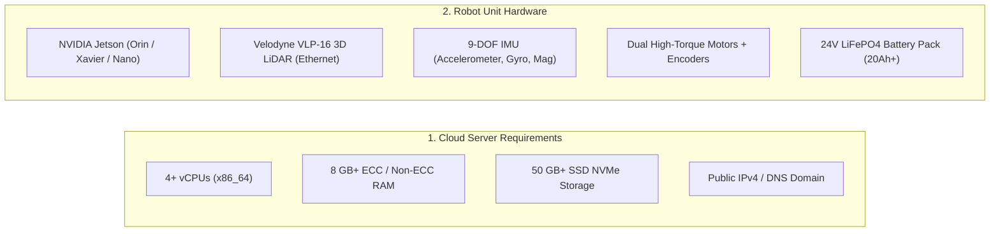
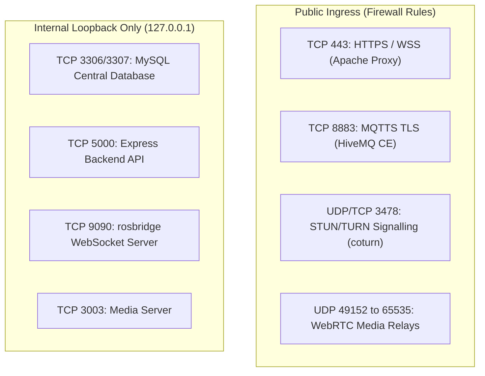

# Prasyarat

<RoleBadge role="technician" />

Dokumen ini merinci spesifikasi perangkat keras, kebutuhan sistem operasi, aturan jaringan, dan dependensi perangkat lunak yang diperlukan sebelum melakukan deployment **MSD700 Server** atau **Unit Robot Fisik MSD700**.

## Ukuran Sistem dan Spesifikasi Perangkat Keras



### 1. Spesifikasi Perangkat Keras Server (Host Cloud)

| Komponen | Spesifikasi Minimum | Rekomendasi Produksi |
| --- | --- | --- |
| **Prosesor** | 2 vCPU (x86_64 / amd64) | 4 sampai 8 vCPU |
| **Memori Sistem** | RAM 4 GB | RAM 8 sampai 16 GB |
| **Penyimpanan Disk** | SSD 30 GB | NVMe 100 GB (untuk arsip peta dan log media) |
| **Ingress Jaringan** | IPv4 Publik statis dengan Port 443, 8883 diteruskan (forward) | Tautan Full Duplex 100 Mbps+ |

### 2. Spesifikasi Unit Robot Fisik (SBC Jetson)

| Komponen | Spesifikasi Perangkat Keras | Tujuan |
| --- | --- | --- |
| **Single-Board Computer** | NVIDIA Jetson (JetPack 5.x / 6.x) | Menjalankan runtime ROS Noetic di Docker, sensor fusion, dan stack web lokal. |
| **LiDAR 3D Utama** | Velodyne VLP-16 (16 Channel, Ethernet) | Pemetaan lingkungan 360 derajat dan deteksi halangan jarak 100 m. |
| **IMU Status** | Sensor MEMS 9-DOF (I2C/UART) | Digabung dengan odometri roda melalui filter Madgwick untuk orientasi dengan laju tinggi. |
| **Mikrokontroler Motor** | Kontroler Embedded Arduino / Teensy | Menjalankan kontrol kecepatan PID closed-loop dan interrupt tick encoder. |
| **Sasis & Penggerak** | Differential Drive dengan 4 Swivel Caster | Jejak sasis fisik 0,90 x 0,70 m; kecepatan desain maksimum 2,5 m/s. |
| **Tahap Daya** | Paket Baterai LiFePO4 24V | Operasi otonom berkelanjutan 4 sampai 6 jam; relai E-Stop perangkat keras. |

---

## Matriks Firewall Jaringan dan Port

Pastikan router jaringan dan security group mengizinkan trafik berikut:



| Port | Protokol | Cakupan | Layanan | Diperlukan Untuk |
| --- | --- | --- | --- | --- |
| **`443`** | TCP | Publik | Apache2 Reverse Proxy | Dashboard web HTTPS, REST API, dan stream WebSocket rosbridge. |
| **`8883`** | TCP | Publik | HiveMQ TLS Broker | Jembatan perintah dan telemetri MQTT terenkripsi yang menghubungkan robot ke cloud. |
| **`3478`** | UDP + TCP | Publik | coturn TURN Server | Traversal video kamera WebRTC saat peer-to-peer NAT punch diblokir. |
| **`49152 - 65535`** | UDP | Publik | coturn Dynamic Media Range | Relay payload video WebRTC melintasi symmetric NAT. |
| **`3307`** | TCP | Localhost | MySQL Production DB | Penyimpanan relasional pusat untuk akun, peta, rute, dan profil penyewaan. |
| **`5000`** | TCP | Localhost | Express Backend API | REST API internal dan orkestrator container Docker. |
| **`9090`** | TCP | Localhost | rosbridge WebSocket | Deserializer topic ROS berfrekuensi tinggi yang memasok kanvas web. |

---

## Sistem Operasi Host & Dependensi

### Untuk Server Cloud:
1. **Sistem Operasi**: Ubuntu 22.04 LTS atau Ubuntu 24.04 LTS (x86_64).
2. **Docker Engine**: Docker CE 20.10+ dengan Compose Plugin (`docker compose` v2).
3. **Web Server**: Apache 2.4+ (`a2enmod ssl proxy proxy_http proxy_wstunnel headers rewrite alias`).
4. **Sertifikat SSL**: Certbot terinstal untuk perpanjangan otomatis Let's Encrypt.

### Untuk Unit Jetson Fisik:
1. **Sistem Operasi**: Ubuntu 20.04 / 22.04 LTS (JetPack 5.x / 6.x pada ARM64).
2. **Docker Engine**: Docker CE dengan dukungan `network_mode: host`.
3. **Aturan Perangkat USB**: Aturan `udev` yang memberi akses non-root ke `/dev/ttyUSB*` (kontroler motor).
4. **Konfigurasi IP Statis**: IP statis `192.168.103.100` dikonfigurasi pada port Ethernet LiDAR khusus (`end0`).

---

## Menginstal Docker Engine di Ubuntu

Baik Server Cloud maupun Unit Jetson memerlukan Docker CE dengan plugin Compose (`docker compose` v2). Instal dari repositori `apt` resmi Docker, bukan dari paket `docker.io` di repositori default Ubuntu, yang tertinggal versinya dan sering tidak menyertakan plugin Compose.

```bash
# 1. Remove any old or conflicting packages
for pkg in docker.io docker-doc docker-compose docker-compose-v2 podman-docker containerd runc; do
  sudo apt-get remove -y $pkg
done

# 2. Install prerequisites and add Docker's official GPG key
sudo apt-get update
sudo apt-get install -y ca-certificates curl
sudo install -m 0755 -d /etc/apt/keyrings
sudo curl -fsSL https://download.docker.com/linux/ubuntu/gpg -o /etc/apt/keyrings/docker.asc
sudo chmod a+r /etc/apt/keyrings/docker.asc

# 3. Add the Docker apt repository
echo \
  "deb [arch=$(dpkg --print-architecture) signed-by=/etc/apt/keyrings/docker.asc] https://download.docker.com/linux/ubuntu \
  $(. /etc/os-release && echo "$VERSION_CODENAME") stable" | \
  sudo tee /etc/apt/sources.list.d/docker.list > /dev/null
sudo apt-get update

# 4. Install Docker Engine, the CLI, containerd, and the Compose plugin
sudo apt-get install -y docker-ce docker-ce-cli containerd.io docker-buildx-plugin docker-compose-plugin

# 5. Verify the installation
sudo docker run hello-world
```

::: info Berfungsi baik di `amd64` maupun `arm64`
Langkah-langkah di atas bersifat agnostik terhadap arsitektur: `dpkg --print-architecture` menghasilkan `amd64` pada Server Cloud dan `arm64` pada Unit Jetson, dan repositori Docker menyajikan paket yang sesuai untuk masing-masing. Tidak diperlukan prosedur terpisah untuk JetPack.
:::

### Pasca-instalasi: menjalankan Docker tanpa `sudo`

`docker-manager.sh` dan `run_msd.sh` (lihat [Referensi Docker](/id/setup/docker-reference)) mengasumsikan pengguna yang menjalankannya dapat menjalankan `docker` tanpa `sudo`. Tambahkan pengguna ke grup `docker` dan mulai sesi shell baru agar perubahan berlaku:

```bash
sudo usermod -aG docker $USER
newgrp docker

# Confirm access without sudo
docker run hello-world
```

::: warning Log out lalu login kembali jika masih meminta `sudo`
`newgrp docker` hanya menerapkan grup baru pada shell saat ini. Jika shell lain, sesi SSH, atau unit systemd masih gagal dengan error izin pada `/var/run/docker.sock`, lakukan log out sepenuhnya lalu login kembali (atau reboot) agar keanggotaan grup diterapkan di mana pun.
:::

### Mengaktifkan Docker saat boot

```bash
sudo systemctl enable docker.service
sudo systemctl enable containerd.service
```

---

## Checklist Keselamatan

::: danger Keselamatan Terlebih Dahulu
1. **Jaga E-Stop Tetap Terjangkau**: Sebelum menjalankan pengujian motor, pastikan tombol jamur Emergency Stop fisik berada dalam jangkauan langsung.
2. **Angkat Sasis untuk Penyalaan Pertama**: Selama bringup firmware awal dan pengujian arah motor, letakkan sasis robot di atas balok kayu sehingga roda penggerak berputar bebas tanpa menyentuh lantai.
3. **Keselamatan Mata terhadap LiDAR**: Velodyne VLP-16 adalah perangkat laser aman-mata Kelas 1 (panjang gelombang $905\text{ nm}$); hindari menempatkan lensa pembesar optik langsung di depan optik yang aktif.
:::

## Langkah Berikutnya

- Lanjutkan ke [Penyiapan Server](/id/setup/server-setup) untuk melakukan deployment backend cloud.
- Atau langsung lanjutkan ke [Penyiapan Unit](/id/setup/unit-setup) jika server sudah aktif.
