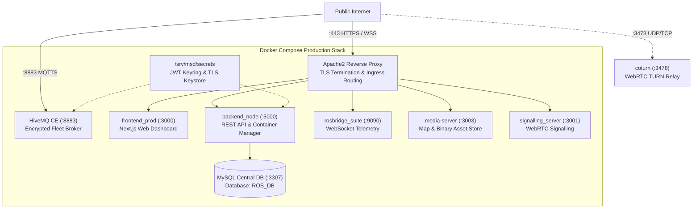
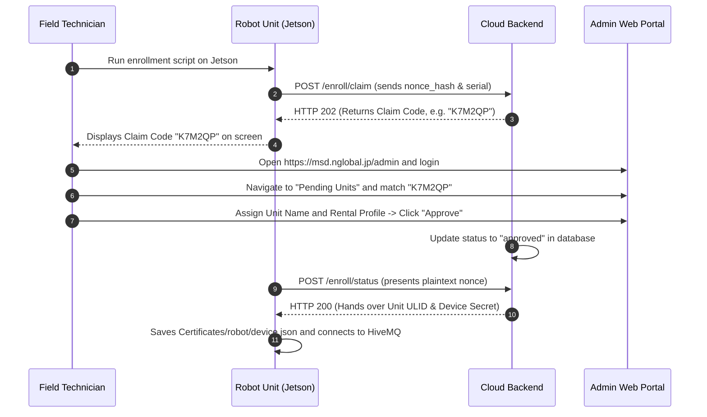

# Penyiapan Server

<RoleBadge role="technician" />

Panduan ini memberikan instruksi langkah demi langkah untuk melakukan deployment **Server Cloud dan Dashboard Web MSD700**.

Selesaikan [Prasyarat](/id/setup/prerequisites) sebelum melanjutkan.

::: info Arsitektur Mengutamakan Produksi
Panduan ini secara default menggunakan **Deployment Produksi** standar. Instruksi mode pengembangan dan parameter kustom lanjutan berada di bagian [Konfigurasi Lanjutan](#advanced-configurations) di bagian bawah.
:::

## Topologi Sistem



## Ikhtisar Struktur Direktori

Sebelum menjalankan perintah apa pun, pahami bagaimana repositori disusun pada filesystem host:

```
~/ (e.g. /home/ubuntu)
└── ros-web-ui/                               # Main Server Repository (branch: v2)
    ├── docker-compose.yml                    # Docker Compose Multi-Service Definition
    ├── .env                                  # Environment & Port Configuration
    ├── scripts/
    │   └── secrets.sh                        # JWT Keyring Management Utility
    └── source/
        └── dependencies/
            ├── ROS-dashboard-backend/        # Express REST API (backend_node)
            ├── ROS-dashboard-next-ts/        # Frontend Dashboard (CLONED HERE, branch: v2)
            ├── media-server/                 # Static Map Media Server
            ├── signalling_server/            # WebRTC Camera Signalling
            └── ssl_update/
                └── update_ssl.sh             # Certbot to HiveMQ Keystore Converter
```

---

## Langkah Inti Penyiapan Bertahap

Ikuti 6 langkah berikut secara berurutan untuk membangun server produksi yang lengkap.

### Langkah 1: Clone Repositori

Clone `ros-web-ui` pada branch `v2`, lalu clone repositori frontend `ROS-dashboard-next-ts` langsung ke dalam `source/dependencies/`:

```bash
# 1. Clone main server repository on branch v2
git clone -b v2 git@github.com:itbdelaboprogramming/ros-web-ui.git ~/ros-web-ui

# 2. Clone the frontend dashboard repository directly into dependencies on branch v2
git clone -b v2 git@github.com:itbdelaboprogramming/ROS-dashboard-next-ts.git \
  ~/ros-web-ui/source/dependencies/ROS-dashboard-next-ts
```

::: tip Mengapa frontend di-clone di dalam dependencies?
Dockerfile membangun (build) frontend Next.js langsung di dalam konteks build Docker milik `ros-web-ui`. Path `source/dependencies/ROS-dashboard-next-ts` di-gitignore oleh repositori induk.
:::

---

### Langkah 2: Inisialisasi Security Secrets

Secrets berada di luar container Docker, di `/srv/msd/secrets/`, agar tetap ada meski image dibangun ulang.

```bash
# 1. Navigate to the ros-web-ui repository
cd ~/ros-web-ui

# 2. Initialize the production JWT Keyring
sudo mkdir -p /srv/msd/secrets
./scripts/secrets.sh init

# 3. Verify that the keyring was created
./scripts/secrets.sh status
```

---

### Langkah 3: Membuat HiveMQ TLS Keystore

Broker MQTT HiveMQ memerlukan keystore PKCS#12 yang dibuat dari sertifikat SSL Let's Encrypt milik domain Anda.

```bash
# 1. Obtain Let's Encrypt certificate for your server domain
sudo certbot certonly --standalone -d msd.nglobal.jp

# 2. Run the automated keystore generator script in ros-web-ui
cd ~/ros-web-ui
sudo ./source/dependencies/ssl_update/update_ssl.sh
```

Skrip ini membuat `/srv/msd/secrets/hivemq/keystore.p12` dengan kepemilikan UID `1001` dan izin `0600`.

---

### Langkah 4: Konfigurasi Environment (`.env`)

Buat `.env` di `~/ros-web-ui/.env`:

```bash
cd ~/ros-web-ui
nano .env
```

Tempel konfigurasi produksi berikut:

```ini
# Storage path for recorded map files on the host
MAPS_FOLDER=/home/ubuntu/ros_maps

# Host User and Docker Group IDs (run: id -u, id -g, getent group docker | cut -d: -f3)
USER_UID=1001
USER_GID=1001
DOCKER_GID=998

# Idle timeout before stopping inactive unit containers (1800000 ms = 30 min)
UNIT_IDLE_TIMEOUT_MS=1800000

# Central Database Credentials
MYSQL_ROOT_PASSWORD=SetYourStrongRootPasswordHere
MYSQL_DATABASE=ROS_DB
MYSQL_USER=itbdelabo
MYSQL_PASSWORD=SetYourStrongUserPasswordHere

# MQTT Broker Settings
MQTT_BROKER_TYPE=nakayama
NAKAYAMA_HOST=msd.nglobal.jp
HIVEMQ_KEYSTORE=/srv/msd/secrets/hivemq/keystore.p12
HIVEMQ_UID=1001

# Production Port Map
MYSQL_PORT_PROD=3307
BACKEND_PORT_PROD=5000
MEDIA_SERVER_PORT_PROD=3003
SIGNALLING_PORT_WS_PROD=3001
SIGNALLING_PORT_HTTP_PROD=3002
HIVE_MQTT_TLS_PORT_PROD=8883
FRONTEND_PORT_PROD=3000

# WebRTC TURN Relay (coturn)
TURN_LISTENING_IP=192.168.100.14
TURN_EXTERNAL_IP=118.22.31.252/192.168.100.14
TURN_USER=msd700
TURN_PASSWORD=SetYourStrongTurnPasswordHere
```

---

### Langkah 5: Menjalankan Container Docker Produksi

Jalankan stack compose produksi:

```bash
cd ~/ros-web-ui

# Start production containers in detached mode
docker compose --profile server_prod up -d

# Verify all containers are Up or Healthy
docker compose --profile server_prod ps
```

---

### Langkah 6: Konfigurasi Apache Reverse Proxy

Apache melakukan terminasi SSL pada port 443 dan meneruskan trafik masuk ke port container internal.

```bash
# 1. Enable required Apache modules
sudo a2enmod ssl proxy proxy_http proxy_wstunnel headers rewrite alias
sudo systemctl restart apache2
```

Edit `/etc/apache2/sites-available/000-default-le-ssl.conf`:

```apache
<IfModule mod_ssl.c>
<VirtualHost *:443>
    ServerName msd.nglobal.jp
    ServerAdmin webmaster@localhost
    DocumentRoot /var/www/html

    ErrorLog ${APACHE_LOG_DIR}/error.log
    CustomLog ${APACHE_LOG_DIR}/access.log combined

    ProxyAddHeaders On

    # 1. WebRTC Signalling Server (WebSocket)
    ProxyPass /services/signalling ws://localhost:3001
    ProxyPassReverse /services/signalling ws://localhost:3001

    # 2. Media Server (Map files and images)
    ProxyPass /services/media http://localhost:3003
    ProxyPassReverse /services/media http://localhost:3003

    # 3. Express REST API Backend
    ProxyPass /services/rosbackend http://localhost:5000
    ProxyPassReverse /services/rosbackend http://localhost:5000

    # 4. rosbridge WebSocket Server
    <Location /services/rosbridge>
        ProxyPass ws://localhost:9090 timeout=86400 keepalive=On flushpackets=on
        ProxyPassReverse ws://localhost:9090
        RequestHeader set Host "localhost:9090"
    </Location>

    # 5. Documentation Site Static Files
    ProxyPass /itbdelabo/docs !
    Alias /itbdelabo/docs /home/itbdelabo/ITBdeLabo/Documentation/msd700_documentation/docs/.vitepress/dist

    <Directory /home/itbdelabo/ITBdeLabo/Documentation/msd700_documentation/docs/.vitepress/dist>
        Options -Indexes -MultiViews +FollowSymLinks
        AllowOverride None
        Require all granted
        DirectoryIndex index.html

        RewriteEngine On
        RewriteCond %{REQUEST_FILENAME} !-f
        RewriteCond %{REQUEST_FILENAME} !-d
        RewriteCond %{REQUEST_FILENAME}.html -f
        RewriteRule ^ %{REQUEST_FILENAME}.html [L]

        ErrorDocument 404 /itbdelabo/docs/404.html
    </Directory>

    # 6. Web Dashboard Frontend (Catch-All, MUST BE LAST)
    ProxyPass / http://localhost:3000/
    ProxyPassReverse / http://localhost:3000/

    # SSL Certificate Paths
    SSLCertificateFile /etc/letsencrypt/live/msd.nglobal.jp/fullchain.pem
    SSLCertificateKeyFile /etc/letsencrypt/live/msd.nglobal.jp/privkey.pem
    Include /etc/letsencrypt/options-ssl-apache.conf
</VirtualHost>
</IfModule>
```

Muat ulang Apache:

```bash
sudo apache2ctl configtest
sudo systemctl reload apache2
```

---

## Alur Registrasi & Enrolment Unit

Setelah server berjalan, robot fisik dapat didaftarkan:



1. Login ke panel administrasi di `https://msd.nglobal.jp/admin`.
2. Di bawah **Pending Units**, temukan kode klaim 6 karakter yang ditampilkan oleh teknisi pada robot.
3. Pilih **Rental Profile** yang aktif, tetapkan label tampilan unit, lalu klik **Approve**.
4. Robot menyelesaikan enrolment dan langsung muncul di dashboard armada.

---

## Konfigurasi Lanjutan

<details>
<summary><b>Profil Mode Pengembangan (`server_dev`)</b></summary>

Untuk menjalankan stack pengembangan yang terisolasi berdampingan dengan produksi:

1. Inisialisasi keyring dev:
   ```bash
   cd ~/ros-web-ui
   ./scripts/secrets.sh init --dev
   ```

2. Jalankan profil dev:
   ```bash
   docker compose --profile server_dev up -d
   ```

3. Port dev digeser untuk mencegah tabrakan:
   - MySQL Dev: `3308`
   - Backend Dev: `5001`
   - HiveMQ Dev: `8884`
   - rosbridge Dev: `9091`
   - Frontend Dev: `3100`

</details>

<details>
<summary><b>Rotasi Keyring & Grace Period</b></summary>

Rotasi kunci signing JWT yang aktif tanpa mengakhiri sesi pengguna yang sedang berjalan:

```bash
cd ~/ros-web-ui

# Rotate active key (old key remains valid for 48 hours)
./scripts/secrets.sh rotate --grace-hours 48

# Check status of keys in keyring
./scripts/secrets.sh status

# Remove expired keys after grace window
./scripts/secrets.sh prune
```

</details>

<details>
<summary><b>Pembuatan HiveMQ Keystore secara Manual</b></summary>

Jika membuat keystore secara manual tanpa `update_ssl.sh`:

```bash
sudo mkdir -p /srv/msd/secrets/hivemq
sudo openssl pkcs12 -export \
  -in   /etc/letsencrypt/live/msd.nglobal.jp/fullchain.pem \
  -inkey /etc/letsencrypt/live/msd.nglobal.jp/privkey.pem \
  -out  /srv/msd/secrets/hivemq/keystore.p12 \
  -name hivemq \
  -passout "pass:SetKeystorePasswordHere"

sudo chown -R 1001:1001 /srv/msd/secrets/hivemq
sudo chmod 700 /srv/msd/secrets/hivemq
sudo chmod 600 /srv/msd/secrets/hivemq/keystore.p12
```

</details>

---

## Verifikasi & Pemeriksaan Kesehatan

Jalankan perintah diagnostik berikut untuk memastikan semua subsistem server beroperasi:

```bash
# 1. Confirm all Docker containers are running
docker compose --profile server_prod ps

# 2. Test Apache HTTPS ingress
curl -sI https://msd.nglobal.jp/ | head -n 1

# 3. Test Backend API health endpoint
curl -s https://msd.nglobal.jp/services/rosbackend/

# 4. Check MQTT broker listening socket
sudo ss -lptn 'sport = :8883'
```

## Dokumentasi Terkait

- [Penyiapan Unit](/id/setup/unit-setup): Mengonfigurasi SBC Jetson fisik.
- [Penyiapan Sistem](/id/setup/system-setup): Integrasi menyeluruh dan kalibrasi.
- [Referensi Docker](/id/setup/docker-reference): Opsi container dan detail siklus hidup.
