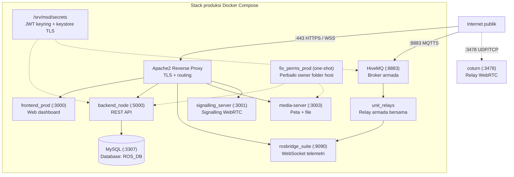
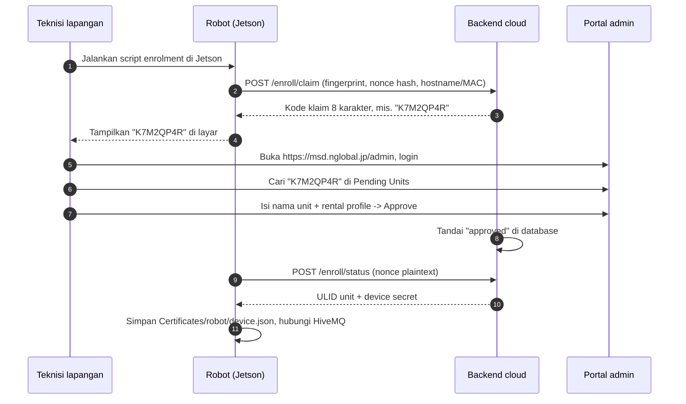

# Setup Server

<RoleBadge role="technician" />

Cara deploy **Cloud Server dan Web Dashboard MSD700**.

Selesaikan [Prasyarat](/id/setup/prerequisites) dulu.

::: info Produksi dulu
Halaman ini men-deploy **produksi**. Mode dev dan tambahan ada di [Advanced Configurations](#advanced-configurations) di bawah.
:::

## Topologi sistem



::: warning Mode fleet adalah default
Satu container `unit_relays` melayani seluruh armada. Container per-unit `rosweb_unit_*` hanya ada di mode legacy (`UNIT_CONTAINERS_ENABLED=true`). Jangan jalankan `server_prod` dan `server_dev` bersamaan di satu host. `coturn` hanya produksi. MySQL (`3307`) dan backend listen di semua interface, jadi tahan di balik firewall (lihat [Prasyarat](/id/setup/prerequisites)).
:::

## Struktur folder

```
~/ (mis. /home/ubuntu)
└── ros-web-ui/                      # Repo server (branch: v2)
    ├── docker-compose.yml
    ├── .env                         # Config per-host, TRACKED di git (lihat Step 4)
    ├── Docker/
    │   ├── Dockerfile               # Image server (copy ./source masuk, tanpa bind-mount)
    │   ├── hivemq/config.xml        # Config broker, satu file untuk prod + dev
    │   └── coturn/turnserver.conf   # Policy TURN bersama (address tetap di .env)
    ├── scripts/
    │   └── secrets.sh               # Tool JWT keyring
    └── source/
        └── dependencies/
            ├── ROS-dashboard-backend/
            ├── ROS-dashboard-next-ts/  # Frontend (clone nested, branch v2, gitignored)
            ├── media-server/
            ├── signalling_server/
            ├── aws_mqtt/               # Bridge MQTT + helper relay armada
            ├── topic2string/
            ├── network-agent/
            ├── shared/
            └── ssl_update/
                └── update_ssl.sh       # Renew Certbot + pembuat keystore HiveMQ
```

Frontend adalah checkout git terpisah di dalam `source/dependencies/ROS-dashboard-next-ts` (punya `.git` sendiri, diabaikan repo induk). Image Docker memanggang `./source` dengan `COPY`, jadi setelah edit kode aplikasi wajib **rebuild**, restart saja tidak cukup.

---

## Langkah setup

Kerjakan 6 langkah ini berurutan.

### Step 1: Clone repo

```bash
# 1. Repo server utama, branch v2
git clone -b v2 git@github.com:itbdelaboprogramming/ros-web-ui.git ~/ros-web-ui

# 2. Repo frontend, ke dalam dependencies, branch v2
git clone -b v2 git@github.com:itbdelaboprogramming/ROS-dashboard-next-ts.git \
  ~/ros-web-ui/source/dependencies/ROS-dashboard-next-ts
```

::: tip Kenapa di dalam dependencies?
Dockerfile mem-build frontend dari dalam build context `ros-web-ui`. Path itu di-gitignore oleh repo induk.
:::

---

### Step 2: Buat secrets

Secrets tinggal di `/srv/msd/secrets/`, di luar container, agar selamat dari rebuild.

```bash
cd ~/ros-web-ui
sudo mkdir -p /srv/msd/secrets
./scripts/secrets.sh init     # membuat jwt_keyring.json, tidak pernah overwrite
./scripts/secrets.sh status   # cek (output menyembunyikan nilai secret)
```

`--dev` memakai `jwt_keyring.dev.json` terpisah untuk stack dev. Migrasi dari `JWT_SECRET` lama? Pakai `init --seed-legacy <old-secret>`.

---

### Step 3: Buat keystore HiveMQ

HiveMQ butuh keystore PKCS#12 dari sertifikat Let's Encrypt.

```bash
cd ~/ros-web-ui
sudo ./source/dependencies/ssl_update/update_ssl.sh
```

Ini menjalankan `certbot renew`, lalu menulis `/srv/msd/secrets/hivemq/keystore.p12` (owner `1001`, mode `600`). Catatan:

- Script terkunci ke domain `msd.nglobal.jp` dan path itu. Password export harus cocok dengan `Docker/hivemq/config.xml`.
- Satu file keystore melayani broker **prod dan dev**.
- HiveMQ membacanya sekali saat startup, jadi **restart broker** setelahnya, di jam maintenance. Restart memutus MQTT se-armada dan bisa memicu watchdog 10-detik (`/emergency_pause`).
- `certbot renew` saja **tidak** mengupdate HiveMQ. Lihat [Maintenance](/id/setup/maintenance#sertifikat).

---

### Step 4: Tulis `.env`

```bash
cd ~/ros-web-ui
nano .env
```

```ini
# Penyimpanan peta di host ini
MAPS_FOLDER=/home/ubuntu/ros_maps

# User host + ID grup docker (cari dengan: id -u; id -g; getent group docker | cut -d: -f3)
USER_UID=1001
USER_GID=1001
DOCKER_GID=998

# Lepas klaim unit operator idle setelah 30 menit
UNIT_IDLE_TIMEOUT_MS=1800000

# Database (set password kuat sebelum start pertama)
MYSQL_ROOT_PASSWORD=SetYourStrongRootPasswordHere
MYSQL_DATABASE=ROS_DB
MYSQL_USER=itbdelabo
MYSQL_PASSWORD=SetYourStrongUserPasswordHere

# Broker MQTT
MQTT_BROKER_TYPE=nakayama
NAKAYAMA_HOST=msd.nglobal.jp
HIVEMQ_KEYSTORE=/srv/msd/secrets/hivemq/keystore.p12
HIVEMQ_UID=1001

# Port produksi
MYSQL_PORT_PROD=3307
BACKEND_PORT_PROD=5000
ROSBRIDGE_PORT_PROD=9090
MEDIA_SERVER_PORT_PROD=3003
SIGNALLING_PORT_WS_PROD=3001
SIGNALLING_PORT_HTTP_PROD=3002
HIVE_MQTT_TLS_PORT_PROD=8883
FRONTEND_PORT_PROD=3000

# Port development (stack terpisah, host sama)
MYSQL_PORT_DEV=3308
BACKEND_PORT_DEV=5001
ROSBRIDGE_PORT_DEV=9091
MEDIA_SERVER_PORT_DEV=4003
SIGNALLING_PORT_WS_DEV=4001
SIGNALLING_PORT_HTTP_DEV=4002
HIVE_MQTT_TLS_PORT_DEV=8884
FRONTEND_PORT_DEV=3100

# Alamat publik, dipanggang ke dashboard saat build
SERVER_PUBLIC_IP=118.22.31.252

# Relay TURN (hanya produksi; keempatnya wajib saat container start)
TURN_LISTENING_IP=192.168.100.14
TURN_EXTERNAL_IP=118.22.31.252/192.168.100.14
TURN_USER=msd700
TURN_PASSWORD=SetYourStrongTurnPasswordHere
```

::: warning `.env` tracked di git dan beda tiap host
`DOCKER_GID`, `MAPS_FOLDER`, `TURN_*`, `SERVER_PUBLIC_IP`, dan password menjelaskan **mesin ini**, bukan proyek. `git pull` bisa menimpanya dan commit bisa membocorkannya. Cek per host, jangan copy file satu host ke host lain. Mengubah `FRONTEND_PORT_PROD` berarti edit juga catch-all Apache. Rotasi kredensial TURN butuh restart relay plus rebuild (lihat [Maintenance](/id/setup/maintenance#relay-turn)).
:::

---

### Step 5: Jalankan container produksi

```bash
cd ~/ros-web-ui

# fix_perms_prod jalan otomatis duluan; tanpa profile tidak ada yang start
docker compose --profile server_prod up -d

# Cek semua Up atau healthy (fix_perms_* normalnya exit 0)
docker compose --profile server_prod ps
```

Setelah pull kode yang mengubah source aplikasi atau Dockerfile, rebuild: `up -d --build` (image tidak bind-mount `source/`). `up` prod juga menyalakan `coturn`. Referensi flag lengkap: [Referensi Docker](/id/setup/docker-reference).

---

### Step 6: Konfigurasi Apache

Apache mengakhiri TLS di port 443 dan meneruskan trafik ke container.

```bash
sudo a2enmod ssl proxy proxy_http proxy_wstunnel headers rewrite alias
sudo systemctl restart apache2
```

Edit `/etc/apache2/sites-available/000-default-le-ssl.conf`:

```apache
<IfModule mod_ssl.c>
<VirtualHost *:443>
    ServerName msd.nglobal.jp
    ServerAdmin webmaster@localhost
    DocumentRoot /var/www/html

    ErrorLog ${APACHE_LOG_DIR}/error.log
    CustomLog ${APACHE_LOG_DIR}/access.log combined

    ProxyAddHeaders On

    # 1. Signalling WebRTC (WebSocket)
    ProxyPass /services/signalling ws://localhost:3001
    ProxyPassReverse /services/signalling ws://localhost:3001

    # 2. Media server (peta, gambar)
    ProxyPass /services/media http://localhost:3003
    ProxyPassReverse /services/media http://localhost:3003

    # 3. Backend REST API
    ProxyPass /services/rosbackend http://localhost:5000
    ProxyPassReverse /services/rosbackend http://localhost:5000

    # 4. rosbridge WebSocket
    <Location /services/rosbridge>
        ProxyPass ws://localhost:9090 timeout=86400 keepalive=On flushpackets=on
        ProxyPassReverse ws://localhost:9090
        RequestHeader set Host "localhost:9090"
    </Location>

    # 5. Situs docs (exclusion harus DI ATAS catch-all)
    ProxyPass /itbdelabo/docs !
    Alias /itbdelabo/docs /home/itbdelabo/ITBdeLabo/V2/msd700_documentation/docs/.vitepress/dist

    <Directory /home/itbdelabo/ITBdeLabo/V2/msd700_documentation/docs/.vitepress/dist>
        Options -Indexes -MultiViews +FollowSymLinks
        AllowOverride None
        Require all granted
        DirectoryIndex index.html

        RewriteEngine On
        RewriteCond %{REQUEST_FILENAME} !-f
        RewriteCond %{REQUEST_FILENAME} !-d
        RewriteCond %{REQUEST_FILENAME}.html -f
        RewriteRule ^ %{REQUEST_FILENAME}.html [L]

        ErrorDocument 404 /itbdelabo/docs/404.html
    </Directory>

    # 6. Frontend dashboard (catch-all, HARUS TERAKHIR)
    ProxyPass / http://localhost:3000/
    ProxyPassReverse / http://localhost:3000/

    SSLCertificateFile /etc/letsencrypt/live/msd.nglobal.jp/fullchain.pem
    SSLCertificateKeyFile /etc/letsencrypt/live/msd.nglobal.jp/privkey.pem
    Include /etc/letsencrypt/options-ssl-apache.conf
</VirtualHost>
</IfModule>
```

Host live punya blok tambahan yang tidak ditampilkan (MQTT WebSocket, webhook, docs lama, gate Basic Auth di `/development/`). Aturannya: `ProxyPass /` selalu terakhir, setiap exclusion `ProxyPass ... !` di atasnya.

| Path | Target | Catatan |
| --- | --- | --- |
| `/services/signalling` | `ws://localhost:3001` | Signalling WebRTC WS |
| `/services/media` | `http://localhost:3003` | Aset peta |
| `/services/rosbackend` | `http://localhost:5000` | REST API |
| `/services/rosbridge` | `ws://localhost:9090` | `timeout=86400 keepalive=On flushpackets=on`, `Host: localhost:9090` |
| `/services/msd700-webhook` | `localhost:4701/webhook` | Hook deploy docs (di `apache-snippet.conf`, bukan blok utama) |
| `/itbdelabo/docs` | exclusion + `Alias` ke `dist/` | Harus tetap di atas catch-all |
| `/` | `http://localhost:3000/` | Frontend dashboard, **harus terakhir** |

Catatan HiveMQ: satu `config.xml` melayani prod dan dev; plaintext `1883` hanya internal container; TLS `8883` di dalam container untuk keduanya, dipetakan ke host 8883 prod / 8884 dev (jangan "perbaiki" port dev di XML). Auth client NONE — TLS hanya untuk transport/identitas server; keystore di `/opt/hivemq/conf/keystore.p12` di-rebuild oleh `update_ssl.sh` dan butuh restart broker. HTTP control-center `8080` ada untuk healthcheck.

Catatan coturn: `realm=msd.nglobal.jp`, `lt-cred-mech` (config lama tanpa auth memberi Allocate tanpa kredensial — sudah ditutup). Kredensial, port, dan `external-ip` masuk sebagai **flag** container dari compose (coturn tidak mengekspansi env), bukan file conf. Tanpa TURN-over-TLS/5349 by design; `no-cli`, tanpa relay TCP, peer LAN/loopback/multicast ditolak. Dev berbagi relay prod.

```bash
sudo apache2ctl configtest
sudo systemctl reload apache2
```

---

## Mendaftarkan unit (enrolment)

Setelah server jalan, robot bisa didaftarkan:



1. Login di `https://msd.nglobal.jp/admin`.
2. Di bawah **Pending Units**, cari kode 8 karakter dari robot.
3. Pilih **Rental Profile** aktif, beri nama unit, klik **Approve**.
4. Robot menyelesaikan enrolment dan muncul di dashboard armada.

---

## Advanced configurations

<details>
<summary><b>Mode development (`server_dev`)</b></summary>

Stack dev terisolasi di host yang sama:

```bash
cd ~/ros-web-ui
./scripts/secrets.sh init --dev
docker compose --profile server_dev up -d
```

Port dev: MySQL `3308`, backend `5001`, HiveMQ `8884`, rosbridge `9091`, ROS master `11312` (prod `11311`), frontend `3100`, media `4003`, signalling `4001` WS / `4002` HTTP.

Dev memakai `jwt_keyring.dev.json` terpisah tapi file keystore yang sama dengan prod. `coturn` tetap hanya produksi.

</details>

<details>
<summary><b>Rotasi key tanpa logout semua orang</b></summary>

```bash
cd ~/ros-web-ui
./scripts/secrets.sh rotate --grace-hours 48  # key lama tetap berlaku 48 jam
./scripts/secrets.sh status
./scripts/secrets.sh prune                    # hapus key kedaluwarsa setelah window
```

</details>

<details>
<summary><b>Keystore HiveMQ manual</b></summary>

Hanya bila tidak bisa memakai `update_ssl.sh`:

```bash
sudo mkdir -p /srv/msd/secrets/hivemq
sudo openssl pkcs12 -export \
  -in   /etc/letsencrypt/live/msd.nglobal.jp/fullchain.pem \
  -inkey /etc/letsencrypt/live/msd.nglobal.jp/privkey.pem \
  -out  /srv/msd/secrets/hivemq/keystore.p12 \
  -name hivemq \
  -passout "pass:<must-match-Docker-hivemq-config.xml>"

sudo chown -R 1001:1001 /srv/msd/secrets/hivemq
sudo chmod 700 /srv/msd/secrets/hivemq
sudo chmod 600 /srv/msd/secrets/hivemq/keystore.p12
```

Password harus cocok dengan `Docker/hivemq/config.xml`. Restart broker setelahnya.

</details>

---

## Health checks

```bash
# 1. Container jalan?
docker compose --profile server_prod ps

# 2. HTTPS Apache oke?
curl -sI https://msd.nglobal.jp/ | head -n 1

# 3. Backend API menjawab?
curl -s https://msd.nglobal.jp/services/rosbackend/

# 4. Broker MQTT listen?
sudo ss -lptn 'sport = :8883'

# 5. Relay armada jalan?
docker ps --filter name=unit_relays
```

## Terkait

- [Setup Unit](/id/setup/unit-setup): siapkan robot Jetson.
- [Setup Sistem](/id/setup/system-setup): cek server + unit bersama.
- [Referensi Docker](/id/setup/docker-reference): detail container.
