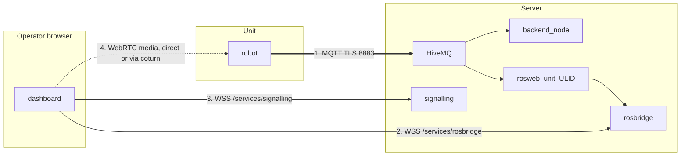

# Penyiapan Sistem

<RoleBadge role="technician" />

Cara memastikan [Server](/id/setup/server-setup) yang telah dikonfigurasi dan [Unit](/id/setup/unit-setup) yang telah dikonfigurasi
benar-benar bekerja sama sebagai satu sistem. Jika Anda mengikuti kedua halaman tersebut secara berurutan dan
unit berhasil melakukan enrolment, sebagian besar langkah di sini adalah verifikasi, bukan konfigurasi baru.

## Ikhtisar

Sebuah Unit dan Server berkomunikasi melalui beberapa jalur (channel) yang dapat gagal secara **independen**. Membedakan jalur-jalur
tersebut adalah keahlian inti di sini.



| # | Jalur | Membawa | Tampilan saat rusak |
| --- | --- | --- | --- |
| 1 | MQTT | perintah, feedback, dan setiap stream, dalam bentuk string | Unit tampak **offline**. Tidak ada yang berfungsi |
| 2 | rosbridge | langganan (subscription) browser ke topic bertipe sisi cloud | Unit **online**, perintah berfungsi, kanvas peta kosong |
| 3 | signalling | negosiasi peer WebRTC | Tidak ada video, sisanya baik-baik saja |
| 4 | Media WebRTC | gambar kamera itu sendiri | Video berfungsi di LAN, tidak pernah di luar itu. Itulah relay TURN |

Ada kegagalan kelima yang tampak seperti nomor 2: unit online dan rosbridge terhubung,
tetapi **belum ada yang membuka unit tersebut cukup baru-baru ini agar container per-unit-nya tetap berjalan**,
sehingga relay sisi cloud yang menjadi tempat rosbridge berlangganan tidak ada. Kanvas kosong yang sama, penyebab
yang berbeda. Periksa dengan `docker ps --filter name=rosweb_unit_`.

## 1. Konfirmasi jalur jaringan

| Dari | Ke | Port | Diperlukan untuk |
| --- | --- | --- | --- |
| Unit | Server | TCP `8883` (prod) atau TCP `8884` (dev) | Semuanya. Ini satu-satunya yang wajib |
| Browser operator | Server | TCP `443` | Dashboard, API, rosbridge, signalling |
| Browser operator | Server | UDP+TCP `3478` dan rentang relay | Video WebRTC saat tidak ada jalur langsung |

```bash
# From the Unit: can it reach the broker at all?
nc -zv msd.nglobal.jp 8883

# And is the certificate the broker presents actually valid?
openssl s_client -connect msd.nglobal.jp:8883 -servername msd.nglobal.jp </dev/null 2>/dev/null \
  | openssl x509 -noout -subject -dates
```

::: warning Sertifikat kedaluwarsa gagal secara diam-diam di browser
Koneksi WebSocket dashboard hanya tidak pernah terbuka. Sebagian besar browser tidak menampilkan apa pun
yang lebih berguna selain error jaringan generik di konsol, jadi periksa sertifikat terlebih dahulu sebelum
mengejar hal lain. Perhatikan bahwa sertifikat broker MQTT adalah **artefak terpisah** dari milik Apache,
dibangun ulang dari file PEM yang sama: lihat [Pemeliharaan](/id/setup/maintenance#sertifikat).
:::

::: info Memilih antara produksi vs. dev
`--dev` di sisi unit (`./scripts/docker-manager.sh up --dev`) mengarahkan enrolment dan jembatan MQTT
ke profil `server_dev` milik Server, bukan `server_prod`: port berbeda, database berbeda, armada berbeda.
Ini pilihan yang tepat saat Anda sedang menguji unit baru atau perubahan sisi server; hapus flag tersebut
setelah Anda melakukan deployment sungguhan. Identitas sebuah unit *tidak* dibagi antara keduanya:
melakukan enrolment terhadap dev tidak mendaftarkannya di prod, begitu pula sebaliknya.
:::

## 2. Konfirmasi unit terdaftar dengan benar

Di konsol admin, di bawah **Registered Units**, temukan unit yang Anda setujui pada
[Penyiapan Unit](/id/setup/unit-setup). Catat ULID-nya; Anda akan membutuhkannya untuk pemeriksaan berikutnya.

```bash
# On the Server. The per-unit container has to be RUNNING for these topics to exist,
# so open the unit in the dashboard first, or start it by hand.
docker ps --filter "name=rosweb_unit_"
docker exec -it ros_web_ui_v2_nakayama_ros bash -lc \
  'source /home/itbdelabo/ros-web-ui-ws/devel/setup.bash && rostopic list | grep unit_<ULID>'
```

Anda seharusnya melihat topic seperti `/unit_<ULID>/system_command`, `/unit_<ULID>/system_feedback`, dan
`/unit_<ULID>/server/robot_pose`. Tidak melihat apa pun di sini, tanpa error di tempat lain, adalah gejala
"tampak rusak tapi tidak memberi tahu alasannya" yang paling umum di sistem ini.

Anda juga bisa mengamati broker secara langsung, yang memisahkan antara "robot tidak melakukan publish" dan
"relay cloud tidak berjalan":

```bash
mosquitto_sub -h msd.nglobal.jp -p 8883 --capath /etc/ssl/certs \
  -t '/unit_<ULID>/#' -v | head -20
```

## 3. Checklist verifikasi menyeluruh

Kerjakan daftar ini dari atas ke bawah. Setiap butir menyingkirkan satu kemungkinan dari jalur-jalur pada diagram ikhtisar.

- [ ] Server sehat: `docker compose --profile server_prod ps` menunjukkan setiap service `Up` atau `healthy`
- [ ] Graf ROS unit sehat: `rosnode list` di dalam container unit menunjukkan node-node bringup
- [ ] Unit tampak **online** pada daftar Registered Units di konsol admin (jalur 1, MQTT)
- [ ] Container per-unit-nya berjalan: `docker ps --filter name=rosweb_unit_`
- [ ] Membuka unit menunjukkan posisi robot yang mutakhir dan peta live (jalur 2, rosbridge)
- [ ] Feed kamera live muncul **dari luar LAN unit tersebut** (jalur 3 dan 4)
- [ ] Gerakan W-A-S-D kecil benar-benar menggerakkan robot, dan posisi di dashboard mengikuti
- [ ] Goal click-to-navigate diterima dan robot bergerak ke sana
- [ ] Emergency Stop, diuji sekali, menghentikan robot dengan segera
- [ ] Menutup browser di tengah operasi menjeda robot dalam waktu sekitar 10 detik

::: warning Jangan lewati empat butir terakhir
Sebuah unit bisa tampak terhubung sepenuhnya (badge online, video berfungsi) sementara jalur perintah rusak
di satu arah, dan itu hanya terlihat begitu robot diminta bergerak. Pengujian disconnect sama pentingnya:
itu adalah perilaku keselamatan, dan satu-satunya cara mengetahui apakah itu berfungsi adalah dengan
memicunya secara sengaja sekali, pada robot dengan ruang bebas di sekitarnya.
:::

## 4. Serah Terima

Setelah verifikasi berhasil, unit siap untuk penggunaan sehari-hari. Dua hal masih perlu dilakukan sebelum
menyerahkannya ke operator:

1. **Berikan akses dashboard.** Di konsol admin, tambahkan akun operator ke profil penyewaan
   yang mencakup unit ini. Sebuah unit yang ada dan telah di-enrol tidak, dengan sendirinya, membuatnya
   terlihat oleh akun pengguna mana pun: unit adalah sumber daya bersama lintas armada, dan akses ke
   unit tersebut sepenuhnya dikontrol melalui profil, bukan melalui unit itu sendiri.
2. **Arahkan mereka ke [Panduan Pengguna](/id/user-guide/).** Bagian tersebut mengasumsikan persis kondisi ini:
   unit yang sudah terpasang, terhubung, dan telah diberi akses.

## Langkah Berikutnya

- Siapkan jadwal [Pemeliharaan](/id/setup/maintenance) untuk deployment baru ini.
- Simpan [Pemecahan Masalah](/id/setup/troubleshooting) untuk masalah di masa mendatang.
