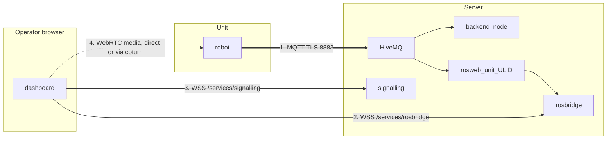

# Pengaturan Sistem

<RoleBadge role="technician" />

Cara mengonfirmasi [Server](/id/setup/server-setup) yang dikonfigurasi dan [Unit](/id/setup/unit-setup) yang dikonfigurasi
sebenarnya bekerja sama sebagai satu sistem. Jika Anda mengikuti kedua halaman tersebut secara berurutan dan
unit berhasil didaftarkan, sebagian besar merupakan verifikasi, bukan konfigurasi baru.

## Ikhtisar

Unit dan Server membicarakan saluran yang gagal **secara independen**. Membedakan mereka adalah
seluruh keterampilan di sini.



| # | Saluran | Membawa | Rusak sepertinya |
| --- | --- | --- | --- |
| 1 | MQTT | perintah, umpan balik, dan setiap aliran, sebagai string | Unit menunjukkan **offline**. Tidak ada yang berhasil |
| 2 | rosbridge | langganan browser ke topik yang diketik di sisi cloud | Unit **online**, perintah berfungsi, kanvas peta kosong |
| 3 | memberi isyarat | Negosiasi rekan WebRTC | Tidak ada video, semuanya baik-baik saja |
| 4 | Media WebRTC | gambar kamera itu sendiri | Video berfungsi di LAN, tidak pernah terputus. Itulah relai TURN |

Ada kegagalan kelima seperti nomor 2: unit online dan rosbridge terhubung,
namun **belum ada yang membuka unit tersebut baru-baru ini agar kontainer per unitnya tetap dapat berjalan**,
jadi relay sisi cloud yang menjadi langganan rosbridge tidak ada. Kanvas kosong yang sama, berbeda
penyebab. Periksa dengan `docker ps --filter name=rosweb_unit_`.

## 1. Konfirmasikan jalur jaringan

| Dari | Ke | Pelabuhan | Diperlukan untuk |
| --- | --- | --- | --- |
| Satuan | Server | `8883` TCP (prod) atau `8884` TCP (dev) | Semuanya. Ini satu-satunya yang wajib |
| Peramban operator | Server | `443` TCP | Dasbor, API, rosbridge, pensinyalan |
| Peramban operator | Server | `3478` UDP+TCP dan jangkauan relai | Video WebRTC ketika tidak ada jalur langsung |

```bash
# From the Unit: can it reach the broker at all?
nc -zv msd.nglobal.jp 8883

# And is the certificate the broker presents actually valid?
openssl s_client -connect msd.nglobal.jp:8883 -servername msd.nglobal.jp </dev/null 2>/dev/null \
  | openssl x509 -noout -subject -dates
```

::: warning An expired certificate fails silently in the browser
Koneksi WebSocket dasbor tidak pernah terbuka. Kebanyakan browser tidak menampilkan hal yang lebih berguna daripada a
kesalahan jaringan umum di konsol, jadi periksa sertifikat sebelum melakukan hal lain. Catatan
bahwa sertifikat broker MQTT adalah **artefak terpisah** dari Apache, yang dibuat ulang dari sertifikat yang sama
File PEM: lihat [Pemeliharaan](/id/setup/maintenance#certificates).
:::

::: info Choosing production vs. dev
`--dev` di sisi unit (`./scripts/docker-manager.sh up --dev`) poin pendaftaran dan MQTT
jembatan di profil `server_dev` Server alih-alih `server_prod`: port berbeda, berbeda
database, armada berbeda. Ini adalah pilihan yang tepat saat Anda menguji unit baru atau sisi server
perubahan; jatuhkan benderanya setelah Anda benar-benar menerapkannya. Identitas unit *tidak* dibagikan di antara mereka
dua: mendaftar melawan dev tidak mendaftarkannya di prod, dan sebaliknya.
:::

## 2. Konfirmasi unit yang didaftarkan dengan benar

Di konsol Admin, pada **Unit Terdaftar**, temukan unit yang Anda setujui
[Pengaturan Unit](/id/setup/unit-setup). Perhatikan ULID-nya; Anda akan menginginkannya untuk pemeriksaan berikutnya.

```bash
# On the Server. The per-unit container has to be RUNNING for these topics to exist,
# so open the unit in the dashboard first, or start it by hand.
docker ps --filter "name=rosweb_unit_"
docker exec -it ros_web_ui_v2_nakayama_ros bash -lc \
  'source /home/itbdelabo/ros-web-ui-ws/devel/setup.bash && rostopic list | grep unit_<ULID>'
```

Anda akan melihat topik seperti `/unit_<ULID>/system_command`, `/unit_<ULID>/system_feedback` dan
`/unit_<ULID>/server/robot_pose`. Tidak melihat apa pun di sini, tanpa kesalahan di tempat lain, adalah satu-satunya
gejala paling umum "kelihatannya rusak tetapi tidak memberi tahu alasannya" pada sistem ini.

Anda juga dapat menyaksikan langsung broker yang memisahkan "robot tidak menerbitkan" dari "the
relay cloud tidak berjalan":

```bash
mosquitto_sub -h msd.nglobal.jp -p 8883 --capath /etc/ssl/certs \
  -t '/unit_<ULID>/#' -v | head -20
```

## 3. Daftar periksa verifikasi ujung ke ujung

Kerjakan daftar ini. Setiap item mengesampingkan salah satu saluran dalam diagram ikhtisar.

- [ ] Server sehat: `docker compose --profile server_prod ps` menampilkan setiap layanan `Up` atau `healthy`
- [ ] Grafik ROS unit sehat: `rosnode list` di dalam wadah unit menunjukkan node yang memunculkan
- [ ] Unit ditampilkan **online** di daftar Unit Terdaftar di konsol admin (saluran 1, MQTT)
- [ ] Kontainer per unitnya sedang berjalan: `docker ps --filter name=rosweb_unit_`
- [ ] Membuka unit menunjukkan posisi robot terkini dan peta langsung (saluran 2, rosbridge)
- [ ] Umpan kamera langsung muncul **dari luar LAN unit** (saluran 3 dan 4)
- [ ] Gerakan kecil W-A-S-D sebenarnya menggerakkan robot, dan posisi dashboard mengikuti
- [ ] Sasaran klik untuk bernavigasi diterima dan robot mengarahkannya ke sasaran tersebut
- [ ] Berhenti Darurat, diuji satu kali, menghentikan robot dengan segera
- [ ] Menutup browser di tengah pengoperasian akan menjeda robot dalam waktu sekitar 10 detik

::: warning Do not skip the last four
Sebuah unit dapat terlihat terhubung sepenuhnya (lencana online, video berfungsi) saat jalur perintah rusak
satu arah, dan itu hanya muncul ketika ada sesuatu yang diminta untuk bergerak. Tes pemutusan itu penting
sama pentingnya: ini adalah perilaku keselamatan, dan satu-satunya cara untuk mengetahui keberhasilannya adalah dengan memicunya
sengaja sekali, pada robot dengan ruang kosong disekitarnya.
:::

## 4. Serah terima

Setelah verifikasi lolos, unit siap digunakan sehari-hari. Ada dua hal yang masih perlu dilakukan sebelumnya
menyerahkannya ke operator:

1. **Berikan akses dasbor.** Di konsol admin, tambahkan akun operator ke persewaan
   profil yang mencakup unit ini. Sebuah unit yang ada dan didaftarkan tidak dengan sendirinya dapat berhasil
   dapat dilihat oleh akun pengguna mana pun: unit dibagikan, sumber daya di seluruh armada, dan akses ke unit tersebut
   dikontrol sepenuhnya melalui profil, bukan melalui unit itu sendiri.
2. **Arahkan mereka ke [Memulai](/id/getting-started/).** Bagian tersebut mengasumsikan keadaan seperti ini:
   unit yang sudah terpasang, terhubung, dan diberikan akses.

## Langkah selanjutnya

- Siapkan jadwal [Pemeliharaan](/id/setup/maintenance) untuk penerapan baru.
- Simpan [Pemecahan Masalah](/id/setup/troubleshooting) berguna untuk masalah mendatang.