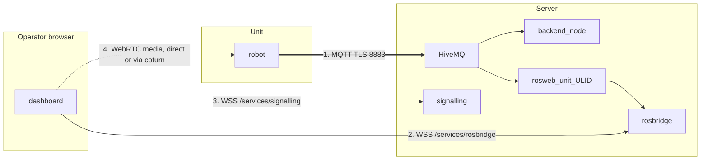

# System Setup

<RoleBadge role="technician" />

How to confirm a configured [Server](/id/setup/server-setup) and a configured [Unit](/id/setup/unit-setup)
are actually working together as one system. If you followed both of those pages in order and the
unit enrolled successfully, most of this is verification rather than new configuration.

## Overview

A Unit and the Server talk over channels that fail **independently**. Telling them apart is the
whole skill here.



| # | Channel | Carries | Broken looks like |
| --- | --- | --- | --- |
| 1 | MQTT | commands, feedback, and every stream, as strings | Unit shows **offline**. Nothing works |
| 2 | rosbridge | the browser's subscription to cloud-side typed topics | Unit is **online**, commands work, map canvas blank |
| 3 | signalling | WebRTC peer negotiation | No video, everything else fine |
| 4 | WebRTC media | the camera image itself | Video works on the LAN, never off it. That is the TURN relay |

There is a fifth failure that looks like number 2: the unit is online and rosbridge is connected,
but **nobody has opened that unit recently enough for its per-unit container to still be running**,
so the cloud-side relays that rosbridge subscribes to do not exist. Same blank canvas, different
cause. Check with `docker ps --filter name=rosweb_unit_`.

## 1. Confirm the network path

| From | To | Port | Required for |
| --- | --- | --- | --- |
| Unit | Server | `8883` TCP (prod) or `8884` TCP (dev) | Everything. This is the only mandatory one |
| Operator browser | Server | `443` TCP | Dashboard, API, rosbridge, signalling |
| Operator browser | Server | `3478` UDP+TCP and the relay range | WebRTC video when there is no direct path |

```bash
# From the Unit: can it reach the broker at all?
nc -zv msd.nglobal.jp 8883

# And is the certificate the broker presents actually valid?
openssl s_client -connect msd.nglobal.jp:8883 -servername msd.nglobal.jp </dev/null 2>/dev/null \
  | openssl x509 -noout -subject -dates
```

::: warning An expired certificate fails silently in the browser
The dashboard's WebSocket connections just never open. Most browsers show nothing more useful than a
generic network error in the console, so check the certificate before chasing anything else. Note
that the MQTT broker's certificate is a **separate artifact** from Apache's, rebuilt from the same
PEM files: see [Maintenance](/id/setup/maintenance#certificates).
:::

::: info Choosing production vs. dev
`--dev` on the unit side (`./scripts/docker-manager.sh up --dev`) points enrolment and the MQTT
bridge at the Server's `server_dev` profile instead of `server_prod`: different port, different
database, different fleet. It's the right choice while you're testing a new unit or a server-side
change; drop the flag once you're deploying for real. A unit's identity is *not* shared between the
two: enrolling against dev does not register it in prod, and vice versa.
:::

## 2. Confirm the unit registered correctly

In the admin console, under **Registered Units**, find the unit you approved in
[Unit Setup](/id/setup/unit-setup). Note its ULID; you'll want it for the next check.

```bash
# On the Server. The per-unit container has to be RUNNING for these topics to exist,
# so open the unit in the dashboard first, or start it by hand.
docker ps --filter "name=rosweb_unit_"
docker exec -it ros_web_ui_v2_nakayama_ros bash -lc \
  'source /home/itbdelabo/ros-web-ui-ws/devel/setup.bash && rostopic list | grep unit_<ULID>'
```

You should see topics like `/unit_<ULID>/system_command`, `/unit_<ULID>/system_feedback` and
`/unit_<ULID>/server/robot_pose`. Seeing nothing here, with no error anywhere else, is the single
most common "it looks broken but is not telling you why" symptom in this system.

You can also watch the broker directly, which separates "the robot is not publishing" from "the
cloud relays are not running":

```bash
mosquitto_sub -h msd.nglobal.jp -p 8883 --capath /etc/ssl/certs \
  -t '/unit_<ULID>/#' -v | head -20
```

## 3. End-to-end verification checklist

Work down this list. Each item rules out one of the channels in the overview diagram.

- [ ] Server healthy: `docker compose --profile server_prod ps` shows every service `Up` or `healthy`
- [ ] Unit's ROS graph healthy: `rosnode list` inside the unit's container shows the bringup nodes
- [ ] Unit shows **online** in the admin console's Registered Units list (channel 1, MQTT)
- [ ] Its per-unit container is running: `docker ps --filter name=rosweb_unit_`
- [ ] Opening the unit shows an up-to-date robot position and a live map (channel 2, rosbridge)
- [ ] The live camera feed appears **from outside the unit's LAN** (channels 3 and 4)
- [ ] A small W-A-S-D movement actually moves the robot, and the dashboard position follows
- [ ] A click-to-navigate goal is accepted and the robot drives to it
- [ ] Emergency Stop, tested once, stops the robot immediately
- [ ] Closing the browser mid-operation pauses the robot within about 10 seconds

::: warning Do not skip the last four
A unit can look fully connected (online badge, video working) while the command path is broken in
one direction, and that only shows up once something is asked to move. The disconnect test matters
just as much: it is the safety behavior, and the only way to know it works is to trigger it
deliberately once, on a robot with clear space around it.
:::

## 4. Handover

Once verification passes, the unit is ready for day-to-day use. Two things still need doing before
handing it to an operator:

1. **Grant dashboard access.** In the admin console, add the operator's account to the rental
   profile that includes this unit. A unit existing and being enrolled does not, by itself, make it
   visible to any user account: units are shared, fleet-wide resources, and access to them is
   controlled entirely through profiles, not through the unit itself.
2. **Point them at [Getting Started](/id/getting-started/).** That section assumes exactly this state:
   a unit that's already installed, connected, and access-granted.

## Next step

- Set up a [Maintenance](/id/setup/maintenance) schedule for the new deployment.
- Keep [Troubleshooting](/id/setup/troubleshooting) handy for future issues.
