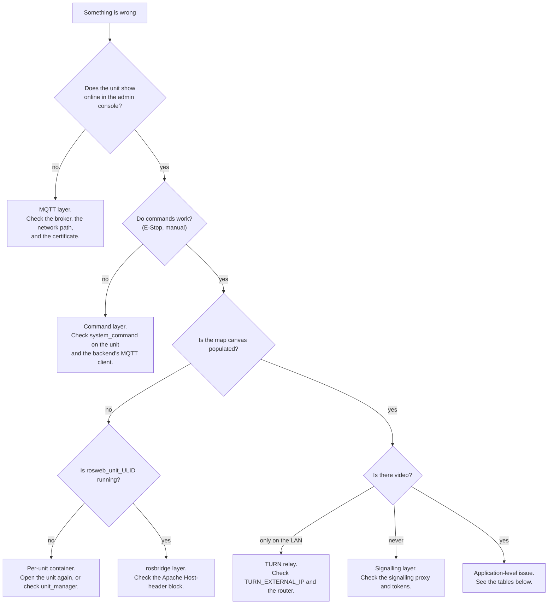

# Pemecahan masalah

<RoleBadge role="technician" />

Diagnostik teknis untuk masalah instalasi dan penerapan. Untuk masalah yang dihadapi pengguna, lihat [Memulai > Pemecahan Masalah](/id/getting-started/troubleshooting) sebagai gantinya.

## Mulai di sini: lapisan mana yang rusak?

## Daftar periksa diagnostik

Selesaikan ini secara berurutan: masing-masing mengesampingkan seluruh lapisan.

1. **Apakah Server berjalan?** `docker compose --profile server_prod ps`: setiap layanan akan ditampilkan
   `Up` atau `healthy` ([Pengaturan Server](/id/setup/server-setup#_7-verify)).
2. **Apakah container Unit berjalan?** `./scripts/docker-manager.sh status` pada Unit.
3. **Apakah Unit berhasil didaftarkan?** Periksa **Unit Terdaftar** di konsol admin untuk mengetahui lokasinya
   ULID, dan itu ditampilkan secara online.
4. **Apakah kontainer per unit berjalan?** `docker ps --filter name=rosweb_unit_` di Server.
5. **Apakah jalur jaringan terbuka**, pada port masuk
   [Pengaturan Sistem](/id/setup/system-setup#_1-confirm-the-network-path)?
6. **Periksa log**: `docker compose logs -f <service>` di Server,
   `docker exec -it msd700 tmux attach -t robot_services` pada Unit (jendela: `roscore`,
   `ros_webui`, `camera_client`, `switch_mode`, `log_janitor`).

## Masalah umum

| Gejala | Kemungkinan penyebab | Perbaiki |
| --- | --- | --- |
| Robot menyala, semuanya tampak baik-baik saja, tetapi dasbor tidak menunjukkan apa pun | ULID unit tidak cocok dengan catatan dasbor/konsol admin. Ini gagal **secara diam-diam**: ROS baru saja menerbitkan ke dalam namespace yang tidak ada orang yang berlangganan. | Konfirmasikan id dengan `rostopic list \| grep unit_<ULID>` di sisi Server, dan periksa silang dengan Unit Terdaftar di konsol admin. Jika Anda pernah menyetel `UNIT_ID` dengan tangan, pastikan menggunakan huruf besar: nama topik peka huruf besar-kecil meskipun pengkodean ULID tidak. |
| `docker: permission denied` pada Unit | Pengguna Anda belum (belum) tergabung dalam grup `docker`, atau keanggotaan grup belum berlaku untuk shell ini | `sudo usermod -aG docker $USER`, lalu logout dan masuk kembali (atau `newgrp docker` untuk shell saat ini) |
| Jendela RViz/Gazebo tidak terbuka | Penerusan X11 tidak diperbolehkan dari dalam penampung | `xhost +local:docker` pada host, sebelum memulai container |
| `catkin_make`/`catkin build` gagal di dalam wadah | Biasanya ketergantungan hilang, atau `logs/` dipasang di direktori log ruang kerja sendiri (ketidakcocokan uid: salinan host dimiliki oleh uid 2002, pengguna build dalam wadah adalah 1000) | Jalankan kembali di dalam shell (`./scripts/docker-manager.sh shell`) untuk melihat kesalahan sebenarnya; jangan pasang `logs/` di atas `/workspace/logs` |
| Backend gagal dimulai dengan `Connection lost` tepat setelah `up` | Backend dimulai sebelum MySQL menyelesaikan pemeriksaan kesehatannya, biasanya hanya terlihat ketika pembangunan ruang kerja lambat (cold cache) | Ini harus mencoba lagi secara otomatis; jika tidak, `docker compose up -d <backend service>` sekali lagi `docker compose ps` menampilkan DB sebagai `healthy` |
| Cadangan profil gagal disimpan | `/srv/msd/media/backup` (atau `_dev`) belum ada, atau belum dimiliki oleh pengguna aplikasi | Tampilkan pemecah izin sekali pakai secara eksplisit: `docker compose up fix_perms_prod` (atau `fix_perms_dev`), lalu centang `ls -la /srv/msd/media/backup` |
| Pembuatan simulator gagal pada peluncuran pertama dengan `resource not found: gazebo_ros` | Gambar dibuat *tanpa* `--simulator`: Gazebo tidak dinyatakan sebagai ketergantungan secara default, jadi gambar stok tidak memilikinya | `./scripts/docker-manager.sh build --simulator`, lalu `up --simulator` |
| Penyimpanan peta gagal karena kesalahan izin, hanya di laptop dev (bukan Jetson asli) | `USER_UID`/`USER_GID` di `docker/.env` masih menunjuk pada default Jetson (2002) dan bukan pada pengguna Anda sendiri | Atur ke `id -u`/`id -g` |
| Wadah yang sudah ada tidak akan dimulai dengan bersih | Status kontainer/jaringan yang tersisa dari `down`/crash | `docker compose down --remove-orphans`, lalu aktifkan kembali |
| Kanvas peta kosong, tetapi unit online dan perintah berfungsi | Kontainer per unit tidak berjalan, sehingga relai sisi cloud yang berlangganan rosbridge tidak ada | `docker ps --filter name=rosweb_unit_`. Buka kembali unit di dashboard; jika masih tidak muncul, periksa baris `unit_manager` di backend log |
| Konsol browser menunjukkan kegagalan jabat tangan rosbridge | Apache mem-proxy rosbridge tanpa penulisan ulang header `Host`, jadi rosbridge menjawab `missing port in HTTP Host header` | Tambahkan blok `<Location /services/rosbridge>` dari [Server Setup](/id/setup/server-setup#the-vhost-block) |
| Setiap jalur WebSocket gagal, jalur HTTP baik-baik saja | `mod_proxy_wstunnel` tidak diaktifkan | `sudo a2enmod proxy_wstunnel && sudo systemctl restart apache2` |
| Umpan kamera berfungsi di LAN, tidak pernah dari luar | Relai TURN mengiklankan alamat yang tidak dapat dijangkau, atau portnya tidak diteruskan | Periksa `TURN_EXTERNAL_IP` dan penerus router; lihat [Pemeliharaan](/id/setup/maintenance#the-turn-relay) |
| Seluruh armada offline sekaligus dengan kesalahan TLS | Keystore HiveMQ menyajikan sertifikat yang kedaluwarsa. `certbot renew` saja tidak memperbaruinya | `sudo ./source/dependencies/ssl_update/update_ssl.sh`, kemudian restart broker di jendela pemeliharaan |
| `coturn` memulai ulang dalam satu lingkaran dan tidak pernah mengikat | apt/systemd `coturn` masih memiliki port 3478 | `sudo systemctl disable --now coturn`, lalu jalankan container |
| Log backend `ECONNREFUSED 127.0.0.1:1883` berulang kali | `MQTT_BROKER_TYPE` tidak disetel atau tidak `nakayama`, sehingga backend dikembalikan ke broker lokal tidak ada yang berfungsi | Setel `MQTT_BROKER_TYPE=nakayama` di `.env` dan buat ulang backend |
| Log backend `EACCES /var/run/docker.sock` dan tidak ada kontainer unit yang muncul | `DOCKER_GID` tidak cocok dengan grup buruh pelabuhan host ini | `getent group docker \| cut -d: -f3`, perbaiki `.env`, buat ulang backend |
| Titik akhir baru mengembalikan 404 pada unit yang sumbernya jelas memilikinya | Gambar server lokal unit sudah basi. Layanan tersebut **disalin** ke dalam gambar, bukan diikat | `./scripts/docker-manager.sh local-build`, lalu `up` |
| Lencana mengatakan gambar kedaluwarsa setelah diedit sumber mode lokal | Sejak 13-08-2026, `up` hanya memperingatkan (`[WARN] ... OUT OF DATE`) dan tetap menjalankan image lama, tidak lagi dibuat ulang secara otomatis, jadi membuat unit online tidak memerlukan internet | Bangun kembali dengan sengaja: `./scripts/docker-manager.sh local-build` (atau `build` untuk gambar robot juga), atau `up --build` untuk melakukan keduanya dan memulai dalam satu perintah |

## Regresi yang perlu diketahui

Beberapa kejadian di masa lalu layak untuk dikenali, karena gejalanya tidak jelas
pada tujuan mereka:

- **Unit yang berfungsi berhenti muncul setelah pembaruan kode, dengan build yang terlihat sebaliknya
  baiklah.** Periksa apakah file penanda `CATKIN_IGNORE` secara tidak sengaja dimasukkan ke dalam sebuah paket
  itulah *satu-satunya* salinan robot yang dapat dibuat. Ini telah terjadi sebelumnya (`robot_pose_publisher`) dan
  secara diam-diam membatalkan `navigation.launch` tanpa kesalahan yang jelas yang menunjukkan penyebab sebenarnya.
- **Navigasi dan pemetaan terhenti sepenuhnya, dengan kesalahan TF menyebutkan "waktu simulasi".** Ini dia
  `/use_sim_time` terjebak `true` di roscore tanpa penerbit `/clock`. Memulai ulang pendidikan sendirian
  tidak memperbaikinya, karena nilai basi berada di master ROS, bukan di satu node mana pun. Ini adalah sebuah
  bug tingkat kode, bukan kesalahan penerapan; meningkatkannya daripada mencoba mengatasinya secara lokal.

- **Robot yang jelas-jelas sedang mengemudi menunjukkan spanduk "Robot Terjebak".** Ternyata memang begitu
  `idle_detector` logikanya sendiri (titik jangkar yang lengket, atau ambang perpindahan yang terlalu besar untuk memperlambat
  gerak), tidak pernah di bagian depan. Lihat
  [Keadaan dan Perilaku](/id/development/state-and-behavior#idle-and-stuck-arbitration).
- **Sebuah liputan melaporkan "Tiba" untuk suatu daerah yang jelas-jelas tidak pernah tersapu.** Dana talangan sekarang
  menerbitkan `aborted` dan membaca "Gagal", tetapi hanya setelah N kegagalan **berturut-turut**, proses yang gagal
  sebentar-sebentar dan melengkapi sisa kakinya yang masih berakhir sebagai `complete`. Kenali itu dengan sebuah
  `arrived` nyatakan di sebelah hamparan cakupan yang tidak lengkap.
- **Hanya di dasbor lokal: Autopilot menunjukkan "tidak terlibat" tetapi robot jelas berjalan
  itu, dan masuk kembali tidak akan memulihkan apa pun.** Keduanya merupakan lompatan hilang yang sama. Hingga 15-08-2026
  `local.launch` menyampaikan topik string dasbor-ke-robot tetapi tidak sebaliknya, jadi
  supervisor menerbitkan `/string/operation_snapshot` sementara dashboard mendengarkan
  `/unit_<ULID>/string/operation_snapshot`. Konfirmasi dengan `rostopic list | grep operation_` di
  unit: nama datar yang ada tanpa awalan kembar adalah sidik jari. Jalur awan tidak pernah ada
  terpengaruh, karena MQTT menjembatani kedua arah.
- **Ruang yang disapu masih memiliki strip yang belum disapu di sepanjang dindingnya.** Beberapa di antaranya adalah geometri dan beberapa di antaranya
  itu adalah bug. Lantainya `wall_clearance - body_half_width` = 0,225 m per dinding, dan tidak ada denah yang bisa
  kalahkan itu. Semakin lebar berarti jarak bebas diterapkan lebih dari satu kali: baca geometrinya
  blok `path_coverage` mencetak saat startup dan periksa apakah kemunduran efektif adalah 0,575 m, bukan
  1,10 m. Lihat
  [Boustrophedon § Dua geometri robot](/id/development/boustrophedon-and-alignment#_1-two-robot-geometries).
- **Masalah geometri muncul di robot, tetapi tidak pernah muncul di simulator.** Hingga 19-08-2026 setiap
  robot yang disimulasikan adalah turunan TurtleBot3 Waffle: tubuh berukuran 0,266 x 0,266 m melawan tubuh nyata
  0,90 x 0,70 m satu. Sebuah benda berjari-jari 0,133 m berlayar melewati celah yang menghentikan benda yang berukuran 0,425 m, jadi
  tidak ada keluhan sempit yang dapat direproduksi. Lebih buruk lagi, dunia ini cocok dengan robot kecil:
  `turtlebot_world` berada pada jarak 0,39 m, sehingga robot sebenarnya tidak muat dalam satu pun
  sel itu. Gunakan `msd700_simulation msd700_warehouse_nav.launch`, yang memunculkan
  `msd700_field.urdf.xacro` dengan ukuran aslinya di aula berukuran 14 x 21 m. Lihat
  [Simulasi](/id/development/simulation).
- **Gazebo terbuka di kotak abu-abu kosong dan peta menjadi kosong.** Dunia pihak ketiga dulu
  tidak pernah diambil. Gazebo tidak gagal jika `world_name` hilang; ia tidak membuka apa pun dan tidak mengatakan apa pun,
  dan setiap gejala hilirnya adalah ikan haring merah. Jalankan
  `rosrun msd700_simulation fetch_sim_worlds.sh`. Peluncuran gudang sekarang dibatalkan dengan dapat dibaca
  pesan sebagai gantinya, tetapi peluncuran apa pun yang menunjuk `world_path` ke direktori vendor dengan tangan masih bisa
  pukul ini.
- **Robot yang disimulasikan merencanakan jalur di antara dua kaki rak yang tidak mungkin dilewatinya.** `move_base`
  membawa jejak Waffle di bawah bodi berukuran sebenarnya. Lewati `sim_body:=field` agar dapat dimuat
  `costmap_common_params.yaml` (amplop 1,20 x 0,85 m) bukan varian `_sim`
  (0,28x0,31m). Konfirmasikan dengan
  `rosparam get /move_base/global_costmap/footprint`.
- **Pose AMCL mengembara di tengah terbuka peta besar.** `laser_max_range` defaultnya adalah 3,5 m,
  yang merupakan sosok seukuran ruangan. Di aula berukuran 21 m, ia membuang satu-satunya pengembalian jangka panjang yang bisa dihasilkan sebuah partikel
  ditimbang melawan. Sekarang menjadi argumen di `amcl.launch`; rig gudang melewati 12.0.
- **Koridor sempit tidak menghasilkan jalur sapuan sama sekali.** Robot memerlukan jarak 1,15 m untuk masuk dan
  1,77 m untuk berbalik ke dalam. Di bawah gambar pertama, erosi ruang bebas menghilangkan koridor
  sepenuhnya dan tidak ada yang perlu direncanakan. `rostopic echo -n1 /msd700/coverage_debug` menunjukkan gambarnya
  area dibandingkan dengan area yang dapat dijangkau, yang merupakan cara tercepat untuk mengetahui "koridor terlalu sempit"
  dari "perencana gagal".
- **Seluruh ruangan di belakang pintu tidak pernah disapu.** Ekstraksi ruang kosong digunakan untuk menyimpan hanya itu
  gumpalan terhubung terbesar, jadi pintu yang lebih sempit dari dua kali jarak bebasnya memutuskan ruangan dan itu
  menghilang tanpa pesan. Sekarang dikembalikan dengan tanda tidak dapat dijangkau dan diarsir pada peta melalui
  `/msd700/uncovered_regions`. Jika sebuah ruangan menghilang lagi, periksa topik tersebut sebelum perencana.
- **Robot menyerah di jalur alih-alih mengemudi di sekitar kotak di dalamnya.** Itu adalah rencana ulang L4
  loop tidak menyala. Perlu `~replan_blocked_fraction` dari jalur yang tersisa diblokir, atau
  `~replan_failure_streak` kegagalan berturut-turut, dan tidak akan menyala lebih sering daripada itu
  `~replan_min_interval`. Hambatan yang lebih kecil dari bodi sengaja tidak pernah memicunya, karena
  perencana lokal sudah mengarahkan hal tersebut.
- **Jalur sapuan terlihat acak-acakan, bukan sisir bolak-balik biasa.** Ada dua pengaturan yang membentuknya.
  `~lane_order` harus `adjacent` (`skip` sengaja menyapu 1, 3, 5 lalu 6, 4, 2) dan
  `~turn_style` harus `square`. Keduanya adalah defaultnya; file peluncuran masih lewat
  `lane_order:=skip` adalah penyebab biasa. Kaki diagonal pada jalur yang berbentuk persegi bukan a
  pengaturan: maksudnya robot tidak dapat berputar pada sudut tersebut, sehingga perencana jatuh kembali ke sudut tersebut
  manuver terpendek yang cocok. `rostopic echo -n1 /msd700/coverage_debug` dan `turn_clearance`
  baris di blok permulaan memberi tahu Anda apakah sudut tersebut mempunyai ruangan 0,885 m.
- **Jalannya melompati pilar berkali-kali, bukannya menyelesaikan satu sisi terlebih dahulu.** Pindai kolom
  yang melintasi lubang seharusnya dikelompokkan menjadi pita terpisah. Jika tidak, setiap kolom
  membutuhkan biaya penyeberangan. Konfirmasikan `~boustrophedon_decomposition` adalah `true`, karena selnya masih
  berisi lubang inilah yang menempatkan pengelompokan pita di bawah beban.
- **Robot berosilasi di ujung setiap jalur.** Belokan tidak pas. Perlu giliran di tempat
  radius bebas 0,885 m; jika jalur tanjung dinonaktifkan, jalurnya mengarah ke tembok dan
  tidak ada ruang. Periksa `~headland` adalah `true`, dan apakah profil cakupan TEB telah diterapkan (
  log mengatakan demikian) sehingga robot diperbolehkan mundur.
- **Garis sapuan Boustrophedon dari proses lama muncul kembali setelah login baru.** Topik hamparannya adalah
  terkunci dan disiarkan ulang pada 2 Hz, dan untuk waktu yang lama satu-satunya hal yang mengabaikannya adalah a
  `sessionStorage` tandai bahwa logout akan dihapus. Jika muncul kembali, carilah proses yang berakhir tanpa
  mencapai terminal `coverage_status`, bukan di browser.
- **Operasi yang telah selesai ditampilkan kembali sebagai "Sedang Berlangsung" setelah masuk, area cakupan digambar ulang dan
  semuanya.** Supervisor mengirimkan batch hanya ke `stop` atau `complete`. Jalur keluar apa pun yang lupa
  kirim satu meninggalkan proses yang sudah selesai `active` dalam snapshot yang terkunci, dan pemulihan sesi akan memulihkannya
  persis seperti yang dirancang. Lihat
  [Keadaan dan Perilaku § Pemulihan sesi](/id/development/state-and-behavior#session-recovery).
- **Robot melanjutkan operasi yang dibatalkan.** Daftar area dipublikasikan di **terkunci**
  topik, jadi membatalkan tidak menghapusnya dan node cakupan berikutnya yang memulai mengambil area lama.
- **`skipped profile_units ...: parent row not present`, dan hanya sebagian peta unit yang ditarik ke bawah
  (misalnya 7 dari 30).** `sync_state` hanya menyimpan tanda air stempel waktu, bukan profil rental yang mana
  itu dicakup. Menyewakan kembali unit ke penyewa lain meninggalkan watermark lama yang diam-diam
  memfilter baris yang baru **untuk profil itu** meskipun unit belum pernah menerimanya.
  Diperbaiki dengan juga merekam `last_pull_profile_id` dan memaksa penarikan ulang penuh setiap kali jabat tangan
  profile tidak setuju dengan itu, tetapi unit mana pun yang sudah mencapai kebutuhan ini
  `node scripts/migrate_sync.js --profile <name> --apply` sebelum perbaikan diterapkan. Lihat
  [Sinkronisasi Data § Tanda air mencakup profil rental](/id/development/data-sync#watermarks-are-scoped-to-a-rental-profile-not-just-a-clock).
- **Sinkronisasi melaporkan keberhasilan, tetapi persewaan dan semua peta di bawahnya tidak pernah sampai.** `units` tadinya, untuk a
  sementara, hilang dari registri tabel sinkronisasi meskipun `profile_units.unit_id` dan
  `maps_data.unit_id` keduanya merupakan kunci asing di dalamnya. Baris induk yang hilang dianggap dilewati seperti biasa
  lalu lintas, tanpa suara, tanpa kesalahan dan tanpa hitungan `skipped` tercetak, jadi seluruh cabang data
  bisa gagal disinkronkan saat putaran masih dilaporkan `ok`. Jika celah diam berbentuk serupa muncul
  sekali lagi, periksa dulu registry `sync_tables.js`, bukan transportnya.
- **Peta yang dihapus di satu sisi masih menggunakan disk di sisi lain, setelah baris database-nya sudah ada
  hilang.** Batu Nisan digunakan untuk menghapus hanya baris database; pihak mana pun yang menerima batu nisan itu
  melalui sinkronisasi (bukan pihak yang melakukan penghapusan asli) tidak pernah menghapus `.pgm`/`.yaml`
  file gambar mini. File yang menumpuk sebelum ini diperbaiki tidak akan membersihkan dirinya sendiri secara surut
  dan memerlukan sapuan manual.
- **Peta yang ditransfer, ditukar, atau dihapus dari konsol admin cloud tidak pernah mencapai unit, atau
  muncul kembali setelah dibersihkan.** Titik akhir transfer/swap/hapus/pemulihan admin digunakan untuk menulis SQL
  langsung daripada melalui `sync_engine.js`, jadi mereka tidak pernah merekam batu nisan dengan cara an
  penghapusan biasa bisa. Tampak jelas, dari sisi unit, persis seperti tidak terjadi apa-apa, dan
  dorongan berikutnya menghidupkan kembali peta yang "dihapus" di cloud. Diperbaiki dengan merutekan semuanya melalui
  jalur penulisan batu nisan yang sama dengan penghapusan normal.
- **Jangan pernah `HEX()` id di mana pun di jalur sinkronisasi.** `toBinary()` mengharapkan `BINARY(16)` mentah dan
  langsung menolak string hex 32 karakter, karena ULID terdiri dari 26 karakter Crockford base32,
  bukan 32 karakter hex. `collectChanges needs a rental profile`, terjebak di 15%, tepatnya seperti ini: a
  pencarian profil telah ditulis dengan `HEX(pu.profile_id)` dan setiap baris yang menggunakannya gagal diselesaikan.

Jika suatu gejala terlihat seperti salah satu gejala berikut (tampaknya masuk akal di permukaan, namun daftar periksa di atas tidak
jelaskan), itu adalah sinyal untuk meningkat daripada terus menebak-nebak.

## Eskalasi

Jika daftar periksa dan tabel di atas tidak menjelaskan apa yang Anda lihat, atau ternyata masalahnya adalah masalahnya
bug perangkat lunak/logika, bukan kesalahan penerapan, sampaikan ke tim pengembangan: lihat
[Dokumentasi](/id/development/), dan sertakan langkah apa yang pertama kali ditunjukkan dalam daftar periksa
masalah ditambah keluaran log yang relevan.