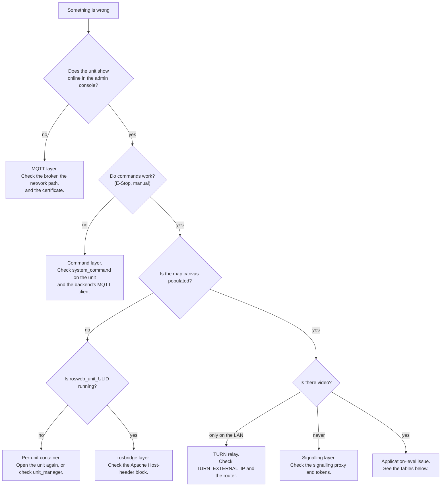

# Troubleshooting

<RoleBadge role="technician" />

Technical diagnostics for installation and deployment issues. For user-facing issues, see [Getting Started &gt; Troubleshooting](/id/getting-started/troubleshooting) instead.

## Start here: which layer is broken?

## Diagnostic checklist

Work through these in order: each one rules out an entire layer.

1. **Is the Server running?** `docker compose --profile server_prod ps`: every service should show
   `Up` or `healthy` ([Server Setup](/id/setup/server-setup#_7-verify)).
2. **Is the Unit's container running?** `./scripts/docker-manager.sh status` on the Unit.
3. **Did the Unit enrol successfully?** Check **Registered Units** in the admin console for its
   ULID, and that it shows online.
4. **Is the per-unit container running?** `docker ps --filter name=rosweb_unit_` on the Server.
5. **Is the network path open**, on the ports in
   [System Setup](/id/setup/system-setup#_1-confirm-the-network-path)?
6. **Check the logs**: `docker compose logs -f <service>` on the Server,
   `docker exec -it msd700 tmux attach -t robot_services` on the Unit (windows: `roscore`,
   `ros_webui`, `camera_client`, `switch_mode`, `log_janitor`).

## Common issues

| Symptom | Likely cause | Fix |
| --- | --- | --- |
| Robot starts, everything looks fine, but the dashboard shows nothing for it | The unit's ULID doesn't match what the dashboard/admin console has on record. This fails **silently**: ROS just publishes into a namespace nobody is subscribed to. | Confirm the id with `rostopic list \| grep unit_<ULID>` on the Server side, and cross-check against the admin console's Registered Units. If you ever set `UNIT_ID` by hand, make sure it's uppercase: the topic name is case-sensitive even though the ULID encoding isn't. |
| `docker: permission denied` on the Unit | Your user isn't (yet) in the `docker` group, or the group membership hasn't applied to this shell | `sudo usermod -aG docker $USER`, then log out and back in (or `newgrp docker` for the current shell) |
| RViz/Gazebo windows don't open | X11 forwarding isn't allowed from inside the container | `xhost +local:docker` on the host, before starting the container |
| `catkin_make`/`catkin build` fails inside the container | Usually a missing dependency, or `logs/` mounted over the workspace's own log directory (a uid mismatch: the host copy is owned by uid 2002, the in-container build user is 1000) | Re-run inside a shell (`./scripts/docker-manager.sh shell`) to see the real error; do not mount `logs/` over `/workspace/logs` |
| Backend fails to start with `Connection lost` right after `up` | The backend started before MySQL finished its health check, usually only visible when the workspace build was slow (cold cache) | It should retry automatically; if it doesn't, `docker compose up -d <backend service>` again once `docker compose ps` shows the DB as `healthy` |
| Profile backups fail to save | `/srv/msd/media/backup` (or `_dev`) doesn't exist yet, or isn't owned by the app's user | Bring up the one-shot permissions fixer explicitly: `docker compose up fix_perms_prod` (or `fix_perms_dev`), then check `ls -la /srv/msd/media/backup` |
| Simulator build fails at the first launch with `resource not found: gazebo_ros` | The image was built *without* `--simulator`: Gazebo isn't declared as a dependency by default, so a stock image doesn't have it | `./scripts/docker-manager.sh build --simulator`, then `up --simulator` |
| Map saving fails with a permission error, only on a dev laptop (not the real Jetson) | `USER_UID`/`USER_GID` in `docker/.env` still point at the Jetson's default (2002) instead of your own user | Set them to your own `id -u`/`id -g` |
| A container that already exists won't start cleanly | Leftover container/network state from a previous `down`/crash | `docker compose down --remove-orphans`, then bring it back up |
| Map canvas blank, but the unit is online and commands work | The per-unit container is not running, so the cloud-side relays rosbridge subscribes to do not exist | `docker ps --filter name=rosweb_unit_`. Re-open the unit in the dashboard; if it still does not appear, check `unit_manager` lines in the backend log |
| Browser console shows a rosbridge handshake failure | Apache is proxying rosbridge without the `Host` header rewrite, so rosbridge answers `missing port in HTTP Host header` | Add the `<Location /services/rosbridge>` block from [Server Setup](/id/setup/server-setup#the-vhost-block) |
| Every WebSocket path fails, HTTP paths are fine | `mod_proxy_wstunnel` is not enabled | `sudo a2enmod proxy_wstunnel && sudo systemctl restart apache2` |
| Camera feed works on the LAN, never from outside | The TURN relay is advertising an unreachable address, or its ports are not forwarded | Check `TURN_EXTERNAL_IP` and the router forward; see [Maintenance](/id/setup/maintenance#the-turn-relay) |
| The whole fleet drops offline at once with TLS errors | The HiveMQ keystore is serving an expired certificate. `certbot renew` alone does not update it | `sudo ./source/dependencies/ssl_update/update_ssl.sh`, then restart the broker in a maintenance window |
| `coturn` restarts in a loop and never binds | The apt/systemd `coturn` still holds port 3478 | `sudo systemctl disable --now coturn`, then start the container |
| Backend logs `ECONNREFUSED 127.0.0.1:1883` repeatedly | `MQTT_BROKER_TYPE` is unset or not `nakayama`, so the backend fell back to a local broker nothing serves | Set `MQTT_BROKER_TYPE=nakayama` in `.env` and recreate the backend |
| Backend logs `EACCES /var/run/docker.sock` and no unit containers appear | `DOCKER_GID` does not match this host's docker group | `getent group docker \| cut -d: -f3`, fix `.env`, recreate the backend |
| A new endpoint returns 404 on a unit whose source clearly has it | The unit's local server image is stale. Those services are **copied** into the image, not bind-mounted | `./scripts/docker-manager.sh local-build`, then `up` |
| Badge says image is out of date after editing local-mode source | Since 2026-08-13, `up` only warns (`[WARN] ... OUT OF DATE`) and keeps running the old image, it no longer rebuilds automatically, so bringing a unit online never requires internet | Rebuild deliberately: `./scripts/docker-manager.sh local-build` (or `build` for the robot image too), or `up --build` to do both and start in one command |

## Regressions worth knowing about

A couple of past incidents are worth recognizing on sight, since their symptoms don't obviously point
at their cause:

- **A unit that was working stops appearing after a code update, with a build that otherwise looks
  fine.** Check whether a `CATKIN_IGNORE` marker file accidentally got committed into a package
  that's the robot's *only* buildable copy. This has happened before (`robot_pose_publisher`) and
  silently aborts `navigation.launch` with no obvious error pointing at the real cause.
- **Navigation and mapping freeze completely, with TF errors mentioning "simulated time."** This is
  `/use_sim_time` stuck `true` on a roscore with no `/clock` publisher. Restarting the bringup alone
  does not fix it, because the stale value lives on the ROS master, not in any one node. This is a
  code-level bug, not a deployment mistake; escalate it rather than trying to work around it locally.

- **Robot yang jelas-jelas sedang mengemudi menunjukkan spanduk "Robot Terjebak".** Ternyata memang begitu
  `idle_detector` logikanya sendiri (titik jangkar yang lengket, atau ambang perpindahan yang terlalu besar untuk memperlambat
  gerak), tidak pernah di bagian depan. Lihat
  [Keadaan dan Perilaku](/id/development/state-and-behavior#idle-and-stuck-arbitration).
- **Sebuah liputan melaporkan "Tiba" untuk suatu daerah yang jelas-jelas tidak pernah tersapu.** Dana talangan sekarang
  menerbitkan `aborted` dan membaca "Gagal", tetapi hanya setelah N kegagalan **berturut-turut**, proses yang gagal
  sebentar-sebentar dan melengkapi sisa kakinya yang masih berakhir sebagai `complete`. Kenali itu dengan sebuah
  `arrived` nyatakan di sebelah hamparan cakupan yang tidak lengkap.
- **Hanya di dasbor lokal: Autopilot menunjukkan "tidak terlibat" tetapi robot jelas berjalan
  itu, dan masuk kembali tidak akan memulihkan apa pun.** Keduanya merupakan lompatan hilang yang sama. Hingga 15-08-2026
  `local.launch` menyampaikan topik string dasbor-ke-robot tetapi tidak sebaliknya, jadi
  supervisor menerbitkan `/string/operation_snapshot` sementara dashboard mendengarkan
  `/unit_<ULID>/string/operation_snapshot`. Konfirmasi dengan `rostopic list | grep operation_` di
  unit: nama datar yang ada tanpa awalan kembar adalah sidik jari. Jalur awan tidak pernah ada
  terpengaruh, karena MQTT menjembatani kedua arah.
- **Ruang yang disapu masih memiliki strip yang belum disapu di sepanjang dindingnya.** Beberapa di antaranya adalah geometri dan beberapa di antaranya
  itu adalah bug. Lantainya `wall_clearance - body_half_width` = 0,225 m per dinding, dan tidak ada denah yang bisa
  kalahkan itu. Semakin lebar berarti jarak bebas diterapkan lebih dari satu kali: baca geometrinya
  blok `path_coverage` mencetak saat startup dan periksa apakah kemunduran efektif adalah 0,575 m, bukan
  1,10 m. Lihat
  [Boustrophedon § Dua geometri robot](/id/development/boustrophedon-and-alignment#_1-two-robot-geometries).
- **Masalah geometri muncul di robot, tetapi tidak pernah muncul di simulator.** Hingga 19-08-2026 setiap
  robot yang disimulasikan adalah turunan TurtleBot3 Waffle: tubuh berukuran 0,266 x 0,266 m melawan tubuh nyata
  0,90 x 0,70 m satu. Sebuah benda berjari-jari 0,133 m berlayar melewati celah yang menghentikan benda yang berukuran 0,425 m, jadi
  tidak ada keluhan sempit yang dapat direproduksi. Lebih buruk lagi, dunia ini cocok dengan robot kecil:
  `turtlebot_world` berada pada jarak 0,39 m, sehingga robot sebenarnya tidak muat dalam satu pun
  sel itu. Gunakan `msd700_simulation msd700_warehouse_nav.launch`, yang memunculkan
  `msd700_field.urdf.xacro` dengan ukuran aslinya di aula berukuran 14 x 21 m. Lihat
  [Simulasi](/id/development/simulation).
- **Gazebo terbuka di kotak abu-abu kosong dan peta menjadi kosong.** Dunia pihak ketiga dulu
  tidak pernah diambil. Gazebo tidak gagal jika `world_name` hilang; ia tidak membuka apa pun dan tidak mengatakan apa pun,
  dan setiap gejala hilirnya adalah ikan haring merah. Jalankan
  `rosrun msd700_simulation fetch_sim_worlds.sh`. Peluncuran gudang sekarang dibatalkan dengan dapat dibaca
  pesan sebagai gantinya, tetapi peluncuran apa pun yang menunjuk `world_path` ke direktori vendor dengan tangan masih bisa
  pukul ini.
- **Robot yang disimulasikan merencanakan jalur di antara dua kaki rak yang tidak mungkin dilewatinya.** `move_base`
  membawa jejak Waffle di bawah bodi berukuran sebenarnya. Lewati `sim_body:=field` agar dapat dimuat
  `costmap_common_params.yaml` (amplop 1,20 x 0,85 m) bukan varian `_sim`
  (0,28x0,31m). Konfirmasikan dengan
  `rosparam get /move_base/global_costmap/footprint`.
- **Pose AMCL mengembara di tengah terbuka peta besar.** `laser_max_range` defaultnya adalah 3,5 m,
  yang merupakan sosok seukuran ruangan. Di aula berukuran 21 m, ia membuang satu-satunya pengembalian jangka panjang yang bisa dihasilkan sebuah partikel
  ditimbang melawan. Sekarang menjadi argumen di `amcl.launch`; rig gudang melewati 12.0.
- **Koridor sempit tidak menghasilkan jalur sapuan sama sekali.** Robot memerlukan jarak 1,15 m untuk masuk dan
  1,77 m untuk berbalik ke dalam. Di bawah gambar pertama, erosi ruang bebas menghilangkan koridor
  sepenuhnya dan tidak ada yang perlu direncanakan. `rostopic echo -n1 /msd700/coverage_debug` menunjukkan gambarnya
  area dibandingkan dengan area yang dapat dijangkau, yang merupakan cara tercepat untuk mengetahui "koridor terlalu sempit"
  dari "perencana gagal".
- **Seluruh ruangan di belakang pintu tidak pernah disapu.** Ekstraksi ruang kosong digunakan untuk menyimpan hanya itu
  gumpalan terhubung terbesar, jadi pintu yang lebih sempit dari dua kali jarak bebasnya memutuskan ruangan dan itu
  menghilang tanpa pesan. Sekarang dikembalikan dengan tanda tidak dapat dijangkau dan diarsir pada peta melalui
  `/msd700/uncovered_regions`. Jika sebuah ruangan menghilang lagi, periksa topik tersebut sebelum perencana.
- **Robot menyerah di jalur alih-alih mengemudi di sekitar kotak di dalamnya.** Itu adalah rencana ulang L4
  loop tidak menyala. Perlu `~replan_blocked_fraction` dari jalur yang tersisa diblokir, atau
  `~replan_failure_streak` kegagalan berturut-turut, dan tidak akan menyala lebih sering daripada itu
  `~replan_min_interval`. Hambatan yang lebih kecil dari bodi sengaja tidak pernah memicunya, karena
  perencana lokal sudah mengarahkan hal tersebut.
- **Jalur sapuan terlihat acak-acakan, bukan sisir bolak-balik biasa.** Ada dua pengaturan yang membentuknya.
  `~lane_order` harus `adjacent` (`skip` sengaja menyapu 1, 3, 5 lalu 6, 4, 2) dan
  `~turn_style` harus `square`. Keduanya adalah defaultnya; file peluncuran masih lewat
  `lane_order:=skip` adalah penyebab biasa. Kaki diagonal pada jalur yang berbentuk persegi bukan a
  pengaturan: maksudnya robot tidak dapat berputar pada sudut tersebut, sehingga perencana jatuh kembali ke sudut tersebut
  manuver terpendek yang cocok. `rostopic echo -n1 /msd700/coverage_debug` dan `turn_clearance`
  baris di blok permulaan memberi tahu Anda apakah sudut tersebut mempunyai ruangan 0,885 m.
- **Jalannya melompati pilar berkali-kali, bukannya menyelesaikan satu sisi terlebih dahulu.** Pindai kolom
  yang melintasi lubang seharusnya dikelompokkan menjadi pita terpisah. Jika tidak, setiap kolom
  membutuhkan biaya penyeberangan. Konfirmasikan `~boustrophedon_decomposition` adalah `true`, karena selnya masih
  berisi lubang inilah yang menempatkan pengelompokan pita di bawah beban.
- **Robot berosilasi di ujung setiap jalur.** Belokan tidak pas. Perlu giliran di tempat
  radius bebas 0,885 m; jika jalur tanjung dinonaktifkan, jalurnya mengarah ke tembok dan
  tidak ada ruang. Periksa `~headland` adalah `true`, dan apakah profil cakupan TEB telah diterapkan (
  log mengatakan demikian) sehingga robot diperbolehkan mundur.
- **Garis sapuan Boustrophedon dari proses lama muncul kembali setelah login baru.** Topik hamparannya adalah
  terkunci dan disiarkan ulang pada 2 Hz, dan untuk waktu yang lama satu-satunya hal yang mengabaikannya adalah a
  `sessionStorage` tandai bahwa logout akan dihapus. Jika muncul kembali, carilah proses yang berakhir tanpa
  mencapai terminal `coverage_status`, bukan di browser.
- **Operasi yang telah selesai ditampilkan kembali sebagai "Sedang Berlangsung" setelah masuk, area cakupan digambar ulang dan
  semuanya.** Supervisor mengirimkan batch hanya ke `stop` atau `complete`. Jalur keluar apa pun yang lupa
  kirim satu meninggalkan proses yang sudah selesai `active` dalam snapshot yang terkunci, dan pemulihan sesi akan memulihkannya
  persis seperti yang dirancang. Lihat
  [Keadaan dan Perilaku § Pemulihan sesi](/id/development/state-and-behavior#session-recovery).
- **Robot melanjutkan operasi yang dibatalkan.** Daftar area dipublikasikan di **terkunci**
  topik, jadi membatalkan tidak menghapusnya dan node cakupan berikutnya yang memulai mengambil area lama.
- **`skipped profile_units ...: parent row not present`, dan hanya sebagian peta unit yang ditarik ke bawah
  (misalnya 7 dari 30).** `sync_state` hanya menyimpan tanda air stempel waktu, bukan profil rental yang mana
  itu dicakup. Menyewakan kembali unit ke penyewa lain meninggalkan watermark lama yang diam-diam
  memfilter baris yang baru **untuk profil itu** meskipun unit belum pernah menerimanya.
  Diperbaiki dengan juga merekam `last_pull_profile_id` dan memaksa penarikan ulang penuh setiap kali jabat tangan
  profile tidak setuju dengan itu, tetapi unit mana pun yang sudah mencapai kebutuhan ini
  `node scripts/migrate_sync.js --profile <name> --apply` sebelum perbaikan diterapkan. Lihat
  [Sinkronisasi Data § Tanda air mencakup profil rental](/id/development/data-sync#watermarks-are-scoped-to-a-rental-profile-not-just-a-clock).
- **Sinkronisasi melaporkan keberhasilan, tetapi persewaan dan semua peta di bawahnya tidak pernah sampai.** `units` tadinya, untuk a
  sementara, hilang dari registri tabel sinkronisasi meskipun `profile_units.unit_id` dan
  `maps_data.unit_id` keduanya merupakan kunci asing di dalamnya. Baris induk yang hilang dianggap dilewati seperti biasa
  lalu lintas, tanpa suara, tanpa kesalahan dan tanpa hitungan `skipped` tercetak, jadi seluruh cabang data
  bisa gagal disinkronkan saat putaran masih dilaporkan `ok`. Jika celah diam berbentuk serupa muncul
  sekali lagi, periksa dulu registry `sync_tables.js`, bukan transportnya.
- **Peta yang dihapus di satu sisi masih menggunakan disk di sisi lain, setelah baris database-nya sudah ada
  hilang.** Batu Nisan digunakan untuk menghapus hanya baris database; pihak mana pun yang menerima batu nisan itu
  melalui sinkronisasi (bukan pihak yang melakukan penghapusan asli) tidak pernah menghapus `.pgm`/`.yaml`
  file gambar mini. File yang menumpuk sebelum ini diperbaiki tidak akan membersihkan dirinya sendiri secara surut
  dan memerlukan sapuan manual.
- **Peta yang ditransfer, ditukar, atau dihapus dari konsol admin cloud tidak pernah mencapai unit, atau
  muncul kembali setelah dibersihkan.** Titik akhir transfer/swap/hapus/pemulihan admin digunakan untuk menulis SQL
  langsung daripada melalui `sync_engine.js`, jadi mereka tidak pernah merekam batu nisan dengan cara an
  penghapusan biasa bisa. Tampak jelas, dari sisi unit, persis seperti tidak terjadi apa-apa, dan
  dorongan berikutnya menghidupkan kembali peta yang "dihapus" di cloud. Diperbaiki dengan merutekan semuanya melalui
  jalur penulisan batu nisan yang sama dengan penghapusan normal.
- **Jangan pernah `HEX()` id di mana pun di jalur sinkronisasi.** `toBinary()` mengharapkan `BINARY(16)` mentah dan
  langsung menolak string hex 32 karakter, karena ULID terdiri dari 26 karakter Crockford base32,
  bukan 32 karakter hex. `collectChanges needs a rental profile`, terjebak di 15%, tepatnya seperti ini: a
  pencarian profil telah ditulis dengan `HEX(pu.profile_id)` dan setiap baris yang menggunakannya gagal diselesaikan.

If a symptom looks like one of these (plausible on the surface, but the checklist above does not
explain it), that is the signal to escalate rather than keep guessing.

## Escalation

If the checklist and the table above don't explain what you're seeing, or the issue turns out to be
a software/logic bug rather than a deployment mistake, escalate to the development team: see the
[Documentation](/id/development/) section, and include what step of the checklist first showed the
problem plus the relevant log output.
