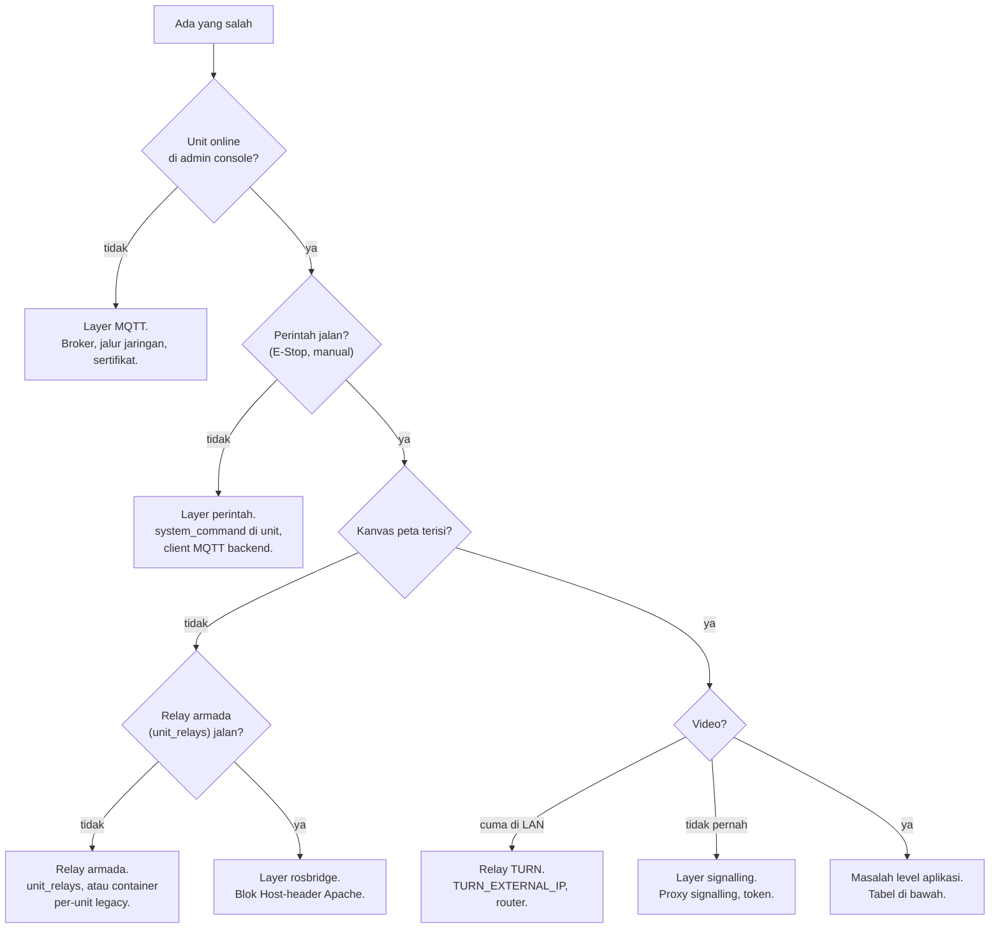

# Troubleshooting

<RoleBadge role="technician" />

Memperbaiki masalah instalasi dan deployment. Untuk masalah user, lihat [User Guide > Troubleshooting](/id/user-guide/troubleshooting).

::: info Kepemilikan
Tiga halaman troubleshooting berbagi gejala per peran: [User Guide](/id/user-guide/troubleshooting) memegang perbaikan operator (pilih peta, refresh, retry), halaman ini memegang perbaikan teknisi (port, env, container, log), dan [Diagnostik Pengembang](/id/development/troubleshooting-guide) memegang root cause. Perbaiki gejala di halaman peran yang memperbaikinya; tautkan, jangan duplikasi.
:::

## Mulai di sini: layer mana yang rusak?

## Checklist diagnostik

Pilih environment dan mesin dulu. Checkout V2 di cloud server bukan unit fisik; jangan jalankan launcher robot di sana untuk mendiagnosis Jetson. Container jalan saja tidak membuktikan node ROS, bridge MQTT, atau koneksi browser-nya bekerja.

1. **Stack server jalan?** Dari `ros-web-ui`: `docker compose --profile server_prod ps` (atau `server_dev` + nama `_dev` untuk dev). Service jangka panjang harus `Up`/`healthy`; `fix_perms_*` one-shot yang normalnya exit `0`.
2. **Container unit jalan?** `./scripts/docker-manager.sh status` di unit.
3. **Unit ter-enrol?** Cari ULID-nya di **Registered Units** admin console, tampil online.
4. **Relay armada jalan?** `docker ps --filter name=unit_relays` di server.
5. **Jalur jaringan terbuka?** Port di [Setup Sistem](/id/setup/system-setup#_1-cek-jalur-jaringan).
6. **Log**: `docker compose logs -f <service>` di server; `docker exec -it msd700 tmux attach -t robot_services` di unit (window: `roscore`, `ros_webui`, `camera_client`, `switch_mode`, `log_janitor`, `token_refresh`).

Untuk cek ROS read-only, masuk ke container yang **sudah jalan** dengan `docker exec` (perintah `shell` bisa menyalakan yang berhenti). Source workspace ROS-nya, lalu set master yang benar di tiap shell baru: cloud prod `http://localhost:11311`, cloud dev `http://localhost:11312`, robot `http://localhost:11321`, robot `--dev` `http://localhost:11322`. `rosnode list`, `rostopic list`, dan `rosparam get /use_sim_time` memeriksa tanpa menggerakkan apa-apa. Jangan diagnosis dengan menyetir atau toggle E-Stop. Bila trafik nyasar ke proses salah, cek pemilik port dengan `ss -ltnp`, termasuk port forward IDE yang tak sengaja.

::: warning Jaga secret saat diagnostik
Log, output launch, `docker inspect`, dan output Compose bisa berisi kredensial. Redact password, token, device secret, dan auth header sebelum dibagikan. Pakai `config --quiet` / `config --services` daripada dump config penuh.
:::

## Masalah umum

| Gejala | Kemungkinan penyebab | Perbaikan |
| --- | --- | --- |
| Robot jalan, dashboard kosong untuknya | ULID unit tidak cocok: ROS publish ke namespace yang tak dibaca. Gagal diam-diam | `rostopic list \| grep unit_<ULID>` di sisi server, bandingkan dengan Registered Units. `UNIT_ID` manual harus uppercase (nama topik case-sensitive) |
| `docker: permission denied` di unit | User belum masuk grup `docker` | `sudo usermod -aG docker $USER`, logout/in (atau `newgrp docker` untuk shell ini) |
| Window RViz/Gazebo tidak terbuka | X11 tidak diizinkan dari container | `xhost +local:docker` di host dulu |
| `catkin build` gagal di container | Dependensi hilang, atau `robot_pose_publisher` ganda (vendored di ros-web-ui + submodule di msd700_robot) | Buka shell (`docker-manager.sh shell`) untuk error aslinya; cek `CATKIN_IGNORE` nyasar |
| Backend `Connection lost` tepat setelah `up` | Backend balapan dengan MySQL sebelum healthcheck lolos | `up -d <backend service>` lagi setelah `ps` menunjukkan DB `healthy` |
| Backup profile gagal simpan | `/srv/msd/media/backup` (atau `_dev`) belum ada atau tak writable oleh user aplikasi | Jalankan fixer permission: `docker compose --profile server_prod up fix_perms_prod` (atau padanan dev) |
| Build simulator gagal `resource not found: gazebo_ros` | Image di-build tanpa `--simulator` | `docker-manager.sh build --simulator`, lalu `up --simulator` |
| Simpan peta error permission, hanya laptop dev | `USER_UID`/`USER_GID` di `docker/.env` masih menunjuk default Jetson | Setel ke `id -u` / `id -g` sendiri (auto-detect hanya bila kosong) |
| Container lama tak mau start bersih | Sisa state dari run sebelumnya | `down --remove-orphans` dari file Compose itu, lalu `up` lagi |
| Peta kosong, unit online, perintah jalan | Relay armada hilang/belum terdaftar, atau masalah map/rosbridge hilir | Cek container `unit_relays[_dev]` dan log-nya. Relay hilang harus dibuat Compose; manager hanya me-restart yang ada. Jangan start prod untuk memperbaiki dev. Mode legacy: suffix `rosweb_unit_*` yang cocok |
| Handshake rosbridge gagal di console browser | Apache mem-proxy rosbridge tanpa rewrite header `Host` | Tambahkan blok `<Location /services/rosbridge>` dari [Setup Server](/id/setup/server-setup) |
| Semua path WebSocket gagal, HTTP oke | `mod_proxy_wstunnel` mati | `sudo a2enmod proxy_wstunnel && sudo systemctl restart apache2` |
| Kamera hanya di LAN, tidak pernah di luar | TURN mengiklankan alamat tak terjangkau, atau port tak di-forward | Cek `TURN_EXTERNAL_IP` + forward router ([Maintenance](/id/setup/maintenance#relay-turn)) |
| Se-armada offline sekaligus, error TLS | HiveMQ menyajikan sertifikat kedaluwarsa (`certbot renew` saja tak pernah mengupdate-nya) | `sudo ./source/dependencies/ssl_update/update_ssl.sh`, restart broker di jam maintenance |
| `coturn` loop dan tak pernah bind | `coturn` apt/systemd masih memegang port 3478 | `sudo systemctl disable --now coturn`, start container |
| Backend log `ECONNREFUSED 127.0.0.1:1883` | Launch lama atau override mengarahkan MQTT ke loopback; default server kini `nakayama` | Perbaiki config service itu, recreate scoped. (Di unit, `backend_local` sengaja loopback: cek `mosquitto_local`) |
| Backend log `EACCES /var/run/docker.sock` | `DOCKER_GID` tidak cocok dengan grup docker host | `getent group docker \| cut -d: -f3`, perbaiki `.env`, recreate backend |
| Endpoint baru 404 di unit yang jelas punya source-nya | Image server lokal basi (source di-**copy** masuk, bukan bind-mount) | `./scripts/docker-manager.sh local-build`, lalu `up` |
| Launcher warning image lokal out of date | `up` biasa memakai ulang image basi: memang didesain begitu | Rebuild dengan `local-build`, `build`, atau `up --build`; robot yang jalan mempertahankan image lama sampai recreated |

## Bug lama yang diketahui (kenali, lalu eskalasi)

Ini terlihat seperti salah deployment tapi sebenarnya bug kode. Bila checklist di atas tidak menjelaskan gejala dan cocok dengan salah satu ini, eskalasi ke developer daripada menebak:

- Unit yang tadinya jalan hilang setelah update kode dengan build terlihat bersih: `CATKIN_IGNORE` nyasar di satu-satunya copy buildable sebuah paket (pernah terjadi di `robot_pose_publisher`).
- Navigasi/mapping beku dengan error TF "simulated time": `/use_sim_time` macet `true` di roscore tanpa publisher `/clock`. Restart bringup saja tak pernah memperbaiki; nilai basi tinggal di ROS master.
- Unit dev log broker-nya `msd.nglobal.jp`: normal. Dev dan prod satu mesin, dipisah port (`8884` dev), dan sertifikat TLS bernama host itu. Baca port-nya.
- Unit dev/sim reboot jadi hardware-on-production: `msd700.service` lama membuang flag mode. Cek `grep ExecStart /etc/systemd/system/msd700.service` dan jalankan `up` ulang dengan flag yang diinginkan.
- Peta lambat muncul dari Database, atau ruangan sesi sebelumnya flash duluan: potongan map-on-demand hilang di satu sisi. Cek `/unit_<ULID>/string/map_request` di sisi cloud dan `Map resend requested` di log `map_compression_node` robot.
- Coverage lapor "Arrived" untuk area yang tak pernah disapu, atau WASD saat coverage merusak run: bug state coverage. Konfirmasi di log `path_coverage`, lalu eskalasi.
- Keluhan geometri simulator yang tak pernah reproduksi: sim lama memakai body TurtleBot3 kecil di world kecil. Pakai `msd700_simulation msd700_warehouse_nav.launch` (body ukuran asli, hall 14 x 21 m).
- Sync sukses tapi data hilang, atau peta muncul lagi setelah dihapus: edge case sync engine (cakupan watermark, tombstone, gap registry). Cek endpoint status sync dan eskalasi dengan log.

## Eskalasi

Bila checklist dan tabel tidak menjelaskannya, atau baunya bug software, eskalasi ke developer: sebutkan step checklist mana yang pertama gagal, dan lampirkan log relevan (yang sudah di-redact).
