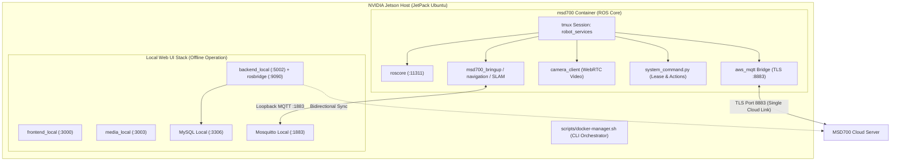

# Pengaturan Unit

<RoleBadge role="technician" />

Panduan ini memberikan petunjuk langkah demi langkah untuk menginstal dan mengonfigurasi **Unit MSD700** (robot fisik yang berjalan pada komputer papan tunggal NVIDIA Jetson).

Pastikan [MSD700 Server](/id/setup/server-setup) yang sedang berjalan ada sebelum melanjutkan.

::: info Production-First Architecture
Panduan ini secara default menerapkan robot perangkat keras nyata yang terhubung ke **Cloud Produksi**. Opsi simulasi (`--simulator`) dan perutean cloud pengembangan (`--dev`) ada di bagian [Konfigurasi Lanjutan](#advanced-configurations).
:::

## Topologi Sistem



## Ikhtisar Struktur Direktori

Ruang kerja Jetson mengelola paket robot, jembatan web, dan UI web onboard sebagai submodul:

```
~/msd700_noetic/                              # Main Jetson Orchestration Workspace
├── setup.sh                                  # Host Dependency Installer (Docker, xhost)
├── scripts/
│   └── docker-manager.sh                     # Core Lifecycle CLI (build, up, down, logs)
├── docker/
│   ├── Dockerfile                            # ROS 1 Noetic Desktop Full Container
│   ├── docker-compose.yml                    # Robot Container Definition
│   └── .env                                  # Local Environment Variables
└── src/                                      # Catkin Workspace Submodules
    ├── msd700_robot/                         # Navigation, EKF Control, Hardware Drivers
    ├── ros-web-ui/                           # Web Bridges, MQTT nodes, System Command
    └── ROS-dashboard-next-ts/                # Local Operator Web Dashboard
```

---

## Pengaturan Inti Langkah-demi-Langkah

Ikuti 5 langkah berikut secara berurutan untuk menyiapkan robot fisik.

### Langkah 1: Kloning Ruang Kerja dengan Submodul

Kloning `msd700_noetic` dengan `--recursive` sehingga semua submodul di `src/` terisi secara otomatis:

```bash
git clone --recursive https://github.com/itbdelaboprogramming/msd700_noetic.git ~/msd700_noetic
cd ~/msd700_noetic
```

::: tip Cloned without `--recursive`?
Jika Anda sudah mengkloning tanpa submodul, jalankan:
```bash
git submodule update --init --recursive
```
:::

---

### Langkah 2: Penyiapan Host Satu Kali

Jalankan skrip pengaturan host untuk mengonfigurasi izin grup Docker dan penerusan grafis:

```bash
cd ~/msd700_noetic
./setup.sh
```

::: warning Apply Group Permissions
Jika skrip menambahkan pengguna Anda ke grup `docker`, keluar dan masuk kembali, atau jalankan:
```bash
newgrp docker
```
:::

---

### Langkah 3: Konfigurasikan Lingkungan (`docker/.env`)

Hasilkan dan tinjau file lingkungan lokal:

```bash
cd ~/msd700_noetic
cp docker/.env.example docker/.env
nano docker/.env
```

Pengaturan lingkungan utama:

```ini
# Storage path for map occupancy grids on the Jetson
MAPS_FOLDER_LOCAL=/home/ubuntu/ros_maps

# Cloud Server Hostname for MQTT and Sync
NAKAYAMA_HOST=msd.nglobal.jp
CLOUD_BASE_URL=https://msd.nglobal.jp/services

# Local Ports (Default settings)
FRONTEND_PORT_LOCAL=3000
BACKEND_PORT_LOCAL=5002
ROSBRIDGE_PORT_LOCAL=9090
MEDIA_SERVER_PORT_LOCAL=3003
SIGNALLING_PORT_WS_LOCAL=3001
MYSQL_PORT_LOCAL=3306

# Leave UNIT_ID empty; assigned automatically during enrolment
UNIT_ID=
```

---

### Langkah 4: Bangun Gambar Robot Docker

Bangun wadah runtime robot ROS Noetic:

```bash
cd ~/msd700_noetic
./scripts/docker-manager.sh build
```

Ini membangun gambar `msd700:latest` yang berisi ROS Noetic, tumpukan navigasi, driver sensor, dan jembatan web.

---

### Langkah 5: Mulai Robot dan Selesaikan Pendaftaran

Luncurkan tumpukan robot dalam mode terpisah:

```bash
cd ~/msd700_noetic
./scripts/docker-manager.sh up -d
```

#### Alur Pendaftaran Otomatis:
1. Pada peluncuran pertama, robot menghubungi server cloud dan mengeluarkan **Kode Klaim** 6 karakter (misalnya `K7M2QP`).
2. Administrator membuka `https://msd.nglobal.jp/admin` dan login.
3. Di bawah **Unit Tertunda**, temukan kode klaim yang cocok, tetapkan unit ke **Profil Penyewaan** yang aktif, dan klik **Setuju**.
4. Robot menerima kredensial yang ditandatangani secara kriptografis (`Certificates/robot/device.json`), diikat ke HiveMQ melalui port TLS 8883, dan muncul langsung di peta armada.

---

## Mengoperasikan Unit Secara Lokal (Mode Offline)

Saat robot beroperasi di lokasi tanpa konektivitas internet, sambungkan laptop atau tablet Anda langsung ke jaringan lokal robot (atau hotspot Wi-Fi robot):

1. Buka browser Anda dan navigasikan ke: `http://<jetson-ip>:3000`.
2. Dasbor lokal memungkinkan teleoperasi penuh, pemetaan SLAM, pembuatan rute, dan penyisiran cakupan area.
3. Ketika konektivitas internet pulih, semua peta yang direkam secara lokal secara otomatis disinkronkan kembali ke server cloud pusat.

---

## Konfigurasi Lanjutan

<details>
<summary><b>Mode Simulasi (Gudang Gazebo)</b></summary>

Untuk menguji algoritme pada laptop tanpa perangkat keras robot fisik:

1. Buat gambar yang mendukung simulator:
   ```bash
   ./scripts/docker-manager.sh build --simulator
   ```

2. Mulai tumpukan simulasi:
   ```bash
   ./scripts/docker-manager.sh up --simulator -d
   ```

</details>

<details>
<summary><b>Perutean Cloud Pengembangan (`--dev`)</b></summary>

Untuk mengarahkan unit ke server cloud pengembangan, bukan produksi:

```bash
./scripts/docker-manager.sh up --dev -d
```

Ini menghubungkan MQTT ke port dev `8884` dan menyinkronkan dengan database pengembangan.

</details>

<details>
<summary><b>Perbaikan Jaringan Host untuk Laptop Non-Ubuntu/Arch</b></summary>

Jika berjalan di Arch Linux atau distribusi non-standar:

1. **Resolusi Nama Host**:
   ```bash
   grep "$(hostname)" /etc/hosts || echo "127.0.0.1 $(hostname)" | sudo tee -a /etc/hosts
   ```

2. **Nonaktifkan Pemetaan Loopback IPv6**:
   ```bash
   sudo sed -i 's/^::1[[:space:]].*/::1 ip6-localhost ip6-loopback/' /etc/hosts
   ```

3. **Buat Direktori Peta Bersama**:
   ```bash
   sudo mkdir -p /home/ubuntu/ros_maps
   sudo chown -R $(id -u):$(id -g) /home/ubuntu/ros_maps
   ```

</details>

---

## Verifikasi & Diagnostik

Gunakan perintah diagnostik berikut untuk memverifikasi kesehatan robot:

```bash
# 1. View overall container and service status
./scripts/docker-manager.sh status

# 2. Attach to the ROS tmux session inside the container
./scripts/docker-manager.sh shell
tmux attach -t robot_services

# 3. View real-time container logs
./scripts/docker-manager.sh logs -f
```

## Dokumentasi Terkait

- [Pengaturan Server](/id/setup/server-setup): Instalasi backend cloud.
- [Pengaturan Sistem](/id/setup/system-setup): Kalibrasi dan verifikasi sensor.
- [Referensi Docker](/id/setup/docker-reference): Referensi sintaksis CLI yang komprehensif.