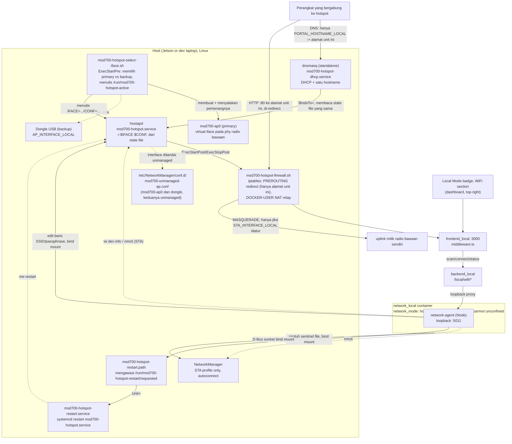

# Hotspot Wi-Fi + Klien

<RoleBadge role="technician" />

Bagian standar dari penyiapan mode lokal setiap unit ([Penyiapan Unit](/id/setup/unit-setup) Langkah 6):
Unit menjalankan hotspot WiFi-nya sendiri agar operator dapat bergabung, bisa dijangkau di
`http://mymsd.jp`, dan tetap menjaga koneksi **klien** WiFi normal ke jaringan lain sebagai fallback
internet/sinkronisasi cloud, pada radio yang sama persis saat perangkat kerasnya mendukung. Pada
setiap kali hotspot dimulai, `msd700-hotspot-select-iface.sh` memilih antara dua jalur:

- **Primary**: sebuah virtual AP interface (`msd700-ap0`) yang dibuat pada phy milik radio bawaan
  itu sendiri, berdampingan dengan koneksi klien (STA) normalnya. Kartu kelas MediaTek MT7922
  mendukung mode STA+AP konkuren ini pada satu radio fisik, lihat
  [Penyiapan Wi-Fi MT7922](/id/setup/wifi-mt7922).
- **Backup**: sebuah dongle WiFi USB, dinyalakan secara otomatis kapan pun jalur primary tidak
  tersedia pada boot tersebut (kartu onboard berbeda, regresi driver, tidak ada dukungan kombo).
  Sama sekali tidak dibutuhkan pada perangkat keras yang jalur primary-nya berfungsi.

Status kedua radio ditampilkan pada [badge Mode Lokal](/id/development/data-sync#the-local-mode-badge),
badge yang sama, dropdown yang sama, dan operator dapat terhubung ke jaringan lain dari sana.

Unit yang tidak pernah menjalankan langkah provisioning di bawah ini tetap berfungsi persis seperti
yang dijelaskan [Penyiapan Unit](/id/setup/unit-setup); badge hanya akan melaporkan "no hotspot radio"
dan tidak ada yang lain yang terpengaruh.

## Alur penyiapan

Ikuti urutan ini pada unit baru, kebanyakan unit hanya perlu langkah 2 dan 3:

1. **Nyalakan dulu radio bawaan, itu adalah jalur primary.** Jika kartunya MediaTek MT7922,
   perbaiki dulu firmware-nya, lihat [Penyiapan Wi-Fi MT7922](/id/setup/wifi-mt7922): pada kernel
   Tegra, kartu ini bisa melaporkan error firmware-not-found dan sama sekali tidak muncul ke
   NetworkManager, yang diam-diam mengirim hotspot ke backup dongle di bawah alih-alih jalur onboard
   konkuren yang seharusnya dipakai. Jika radio bawaan sudah muncul dengan baik (`nmcli device
   status`), tidak ada yang perlu diperbaiki di sini.
2. [Provisioning hotspot](#provisioning-hotspot-satu-kali-per-unit)
   (`./setup.sh --provision-network`). Preflight-nya sendiri memeriksa radio bawaan dan memberi
   peringatan jika tidak bisa menjalankan jalur primary, otomatis jatuh ke dongle jika ada yang
   dikonfigurasi.
3. [Verifikasi berjalan dengan benar](#memverifikasi-bahwa-ini-berfungsi).
4. **(Opsional) [Instal driver backup dongle](#menginstal-driver-dongle)**, hanya jika preflight di
   langkah 2 melaporkan radio bawaan tidak bisa menjalankan jalur primary, atau sebagai redundansi
   yang disengaja. Sama sekali tidak dibutuhkan pada perangkat keras yang jalur primary-nya sudah
   berfungsi.

Hanya langkah 2 yang interaktif dan spesifik per unit (SSID, password); yang lain adalah bring-up
perangkat keras sekali jalan, diulang hanya jika perangkat kerasnya sendiri berubah.

## Radio primary vs. backup dongle

Kartu kelas MediaTek MT7922 dapat berjalan sebagai klien WiFi (STA) dan menyiarkan access point
(AP) secara bersamaan, pada radio fisik yang sama: `msd700-hotspot-select-iface.sh` membuat sebuah
virtual interface (`msd700-ap0`) pada phy yang sama dengan interface STA pada setiap kali hotspot
dimulai, virtual interface tidak bertahan lewat reboot sehingga tidak bisa dibuat sekali saja.
"Valid interface combinations" milik `iw phy <phy> info` yang melaporkan `{ managed, AP } <= 2`
pada perangkat keras ini adalah yang mengonfirmasi drivernya sungguh mendukung ini,
`--provision-network` memeriksa persis ini pada saat provisioning.

::: warning Perangkat keras lama atau yang ditukar jatuh ke backup secara otomatis, tapi tidak diam-diam
Radio bawaan proyek ini sebelumnya, Realtek RTL8822CE, adalah **satu radio fisik** yang bisa menjadi
klien *atau* AP, tidak pernah keduanya sekaligus; ini adalah perangkat kerasnya, bukan keterbatasan
driver: `iw phy` menunjukkan tepat satu `phy`, dan satu radio hanya bisa disetel ke satu channel
pada satu waktu. Preflight `setup.sh --provision-network` memberi peringatan keras begitu ia
melihat ini, alih-alih membiarkannya ditemukan belakangan sebagai "kenapa hotspot selalu di dongle?".
:::

| Jalur | Kapan dipakai | Kelayakan |
| --- | --- | --- |
| **Primary**: AP virtual pada radio bawaan | Setiap kali hotspot dimulai, kapan pun radio bawaan (`STA_INTERFACE_LOCAL`) melaporkan kombinasi interface yang mendukung | Kepercayaan tinggi pada perangkat keras kelas MT7922, tervalidasi pada proyek ini. Tidak ada yang perlu dicolok. |
| **Backup**: dongle USB (`AP_INTERFACE_LOCAL`) | Otomatis, hanya saat jalur primary tidak tersedia pada boot tersebut (kartu hilang, driver/firmware rusak, tidak ada dukungan kombo, atau radio kelas RTL8822CE) | Kepercayaan tinggi, tanpa risiko chipset, AP dan klien berada pada dua radio yang secara fisik terpisah sehingga tidak ada pertanyaan "mode konkuren" sama sekali. Membutuhkan dongle yang tercolok dengan drivernya terinstal, lihat [Menginstal driver dongle](#menginstal-driver-dongle). |

::: info Windows melakukan keduanya sekaligus bukan bukti driver Linux mana pun juga bisa
Laptop yang menjalankan fitur Mobile Hotspot milik Microsoft berdampingan dengan koneksi WiFi normal
menggunakan stack driver yang sama sekali berbeda (adaptor WiFi virtual yang dikelola Windows sendiri)
dari kombinasi AP-dan-managed konkuren `mac80211`/`nl80211` milik Linux. Ini adalah petunjuk yang masuk
akal bahwa *perangkat keras*-nya secara fundamental tidak sepenuhnya tidak mampu, tetapi itu tidak
mengatakan apa pun tentang kombinasi interface milik driver Linux tertentu. Verifikasi dengan
`iw phy <phy> info` pada host sesungguhnya, persis yang sudah dilakukan otomatis oleh preflight
`--provision-network`.
:::

**Perangkat keras backup dongle tervalidasi pada proyek ini**: TP-Link TL-WN722N v2/v3, chipset
Realtek **RTL8188EUS** (USB ID `2357:010c`). Dongle berbasis RTL8188EUS apa pun seharusnya berfungsi
dengan driver yang sama, lihat `KNOWN_IDS` di `scripts/install-wifi-dongle-driver.sh` untuk USB ID
lain dari chipset yang sama. Tidak ada driver untuk chipset ini yang tersedia bawaan pada kernel
Jetson (baik `rtl8xxxu` in-tree maupun modul out-of-tree), harus dibangun dari source lewat DKMS,
lihat [Menginstal driver dongle](#menginstal-driver-dongle) di bawah.

## Bagaimana semuanya terhubung



Keberadaan hotspot **tidak** bergantung pada Docker. `hostapd` dan `dnsmasq` berjalan sebagai service
systemd-nya sendiri, dijalankan saat boot dan independen dari apakah `docker-manager.sh` pernah
dijalankan, dengan cara yang sama seperti kabel Ethernet kabel "begitu saja berfungsi".
`network_local` hanya menyajikan status/scan live untuk badge dan menjalankan permintaan eksplisit
operator "terhubung ke jaringan lain" (hanya sisi klien); provisioning hotspot itu sendiri adalah
langkah terpisah, satu kali (di bawah).

### Mengapa hostapd, bukan mode AP milik NetworkManager sendiri

NetworkManager bisa membuat koneksi mode AP-nya sendiri (`nmcli connection add ...
802-11-wireless.mode ap`), digerakkan secara internal oleh `wpa_supplicant`. Itu adalah desain awal di
sini, tetapi pada dongle RTL8188EUS ia **hang setiap kali**: aktivasi NM selalu gagal setelah sekitar
25 detik dengan `"Hotspot network creation took too long"` / `reason 'supplicant-timeout'`.

Didiagnosis dengan menjalankan `hostapd -dd` langsung terhadap interface yang sama: AP-nya naik dalam
kurang dari satu detik (`AP-ENABLED`), berfungsi penuh. Driver tersebut memang mendukung mode AP,
tetapi event penyelesaian `NL80211_CMD_START_AP`-nya tiba di luar urutan yang diharapkan oleh kode AP
internal `wpa_supplicant` (terlihat di log debug hostapd sebagai `Ignored unknown event (cmd=15)`,
tercatat *setelah* AP-nya sudah dimulai lewat cara lain). Jalur softAP milik `wpa_supplicant`
tampaknya menunggu event tersebut; `hostapd` tidak memblokir untuk itu dan langsung melanjutkan.

Perbaikannya: jalankan `hostapd` langsung sebagai service systemd-nya sendiri, dan beri tahu
NetworkManager untuk sepenuhnya membiarkan interface tersebut (`unmanaged-devices` dalam sebuah
drop-in `conf.d`) sehingga keduanya tidak pernah saling berebut, dipakai seragam untuk interface
primary maupun backup. Sisi STA (jaringan upstream untuk bergabung sebagai klien) tidak memiliki
masalah seperti itu dan tetap melalui profil koneksi NM normal.

### Komponen

| Komponen | Yang dilakukannya | Siklus hidup |
| --- | --- | --- |
| `msd700-hotspot-select-iface.sh` | `ExecStartPre`: membuat/menyalakan AP virtual primary (`msd700-ap0`) jika radio bawaan mendukungnya, jika tidak menyalakan interface dongle backup; menulis pemenangnya (`IFACE`, `CONF`) ke `/run/msd700-hotspot-active` | Dijalankan oleh `ExecStartPre` milik `msd700-hotspot.service`, setiap kali start (virtual interface tidak bertahan lewat reboot) |
| `msd700-hotspot.service` | Menetapkan IP statis `192.168.4.1/24` ke interface mana pun yang menang, menjalankan `hostapd -i $IFACE $CONF`, memanggil `msd700-hotspot-firewall.sh apply`/`teardown` | systemd, diaktifkan saat boot, `Restart=on-failure` |
| `msd700-hotspot-firewall.sh` | Redirect HTTP ke dashboard, dibatasi hanya pada port 80 yang ditujukan ke alamat unit ini sendiri (bukan captive portal, trafik port 80 lainnya lewat langsung) ditambah NAT relay internet (chain `DOCKER-USER`, hanya saat `STA_INTERFACE_LOCAL` diatur) | Dipanggil dari `ExecStartPost`/`ExecStopPost` service di atas, idempoten (periksa-lalu-bertindak) |
| `msd700-hotspot-dhcp.service` | Menjalankan instance `dnsmasq` khusus terhadap interface mana pun yang aktif: server DHCP (`192.168.4.10`-`192.168.4.200`) + me-resolve `PORTAL_HOSTNAME_LOCAL` ke alamat unit ini | systemd, `BindsTo=msd700-hotspot.service` |
| `/etc/hostapd/hostapd-msd700-primary.conf` / `-backup.conf` | SSID/password yang sama dirender dua kali, sekali per interface, sehingga klien melihat satu identitas terlepas dari radio mana yang sebenarnya menjawab | Dirender oleh `--provision-network`, `chmod 0600` |
| `/etc/NetworkManager/conf.d/msd700-unmanaged-ap.conf` | Memberi tahu NM untuk tidak pernah menyentuh `msd700-ap0` atau interface milik dongle | Dibaca oleh NetworkManager saat restart |
| `/etc/polkit-1/rules.d/50-msd700-network-manager.rules` | Memberikan aksi `org.freedesktop.NetworkManager.*` tanpa syarat, sehingga panggilan `nmcli` milik `network_local` (scan, connect, forget) berfungsi tanpa prompt polkit interaktif yang tidak pernah bisa dijawab container | Dibaca oleh `polkit` saat restart |
| `msd700-hotspot-restart.path` / `-restart.service` | Satu-satunya jalur `network_local` ke systemd host: mengawasi sentinel file yang disentuh `network_local` setelah mengedit config hostapd, lalu menjalankan `systemctl restart msd700-hotspot.service`. Sengaja dibuat sempit, hanya bisa memicu satu restart ini saja, tidak ada yang lain | systemd, unit `path` aktif saat boot, `service` hanya dipicu olehnya |
| `/etc/tmpfiles.d/msd700-hotspot.conf` | Menjamin `/run/msd700-hotspot-active` (sebuah file) dan `/run/msd700-hotspot-restart/` (sebuah direktori) ada dengan tipe yang benar di setiap boot, sebelum Docker bisa bind-mount folder stray di atas salah satunya | Diterapkan oleh `systemd-tmpfiles` saat boot dan segera saat `--provision-network` |
| Profil koneksi NM (hanya radio bawaan) | Koneksi klien normal ke WiFi operator | Dikelola oleh NetworkManager seperti biasa, `autoconnect: yes` |

Kedua service systemd sisi-hotspot memiliki `Restart=on-failure`, jadi kehilangan dan mendapatkan
kembali interface yang aktif, mencabut dan memasang kembali backup dongle, atau driver radio bawaan
pulih dari sebuah fault, membuat hotspot kembali menyala dengan sendirinya tanpa intervensi manual.

::: info Mengapa `network_local` bukan `privileged: true`
`network_local` membutuhkan beberapa hal yang spesifik, tidak satu pun dari itu adalah grant luas yang
sudah digunakan `msd700` (`privileged: true` + host network, lihat
[Referensi Docker](/id/setup/docker-reference#network-mode-host)). Socket D-Bus yang di-bind-mount
adalah yang memungkinkan `nmcli` mengontrol daemon NetworkManager milik **host sendiri** untuk sisi
STA; klien itu sendiri tidak pernah menyentuh interface jaringan secara langsung. `cap_add:
[NET_ADMIN]` ditambah `network_mode: host` adalah yang dibutuhkan pembacaan status-AP (`iw dev <iface>
info`), karena interface AP berada di network namespace milik host. `security_opt:
apparmor:unconfined` adalah yang tidak begitu jelas: profil apparmor default Docker menolak pemanggilan
metode D-Bus dari dalam container bahkan dengan socket sudah di-bind-mount dan `NET_ADMIN` sudah
diberikan; `Hello()` awal `nmcli` ke bus mendapat `AccessDenied` bahkan sebelum kebijakan D-Bus milik
NetworkManager sendiri sempat dikonsultasikan. Satu-satunya tugas container ini adalah berbicara
dengan NetworkManager milik host lewat bus tersebut, jadi ia berjalan unconfined alih-alih melawan
aturan profil default satu per satu.

Tiga bind mount lagi, semuanya file/direktori biasa alih-alih socket: `/run/msd700-hotspot-active`
(read-only, interface mana yang menang pada boot ini), `/etc/hostapd` (read-write, `setHotspot()`
mengedit langsung file config di sana), dan `/run/msd700-hotspot-restart` (read-write, tempat
`setHotspot()` menyentuh sentinel file yang diawasi `msd700-hotspot-restart.path`, lihat
[Mengubah hotspot milik unit sendiri](#mengubah-hotspot-milik-unit-sendiri)).
:::

## Menginstal driver dongle

Hanya dibutuhkan untuk jalur **backup**, baik karena radio bawaan tidak bisa menjalankan jalur
primary (AP+STA konkuren), atau sebagai redundansi yang disengaja, sama sekali tidak dibutuhkan pada
perangkat keras yang jalur primary-nya sudah berfungsi. Satu kali, per unit, sebelum provisioning:

```bash
./scripts/install-wifi-dongle-driver.sh
```

- Menginstal `dkms`, kernel header, dan toolchain C jika belum ada.
- Meng-clone source driver ([aircrack-ng/rtl8188eus](https://github.com/aircrack-ng/rtl8188eus)) ke
  `/usr/src/`.
- Membangun dan menginstalnya lewat **DKMS**, bukan `insmod` sekali pakai. Ini penting: DKMS secara
  otomatis membangun ulang modul tersebut terhadap setiap kernel masa depan yang di-boot Jetson ini,
  sehingga upgrade kernel via `apt` tidak diam-diam mematikan dongle seperti yang akan terjadi pada
  build manual.
- Memuat modul dan menunggu interface WiFi kedua muncul.

Flag: `--check` (hanya verifikasi status, tanpa perubahan), `--remove` (uninstall).

::: info Langkah ini juga bisa menjalankan dirinya sendiri
`setup.sh --provision-network` (di bawah) mendeteksi dongle RTL8188EUS yang dikenal (`lsusb` terhadap
daftar `KNOWN_IDS` yang sama) dan, jika drivernya belum dimuat, menjalankan skrip ini secara otomatis
sebelum melanjutkan. Menjalankannya secara manual terlebih dahulu tetap berguna untuk melihat output
build, atau untuk `--check` status tanpa mengubah apa pun.
:::

## Provisioning hotspot (satu kali per unit)

Semua yang ada di bawah ini secara sengaja hidup **di luar Docker**: ia harus tetap bertahan meski
`local_dev` sedang mati, dan ia harus menyala seketika dongle dipasang ke unit yang bahkan belum
pernah menjalankan `docker-manager.sh` sama sekali.

### 1. (Opsional) Pasang backup dongle

Hanya dibutuhkan jika radio bawaan tidak bisa menjalankan jalur primary (AP+STA konkuren), atau
untuk redundansi yang disengaja, lihat [Radio primary vs. backup dongle](#radio-primary-vs-backup-dongle)
di atas. Lewati langkah ini sepenuhnya pada perangkat keras yang jalur primary-nya sudah berfungsi.

Tidak ada yang perlu diatur di `docker/.env` secara manual terlebih dahulu, pasang saja dongle WiFi
USB yang telah tervalidasi dan lanjutkan ke provisioning di bawah; password dan semua pengaturan lain
akan ditanyakan secara interaktif pada saat itu.

Jika `nmcli` belum ada di host:

```bash
sudo apt install network-manager
```

### 2. Provisioning

Jalankan dari terminal interaktif (manusia di keyboard, bukan sesi pipa atau non-TTY):

```bash
./setup.sh --provision-network
```

Dengan gaya create-next-app, ia menuntun Anda melalui setiap pengaturan, nama interface, SSID, dan
password hotspot, menampilkan nilai yang terdeteksi otomatis atau saat ini sebagai `[default]`, tekan
Enter untuk menerimanya atau ketik nilai baru. Setiap prompt menyatakan perannya secara eksplisit,
`Backup hotspot interface (USB dongle...)` dan `Uplink Wi-Fi interface (onboard radio -- also backs
the primary hotspot)`, jadi radio mana yang berfungsi sebagai apa tidak pernah ambigu saat mengetik.
Password hotspot diketik dua kali untuk konfirmasi dan, bersama password WiFi upstream apa pun yang
dimasukkan untuk sisi STA, secara sengaja **tidak pernah** dituliskan ke `docker/.env` atau file apa
pun lainnya di disk; NetworkManager menyimpan sendiri key STA-nya dan file konfigurasi hostapd
sendiri (`/etc/hostapd/hostapd-msd700-primary.conf` dan, jika dongle dikonfigurasi,
`hostapd-msd700-backup.conf`, keduanya `chmod 0600`) menyimpan yang AP, SSID/password yang sama
dirender ke keduanya sehingga klien melihat satu identitas terlepas dari radio mana yang menjawab.
Setiap jawaban lainnya (nama interface, SSID) disimpan kembali ke `docker/.env` sehingga run ulang,
atau manusia yang membaca sekilas file tersebut, melihat nilai yang sebenarnya, lihat
[Referensi konfigurasi](#referensi-konfigurasi-docker-env) di bawah.

::: info Provisioning tanpa pengawasan / via skrip
Tanpa TTY, atau dengan `MSD700_NONINTERACTIVE=1`, prompt di atas dilewati sepenuhnya dan
`docker/.env` (dibuat dari `docker/.env.example` pada run pertama jika belum ada) beserta environment
digunakan apa adanya, sehingga otomasi tetap berfungsi:

```bash
AP_PASSWORD_LOCAL='your-hotspot-password' ./setup.sh --provision-network
```

`docker/.env` **dilacak oleh git**, jadi password sungguhan sebaiknya diberikan lewat command line
seperti ditunjukkan, jangan pernah di-commit ke file tersebut; `setup.sh` mem-source `docker/.env`
tanpa menimpa variabel yang sudah ada di environment, jadi nilai inline yang menang.
:::

Tidak perlu mencari tahu nama interface secara manual terlebih dahulu dengan cara apa pun. Satu
perintah ini:

1. **Menginstal aturan udev.** Setiap file `*.rules` di `scripts/udev/`, bukan hanya yang WiFi;
   aturan STM32 dan RealSense yang sudah ada di repo tidak memiliki jalur instalasinya sendiri sampai
   ini ada.
2. **Menginstal aturan PolicyKit** (`/etc/polkit-1/rules.d/50-msd700-network-manager.rules`) sehingga
   panggilan `nmcli` milik `network_local` tidak menggantung pada prompt otentikasi interaktif.
3. **Mendeteksi otomatis interface backup**: jika dongle RTL8188EUS yang dikenal terpasang tetapi
   `AP_INTERFACE_LOCAL` kosong, terlebih dahulu menginstal drivernya (lihat di atas) jika perlu, lalu
   menemukan interface-nya dengan menelusuri `/sys/class/net/*/device/driver` untuk mana pun yang
   dimiliki oleh driver kernel `8188eu`, deterministik, independen dari alamat MAC atau urutan colok.
4. **Mendeteksi otomatis interface onboard (primary)**: perangkat WiFi *lain* mana pun yang ada,
   jika hanya ada tepat satu. Kedua nilai yang terdeteksi dituliskan kembali ke `docker/.env`
   sehingga run berikutnya, dan manusia yang membaca sekilas file tersebut, melihat nilai sebenarnya.
   Kasus ambigu (misalnya dua radio bawaan) dibiarkan untuk diatur secara eksplisit oleh manusia.
5. **Memeriksa kesiapan jalur primary radio bawaan.** Jika `STA_INTERFACE_LOCAL` diatur tapi
   interface-nya sama sekali tidak muncul, mencoba perbaikan sekali jalan (`sudo apt-get install -y
   linux-firmware`, lalu memicu ulang udev), memberi peringatan dan tetap di backup dongle jika itu
   tidak cukup; kegagalan persis ini adalah yang diperbaiki secara manual oleh
   [Penyiapan Wi-Fi MT7922](/id/setup/wifi-mt7922) saat percobaan otomatis tidak berhasil. Jika
   interface-nya ada tapi `iw phy` tidak melaporkan dukungan AP di kombinasi interface-nya, memberi
   peringatan bahwa jalur primary akan terus jatuh ke dongle, sebuah keterbatasan driver/perangkat
   keras, bukan sesuatu yang bisa diperbaiki skrip ini.
6. **Menginstal `hostapd`** jika belum ada, menghapus profil koneksi NetworkManager
   `msd700-hotspot` yang tersisa dari sebelum proyek ini beralih dari mode AP milik NM sendiri, dan
   menulis `/etc/NetworkManager/conf.d/msd700-unmanaged-ap.conf` yang mencakup baik `msd700-ap0`
   maupun interface dongle (me-restart NetworkManager *sebelum* hostapd mengambil alih salah satu
   interface-nya, sehingga NM tidak lagi memegangnya).
7. **Merender dan menginstal** `hostapd-msd700-primary.conf` (selalu) dan `hostapd-msd700-backup.conf`
   (hanya jika interface dongle dikonfigurasi), `/etc/dnsmasq-msd700-hotspot.conf`,
   `/usr/local/sbin/msd700-hotspot-firewall.sh`, `/usr/local/sbin/msd700-hotspot-select-iface.sh`,
   dan kedua file unit systemd, lalu mengaktifkan dan **me-restart** (bukan `enable --now`, yang
   menjadi no-op pada service yang sudah berjalan dan akan meninggalkan konfigurasi yang berubah
   tanpa pernah benar-benar diterapkan ulang) `msd700-hotspot.service` dan
   `msd700-hotspot-dhcp.service`.
8. **Membuat profil klien STA**, jika `STA_INTERFACE_LOCAL`/`STA_SSID_LOCAL` telah diisi, dibiarkan
   apa adanya jika profil dengan nama tersebut sudah ada.

Menjalankan ulang perintah ini selalu aman: setiap langkah idempoten dan hanya menyentuh apa yang
benar-benar perlu diubah. Untuk menambah atau mengubah jaringan klien setelahnya, gunakan bagian WiFi
di dropdown badge dashboard alih-alih menjalankan ulang langkah ini; provisioning secara sengaja tidak
pernah menyentuh profil STA yang sudah ada.

### Mengapa ini tidak digabungkan ke `docker-manager.sh build`/`up`

Sudah dipertimbangkan dan sengaja ditolak. `docker-manager.sh` saat ini tidak pernah membutuhkan
`sudo` sama sekali (membangun dan menjalankan container hanya membutuhkan keanggotaan grup `docker`).
Provisioning hotspot membutuhkannya: `apt install`, `systemctl`, menulis ke `/etc/`. Menggabungkannya
akan berarti setiap `docker-manager.sh build`, termasuk pada laptop dev yang menjalankan
`--simulator` tanpa perangkat keras hotspot sama sekali, bisa mulai meminta password `sudo` yang
sebelumnya tidak pernah dibutuhkan. Menjaga kedua perintah tetap terpisah menjaga kejutan itu tetap
di luar kasus umum.

## Redirect dashboard

**Bukan captive portal, dengan sengaja, sejak 2026-09-01.** Versi fitur ini sebelumnya membajak
hostname-hostname spesifik yang dikueri masing-masing oleh iOS/macOS, Android, Windows, Ubuntu/GNOME,
dan Firefox untuk mendeteksi "apakah jaringan ini berada di balik captive portal"
(`captive.apple.com`, `connectivitycheck.gstatic.com`, dan lain-lain), mengarahkan semuanya ke
alamat hotspot itu sendiri. Ini secara teknis menghasilkan prompt "Sign in to WiFi", tetapi itu juga
berarti setiap satu dari pemeriksaan konektivitas OS tersebut menerima dashboard alih-alih jawaban
"kamu punya internet sungguhan" yang diharapkannya, sehingga OS menyimpulkan jaringan tersebut
**tidak** punya internet yang berfungsi (menandainya, dan pada Android jatuh ke data seluler),
padahal relay uplink bawaan di baliknya sudah berfungsi sepanjang waktu. Portalnya sendiri yang
menyembunyikan koneksinya yang sebenarnya bekerja.

**Yang terjadi sekarang**: `/etc/dnsmasq-msd700-hotspot.conf` (dirender dari
`docker/networkmanager/dnsmasq-hotspot.conf.tmpl`) me-resolve tepat satu hostname,
`PORTAL_HOSTNAME_LOCAL` (default `mymsd.jp`) beserta subdomainnya, ke alamat unit ini sendiri. Setiap
hostname lainnya, termasuk domain connectivity-check milik setiap OS, jatuh ke resolver upstream
milik dnsmasq ini sendiri (`/etc/resolv.conf`, biasanya systemd-resolved, yang meminta DNS apa pun
yang diberikan uplink bawaan), sehingga pemeriksaan tersebut melihat internet sungguhan dan lolos
normal begitu ada uplink yang me-relay trafik. Satu konsekuensi praktis: dengan uplink yang
berfungsi, kebanyakan OS sekarang dengan benar memutuskan tidak ada yang perlu di-sign-in dan
**tidak pernah menampilkan prompt "Sign in to WiFi" sama sekali**, operator mencapai dashboard
dengan menavigasi langsung ke `http://mymsd.jp` (atau alamat mentah hotspot), bukan menunggu popup.

**Redirect ini berbasis alamat, bukan berbasis hostname.** `msd700-hotspot-firewall.sh` menginstal:

```
iptables -t nat -A PREROUTING -i <ap-interface> -d <ap-address> -p tcp --dport 80 -j REDIRECT --to-port <dashboard-port>
```

Klausa `-d <ap-address>` inilah yang berubah: hanya trafik HTTP polos yang benar-benar dialamatkan
ke IP hotspot unit ini sendiri yang di-redirect ke dashboard. Port 80 ke tempat lain, browsing biasa
klien yang di-resolve ke IP sungguhan situs tersebut, lewat langsung tanpa disentuh, berbeda dari
redirect lama yang berlaku untuk seluruh interface. HTTPS (port 443) tidak pernah disentuh aturan
ini baik sebelum maupun sesudahnya, jadi browsing biasa lewat HTTPS tidak terpengaruh begitu ada
uplink bawaan yang me-relay-nya. Unit yang sudah di-provision sebelum perubahan ini masih membawa
aturan blanket lama di tabel `nat`-nya; `apply` dan `teardown` keduanya secara eksplisit mencari dan
menghapusnya (`drop_legacy_blanket_redirect`) sehingga unit yang di-provision ulang tidak pernah
menjalankan keduanya sekaligus. Penanganan probe captive-portal per-OS lama di
`ROS-dashboard-next-ts/middleware.ts`, yang menjawab hostname-hostname yang kini tidak pernah
tercapai itu, ikut dihapus bersamaan dengan ini.

Diterapkan dan dihapus secara otomatis lewat `ExecStartPost`/`ExecStopPost` milik
`msd700-hotspot.service`, terikat pada naik/turunnya hostapd itu sendiri, bukan pada siklus hidup
container apa pun atau skrip dispatcher NetworkManager.

**Relay internet.** Hanya saat `STA_INTERFACE_LOCAL` diatur, `msd700-hotspot-firewall.sh` juga
menambahkan:

- Sebuah aturan `MASQUERADE` (`192.168.4.0/24` keluar lewat radio bawaan) sehingga trafik balik
  memiliki rute kembali ke alamat hotspot privat milik klien.
- Dua aturan `ACCEPT` di chain **`DOCKER-USER`** milik Docker, bukan langsung `FORWARD`, karena
  Docker mengatur kebijakan default `FORWARD` menjadi `DROP` dan memiliki chain-nya sendiri di sana,
  tetapi dokumentasinya sendiri menyebut `DOCKER-USER` sebagai satu-satunya chain yang dijaminnya
  tidak akan pernah disisipi, di-flush, atau disentuh dengan cara lain, sehingga aturan ini tetap
  bertahan meski `docker-manager.sh` me-restart Docker atau container-container, yang mana aturan
  yang ditambahkan langsung ke `FORWARD` tidak akan bertahan.

**Catatan keamanan:** siapa pun yang terhubung ke hotspot ikut menumpang koneksi internet milik unit
itu sendiri. Perlu dipertimbangkan jika sebuah unit di-deploy di tempat di mana password hotspot bisa
menjangkau orang-orang di luar operator yang dimaksud.

## Badge dashboard

Tidak ada badge WiFi terpisah. Ini adalah sebuah **bagian di dalam** dropdown
[badge Mode Lokal](/id/development/data-sync#the-local-mode-badge), di bawah status sinkronisasi.
Pada baris badge itu sendiri hanya ada sebuah **glyph** WiFi, diwarnai berdasarkan status dan membawa
ringkasan (sebuah SSID, `hotspot only`, `no network`, `wifi unreachable`) sebagai tooltip hover dan
label pembaca layarnya, bukan sebagai teks tercetak; sebuah SSID bisa sampai 32 byte karakter
sembarang dan badge tersebut duduk di atas navbar, jadi kata-katanya berada satu klik jauhnya.
Ketidakterjangkauan agent juga dinyatakan dalam kata-kata di bagian atas seksi tersebut, karena glyph
merah saja bukan sesuatu yang bisa ditindaklanjuti operator.

::: info Membaca interface pemenang sebenarnya, bukan cuma backup dongle
`getApInfo()` milik `network-agent`
(`ros-web-ui/source/dependencies/network-agent/wifi_control.js`) menentukan interface mana yang
mau ditanya dari `/run/msd700-hotspot-active` dulu (file yang ditulis
`msd700-hotspot-select-iface.sh`, primary `msd700-ap0` atau backup dongle, mana pun yang menang
pada boot itu), baru fallback ke dongle `AP_INTERFACE_LOCAL` kalau file itu tidak ada (unit belum
di-provision, atau host dev/simulator tanpa infrastruktur hotspot sama sekali). Pada unit yang
menjalankan hotspot sepenuhnya di jalur primary, tanpa dongle dikonfigurasi, inilah yang membuat
badge tetap bisa melihatnya.
:::

Ia melakukan polling `GET /local/wifi/status` setiap 30 detik, lebih cepat untuk jendela waktu singkat
setelah sebuah aksi, dari badge yang selalu ter-mount alih-alih dari bagian tersebut, sehingga
ringkasan tetap mutakhir baik dropdown pernah dibuka atau tidak. Pemindaian jaringan sebaliknya:
dijalankan saat dropdown dibuka dan tidak sebelumnya, karena rescan `nmcli` tidak gratis dan sebagian
besar tampilan halaman tidak pernah membukanya.

| Endpoint | Otentikasi | Tujuan |
| --- | --- | --- |
| `GET /local/wifi/status` | tidak ada | Status hotspot (menyala? SSID? jumlah klien, dibaca lewat `iw dev <ap-iface> info` / `station dump`), status klien (terhubung? SSID? IP? internet terjangkau, lewat `nmcli networking connectivity`?) |
| `GET /local/wifi/scan` | tidak ada | SSID terdekat dan tipe keamanannya, untuk dropdown. **Mengecualikan hotspot milik unit ini sendiri**, lihat di bawah |
| `GET /local/wifi/saved` | tidak ada | Profil klien yang diketahui |
| `GET /local/wifi/hotspot` | tidak ada | SSID hotspot milik unit ini sendiri dan hasil dari perubahan terakhir. **Tidak pernah mengembalikan password** |
| `POST /local/wifi/connect` | sesi operator | Menghubungkan radio klien ke jaringan yang dipilih |
| `POST /local/wifi/forget` | sesi operator | Menghapus profil klien yang tersimpan |
| `POST /local/wifi/hotspot` | sesi operator | Mengubah SSID dan/atau password hotspot milik unit ini sendiri |

Rute yang mengubah state membutuhkan sesi operator yang sama seperti setiap rute `/api/*` lainnya,
berbeda dari `/local/status`/`/local/sync`, yang tetap tanpa otentikasi karena unit yang belum
memiliki akun tersinkron belum punya siapa pun yang bisa login. Menghubungkan ke jaringan (dan
menyerahkan password) adalah tindakan yang jauh lebih sensitif secara bermakna dibanding membaca
timestamp sinkronisasi, jadi ia tidak mendapat pengecualian pra-login yang sama.

### Hotspot milik unit sendiri tidak pernah muncul di hasil scan

Unit dengan dua radio melakukan scan pada radio klien sementara radio lainnya menyiarkan hotspot,
sehingga hotspot-nya sendiri adalah jaringan yang cukup kuat dalam hasil pemindaiannya sendiri,
biasanya yang terkuat dan karenanya pertama dalam daftar. Operator hampir selalu membaca daftar
tersebut **melalui** hotspot itu, jadi memilihnya berarti memberi tahu unit untuk bergabung dengan
dirinya sendiri: radio klien berasosiasi dengan AP yang hanya berjarak beberapa sentimeter, hotspot
melepas operator saat dikonfigurasi ulang, halaman memuat ulang ke jaringan yang tidak menuju ke mana
pun, dan hal yang tampak jelas dilakukan di layar adalah memilih entri yang sama lagi. Sejak
2026-09-10 `scan()` membuangnya, dan `connect()` menolaknya langsung dengan `own_hotspot` (dirender
di panel sebagai kalimat yang menjelaskan mengapa jaringan terkuat adalah yang harus dihindari).
Menyaring daftar saja hanya akan membuat loop ini tidak mungkin, dropdown basi yang tersimpan lintas
penggantian nama hotspot, atau SSID yang diketik manual, tetap mencapai `connect()`.

SSID yang dikecualikan dibaca dari dua tempat, karena keduanya bisa menjadi satu-satunya yang
tersedia. `iw dev <ap-iface> info` melaporkan apa yang sebenarnya sedang di udara saat ini, siapa pun
yang menempatkannya di sana (`hostapd` atau NetworkManager), dan `802-11-wireless.ssid` profil NM
melaporkan apa yang dikonfigurasi bahkan saat AP sedang mati sesaat di tengah restart. Kedua pencarian
gagal secara lunak: tidak mengetahui SSID sendiri hanya membuat satu entri tersaring, tidak pernah
seluruh pemindaian.

## Mengubah hotspot milik unit sendiri

Bagian WiFi pada dropdown badge dimaksudkan untuk mengganti nama hotspot dan mengatur password baru.

::: info Mengedit langsung file config hostapd, bukan profil NetworkManager
`setHotspot()` milik `network-agent`
(`ros-web-ui/source/dependencies/network-agent/wifi_control.js`) mengedit baris `ssid=`/`wpa_passphrase=`
langsung di tempat pada `hostapd-msd700-primary.conf` dan `hostapd-msd700-backup.conf`, mana pun
yang ada (nilai yang sama di keduanya, sehingga klien melihat satu identitas terlepas dari radio
mana yang menjawab), lalu meminta restart. Container ini tidak punya jalur langsung ke systemd
host, berbeda dari NetworkManager yang dijangkau lewat socket D-Bus yang di-bind-mount, jadi restart
diminta secara tidak langsung: menyentuh sentinel file yang diawasi unit systemd path di sisi host
(`msd700-hotspot-restart.path`, dipasang oleh `--provision-network`), yang lalu menjalankan
`systemctl restart msd700-hotspot.service` sendiri. Karena tidak ada sinyal "restart selesai" yang
sinkron, `setHotspot()` mem-poll state radio sungguhan sampai 15 detik setelahnya alih-alih
mengandalkan sleep tetap.
:::

Ada dua perilaku yang layak diketahui sebelum menggunakannya, dan keduanya sudah tercermin dalam
bentuk API-nya:

::: danger Menyimpan memutus semua perangkat di hotspot, termasuk milik Anda
Ini tidak terhindarkan, bukan sisi kasar: hotspot itulah yang menyajikan dashboard, jadi permintaan
untuk mengubahnya tiba lewat koneksi yang sama yang dihancurkan oleh perubahan tersebut. Me-restart AP
dengan SSID baru (atau key baru) melepas setiap perangkat yang terasosiasi, dan tidak ada satu pun
dari mereka yang akan auto-rejoin; bagi OS mereka, ini sekarang adalah jaringan yang tidak dikenal
atau yang password-nya sudah tidak berfungsi lagi.

API ini dibangun berdasarkan hal itu, bukan melawannya. `POST /local/wifi/hotspot` melakukan validasi
segera, menjawab **202 Accepted** yang membawa SSID untuk disambungkan kembali, dan baru *setelah itu*
menerapkan perubahan. Menerapkannya secara inline akan menghancurkan koneksi TCP di tengah respons,
dan browser tidak bisa membedakan itu dari crash; operator akan melihat error jaringan untuk
perubahan yang sebenarnya berhasil, tanpa tahu jaringan mana yang harus dicari. Menjawab terlebih
dahulu adalah yang memungkinkan UI mengatakan "hubungkan kembali ke `<nama baru>`" selagi masih
punya koneksi untuk mengatakannya.

Akibatnya respons tersebut berarti *diterima*, bukan pernah *berhasil*. Apa yang sebenarnya terjadi
dilaporkan oleh field `last_change` milik `GET /local/wifi/hotspot`, dibaca setelah operator
bergabung kembali.
:::

::: info Perubahan yang gagal aktif dimaksudkan untuk otomatis roll back
Kegagalan yang mahal di sini adalah robot headless yang satu-satunya jalur aksesnya adalah hotspot-nya
sendiri, tertinggal dengan konfigurasi yang tidak lagi aktif: tidak ada yang bisa menjangkaunya untuk
membatalkan itu, jadi dibutuhkan seseorang secara fisik di mesin tersebut. Implementasi saat ini
menangkap SSID dan key sebelumnya terlebih dahulu dan, jika pengaturan baru gagal aktif, memulihkan
dan mengaktifkan kembali keduanya, dengan `last_change.rolled_back` diatur sehingga operator yang
menyambung kembali bisa membedakan perubahan yang di-roll-back dari yang tidak pernah diajukan sama
sekali; jika tidak, keduanya akan tampak identik, karena dalam kedua kasus jaringan di depan mereka
adalah jaringan yang sama seperti saat mereka mulai. "Gagal aktif" di sini berarti state radio yang
di-poll tidak pernah menunjukkan SSID yang diharapkan dalam jendela 15 detik, bukan error dari
sebuah perintah, karena tidak ada hasil restart sinkron yang tersedia (lihat di atas).
:::

**Validasi** (diberlakukan di agent, bukan hanya di form): SSID adalah 1 sampai 32 **oktet**, sebuah
nama dalam skrip non-Latin mencapai batas lebih cepat dari yang disiratkan jumlah karakternya, dan
password WPA-PSK adalah 8 sampai 63 karakter. Karakter kontrol ditolak, bukan dihapus diam-diam,
karena membersihkannya secara diam-diam akan membuat operator mencari-cari jaringan yang namanya
bukan yang mereka ketik. Tidak ada yang disentuh sampai validasi lolos, jadi nilai yang salah tidak
akan pernah menjadi alasan sebuah unit kehilangan hotspot-nya.

**Password tidak pernah dikirim ke browser.** Siapa pun yang sudah ada di hotspot mengetahuinya
(mereka mengetiknya untuk bisa bergabung), jadi mengembalikannya tidak memberi manfaat apa pun,
sementara menaruhnya di body respons HTTP polos menyerahkannya kepada siapa pun yang menjangkau
dashboard dari jaringan *sisi-klien*, yang tidak mengetahuinya. Form-nya meminta password baru dan
memperlakukan kosong sebagai "pertahankan yang sekarang".

::: warning `docker/.env` adalah benih (seed), bukan sumber kebenaran
`AP_PASSWORD_LOCAL` hanya dibaca oleh `setup.sh --provision-network`, dan hanya sebagai fallback:
passphrase yang hidup dibaca kembali lebih dulu dari konfigurasi hostapd mana pun yang sudah ada
(`hostapd-msd700-primary.conf`, lalu `-backup.conf`), sehingga run ulang mempertahankan password
unit yang sedang berfungsi alih-alih diam-diam mereset dari `docker/.env` yang dilacak git. Ubah
hotspot dari CLI dengan mengedit `docker/.env` dan menjalankan ulang provisioning, menjawab prompt
password dengan nilai baru (atau `AP_PASSWORD_LOCAL=... ./setup.sh --provision-network` secara
non-interaktif), atau pakai langsung jalur dashboard di atas. Jawaban langsung yang jujur untuk
SSID yang disiarkan adalah `iw dev <ap-interface> info`.
:::

Keterjangkauan internet sisi-klien (`full` / `limited` / `portal` / `none`) dibaca langsung dari
`nmcli networking connectivity`, probe konektivitas periodik milik NetworkManager sendiri, tidak ada
apa pun di sini yang mengimplementasikan probe kedua.

## Referensi konfigurasi (`docker/.env`)

| Variabel | Arti | Default |
| --- | --- | --- |
| `AP_INTERFACE_LOCAL` | Nama interface **backup** dongle | terdeteksi otomatis saat `--provision-network` |
| `STA_INTERFACE_LOCAL` | Nama interface radio bawaan, juga menopang jalur hotspot **primary** | terdeteksi otomatis saat `--provision-network` |
| `AP_SSID_LOCAL` | Nama siaran hotspot | `MSD700-<hostname suffix>` jika dibiarkan kosong |
| `AP_PASSWORD_LOCAL` | Password WPA2 hotspot (8+ karakter, wajib agar provisioning dapat membuat AP) | sengaja kosong di `docker/.env.example` |
| `AP_CONNECTION_NAME_LOCAL` | Legacy, hanya digunakan untuk membersihkan profil NetworkManager pre-hostapd yang tersisa dengan nama ini selama provisioning | `msd700-hotspot` |
| `PORTAL_HOSTNAME_LOCAL` | Hostname yang di-resolve dnsmasq ke alamat unit ini sendiri, satu-satunya alamat yang di-redirect firewall ke dashboard | `mymsd.jp` |
| `NETWORK_AGENT_PORT_LOCAL` | Port tempat API loopback `network_local` mendengarkan | `5011` |
| `STA_SSID_LOCAL` / `STA_PASSWORD_LOCAL` | Opsional: jaringan upstream untuk auto-join sebagai klien pada provisioning pertama | kosong (tambahkan nanti lewat dropdown WiFi dashboard) |
| `LOCAL_IP` | IP yang dituju build frontend dashboard | `192.168.4.1` (sesuai dengan IP statis hotspot) |

## Memverifikasi bahwa ini berfungsi

```bash
# Service berjalan?
systemctl status msd700-hotspot.service msd700-hotspot-dhcp.service

# Jalur mana yang menang, primary (msd700-ap0) atau backup (dongle)?
cat /run/msd700-hotspot-active

# Sungguh dalam mode AP, menyiarkan? (pakai IFACE dari file di atas)
iw dev <IFACE> info                      # seharusnya menunjukkan: type AP

# NetworkManager benar-benar membiarkan interface tersebut?
nmcli device status                      # msd700-ap0 dan/atau dongle seharusnya "unmanaged"

# Hostname dashboard me-resolve ke unit ini?
dig +short @192.168.4.1 mymsd.jp                # seharusnya mencetak 192.168.4.1

# Semua yang lain me-resolve sungguhan (hanya bermakna jika STA_INTERFACE_LOCAL diatur)?
dig +short @192.168.4.1 github.com              # seharusnya mencetak IP GitHub sungguhan, bukan 192.168.4.1

# Aturan NAT + relay ada?
sudo iptables -t nat -L POSTROUTING -n | grep 192.168.4.0
sudo iptables -L DOCKER-USER -n
```

Dari perangkat lain: hubungkan ke SSID-nya dan navigasi ke `http://mymsd.jp` (atau alamat mentah
hotspot pada port 80, lihat `FRONTEND_PORT_LOCAL`). Dengan uplink yang berfungsi, kebanyakan OS
**tidak** akan menampilkan prompt "Sign in to WiFi" secara otomatis, perilaku itu sengaja dihapus,
lihat [Redirect dashboard](#redirect-dashboard). Semua yang lain seharusnya bisa browsing normal jika
`STA_INTERFACE_LOCAL` dikonfigurasi.

## Pemecahan Masalah

**`lsusb` tidak menampilkan dongle, atau `nmcli device status` tidak menampilkan perangkat WiFi kedua**
Driver belum terinstal/dimuat. Jalankan `./scripts/install-wifi-dongle-driver.sh --check` untuk
melihat apa yang hilang.

**`install-wifi-dongle-driver.sh` melaporkan modul tidak dimuat bahkan tepat setelah build yang
berhasil**
Coba ulang sekali, ada race condition yang diketahui antara `depmod` milik `dkms install` sendiri dan
`modprobe` tepat setelahnya. Skrip ini sudah mencoba ulang secara internal (5 percobaan); jika masih
gagal, periksa `sudo dmesg | tail -40`.

**Hotspot tidak mau menyiarkan / `iw dev` menunjukkan `type managed` alih-alih `AP`**
Periksa `journalctl -u msd700-hotspot.service`, baris-baris awalnya adalah log keputusan milik
`msd700-hotspot-select-iface.sh` sendiri (jalur mana yang dicoba, dan mengapa jatuh ke backup jika
itu yang terjadi). Jika Anda melihat kegagalan aktivasi berulang, pastikan NetworkManager benar-benar
melepaskan interface yang menang tersebut (`nmcli device status` seharusnya mengatakan `unmanaged`,
bukan `disconnected` atau `connecting`); `/etc/NetworkManager/conf.d/msd700-unmanaged-ap.conf` yang
basi dan mengarah ke nama interface yang salah adalah penyebab umum setelah berganti ke dongle
yang berbeda.

**Hotspot selalu berjalan di backup dongle padahal radio bawaan seharusnya mendukung jalur primary**
Jalankan `iw phy <phy> info` (phy milik radio bawaan, dari
`/sys/class/net/<sta-iface>/phy80211/name`) dan periksa "valid interface combinations" untuk
`{ managed, AP } <= 2`. Jika tidak ada, ini adalah keterbatasan driver/perangkat keras yang sudah
dideteksi dan diperingatkan `setup.sh` saat provisioning, bukan sesuatu untuk didebug lebih lanjut
di sini. Jika ada tapi jalur primary tetap tidak dipilih, periksa `journalctl -u
msd700-hotspot.service` untuk log milik `msd700-hotspot-select-iface.sh` sendiri tentang mengapa
`try_primary` gagal pada boot tersebut.

**Preflight `--provision-network` memperingatkan driver/firmware radio bawaan belum siap**
Ini persis kegagalan yang diperbaiki secara manual oleh [Penyiapan Wi-Fi MT7922](/id/setup/wifi-mt7922),
percobaan otomatis `apt-get install -y linux-firmware` saat provisioning tidak selalu cukup pada
kernel Tegra proyek ini. Hotspot tetap berfungsi di backup dongle sementara itu, jika ada yang
dikonfigurasi.

**`--provision-network` gagal dengan "nmcli not found"**
NetworkManager tidak terinstal pada host. `sudo apt install network-manager`.

**`--provision-network` gagal, "AP_PASSWORD_LOCAL is not set"**
Hanya terjadi pada run non-interaktif (tanpa TTY, atau `MSD700_NONINTERACTIVE=1`): password hilang
atau kurang dari 8 karakter. Atur password 8+ karakter di `docker/.env` atau berikan
`AP_PASSWORD_LOCAL` secara inline, lalu jalankan ulang. Run interaktif sebaliknya meminta password
secara langsung dan meminta ulang saat input terlalu pendek atau tidak cocok.

**Klien terhubung ke hotspot tapi tidak mendapat IP**
Periksa `systemctl status msd700-hotspot-dhcp.service` dan `journalctl -u
msd700-hotspot-dhcp.service`. Pastikan `/etc/dnsmasq-msd700-hotspot.conf` memiliki baris `interface=`
yang benar (jalankan ulang `./setup.sh --provision-network` untuk merendernya ulang dari
`docker/.env` saat ini).

**Klien bisa mencapai `http://mymsd.jp` tapi tidak ada yang lain yang dimuat**
`STA_INTERFACE_LOCAL` kemungkinan kosong di `docker/.env`, itu adalah mode AP-only, dashboard-only
secara desain (tidak ada uplink bawaan untuk di-relay melaluinya). Jika seharusnya diatur, periksa
dengan `nmcli device status`, atur, lalu jalankan ulang `./setup.sh --provision-network`.

**`STA_INTERFACE_LOCAL` sudah diatur tapi klien masih tidak punya internet**
Periksa apakah aturan NAT benar-benar ada (lihat [Memverifikasi bahwa ini
berfungsi](#memverifikasi-bahwa-ini-berfungsi) di atas). Jika hilang setelah provisioning ulang,
pastikan `msd700-hotspot.service` benar-benar **di-restart** (bukan hanya di-`enable`, lihat langkah
7 provisioning), dan bahwa `net.ipv4.ip_forward` bernilai `1` (`sysctl net.ipv4.ip_forward`). Jika
tidak, pastikan radio bawaan itu sendiri memiliki internet sungguhan (`ping -I <STA_INTERFACE_LOCAL>
8.8.8.8`), relay hanya meneruskan ke ke mana pun koneksi radio tersebut sendiri menuju.

**Service lokal yang sudah ada (backend, media, MySQL) menjadi tak terjangkau setelah provisioning**
Aturan redirect iptables tidak dibatasi dengan benar. Periksa apakah ia hanya menargetkan interface
pemenang dari `/run/msd700-hotspot-active` dan hanya alamat unit ini sendiri (`-d`), tidak pernah
interface klien, loopback, atau `0.0.0.0/0`: `sudo iptables -t nat -L PREROUTING -n`.

**Menu badge mengatakan "Hotspot: no hotspot radio" padahal hotspot-nya sebenarnya menyala**
Konfirmasi `/run/msd700-hotspot-active` benar-benar ter-mount ke `network_local`
(`docker compose exec network_local cat /run/msd700-hotspot-active`, harus cocok dengan
`cat /run/msd700-hotspot-active` di host). Jika di dalam container terbaca kosong atau tidak ada,
bind mount compose belum terpasang di unit ini, lihat [Badge dashboard](#badge-dashboard) di atas.
Jika mount-nya beres dan filenya cocok, bisa jadi `--provision-network` belum pernah dijalankan
sama sekali, atau `AP_INTERFACE_LOCAL`/`STA_INTERFACE_LOCAL` sungguhan kosong keduanya, isi
`docker/.env` dan jalankan `./setup.sh --provision-network`.

**Tidak ada glyph WiFi sama sekali pada badge**
Tidak ada radio yang tersedia, tanpa interface AP dan STA tidak ada apa pun untuk dilaporkan.
Diharapkan pada unit yang dibangun tanpa WiFi; jika tidak, periksa `nmcli device` / `lsusb` untuk
interface-nya.

**Hotspot menyala, tapi glyph WiFi berwarna merah dan menu mengatakan "WiFi service unreachable on
this unit"**
`network_local` tidak berjalan, atau `backend_local` tidak dapat menjangkaunya. `docker compose ps`
untuk `network_local`; pastikan `NETWORK_AGENT_PORT_LOCAL` cocok pada kedua service.

**`nmcli device wifi connect` gagal dari badge dengan alasan yang tidak membantu**
stderr milik nmcli sendiri diteruskan apa adanya alih-alih diubah kata-katanya. Baca teks alasannya
secara langsung, ia membedakan password salah dari di luar jangkauan dari ditolak.

**Mengubah nama/password hotspot dari dashboard melaporkan `not_provisioned`**
Baik `hostapd-msd700-primary.conf` maupun `-backup.conf` belum ada, atau `network_local` tidak
bisa membacanya (konfirmasi bind mount `/etc/hostapd` dari [Bagaimana semuanya
terhubung](#bagaimana-semuanya-terhubung) benar-benar ada:
`docker compose exec network_local ls -l /etc/hostapd`). Bisa jadi `--provision-network` belum
pernah dijalankan sama sekali.

**Mengubah nama/password hotspot dari dashboard timeout / tidak pernah terkonfirmasi**
`setHotspot()` menyentuh sentinel file dan menunggu sampai 15 detik radio kembali menyiarkan SSID
baru; lihat [Mengubah hotspot milik unit sendiri](#mengubah-hotspot-milik-unit-sendiri) di atas.
Periksa `systemctl status msd700-hotspot-restart.path msd700-hotspot-restart.service` di host,
konfirmasi `/run/msd700-hotspot-restart` ter-bind-mount read-write ke `network_local`, dan
`journalctl -u msd700-hotspot-restart.service` untuk memastikan restart-nya benar-benar jalan.

## Terkait

- [Penyiapan Wi-Fi MT7922](/id/setup/wifi-mt7922): langkah 1 dari [alur penyiapan](#alur-penyiapan)
  di atas, kartu ini adalah radio primary proyek ini, tidak butuh dongle
- [Penyiapan Unit](/id/setup/unit-setup): instalasi mode lokal dasar tempat fitur ini dibangun di
  atasnya
- [Referensi Docker § network_mode: host](/id/setup/docker-reference#network-mode-host): mengapa
  beberapa service berbagi network namespace host
- [Sinkronisasi Data § Badge Mode Lokal](/id/development/data-sync#the-local-mode-badge): badge
  tempat bagian ini berada, dan status sinkronisasi yang ditampilkan di atasnya
- [Arsitektur § Domain kepercayaan](/id/development/architecture#trust-domains): mengapa
  `/local/wifi/connect` membutuhkan sesi operator dan `/local/status` tidak
