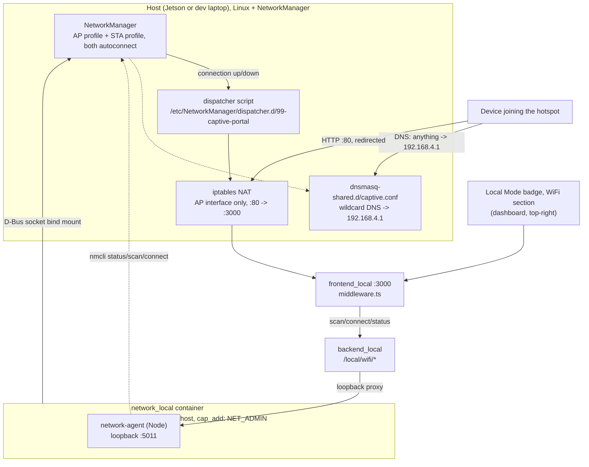

# Hotspot WiFi + Klien

<RoleBadge role="technician" />

Fitur mode lokal opsional: Unit menjalankan hotspot WiFi sendiri agar operator dapat bergabung
secara otomatis ditangkap ke dasbornya saat mereka membuka halaman HTTP apa pun (captive portal, the
mekanisme yang sama yang digunakan bandara dan kafe), dan, jika radio kedua tersedia, tetap terhubung sebagai a
WiFi **klien** ke jaringan lain untuk penggantian internet/sinkronisasi cloud. Status kedua radio ditampilkan
[lencana Mode Lokal](/id/development/data-sync#the-local-mode-badge), lencana yang sama, sama
dropdown, dan operator dapat terhubung ke jaringan lain dari sana.

Sepenuhnya opsional. Unit yang tidak pernah menjalankan langkah penyediaan di bawah ini masih berfungsi persis seperti itu
[Penyiapan Unit](/id/setup/unit-setup) menjelaskan; lencananya hanya melaporkan "tidak ada radio hotspot" dan tidak ada apa-apa
yang lain terpengaruh.

## Mengapa dua radio, bukan satu

| Topologi | Kelayakan |
| --- | --- |
| Dongle menjalankan hotspot, radio internal tetap menjadi klien WiFi | Keyakinan tinggi, tidak ada risiko chipset. AP dan klien hidup di dua radio yang terpisah secara fisik, jadi tidak ada pertanyaan "mode bersamaan" sama sekali, dua profil koneksi NetworkManager independen, masing-masing `autoconnect: yes`, masing-masing terikat ke antarmukanya sendiri. |
| Satu radio melakukan AP dan klien sekaligus (tanpa dongle) | Bersyarat pada chipset. Hanya berfungsi jika pengemudi melaporkan kombinasi antarmuka `iw list` yang valid termasuk `{ AP, managed } <= 2` pada satu wiphy. Tidak dijamin, dan bukan sesuatu yang dapat ditegaskan oleh proyek ini secara umum, periksa pada perangkat keras sebenarnya. |

::: info Windows doing both at once is not proof Linux will
Laptop yang menjalankan fitur Hotspot Seluler Microsoft bersama koneksi WiFi normal menggunakan a
tumpukan driver yang benar-benar berbeda (adaptor WiFi virtual yang dikelola Windows sendiri) dari Linux
`mac80211`/`nl80211` kombinasi AP-dan-terkelola secara bersamaan. Ini adalah petunjuk yang masuk akal *perangkat keras*
pada dasarnya tidak mampu melakukannya, tetapi tidak mengatakan apa pun tentang apakah driver Linux untuk itu
chip yang sama melaporkan kombinasi antarmuka yang mendukung. Verifikasi dengan `iw list` pada host sebenarnya.
:::

## Bagaimana hal itu dihubungkan bersama



Keberadaan hotspot **tidak** bergantung pada Docker. NetworkManager menghadirkan kedua koneksi
membuat profil sendiri, saat boot dan saat perangkat yang cocok dicolokkan, dengan cara yang sama a
kabel Ethernet berkabel "berfungsi", sepenuhnya independen dari `docker-manager.sh` yang pernah dijalankan.
`network_local` hanya melayani status live/scan badge dan melakukan eksplisit operator
permintaan "sambungkan ke jaringan lain"; penyediaan adalah langkah satu kali yang terpisah (di bawah).

::: info Why the container is not `privileged: true`
`network_local` membutuhkan dua hal yang berbeda, dan hibah luas `msd700` juga belum digunakan
(`privileged: true` + jaringan host, lihat [Referensi Docker](/id/setup/docker-reference#network-mode-host)).
`nmcli` hanya memerlukan soket D-Bus yang terpasang di bind untuk mengontrol daemon NetworkManager ** milik host**
, klien itu sendiri tidak pernah menyentuh antarmuka jaringan secara langsung. Aturan iptables berbeda: it
harus dijalankan di namespace jaringan **host**, karena di situlah antarmuka AP sebenarnya berada,
itulah gunanya `network_mode: host`. `cap_add: [NET_ADMIN]` mencakup hal itu, tidak lebih.
:::

## Penyediaan (sekali per unit)

Segala sesuatu yang benar-benar menciptakan hotspot hidup **di luar Docker**, dengan tujuan: ia harus bertahan
`local_dev` sedang down, dan harus menyala seketika dongle dicolokkan ke unit yang memiliki
jangan pernah menjalankan `docker-manager.sh` sama sekali.

### 1. Temukan nama antarmuka

Ini adalah per-host dan tidak dapat ditebak dari repositori. Pada mesin yang akan menjalankan
titik api:

```bash
nmcli device status        # look at the rows whose TYPE is wifi
```

Jetson biasanya menamainya `wlan0` (bawaan) dan `wlan1` (dongle USB), itulah yang dimaksud dengan
`docker/.env` dikirimkan bersama. Laptop Ubuntu menggunakan nama yang dapat diprediksi (`wlp2s0` dan sejenisnya), jadi
periksa daripada berasumsi, NetworkManager akan dengan senang hati membuat profil yang terikat ke antarmuka itu
tidak ada, dan kemudian tidak pernah aktif, tanpa alasan apa pun.

### 2. Tetapkan nilai non-rahasia

Di `msd700_noetic/docker/.env` (dibuat dari `.env.example` pada `docker-manager.sh up` pertama, atau
salin dengan tangan):

```bash
NETWORK_AGENT_PORT_LOCAL=5011
AP_INTERFACE_LOCAL=wlan1          # from step 1: the radio that will BE the hotspot
STA_INTERFACE_LOCAL=wlan0         # from step 1: the radio that stays a client (blank if none)
AP_CONNECTION_NAME_LOCAL=msd700-hotspot
AP_SSID_LOCAL=MSD700-Unit01       # the name broadcast; blank generates one
```

### 3. Penyediaan, meneruskan kata sandi sebaris

```bash
sudo apt install network-manager   # if nmcli is not already on the host
AP_PASSWORD_LOCAL='your-hotspot-password' ./setup.sh --provision-network
```

::: warning Do not put the hotspot password in `docker/.env`
File itu **dilacak oleh git dan dikirim ke asal** di `msd700_noetic`, kata sandi tertulis di sana
dipublikasikan ke repositori. (`.gitignore` membawa header komentar untuk lingkungan
variabel, tetapi aturan di bawahnya tidak ada, sehingga file tidak pernah diabaikan. MySQL asli
kredensial telah dilakukan melalui celah yang sama; mereka hanya loopback, yang membatasi
kerusakan, tapi kunci WiFi tidak, itu adalah jalan menuju jaringan robot.)

Melewatinya secara inline untuk menjalankan provisi satu kali akan menghindari masalah sepenuhnya, dan tidak memerlukan biaya apa pun:
`setup.sh` sumber `docker/.env` tanpa mengesampingkan variabel yang sudah ada di lingkungan,
jadi nilai inline menang. Tidak ada yang memerlukan kata sandi setelahnya, NetworkManager menyimpannya
kunci itu sendiri, dan perubahan selanjutnya terjadi
[menu lencana dasbor](#changing-the-unit-s-own-hotspot). Kata sandi tidak harus tinggal di a
mengajukan sama sekali.

Hal yang sama berlaku untuk `STA_SSID_LOCAL` / `STA_PASSWORD_LOCAL` jika Anda ingin jaringan klien dikonfigurasi
dari awal: teruskan pada baris perintah yang sama, atau cukup tambahkan jaringan dari dasbor
setelah unit habis.
:::

Ini idempoten (aman untuk dijalankan kembali; profil koneksi yang ada atau file yang diinstal dibiarkan saja,
tidak pernah dibuat ulang) dan tidak memulai penampung apa pun. Itu:

1. Instal setiap file `*.rules` di `scripts/udev/` ke `/etc/udev/rules.d/`, aturan hotspot
   ditambah lagi, karena mekanisme instalasi harus ada, kedua aturan tersebut sudah ada
   diperiksa ke dalam repo (`99-stm32-mcu.rules`, `99-realsense.rules`) tanpa jalur instalasinya
   sendiri sampai hal ini ada.
2. Membuat profil koneksi AP (`nmcli connection add ... mode ap ipv4.method shared
   ipv4.addresses 192.168.4.1/24 ...`, `autoconnect: yes`), dan profil klien juga jika
   `STA_INTERFACE_LOCAL`/`STA_SSID_LOCAL` terisi.
3. Menginstal konfigurasi DNS captive-portal dan skrip operator NetworkManager.

Untuk menambah atau mengubah jaringan klien setelahnya, gunakan bagian WiFi di tarik-turun lencana dasbor
alih-alih menjalankan kembali langkah ini, penyediaan sengaja tidak pernah menyentuh profil yang ada.

## Portal tawanan

**DNS.** `dnsmasq -shared` milik NetworkManager (diputar secara otomatis untuk semua
koneksi `ipv4.method shared`) diberikan satu file konfigurasi tambahan,
`/etc/NetworkManager/dnsmasq-shared.d/captive.conf`, berisi `address=/#/192.168.4.1`, setiap
nama host perangkat yang bergabung meminta penyelesaian ke alamat hotspot itu sendiri.

**Redirect.** Satu aturan iptables, terbatas pada antarmuka AP saja:

```
iptables -t nat -A PREROUTING -i <ap-interface> -p tcp --dport 80 -j REDIRECT --to-port 3000
```

Diterapkan dan dihapus secara otomatis oleh skrip operator NetworkManager, yang terkait dengan hotspot
koneksinya sendiri yang naik/turun, bukan ke siklus hidup container mana pun.

::: danger HTTPS is never intercepted, and that is not a bug
Mengarahkan lalu lintas TLS langsung merusak validasi sertifikat: klien mendapatkan keamanan yang ketat
kesalahan, bukan perintah masuk. Ini adalah batasan protokol, yang sama dengan setiap portal captive yang sebenarnya
berlari ke. Apa yang sebenarnya memicu perintah "Masuk ke jaringan" adalah HTTP biasa masing-masing OS
probe, dan semuanya dirancang dengan HTTP biasa, khususnya agar captive portal bisa melakukannya
mencegatnya tanpa pernah menyentuh TLS:

| sistem operasi | URL Penyelidikan | Mengharapkan |
| --- | --- | --- |
| Apple (iOS/macOS) | `http://captive.apple.com/hotspot-detect.html` | string literal "Sukses" |
| Android | `http://connectivitycheck.gstatic.com/generate_204` | HTTP 204 |
| Jendela (NCSI) | `http://www.msftconnecttest.com/connecttest.txt` | "Uji Microsoft Connect" |
| Windows (warisan) | `http://www.msftncsi.com/ncsi.txt` | "Microsoft NCSI" |
| Firefox | `http://detectportal.firefox.com/success.txt` | "sukses\n" |

`ROS-dashboard-next-ts/middleware.ts` menjawab masing-masing dengan sesuatu **selain** selain apa
OS mengharapkan (302 ke dasbor untuk Apple, 200 halaman biasa untuk sisanya) hanya jika
`NEXT_PUBLIC_DEPLOYMENT_MODE=local`, setiap permintaan lainnya, termasuk operator yang mengetik unitnya
alamat asli secara langsung, mencapai dashboard normal tanpa tersentuh.
:::

## Lencana dasbor

Tidak ada lencana WiFi terpisah. Ini adalah **bagian di dalam** itu
Dropdown [Lencana Mode Lokal](/id/development/data-sync#the-local-mode-badge), di bawah status sinkronisasi.
Pada garis lencananya sendiri hanya terdapat **mesin terbang** WiFi yang diwarnai berdasarkan negara dan memuat ringkasannya
(SSID, `hotspot only`, `no network`, `wifi unreachable`) sebagai tooltip hover dan
label pembaca layar, bukan sebagai teks tercetak, SSID berisi karakter arbitrer hingga 32 byte
dan lencananya berada di atas bilah navigasi, jadi kata-katanya hanya berjarak satu klik saja. Agennya adalah
unreachable juga dinyatakan dalam kata-kata di bagian atas, karena mesin terbang merah saja tidak
sesuatu yang dapat ditindaklanjuti oleh operator.

Ia melakukan polling `GET /local/wifi/status` setiap 30 detik, lebih cepat dalam waktu singkat
setelah suatu tindakan, dari lencana yang selalu dipasang, bukan dari bagian, jadi ringkasannya adalah
terkini apakah dropdown pernah dibuka atau belum. Pemindaian jaringan adalah kebalikannya: ia berjalan
ketika dropdown terbuka dan bukan sebelumnya, karena pemindaian ulang `nmcli` tidak gratis dan tampilan halaman terbanyak
jangan pernah membukanya.

| Titik akhir | Otentikasi | Tujuan |
| --- | --- | --- |
| `GET /local/wifi/status` | tidak ada | Status hotspot (naik? SSID? jumlah klien?), status klien (terhubung? SSID? IP? internet dapat dijangkau?) |
| `GET /local/wifi/scan` | tidak ada | SSID terdekat dan jenis keamanan, untuk dropdown |
| `GET /local/wifi/saved` | tidak ada | Profil klien yang dikenal |
| `GET /local/wifi/hotspot` | tidak ada | SSID hotspot unit ini sendiri dan hasil perubahan terakhir. **Jangan pernah mengembalikan kata sandi** |
| `POST /local/wifi/connect` | sesi operator | Hubungkan radio klien ke jaringan yang dipilih |
| `POST /local/wifi/forget` | sesi operator | Hapus profil klien yang disimpan |
| `POST /local/wifi/hotspot` | sesi operator | Ubah SSID dan/atau kata sandi hotspot unit ini |

Rute yang bermutasi memerlukan sesi operator yang sama dengan setiap rute `/api/*` lainnya, tidak seperti itu
`/local/status`/`/local/sync`, yang tetap tidak diautentikasi karena unit tidak disinkronkan
akun namun tidak ada seorang pun yang bisa masuk. Menghubungkan ke jaringan (dan menyerahkan kata sandi) adalah
tindakan yang jauh lebih sensitif daripada membaca stempel waktu sinkronisasi, sehingga hasilnya tidak sama
pengecualian pra-login.

## Mengubah hotspot unit itu sendiri

Bagian WiFi pada dropdown lencana dapat mengganti nama hotspot dan menetapkan kata sandi baru. Dua
perilaku perlu diketahui sebelum menggunakannya.

::: danger Saving disconnects every device on the hotspot, including yours
Hal ini tidak dapat dihindari, bukan sebuah sisi buruk: hotspot itulah yang melayani dashboard, jadi permintaan untuk itu
perubahan itu terjadi melalui hubungan yang dihancurkan oleh perubahan itu. Menerbitkan ulang dengan SSID baru (atau a
kunci baru) menghapus setiap perangkat yang terkait, dan tidak ada satupun yang akan bergabung kembali secara otomatis, ke OS mereka sekarang
baik jaringan yang tidak dikenal atau jaringan yang kata sandinya tidak lagi berfungsi.

API dibangun berdasarkan hal tersebut, bukan menentangnya. `POST /local/wifi/hotspot` memvalidasi
segera, jawaban **202 Diterima** membawa SSID untuk menyambung kembali, dan hanya *kemudian* menerapkannya
ubah ~1,5 detik kemudian. Menerapkannya secara inline akan menghancurkan respons tengah koneksi TCP, dan a
browser tidak dapat mengetahui bahwa dari kerusakan, operator akan melihat kesalahan jaringan untuk perubahan itu
sebenarnya berhasil, tanpa tahu jaringan mana yang harus dicari. Menjawab terlebih dahulu adalah apa yang dikatakan UI
"sambungkan kembali ke `<new name>`" selagi masih ada sambungan untuk mengaktifkannya.

Konsekuensinya responnya berarti *diterima*, tidak pernah *berhasil*. Apa yang sebenarnya terjadi dilaporkan oleh
Bidang `GET /local/wifi/hotspot` `last_change`, dibaca setelah operator bergabung kembali.
:::

::: info A change that cannot activate is rolled back automatically
Kegagalan yang mahal di sini adalah robot tanpa kepala yang satu-satunya jalur aksesnya adalah hotspotnya sendiri, yang tersisa
profil yang tidak lagi aktif: tidak ada yang dapat menghubunginya untuk membatalkannya, sehingga memerlukan seseorang secara fisik
di mesin. Jadi SSID dan kunci sebelumnya ditangkap terlebih dahulu, dan jika pengaturan baru gagal
muncul, mereka dipulihkan dan diaktifkan kembali, dengan `last_change.rolled_back` diatur sehingga menyambung kembali
operator dapat mengetahui perubahan yang dibatalkan dari perubahan yang tidak pernah dikirimkan, jika tidak, keduanya akan terlihat
identik, karena dalam kedua kasus, jaringan di depannya adalah jaringan tempat mereka memulai.
:::

**Validasi** (diterapkan di agen, bukan hanya formulir): SSID adalah 1 hingga 32 **oktet**, nama dalam a
skrip non-Latin mencapai batas lebih cepat dari jumlah karakter yang disarankan, dan kata sandi WPA-PSK
adalah 8 hingga 63 karakter. Karakter kontrol ditolak daripada dilucuti, karena disanitasi secara diam-diam
seseorang meninggalkan operator mencari jaringan yang namanya tidak sesuai dengan yang mereka ketik. Tidak ada yang disentuh
sampai validasi lolos, sehingga nilai yang buruk tidak akan pernah menjadi alasan unit kehilangan hotspotnya.

**Kata sandi tidak pernah dikirim ke browser.** Siapa pun yang sudah ada di hotspot mengetahuinya (mereka mengetiknya
untuk melanjutkan), jadi mengembalikannya tidak akan menghasilkan apa-apa, sementara meletakkannya di badan respons HTTP biasa akan menyerahkannya
siapa pun yang mencapai dasbor dari jaringan *sisi klien*, siapa yang tidak mengetahuinya. Formulir bertanya
untuk kata sandi baru dan menganggap kosong sebagai "simpan yang sekarang".

::: warning `docker/.env` is a seed, not the source of truth
`AP_SSID_LOCAL` / `AP_PASSWORD_LOCAL` dibaca **hanya** oleh `setup.sh --provision-network`, dan hanya
ketika profil belum ada. Setelah perubahan dilakukan dari dashboard, NetworkManager
profile bersifat otoritatif dan kedua kunci tersebut sudah basi. Itu tidak berbahaya, dijalankan kembali
`--provision-network` sengaja tidak pernah menimpa profil yang sudah ada, tapi tidak membacanya
berharap untuk mengetahui nama hotspot unit saat ini. `nmcli -g 802-11-wireless.ssid tampilkan koneksi
msd700-hotspot` adalah jawaban yang jujur.
:::

Keterjangkauan internet di sisi klien (`full` / `limited` / `portal` / `none`) dibaca langsung dari
`nmcli networking connectivity`, pemeriksaan konektivitas berkala milik NetworkManager, tidak ada apa pun di sini
menerapkan yang kedua.

## Pemecahan masalah

| Gejala | Kemungkinan penyebab | Perbaiki |
| --- | --- | --- |
| Menu lencana bertuliskan "Hotspot: tidak ada radio hotspot" | `AP_INTERFACE_LOCAL` kosong, atau `--provision-network` tidak pernah dijalankan | Isi `docker/.env` dan jalankan `./setup.sh --provision-network` |
| Tidak ada mesin terbang WiFi di lencana sama sekali | Tidak ada radio, tanpa antarmuka AP dan STA, tidak ada yang perlu dilaporkan | Diharapkan pada unit yang dibangun tanpa WiFi; jika tidak, periksa `nmcli device` untuk antarmuka |
| `--provision-network` gagal dengan "nmcli tidak ditemukan" | NetworkManager tidak diinstal pada host | `sudo apt install network-manager` |
| `--provision-network` gagal, "AP_PASSWORD_LOCAL tidak disetel" | Kata sandi hilang atau kurang dari 8 karakter | Tetapkan kata sandi 8+ karakter di `docker/.env`, jalankan kembali |
| Hotspot tidak dapat bertahan saat reboot | Penyediaan tidak pernah dijalankan, atau `autoconnect` profil koneksi dinonaktifkan secara manual | `nmcli connection show msd700-hotspot`, periksa `autoconnect: yes`; jalankan kembali `--provision-network` jika profil tidak ada sama sekali |
| Perangkat bergabung dengan hotspot tetapi tidak mendapat prompt captive-portal | OS mungkin menyimpan hasil "internet OK" sebelumnya untuk SSID ini, atau perangkat perusahaan/yang dikelola menonaktifkan deteksi captive-portal | Lupakan jaringan di perangkat klien dan bergabung kembali; periksa pengaturan deteksi portal tawanan |
| Hotspot aktif, namun mesin terbang WiFi berwarna merah dan menu bertuliskan "Layanan WiFi tidak dapat dijangkau di unit ini" | `network_local` tidak berjalan, atau `backend_local` tidak dapat menjangkaunya | `docker compose ps` untuk `network_local`; konfirmasi `NETWORK_AGENT_PORT_LOCAL` cocok di kedua layanan |
| `nmcli device wifi connect` gagal mendapatkan lencana dengan alasan yang tidak membantu | stderr nmcli sendiri diteruskan secara verbatim dan bukan ditulis ulang | Baca teks alasannya secara langsung, ini membedakan kata sandi yang salah dari di luar jangkauan dan ditolak |
| Layanan lokal yang ada (backend, media, MySQL) menjadi tidak dapat dijangkau setelah penyediaan | Aturan iptables tidak dicakup dengan benar ke antarmuka AP | Periksa target aturan pengalihan hanya `<ap-interface>`, jangan pernah memeriksa antarmuka klien atau loopback: `sudo iptables -t nat -L PREROUTING -n` |
| Mengganti nama/password hotspot, dan jaringan lama tetap yang disiarkan | Perubahan gagal diaktifkan dan dibatalkan secara otomatis | Hubungkan kembali pada jaringan lama, buka kembali dashboard, dan baca `last_change.reason` dari `GET /local/wifi/hotspot` |
| Mengubah hotspot dan sekarang tidak ada yang disiarkan sama sekali | Baik perubahan **dan** pengembaliannya gagal, satu-satunya kasus yang memerlukan akses fisik | Periksa `docker logs msd700_network_local` untuk `ROLLBACK ALSO FAILED`; pulihkan di mesin dengan `nmcli connection up msd700-hotspot` |
| `docker/.env` menunjukkan SSID yang berbeda dari unit yang sebenarnya disiarkan | Diharapkan setelah perubahan di sisi dasbor: `.env` hanya penyediaan benih | Baca nilai langsung dengan `nmcli -g 802-11-wireless.ssid connection show msd700-hotspot` |

## Terkait

- [Penyiapan Unit](/id/setup/unit-setup): instalasi mode lokal dasar yang digunakan fitur ini
- [Referensi Docker § network_mode: host](/id/setup/docker-reference#network-mode-host): mengapa beberapa
  layanan berbagi namespace jaringan host
- [Sinkronisasi Data § Lencana Mode Lokal](/id/development/data-sync#the-local-mode-badge): lencana ini
  bagian ada di dalamnya, dan status sinkronisasi ditampilkan di atasnya
- [Arsitektur § Domain kepercayaan](/id/development/architecture#trust-domains): mengapa `/local/wifi/connect`
  memerlukan sesi operator dan `/local/status` tidak