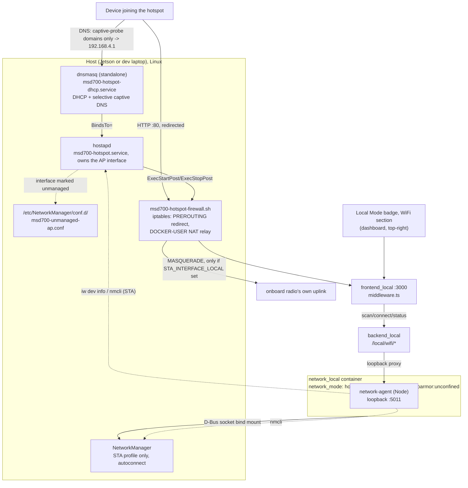

# Hotspot Wi-Fi + Klien

<RoleBadge role="technician" />

Bagian standar dari penyiapan mode lokal setiap unit ([Penyiapan Unit](/id/setup/unit-setup) Langkah 6):
Unit menjalankan hotspot WiFi-nya sendiri agar operator dapat bergabung, secara otomatis "ditangkap"
ke dashboard-nya begitu mereka membuka halaman HTTP apa pun (captive portal, mekanisme yang sama
dengan yang dipakai bandara dan kafe), dan, jika ada radio kedua yang tersedia, tetap terhubung
sebagai **klien** WiFi ke jaringan lain sebagai fallback internet/sinkronisasi cloud. Status kedua
radio ditampilkan pada [badge Mode Lokal](/id/development/data-sync#the-local-mode-badge), badge yang
sama, dropdown yang sama, dan operator dapat terhubung ke jaringan lain dari sana.

Unit yang tidak pernah menjalankan langkah provisioning di bawah ini tetap berfungsi persis seperti
yang dijelaskan [Penyiapan Unit](/id/setup/unit-setup); badge hanya akan melaporkan "no hotspot radio"
dan tidak ada yang lain yang terpengaruh.

## Mengapa dua radio, bukan satu

WiFi onboard milik Jetson (Realtek RTL8822CE pada perangkat keras proyek ini) adalah **satu radio
fisik**. Ia dapat bergabung ke jaringan sebagai klien (STA) *atau* menyiarkan hotspot (AP), tidak
pernah keduanya sekaligus; ini bukan keterbatasan driver, melainkan perangkat kerasnya: `iw phy`
menunjukkan tepat satu `phy` untuk kartu onboard, dan satu radio hanya bisa disetel ke satu channel
pada satu waktu.

| Topologi | Kelayakan |
| --- | --- |
| Sebuah dongle menjalankan hotspot, radio bawaan tetap menjadi klien WiFi | Kepercayaan tinggi, tanpa risiko chipset. AP dan klien berada pada dua radio yang secara fisik terpisah, sehingga tidak ada pertanyaan "mode konkuren" sama sekali: dua proses independen (hostapd pada dongle, NetworkManager pada radio bawaan), masing-masing terikat ke interface-nya sendiri. |
| Satu radio menangani AP dan klien sekaligus (tanpa dongle) | Bergantung pada chipset. Hanya berfungsi jika driver melaporkan kombinasi interface `iw list` yang valid termasuk `{ AP, managed } <= 2` pada satu wiphy. Tidak dijamin, dan bukan sesuatu yang bisa dipastikan proyek ini secara umum; periksa pada perangkat keras sesungguhnya. |

::: info Windows melakukan keduanya sekaligus bukan bukti Linux juga bisa
Laptop yang menjalankan fitur Mobile Hotspot milik Microsoft berdampingan dengan koneksi WiFi normal
menggunakan stack driver yang sama sekali berbeda (adaptor WiFi virtual yang dikelola Windows sendiri)
dari kombinasi AP-dan-managed konkuren `mac80211`/`nl80211` milik Linux. Ini adalah petunjuk yang masuk
akal bahwa *perangkat keras*-nya secara fundamental tidak sepenuhnya tidak mampu, tetapi itu tidak
mengatakan apa pun tentang apakah driver Linux untuk chip yang sama tersebut melaporkan kombinasi
interface yang mendukungnya. Verifikasi dengan `iw list` pada host sesungguhnya.
:::

**Perangkat keras tervalidasi pada proyek ini**: TP-Link TL-WN722N v2/v3, chipset Realtek
**RTL8188EUS** (USB ID `2357:010c`). Dongle berbasis RTL8188EUS apa pun seharusnya berfungsi dengan
driver yang sama, lihat `KNOWN_IDS` di `scripts/install-wifi-dongle-driver.sh` untuk USB ID lain dari
chipset yang sama. Tidak ada driver untuk chipset ini yang tersedia bawaan pada kernel Jetson (baik
`rtl8xxxu` in-tree maupun modul out-of-tree), harus dibangun dari source lewat DKMS, lihat
[Menginstal driver dongle](#installing-the-dongle-driver) di bawah.

## Bagaimana semuanya terhubung



Keberadaan hotspot **tidak** bergantung pada Docker. `hostapd` dan `dnsmasq` berjalan sebagai service
systemd-nya sendiri, dijalankan saat boot dan independen dari apakah `docker-manager.sh` pernah
dijalankan, dengan cara yang sama seperti kabel Ethernet kabel "begitu saja berfungsi".
`network_local` hanya menyajikan status/scan live untuk badge dan menjalankan permintaan eksplisit
operator "terhubung ke jaringan lain" (hanya sisi klien); provisioning hotspot itu sendiri adalah
langkah terpisah, satu kali (di bawah).

### Mengapa hostapd, bukan mode AP milik NetworkManager sendiri

NetworkManager bisa membuat koneksi mode AP-nya sendiri (`nmcli connection add ...
802-11-wireless.mode ap`), digerakkan secara internal oleh `wpa_supplicant`. Itu adalah desain awal di
sini, tetapi pada dongle RTL8188EUS ia **hang setiap kali**: aktivasi NM selalu gagal setelah sekitar
25 detik dengan `"Hotspot network creation took too long"` / `reason 'supplicant-timeout'`.

Didiagnosis dengan menjalankan `hostapd -dd` langsung terhadap interface yang sama: AP-nya naik dalam
kurang dari satu detik (`AP-ENABLED`), berfungsi penuh. Driver tersebut memang mendukung mode AP,
tetapi event penyelesaian `NL80211_CMD_START_AP`-nya tiba di luar urutan yang diharapkan oleh kode AP
internal `wpa_supplicant` (terlihat di log debug hostapd sebagai `Ignored unknown event (cmd=15)`,
tercatat *setelah* AP-nya sudah dimulai lewat cara lain). Jalur softAP milik `wpa_supplicant`
tampaknya menunggu event tersebut; `hostapd` tidak memblokir untuk itu dan langsung melanjutkan.

Perbaikannya: jalankan `hostapd` langsung sebagai service systemd-nya sendiri, dan beri tahu
NetworkManager untuk sepenuhnya membiarkan interface tersebut (`unmanaged-devices` dalam sebuah
drop-in `conf.d`) sehingga keduanya tidak pernah saling berebut. Sisi STA (jaringan upstream untuk
bergabung sebagai klien) tidak memiliki masalah seperti itu dan tetap melalui profil koneksi NM
normal.

### Komponen

| Komponen | Yang dilakukannya | Siklus hidup |
| --- | --- | --- |
| `msd700-hotspot.service` | Menetapkan IP statis `192.168.4.1/24`, menjalankan `hostapd -i <ap-iface> /etc/hostapd/hostapd-msd700.conf`, memanggil `msd700-hotspot-firewall.sh apply`/`teardown` | systemd, diaktifkan saat boot, `Restart=on-failure` |
| `msd700-hotspot-firewall.sh` | Redirect HTTP captive-portal (port 80 pada interface AP, selalu) ditambah NAT relay internet (chain `DOCKER-USER`, hanya saat `STA_INTERFACE_LOCAL` diatur) | Dipanggil dari `ExecStartPost`/`ExecStopPost` service di atas, idempoten (periksa-lalu-bertindak) |
| `msd700-hotspot-dhcp.service` | Menjalankan instance `dnsmasq` khusus: server DHCP (`192.168.4.10`-`192.168.4.200`) + DNS captive-portal selektif | systemd, `BindsTo=msd700-hotspot.service` |
| `/etc/NetworkManager/conf.d/msd700-unmanaged-ap.conf` | Memberi tahu NM untuk tidak pernah menyentuh interface milik dongle | Dibaca oleh NetworkManager saat restart |
| `/etc/polkit-1/rules.d/50-msd700-network-manager.rules` | Memberikan aksi `org.freedesktop.NetworkManager.*` tanpa syarat, sehingga panggilan `nmcli` milik `network_local` (scan, connect, forget) berfungsi tanpa prompt polkit interaktif yang tidak pernah bisa dijawab container | Dibaca oleh `polkit` saat restart |
| Profil koneksi NM (hanya radio bawaan) | Koneksi klien normal ke WiFi operator | Dikelola oleh NetworkManager seperti biasa, `autoconnect: yes` |

Kedua service systemd sisi-hotspot memiliki `Restart=on-failure`, jadi mencabut lalu memasang kembali
dongle yang *sama* saat unit sedang berjalan pulih dengan sendirinya (nama interface diturunkan dari
MAC dan stabil per dongle fisik).

::: info Mengapa `network_local` bukan `privileged: true`
`network_local` membutuhkan beberapa hal yang spesifik, tidak satu pun dari itu adalah grant luas yang
sudah digunakan `msd700` (`privileged: true` + host network, lihat
[Referensi Docker](/id/setup/docker-reference#network-mode-host)). Socket D-Bus yang di-bind-mount
adalah yang memungkinkan `nmcli` mengontrol daemon NetworkManager milik **host sendiri** untuk sisi
STA; klien itu sendiri tidak pernah menyentuh interface jaringan secara langsung. `cap_add:
[NET_ADMIN]` ditambah `network_mode: host` adalah yang dibutuhkan pembacaan status-AP (`iw dev <iface>
info`), karena interface AP berada di network namespace milik host. `security_opt:
apparmor:unconfined` adalah yang tidak begitu jelas: profil apparmor default Docker menolak pemanggilan
metode D-Bus dari dalam container bahkan dengan socket sudah di-bind-mount dan `NET_ADMIN` sudah
diberikan; `Hello()` awal `nmcli` ke bus mendapat `AccessDenied` bahkan sebelum kebijakan D-Bus milik
NetworkManager sendiri sempat dikonsultasikan. Satu-satunya tugas container ini adalah berbicara
dengan NetworkManager milik host lewat bus tersebut, jadi ia berjalan unconfined alih-alih melawan
aturan profil default satu per satu.
:::

## Menginstal driver dongle

Satu kali, per unit, sebelum provisioning:

```bash
./scripts/install-wifi-dongle-driver.sh
```

- Menginstal `dkms`, kernel header, dan toolchain C jika belum ada.
- Meng-clone source driver ([aircrack-ng/rtl8188eus](https://github.com/aircrack-ng/rtl8188eus)) ke
  `/usr/src/`.
- Membangun dan menginstalnya lewat **DKMS**, bukan `insmod` sekali pakai. Ini penting: DKMS secara
  otomatis membangun ulang modul tersebut terhadap setiap kernel masa depan yang di-boot Jetson ini,
  sehingga upgrade kernel via `apt` tidak diam-diam mematikan dongle seperti yang akan terjadi pada
  build manual.
- Memuat modul dan menunggu interface WiFi kedua muncul.

Flag: `--check` (hanya verifikasi status, tanpa perubahan), `--remove` (uninstall).

::: info Langkah ini juga bisa menjalankan dirinya sendiri
`setup.sh --provision-network` (di bawah) mendeteksi dongle RTL8188EUS yang dikenal (`lsusb` terhadap
daftar `KNOWN_IDS` yang sama) dan, jika drivernya belum dimuat, menjalankan skrip ini secara otomatis
sebelum melanjutkan. Menjalankannya secara manual terlebih dahulu tetap berguna untuk melihat output
build, atau untuk `--check` status tanpa mengubah apa pun.
:::

## Provisioning hotspot (satu kali per unit)

Semua yang ada di bawah ini secara sengaja hidup **di luar Docker**: ia harus tetap bertahan meski
`local_dev` sedang mati, dan ia harus menyala seketika dongle dipasang ke unit yang bahkan belum
pernah menjalankan `docker-manager.sh` sama sekali.

### 1. Pasang dongle

Tidak ada yang perlu diatur di `docker/.env` secara manual terlebih dahulu, pasang saja dongle WiFi
USB yang telah tervalidasi dan lanjutkan ke provisioning di bawah; password dan semua pengaturan lain
akan ditanyakan secara interaktif pada saat itu.

Jika `nmcli` belum ada di host:

```bash
sudo apt install network-manager
```

### 2. Provisioning

Jalankan dari terminal interaktif (manusia di keyboard, bukan sesi pipa atau non-TTY):

```bash
./setup.sh --provision-network
```

Dengan gaya create-next-app, ia menuntun Anda melalui setiap pengaturan, nama interface, SSID, dan
password hotspot, menampilkan nilai yang terdeteksi otomatis atau saat ini sebagai `[default]`, tekan
Enter untuk menerimanya atau ketik nilai baru. Password hotspot diketik dua kali untuk konfirmasi dan,
bersama password WiFi upstream apa pun yang dimasukkan untuk sisi STA, secara sengaja **tidak pernah**
dituliskan ke `docker/.env` atau file apa pun lainnya di disk; NetworkManager menyimpan sendiri key
STA-nya dan file konfigurasi hostapd sendiri (`/etc/hostapd/hostapd-msd700.conf`, `chmod 0600`)
menyimpan yang AP. Setiap jawaban lainnya (nama interface, SSID) disimpan kembali ke `docker/.env`
sehingga run ulang, atau manusia yang membaca sekilas file tersebut, melihat nilai yang sebenarnya,
lihat [Referensi konfigurasi](#configuration-reference-docker-env) di bawah.

::: info Provisioning tanpa pengawasan / via skrip
Tanpa TTY, atau dengan `MSD700_NONINTERACTIVE=1`, prompt di atas dilewati sepenuhnya dan
`docker/.env` (dibuat dari `docker/.env.example` pada run pertama jika belum ada) beserta environment
digunakan apa adanya, sehingga otomasi tetap berfungsi:

```bash
AP_PASSWORD_LOCAL='your-hotspot-password' ./setup.sh --provision-network
```

`docker/.env` **dilacak oleh git**, jadi password sungguhan sebaiknya diberikan lewat command line
seperti ditunjukkan, jangan pernah di-commit ke file tersebut; `setup.sh` mem-source `docker/.env`
tanpa menimpa variabel yang sudah ada di environment, jadi nilai inline yang menang.
:::

Tidak perlu mencari tahu nama interface secara manual terlebih dahulu dengan cara apa pun. Satu
perintah ini:

1. **Menginstal aturan udev.** Setiap file `*.rules` di `scripts/udev/`, bukan hanya yang WiFi;
   aturan STM32 dan RealSense yang sudah ada di repo tidak memiliki jalur instalasinya sendiri sampai
   ini ada.
2. **Menginstal aturan PolicyKit** (`/etc/polkit-1/rules.d/50-msd700-network-manager.rules`) sehingga
   panggilan `nmcli` milik `network_local` tidak menggantung pada prompt otentikasi interaktif.
3. **Mendeteksi otomatis interface AP**: jika dongle RTL8188EUS yang dikenal terpasang tetapi
   `AP_INTERFACE_LOCAL` kosong, terlebih dahulu menginstal drivernya (lihat di atas) jika perlu, lalu
   menemukan interface-nya dengan menelusuri `/sys/class/net/*/device/driver` untuk mana pun yang
   dimiliki oleh driver kernel `8188eu`, deterministik, independen dari alamat MAC atau urutan colok.
4. **Mendeteksi otomatis interface STA**: perangkat WiFi *lain* mana pun yang ada, jika hanya ada
   tepat satu. Kedua nilai yang terdeteksi dituliskan kembali ke `docker/.env` sehingga run
   berikutnya, dan manusia yang membaca sekilas file tersebut, melihat nilai sebenarnya. Kasus ambigu
   (misalnya dua radio bawaan) dibiarkan untuk diatur secara eksplisit oleh manusia.
5. **Menginstal `hostapd`** jika belum ada, menghapus profil koneksi NetworkManager
   `msd700-hotspot` yang tersisa dari sebelum proyek ini beralih dari mode AP milik NM sendiri, dan
   menulis `/etc/NetworkManager/conf.d/msd700-unmanaged-ap.conf` (me-restart NetworkManager
   *sebelum* hostapd mengambil alih interface-nya, sehingga NM tidak lagi memegangnya).
6. **Merender dan menginstal** `/etc/hostapd/hostapd-msd700.conf`,
   `/etc/dnsmasq-msd700-hotspot.conf`, `/usr/local/sbin/msd700-hotspot-firewall.sh`, dan kedua file
   unit systemd, lalu mengaktifkan dan **me-restart** (bukan `enable --now`, yang menjadi no-op pada
   service yang sudah berjalan dan akan meninggalkan konfigurasi yang berubah tanpa pernah benar-benar
   diterapkan ulang) `msd700-hotspot.service` dan `msd700-hotspot-dhcp.service`.
7. **Membuat profil klien STA**, jika `STA_INTERFACE_LOCAL`/`STA_SSID_LOCAL` telah diisi, dibiarkan
   apa adanya jika profil dengan nama tersebut sudah ada.

Menjalankan ulang perintah ini selalu aman: setiap langkah idempoten dan hanya menyentuh apa yang
benar-benar perlu diubah. Untuk menambah atau mengubah jaringan klien setelahnya, gunakan bagian WiFi
di dropdown badge dashboard alih-alih menjalankan ulang langkah ini; provisioning secara sengaja tidak
pernah menyentuh profil STA yang sudah ada.

### Mengapa ini tidak digabungkan ke `docker-manager.sh build`/`up`

Sudah dipertimbangkan dan sengaja ditolak. `docker-manager.sh` saat ini tidak pernah membutuhkan
`sudo` sama sekali (membangun dan menjalankan container hanya membutuhkan keanggotaan grup `docker`).
Provisioning hotspot membutuhkannya: `apt install`, `systemctl`, menulis ke `/etc/`. Menggabungkannya
akan berarti setiap `docker-manager.sh build`, termasuk pada laptop dev yang menjalankan
`--simulator` tanpa perangkat keras hotspot sama sekali, bisa mulai meminta password `sudo` yang
sebelumnya tidak pernah dibutuhkan. Menjaga kedua perintah tetap terpisah menjaga kejutan itu tetap
di luar kasus umum.

## Captive portal

**DNS bersifat selektif, bukan wildcard.** `/etc/dnsmasq-msd700-hotspot.conf` (dirender dari
`docker/networkmanager/dnsmasq-hotspot.conf.tmpl`) hanya me-resolve hostname spesifik yang dikueri
masing-masing dari iOS/macOS, Android, Windows, Ubuntu/GNOME, dan Firefox untuk mendeteksi "apakah
jaringan ini berada di balik captive portal" (`captive.apple.com`,
`connectivitycheck.gstatic.com`, `www.msftconnecttest.com`, `detectportal.firefox.com`,
`nmcheck.gnome.org`, dan beberapa lainnya, lihat template untuk daftar lengkap) ke `192.168.4.1`.
Setiap hostname lainnya jatuh ke resolver upstream milik dnsmasq ini sendiri (`/etc/resolv.conf`,
biasanya systemd-resolved, yang meminta DNS apa pun yang diberikan jaringan upstream milik radio
bawaan). Ini menggantikan versi sebelumnya dari fitur ini yang mewildcard *setiap* hostname ke alamat
unit itu sendiri; wildcard secara efektif masih terjadi pada **unit AP-only** tanpa
`STA_INTERFACE_LOCAL` yang dikonfigurasi (tidak ada apa pun untuk di-relay apa pun kata DNS-nya),
tetapi begitu ada uplink bawaan, me-resolve domain sungguhan ke alamat sungguhannya adalah yang
memungkinkan trafik HTTPS (port 443) lewat langsung melalui NAT relay di bawah tanpa disentuh.

**Redirect ini berbasis interface, bukan berbasis hostname.** `msd700-hotspot-firewall.sh` menginstal
satu aturan iptables:

```
iptables -t nat -A PREROUTING -i <ap-interface> -p tcp --dport 80 -j REDIRECT --to-port <captive-port>
```

Ini me-redirect **setiap** permintaan HTTP polos (port 80) yang tiba pada interface AP ke dashboard,
tidak peduli hostname mana yang dituju; iptables bertindak berdasarkan interface dan port, bukan
berdasarkan jawaban DNS yang sudah di-resolve klien. Ini sengaja dilakukan untuk probe captive-portal
itu sendiri (DNS mereka sudah diarahkan ke `192.168.4.1` di atas, jadi mereka akan mendarat di sini
bagaimanapun), tetapi ini juga berarti permintaan HTTP polos klien ke situs lain yang tidak terkait
(yang di-resolve ke IP sungguhan situs tersebut) tetap di-redirect ke sini alih-alih benar-benar
mencapai situs tersebut. `ROS-dashboard-next-ts/middleware.ts` menangani kasus itu secara eksplisit:
ia menjawab setiap host+path probe spesifik milik masing-masing OS dengan sesuatu yang *bukan* yang
diharapkan OS tersebut (302 untuk Apple, halaman 200 polos untuk yang lain, hanya saat
`NEXT_PUBLIC_DEPLOYMENT_MODE=local`), dan untuk hostname asing yang bukan salah satu dari probe
tersebut, me-redirect 302 kembali ke alamat kanonis dashboard sendiri alih-alih mencoba mem-proxy-nya.
Trafik HTTPS tidak pernah menyentuh aturan ini sama sekali (hanya `--dport 80` yang di-redirect), jadi
browsing biasa lewat HTTPS tidak terpengaruh begitu ada uplink bawaan yang me-relay-nya.

Diterapkan dan dihapus secara otomatis lewat `ExecStartPost`/`ExecStopPost` milik
`msd700-hotspot.service`, terikat pada naik/turunnya hostapd itu sendiri, bukan pada siklus hidup
container apa pun atau skrip dispatcher NetworkManager.

::: danger HTTPS tidak pernah dicegat, dan itu bukan bug
Me-redirect trafik TLS sepenuhnya merusak validasi sertifikat: klien mendapat error keamanan keras,
bukan prompt sign-in. Ini adalah batasan protokol, sama seperti yang dihadapi setiap captive portal
sungguhan. Yang sebenarnya memicu prompt "Sign in to network" adalah probe HTTP polos milik
masing-masing OS:

| OS | URL Probe | Mengharapkan |
| --- | --- | --- |
| Apple (iOS/macOS) | `http://captive.apple.com/hotspot-detect.html` | string literal "Success" |
| Android | `http://connectivitycheck.gstatic.com/generate_204` | HTTP 204 |
| Windows (NCSI) | `http://www.msftconnecttest.com/connecttest.txt` | "Microsoft Connect Test" |
| Windows (legacy) | `http://www.msftncsi.com/ncsi.txt` | "Microsoft NCSI" |
| Firefox | `http://detectportal.firefox.com/success.txt` | "success\n" |
| Ubuntu/GNOME (NetworkManager) | `http://connectivity-check.ubuntu.com/` , `http://nmcheck.gnome.org/` | body 200 yang tidak kosong |
:::

**Relay internet.** Hanya saat `STA_INTERFACE_LOCAL` diatur, `msd700-hotspot-firewall.sh` juga
menambahkan:

- Sebuah aturan `MASQUERADE` (`192.168.4.0/24` keluar lewat radio bawaan) sehingga trafik balik
  memiliki rute kembali ke alamat hotspot privat milik klien.
- Dua aturan `ACCEPT` di chain **`DOCKER-USER`** milik Docker, bukan langsung `FORWARD`, karena
  Docker mengatur kebijakan default `FORWARD` menjadi `DROP` dan memiliki chain-nya sendiri di sana,
  tetapi dokumentasinya sendiri menyebut `DOCKER-USER` sebagai satu-satunya chain yang dijaminnya
  tidak akan pernah disisipi, di-flush, atau disentuh dengan cara lain, sehingga aturan ini tetap
  bertahan meski `docker-manager.sh` me-restart Docker atau container-container, yang mana aturan
  yang ditambahkan langsung ke `FORWARD` tidak akan bertahan.

**Catatan keamanan:** siapa pun yang terhubung ke hotspot ikut menumpang koneksi internet milik unit
itu sendiri. Perlu dipertimbangkan jika sebuah unit di-deploy di tempat di mana password hotspot bisa
menjangkau orang-orang di luar operator yang dimaksud.

## Badge dashboard

Tidak ada badge WiFi terpisah. Ini adalah sebuah **bagian di dalam** dropdown
[badge Mode Lokal](/id/development/data-sync#the-local-mode-badge), di bawah status sinkronisasi.
Pada baris badge itu sendiri hanya ada sebuah **glyph** WiFi, diwarnai berdasarkan status dan membawa
ringkasan (sebuah SSID, `hotspot only`, `no network`, `wifi unreachable`) sebagai tooltip hover dan
label pembaca layarnya, bukan sebagai teks tercetak; sebuah SSID bisa sampai 32 byte karakter
sembarang dan badge tersebut duduk di atas navbar, jadi kata-katanya berada satu klik jauhnya.
Ketidakterjangkauan agent juga dinyatakan dalam kata-kata di bagian atas seksi tersebut, karena glyph
merah saja bukan sesuatu yang bisa ditindaklanjuti operator.

Ia melakukan polling `GET /local/wifi/status` setiap 30 detik, lebih cepat untuk jendela waktu singkat
setelah sebuah aksi, dari badge yang selalu ter-mount alih-alih dari bagian tersebut, sehingga
ringkasan tetap mutakhir baik dropdown pernah dibuka atau tidak. Pemindaian jaringan sebaliknya:
dijalankan saat dropdown dibuka dan tidak sebelumnya, karena rescan `nmcli` tidak gratis dan sebagian
besar tampilan halaman tidak pernah membukanya.

| Endpoint | Otentikasi | Tujuan |
| --- | --- | --- |
| `GET /local/wifi/status` | tidak ada | Status hotspot (menyala? SSID? jumlah klien, dibaca lewat `iw dev <ap-iface> info` / `station dump`), status klien (terhubung? SSID? IP? internet terjangkau, lewat `nmcli networking connectivity`?) |
| `GET /local/wifi/scan` | tidak ada | SSID terdekat dan tipe keamanannya, untuk dropdown. **Mengecualikan hotspot milik unit ini sendiri**, lihat di bawah |
| `GET /local/wifi/saved` | tidak ada | Profil klien yang diketahui |
| `GET /local/wifi/hotspot` | tidak ada | SSID hotspot milik unit ini sendiri dan hasil dari perubahan terakhir. **Tidak pernah mengembalikan password** |
| `POST /local/wifi/connect` | sesi operator | Menghubungkan radio klien ke jaringan yang dipilih |
| `POST /local/wifi/forget` | sesi operator | Menghapus profil klien yang tersimpan |
| `POST /local/wifi/hotspot` | sesi operator | Mengubah SSID dan/atau password hotspot milik unit ini sendiri |

Rute yang mengubah state membutuhkan sesi operator yang sama seperti setiap rute `/api/*` lainnya,
berbeda dari `/local/status`/`/local/sync`, yang tetap tanpa otentikasi karena unit yang belum
memiliki akun tersinkron belum punya siapa pun yang bisa login. Menghubungkan ke jaringan (dan
menyerahkan password) adalah tindakan yang jauh lebih sensitif secara bermakna dibanding membaca
timestamp sinkronisasi, jadi ia tidak mendapat pengecualian pra-login yang sama.

### Hotspot milik unit sendiri tidak pernah muncul di hasil scan

Unit dengan dua radio melakukan scan pada radio klien sementara radio lainnya menyiarkan hotspot,
sehingga hotspot-nya sendiri adalah jaringan yang cukup kuat dalam hasil pemindaiannya sendiri,
biasanya yang terkuat dan karenanya pertama dalam daftar. Operator hampir selalu membaca daftar
tersebut **melalui** hotspot itu, jadi memilihnya berarti memberi tahu unit untuk bergabung dengan
dirinya sendiri: radio klien berasosiasi dengan AP yang hanya berjarak beberapa sentimeter, hotspot
melepas operator saat dikonfigurasi ulang, halaman memuat ulang ke jaringan yang tidak menuju ke mana
pun, dan hal yang tampak jelas dilakukan di layar adalah memilih entri yang sama lagi. Sejak
2026-09-10 `scan()` membuangnya, dan `connect()` menolaknya langsung dengan `own_hotspot` (dirender
di panel sebagai kalimat yang menjelaskan mengapa jaringan terkuat adalah yang harus dihindari).
Menyaring daftar saja hanya akan membuat loop ini tidak mungkin, dropdown basi yang tersimpan lintas
penggantian nama hotspot, atau SSID yang diketik manual, tetap mencapai `connect()`.

SSID yang dikecualikan dibaca dari dua tempat, karena keduanya bisa menjadi satu-satunya yang
tersedia. `iw dev <ap-iface> info` melaporkan apa yang sebenarnya sedang di udara saat ini, siapa pun
yang menempatkannya di sana (`hostapd` atau NetworkManager), dan `802-11-wireless.ssid` profil NM
melaporkan apa yang dikonfigurasi bahkan saat AP sedang mati sesaat di tengah restart. Kedua pencarian
gagal secara lunak: tidak mengetahui SSID sendiri hanya membuat satu entri tersaring, tidak pernah
seluruh pemindaian.

## Mengubah hotspot milik unit sendiri

Bagian WiFi pada dropdown badge dimaksudkan untuk mengganti nama hotspot dan mengatur password baru.

::: danger Saat ini rusak setelah migrasi hostapd
`setHotspot()` milik `network-agent`
(`ros-web-ui/source/dependencies/network-agent/wifi_control.js`) masih membaca dan menulis sisi AP
sebagai profil NetworkManager `nmcli connection modify msd700-hotspot ...` / `nmcli connection
down`/`up msd700-hotspot`. Provisioning (di atas) secara eksplisit **menghapus** profil persis
tersebut jika ada; interface AP kini *unmanaged* dari sisi NM, `hostapd` memilikinya langsung lewat
`msd700-hotspot.service`. Pada unit mana pun yang di-provision di bawah arsitektur saat ini, tidak
ada koneksi `msd700-hotspot` yang bisa dibaca `setHotspot()`, jadi ia langsung gagal dengan
`not_provisioned` sebelum mencoba perubahan apa pun. Membaca status (`GET /local/wifi/hotspot`,
`GET /local/wifi/status`) tidak terpengaruh; `getApInfo()` telah diperbarui untuk membaca interface
secara langsung lewat `iw`, hanya jalur *tulis*-nya saja yang belum ikut dipindahkan. Memperbaiki ini
berarti menulis ulang `setHotspot()` untuk mengedit `/etc/hostapd/hostapd-msd700.conf`
(SSID/`wpa_passphrase`) dan `systemctl restart msd700-hotspot.service` alih-alih menyentuh profil
NetworkManager yang sudah tidak ada lagi. Belum dilakukan.
:::

Setelah diperbaiki, ada dua perilaku yang layak diketahui sebelum menggunakannya, dan keduanya sudah
tercermin dalam bentuk API-nya:

::: danger Menyimpan memutus semua perangkat di hotspot, termasuk milik Anda
Ini tidak terhindarkan, bukan sisi kasar: hotspot itulah yang menyajikan dashboard, jadi permintaan
untuk mengubahnya tiba lewat koneksi yang sama yang dihancurkan oleh perubahan tersebut. Me-restart AP
dengan SSID baru (atau key baru) melepas setiap perangkat yang terasosiasi, dan tidak ada satu pun
dari mereka yang akan auto-rejoin; bagi OS mereka, ini sekarang adalah jaringan yang tidak dikenal
atau yang password-nya sudah tidak berfungsi lagi.

API ini dibangun berdasarkan hal itu, bukan melawannya. `POST /local/wifi/hotspot` melakukan validasi
segera, menjawab **202 Accepted** yang membawa SSID untuk disambungkan kembali, dan baru *setelah itu*
menerapkan perubahan. Menerapkannya secara inline akan menghancurkan koneksi TCP di tengah respons,
dan browser tidak bisa membedakan itu dari crash; operator akan melihat error jaringan untuk
perubahan yang sebenarnya berhasil, tanpa tahu jaringan mana yang harus dicari. Menjawab terlebih
dahulu adalah yang memungkinkan UI mengatakan "hubungkan kembali ke `<nama baru>`" selagi masih
punya koneksi untuk mengatakannya.

Akibatnya respons tersebut berarti *diterima*, bukan pernah *berhasil*. Apa yang sebenarnya terjadi
dilaporkan oleh field `last_change` milik `GET /local/wifi/hotspot`, dibaca setelah operator
bergabung kembali.
:::

::: info Perubahan yang gagal aktif dimaksudkan untuk otomatis roll back
Kegagalan yang mahal di sini adalah robot headless yang satu-satunya jalur aksesnya adalah hotspot-nya
sendiri, tertinggal dengan konfigurasi yang tidak lagi aktif: tidak ada yang bisa menjangkaunya untuk
membatalkan itu, jadi dibutuhkan seseorang secara fisik di mesin tersebut. Implementasi saat ini
menangkap SSID dan key sebelumnya terlebih dahulu dan, jika pengaturan baru gagal aktif, memulihkan
dan mengaktifkan kembali keduanya, dengan `last_change.rolled_back` diatur sehingga operator yang
menyambung kembali bisa membedakan perubahan yang di-roll-back dari yang tidak pernah diajukan sama
sekali; jika tidak, keduanya akan tampak identik, karena dalam kedua kasus jaringan di depan mereka
adalah jaringan yang sama seperti saat mereka mulai. Logika ini masih menargetkan profil
NetworkManager yang sudah dihapus (lihat di atas), jadi ia perlu dipindahkan ke pengeditan/pembatalan
file konfigurasi hostapd bersama sisa perbaikan lainnya.
:::

**Validasi** (diberlakukan di agent, bukan hanya di form): SSID adalah 1 sampai 32 **oktet**, sebuah
nama dalam skrip non-Latin mencapai batas lebih cepat dari yang disiratkan jumlah karakternya, dan
password WPA-PSK adalah 8 sampai 63 karakter. Karakter kontrol ditolak, bukan dihapus diam-diam,
karena membersihkannya secara diam-diam akan membuat operator mencari-cari jaringan yang namanya
bukan yang mereka ketik. Tidak ada yang disentuh sampai validasi lolos, jadi nilai yang salah tidak
akan pernah menjadi alasan sebuah unit kehilangan hotspot-nya.

**Password tidak pernah dikirim ke browser.** Siapa pun yang sudah ada di hotspot mengetahuinya
(mereka mengetiknya untuk bisa bergabung), jadi mengembalikannya tidak memberi manfaat apa pun,
sementara menaruhnya di body respons HTTP polos menyerahkannya kepada siapa pun yang menjangkau
dashboard dari jaringan *sisi-klien*, yang tidak mengetahuinya. Form-nya meminta password baru dan
memperlakukan kosong sebagai "pertahankan yang sekarang".

::: warning `docker/.env` adalah benih (seed), bukan sumber kebenaran
`AP_SSID_LOCAL` / `AP_PASSWORD_LOCAL` hanya dibaca oleh `setup.sh --provision-network`, dan hanya
saat `/etc/hostapd/hostapd-msd700.conf` belum ada (dalam praktiknya: hanya pada run provisioning
pertama). Setelah itu, `/etc/hostapd/hostapd-msd700.conf` menjadi otoritatif dan kedua key tersebut
menjadi basi; menjalankan ulang `--provision-network` akan merender ulang file yang sama dari
`docker/.env` lagi, jadi edit `docker/.env` dan jalankan ulang provisioning untuk mengubah hotspot
dari CLI, atau tunggu jalur dashboard di atas diperbaiki. Jawaban langsung yang jujur untuk SSID
yang disiarkan adalah `iw dev <ap-interface> info`.
:::

Keterjangkauan internet sisi-klien (`full` / `limited` / `portal` / `none`) dibaca langsung dari
`nmcli networking connectivity`, probe konektivitas periodik milik NetworkManager sendiri, tidak ada
apa pun di sini yang mengimplementasikan probe kedua.

## Referensi konfigurasi (`docker/.env`)

| Variabel | Arti | Default |
| --- | --- | --- |
| `AP_INTERFACE_LOCAL` | Nama interface dongle | terdeteksi otomatis saat `--provision-network` |
| `STA_INTERFACE_LOCAL` | Nama interface radio bawaan | terdeteksi otomatis saat `--provision-network` |
| `AP_SSID_LOCAL` | Nama siaran hotspot | `MSD700-<hostname suffix>` jika dibiarkan kosong |
| `AP_PASSWORD_LOCAL` | Password WPA2 hotspot (8+ karakter, wajib agar provisioning dapat membuat AP) | sengaja kosong di `docker/.env.example` |
| `AP_CONNECTION_NAME_LOCAL` | Legacy, hanya digunakan untuk membersihkan profil NetworkManager pre-hostapd yang tersisa dengan nama ini selama provisioning | `msd700-hotspot` |
| `NETWORK_AGENT_PORT_LOCAL` | Port tempat API loopback `network_local` mendengarkan | `5011` |
| `STA_SSID_LOCAL` / `STA_PASSWORD_LOCAL` | Opsional: jaringan upstream untuk auto-join sebagai klien pada provisioning pertama | kosong (tambahkan nanti lewat dropdown WiFi dashboard) |
| `LOCAL_IP` | IP yang dituju build frontend dashboard | `192.168.4.1` (sesuai dengan IP statis hotspot) |

## Memverifikasi bahwa ini berfungsi

```bash
# Services running?
systemctl status msd700-hotspot.service msd700-hotspot-dhcp.service

# Actually in AP mode, broadcasting?
iw dev <AP_INTERFACE_LOCAL> info        # should show: type AP

# NetworkManager correctly staying out of the way?
nmcli device status                      # dongle should show "unmanaged"

# Captive-portal domains still redirected?
dig +short @192.168.4.1 captive.apple.com       # should print 192.168.4.1

# Everything else resolving for real (only meaningful if STA_INTERFACE_LOCAL is set)?
dig +short @192.168.4.1 github.com              # should print a real GitHub IP, not 192.168.4.1

# NAT + relay rules present?
sudo iptables -t nat -L POSTROUTING -n | grep 192.168.4.0
sudo iptables -L DOCKER-USER -n
```

Dari perangkat lain: hubungkan ke SSID-nya, prompt "Sign in to WiFi" milik OS itu sendiri seharusnya
muncul dan mendarat di `http://192.168.4.1:3000` (atau port lain yang dituju redirect port 80, lihat
`FRONTEND_PORT_LOCAL`). Semua yang lain seharusnya bisa browsing normal jika `STA_INTERFACE_LOCAL`
dikonfigurasi.

## Pemecahan Masalah

**`lsusb` tidak menampilkan dongle, atau `nmcli device status` tidak menampilkan perangkat WiFi kedua**
Driver belum terinstal/dimuat. Jalankan `./scripts/install-wifi-dongle-driver.sh --check` untuk
melihat apa yang hilang.

**`install-wifi-dongle-driver.sh` melaporkan modul tidak dimuat bahkan tepat setelah build yang
berhasil**
Coba ulang sekali, ada race condition yang diketahui antara `depmod` milik `dkms install` sendiri dan
`modprobe` tepat setelahnya. Skrip ini sudah mencoba ulang secara internal (5 percobaan); jika masih
gagal, periksa `sudo dmesg | tail -40`.

**Hotspot tidak mau menyiarkan / `iw dev` menunjukkan `type managed` alih-alih `AP`**
Periksa `journalctl -u msd700-hotspot.service`. Jika Anda melihat kegagalan aktivasi berulang,
pastikan NetworkManager benar-benar melepaskan interface tersebut (`nmcli device status` seharusnya
mengatakan `unmanaged`, bukan `disconnected` atau `connecting`); `/etc/NetworkManager/conf.d/msd700-unmanaged-ap.conf`
yang basi dan mengarah ke nama interface yang salah adalah penyebab umum setelah berganti ke dongle
yang berbeda.

**`--provision-network` gagal dengan "nmcli not found"**
NetworkManager tidak terinstal pada host. `sudo apt install network-manager`.

**`--provision-network` gagal, "AP_PASSWORD_LOCAL is not set"**
Hanya terjadi pada run non-interaktif (tanpa TTY, atau `MSD700_NONINTERACTIVE=1`): password hilang
atau kurang dari 8 karakter. Atur password 8+ karakter di `docker/.env` atau berikan
`AP_PASSWORD_LOCAL` secara inline, lalu jalankan ulang. Run interaktif sebaliknya meminta password
secara langsung dan meminta ulang saat input terlalu pendek atau tidak cocok.

**Klien terhubung ke hotspot tapi tidak mendapat IP**
Periksa `systemctl status msd700-hotspot-dhcp.service` dan `journalctl -u
msd700-hotspot-dhcp.service`. Pastikan `/etc/dnsmasq-msd700-hotspot.conf` memiliki baris `interface=`
yang benar (jalankan ulang `./setup.sh --provision-network` untuk merendernya ulang dari
`docker/.env` saat ini).

**Klien mendapat prompt "Sign in to WiFi" dan mencapai dashboard, tapi tidak ada yang lain yang
dimuat**
`STA_INTERFACE_LOCAL` kemungkinan kosong di `docker/.env`, itu adalah mode AP-only, dashboard-only
secara desain (tidak ada uplink bawaan untuk di-relay melaluinya). Jika seharusnya diatur, periksa
dengan `nmcli device status`, atur, lalu jalankan ulang `./setup.sh --provision-network`.

**`STA_INTERFACE_LOCAL` sudah diatur tapi klien masih tidak punya internet**
Periksa apakah aturan NAT benar-benar ada (lihat [Memverifikasi bahwa ini berfungsi](#verifying-it-works)
di atas). Jika hilang setelah provisioning ulang, pastikan `msd700-hotspot.service` benar-benar
**di-restart** (bukan hanya di-`enable`, lihat langkah 6 provisioning), dan bahwa
`net.ipv4.ip_forward` bernilai `1` (`sysctl net.ipv4.ip_forward`). Jika tidak, pastikan radio bawaan
itu sendiri memiliki internet sungguhan (`ping -I <STA_INTERFACE_LOCAL> 8.8.8.8`), relay hanya
meneruskan ke ke mana pun koneksi radio tersebut sendiri menuju.

**Service lokal yang sudah ada (backend, media, MySQL) menjadi tak terjangkau setelah provisioning**
Aturan redirect iptables tidak dibatasi dengan benar ke interface AP. Periksa apakah ia hanya
menargetkan `<ap-interface>`, tidak pernah interface klien atau loopback:
`sudo iptables -t nat -L PREROUTING -n`.

**Menu badge mengatakan "Hotspot: no hotspot radio"**
`AP_INTERFACE_LOCAL` kosong, atau `--provision-network` belum pernah dijalankan. Isi `docker/.env`
dan jalankan `./setup.sh --provision-network`.

**Tidak ada glyph WiFi sama sekali pada badge**
Tidak ada radio yang tersedia, tanpa interface AP dan STA tidak ada apa pun untuk dilaporkan.
Diharapkan pada unit yang dibangun tanpa WiFi; jika tidak, periksa `nmcli device` / `lsusb` untuk
interface-nya.

**Hotspot menyala, tapi glyph WiFi berwarna merah dan menu mengatakan "WiFi service unreachable on
this unit"**
`network_local` tidak berjalan, atau `backend_local` tidak dapat menjangkaunya. `docker compose ps`
untuk `network_local`; pastikan `NETWORK_AGENT_PORT_LOCAL` cocok pada kedua service.

**`nmcli device wifi connect` gagal dari badge dengan alasan yang tidak membantu**
stderr milik nmcli sendiri diteruskan apa adanya alih-alih diubah kata-katanya. Baca teks alasannya
secara langsung, ia membedakan password salah dari di luar jangkauan dari ditolak.

**Mengubah nama/password hotspot dari dashboard tidak melakukan apa-apa / melaporkan
`not_provisioned`**
Bug yang diketahui, lihat [Mengubah hotspot milik unit sendiri](#changing-the-unit-s-own-hotspot)
di atas, `setHotspot()` belum diperbarui untuk migrasi hostapd. Untuk saat ini, ubah
`AP_SSID_LOCAL`/`AP_PASSWORD_LOCAL` di `docker/.env` dan jalankan ulang `--provision-network`
sebagai gantinya (hanya berfungsi sebelum file konfigurasi hostapd sudah ada, lihat peringatan di
bawah bagian itu).

## Terkait

- [Penyiapan Unit](/id/setup/unit-setup): instalasi mode lokal dasar tempat fitur ini dibangun di
  atasnya
- [Referensi Docker § network_mode: host](/id/setup/docker-reference#network-mode-host): mengapa
  beberapa service berbagi network namespace host
- [Sinkronisasi Data § Badge Mode Lokal](/id/development/data-sync#the-local-mode-badge): badge
  tempat bagian ini berada, dan status sinkronisasi yang ditampilkan di atasnya
- [Arsitektur § Domain kepercayaan](/id/development/architecture#trust-domains): mengapa
  `/local/wifi/connect` membutuhkan sesi operator dan `/local/status` tidak
