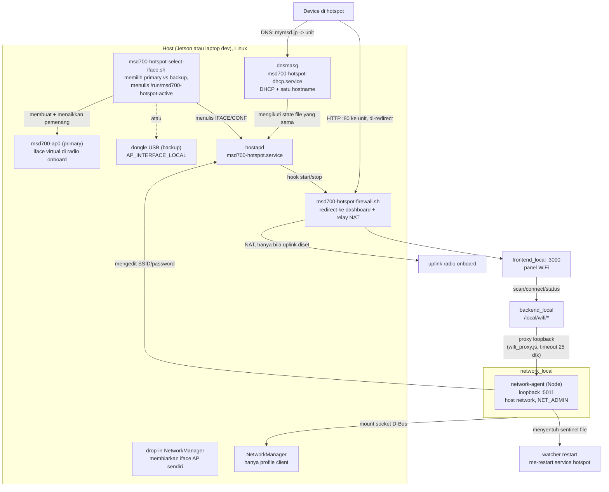

# WiFi Hotspot + Client

<RoleBadge role="technician" />

Bagian dari setup lokal tiap unit ([Setup Unit](/id/setup/unit-setup) Step 6): unit menjalankan hotspot WiFi sendiri untuk operator (di `http://mymsd.jp`), dan bisa mempertahankan koneksi **client** WiFi normal ke jaringan lain untuk internet dan sync cloud, di radio yang sama bila hardware mengizinkan.

Tiap start hotspot, script selector memilih satu dari dua jalur:

- **Primary**: virtual AP (`msd700-ap0`) di radio onboard. Cek dukungan AP+client driver aslinya dulu, termasuk [MT7922](/id/setup/wifi-mt7922).
- **Backup**: dongle USB yang dikonfigurasi, dicoba hanya bila seleksi interface primary gagal. Bukan failover setelah hostapd gagal; lihat batasan di bawah.

Provisioning sebelum start stack unit pertama. Bahkan tanpa hotspot, `network_local` me-mount `/run/msd700-hotspot-active`; start Docker sebelum file itu ada bisa membuat folder pengganti dan memblokir provisioning berikutnya.

## Alur setup

Di unit baru, dengan urutan ini. Kebanyakan unit hanya butuh step 2 dan 3:

1. **Naikkan radio onboard dulu.** MT7922? Perbaiki firmware-nya ([Setup Wi-Fi MT7922](/id/setup/wifi-mt7922)): di kernel Tegra kartu bisa tak terlihat oleh NetworkManager, diam-diam mendorong hotspot ke jalur dongle. Bila radio onboard sudah muncul di `nmcli device status`, tidak ada yang perlu diperbaiki.
2. [Provisioning hotspot](#provisioning-hotspot-sekali-per-unit) (`./setup.sh --provision-network`). Preflight-nya mengecek radio onboard dan otomatis fallback ke dongle bila dikonfigurasi.
3. [Verifikasi](#verifikasi).
4. **(Optional) [Instal driver dongle cadangan](#menginstal-driver-dongle).** Hanya bila preflight step 2 bilang radio onboard tak bisa jalur primary, atau untuk redundansi sengaja. Tidak perlu bila jalur primary jalan.

Hanya step 2 yang interaktif dan per-unit (SSID, password). Sisanya bring-up hardware sekali saja, diulang hanya bila hardware berubah.

## Radio primary vs. dongle cadangan

Jalur primary menjalankan client + AP sekaligus di radio onboard. Cek output penuh `iw phy <phy> info` driver aslinya: tipe interface, limit, limit channel. Satu phy tidak menutup kemungkinan client+AP simultan di channel bersama; nama chip saja tidak membuktikan apa-apa. Cek provisioning hanya mencari `AP` di dekat "valid interface combinations", bukan kombinasi penuh.

::: warning Seleksi bukan tes kesiapan
Selector membuat/menaikkan `msd700-ap0` dan menulis pemenang ke state file. Ia tidak memverifikasi kombinasi atau menunggu hostapd broadcast. Backup dicoba hanya bila seleksi gagal. Failure hostapd/channel belakangan bisa me-retry jalur primary yang sama selamanya, tanpa failover ke dongle. Kedua jalur memakai channel 6 2.4 GHz; tidak ada yang menyinkronkannya dengan uplink client yang berubah. Simpan akses recovery kabel/konsol.
:::

| Jalur | Kapan dipakai | Butuh |
| --- | --- | --- |
| **Primary**: virtual AP di radio onboard | Dicoba dulu tiap start, di phy `STA_INTERFACE_LOCAL` | Driver/firmware dengan limit client+AP/channel yang bekerja; link-up saja tidak membuktikan broadcast |
| **Backup**: dongle USB (`AP_INTERFACE_LOCAL`) | Dicoba bila seleksi interface primary gagal | Dongle AP-capable yang bekerja + driver. Tetap bukan failover setelah hostapd gagal |

::: info Hotspot Windows tidak membuktikan apa-apa soal driver Linux-mu
Windows menjalankan AP+client lewat stack virtual-adapter sendiri, tak terkait konkurensi `mac80211` Linux. Itu hint hardware *mungkin* bisa, tapi tidak berkata apa-apa soal kombinasi interface driver-mu. Baca `iw phy <phy> info` di host aslinya.
:::

**Dongle cadangan tervalidasi**: TP-Link TL-WN722N v2/v3, Realtek **RTL8188EUS** (USB `2357:010c`). Dongle RTL8188EUS lain seharusnya bekerja dengan driver sama; lihat `KNOWN_IDS` di `scripts/install-wifi-dongle-driver.sh`. Setup lama butuh driver DKMS; cek modul kernel dan dukungan AP sendiri sebelum menganggap punyamu juga begitu.

## Cara kerja keseluruhannya



Hotspot tidak tergantung Docker. `hostapd` + `dnsmasq` jalan sebagai service systemd, naik saat boot dengan atau tanpa `docker-manager.sh`. `network_local` menyediakan status/scan/aksi client di dashboard, plus rename hotspot dan request restart. Dashboard tetap butuh stack Docker lokal jalan.

### Kenapa hostapd, bukan mode AP NetworkManager

Mode AP milik NetworkManager hang di dongle RTL8188EUS tiap kali (`supplicant-timeout` setelah ~25 dtk). Menjalankan `hostapd` langsung menaikkan interface yang sama di bawah sedetik: driver mendukung mode AP, tapi event completion-nya tiba dalam urutan yang tidak diharapkan path AP NetworkManager. Jadi `hostapd` jalan sebagai service systemd sendiri, dan NetworkManager disuruh membiarkan interface AP sendiri (drop-in unmanaged). Sisi client tetap memakai profile NM normal.

### Komponen

| Komponen | Artinya |
| --- | --- |
| `msd700-hotspot-select-iface.sh` | Hook startup: menaikkan virtual AP primary bila radio onboard mengizinkan, bila tidak dongle backup; menulis pemenang (`IFACE`, `CONF`) ke `/run/msd700-hotspot-active` |
| `msd700-hotspot.service` | Memberi interface pemenang `192.168.4.1/24`, menjalankan `hostapd`, memasang/melepas rule firewall. Aktif saat boot, `Restart=on-failure` |
| `msd700-hotspot-firewall.sh` | Me-redirect trafik port-80 yang ditujukan ke alamat unit sendiri ke dashboard (bukan captive portal; port-80 lain lewat) + relay NAT untuk internet bila uplink ada |
| `msd700-hotspot-dhcp.service` | `dnsmasq` khusus: DHCP (`192.168.4.10`-`192.168.4.200`) + me-resolve `PORTAL_HOSTNAME_LOCAL` ke unit. Terikat service AP |
| `/etc/hostapd/hostapd-msd700-primary.conf` / `-backup.conf` | SSID/password sama di-render dua kali (satu per interface), sehingga client melihat satu identitas mana pun yang aktif. Mode `0600` |
| `/etc/NetworkManager/conf.d/msd700-unmanaged-ap.conf` | Menjauhkan NM dari `msd700-ap0` dan interface dongle |
| `/etc/polkit-1/rules.d/50-msd700-network-manager.rules` | Membiarkan panggilan `nmcli` `network_local` jalan tanpa prompt auth interaktif |
| `msd700-hotspot-restart.path` / `.service` | Satu-satunya jalur `network_local` ke systemd host: menyentuh sentinel file me-restart service hotspot, tidak yang lain |
| `/etc/tmpfiles.d/msd700-hotspot.conf` | Membuat state file/dir yang hilang saat boot; tidak memperbaiki path bertipe salah |
| Profile koneksi NM (hanya onboard) | Koneksi client normal ke WiFi operator, `autoconnect: yes` |

Recovery best-effort: kedua service restart saat failure, tapi DHCP tidak kembali sendiri setelah restart AP saja. Cek DHCP/DNS terpisah setelah hotplug atau ganti SSID/password.

`network_local` bukan `privileged`. Ia mengontrol NetworkManager host lewat socket D-Bus yang di-mount (`NET_ADMIN` + host network untuk baca status AP, `apparmor:unconfined` karena profile default Docker memblokir panggilan D-Bus). Ia juga me-mount `/run/msd700-hotspot-active` (read-only), `/etc/hostapd` (read-write, untuk rename), dan `/run/msd700-hotspot-restart` (read-write, untuk request restart).

## Menginstal driver dongle

Hanya untuk jalur **backup**: radio onboard tak bisa client+AP, atau redundansi sengaja. Sekali saja per unit, sebelum provisioning:

```bash
./scripts/install-wifi-dongle-driver.sh
```

- Menginstal `dkms`, header kernel, toolchain bila hilang.
- Clone [aircrack-ng/rtl8188eus](https://github.com/aircrack-ng/rtl8188eus) ke `/usr/src/`.
- Build via **DKMS** (selamat dari rebuild kernel bila header + source kompatibel ada; cek status DKMS setelah update kernel).
- Load modul, tunggu interface WiFi kedua.

Flag: `--check` (verifikasi saja), `--remove` (uninstall).

`setup.sh --provision-network` auto-install hanya bila `AP_INTERFACE_LOCAL` kosong dan `lsusb` cocok `2357:010c`. ID USB didukung lain butuh installer dijalankan eksplisit.

## Provisioning hotspot (sekali per unit)

Semua di bawah tinggal **di luar Docker** dengan sengaja: harus selamat saat `local_dev` down, dan naik di unit yang tak pernah menjalankan `docker-manager.sh`.

### 1. (Optional) Colok dongle cadangan

Hanya bila radio onboard tak bisa jalur primary, atau untuk redundansi: [di atas](#radio-primary-vs-dongle-cadangan). Lewati total bila jalur primary jalan.

Tidak ada yang perlu diset di `docker/.env` dulu. Colok dongle tervalidasi dan provisioning di bawah; semuanya ditanyakan interaktif di sana.

Bila `nmcli` hilang di host:

```bash
sudo apt install network-manager
```

### 2. Provisioning

Dari terminal interaktif (bukan piped, bukan non-TTY):

```bash
./setup.sh --provision-network
```

Menanyakan nama interface dan SSID (dengan default terdeteksi). Entri password tersembunyi, menampilkan `[keep current]` bila diset, tidak pernah menampilkannya. Password hotspot baru diketik dua kali. Password **tidak** ditulis kembali ke `docker/.env`: key client masuk ke profile NetworkManager-nya, key AP ke config hostapd (`/etc/hostapd/hostapd-msd700-primary.conf` dan `-backup.conf` bila dongle ada, `chmod 0600`). SSID/password sama di keduanya, sehingga client melihat satu identitas mana pun yang aktif. Jawaban lain (nama interface, SSID) disimpan kembali ke `docker/.env`.

::: info Provisioning unattended
Tanpa TTY (atau `MSD700_NONINTERACTIVE=1`), prompt dilewati. `docker/.env` di-source langsung, sehingga nilainya mengalahkan environment warisan; lalu password hostapd yang ada mengalahkan keduanya. Password inline bisa bocor ke shell history dan tidak andal meng-override. Pilih entri interaktif tersembunyi. Rotasi password unattended yang aman masih belum solved.
:::

Tak perlu lookup nama interface dulu. Satu perintah ini:

1. **Memasang udev rules** (semua `scripts/udev/*.rules`, termasuk STM32 + RealSense).
2. **Memasang rule PolicyKit** agar `nmcli` `network_local` tak pernah hang menunggu prompt auth.
3. **Menemukan interface backup**: bila USB `2357:010c` ada tapi `AP_INTERFACE_LOCAL` kosong, instal driver-nya bila perlu, lalu cocokkan interface by driver kernel `8188eu` (independen MAC/urutan colok).
4. **Menemukan interface onboard**: satu device WiFi *lain*, bila tepat satu. Kedua nilai ditulis kembali ke `docker/.env`. Kasus ambigu (dua radio onboard) diserahkan untuk diset manual.
5. **Mengecek kesiapan jalur primary**: interface STA diset tapi tidak ada → sekali coba `apt-get install -y linux-firmware` + re-trigger udev, bila tidak warning dan tetap di backup dongle (failure persis yang diperbaiki tangan di [Setup Wi-Fi MT7922](/id/setup/wifi-mt7922)). Interface ada tapi tanpa AP di kombinasi `iw phy` → warning jalur primary akan terus fallback; limit driver/hardware, tak bisa diperbaiki di sini.
6. **Memasang `hostapd`** bila hilang, menghapus sisa profile NM `msd700-hotspot` pra-hostapd, menulis drop-in unmanaged NM untuk kedua interface AP (me-restart NM *sebelum* hostapd mengklaimnya).
7. **Me-render dan memasang** kedua config hostapd, config dnsmasq, script firewall + selector, dan kedua unit systemd, lalu enable dan **restart** (bukan `enable --now`, no-op di service jalan) service hotspot + DHCP.
8. **Membuat profile client** bila interface/SSID uplink diset; profile bernama sama yang ada dibiarkan.

Re-provisioning menulis ulang config hostapd, me-restart NM/AP/DHCP, dan bisa memutus operator. Ia juga menjalankan ulang setup jaringan Velodyne setelahnya. Pakai konsol lokal atau akses kabel, bukan WiFi yang diubah. Profile client yang ada dibiarkan; ganti jaringan client dari dashboard.

Host butuh: `nmcli`, `iw`, `dnsmasq`, `iptables`, systemd, udev, polkit. Jalur ini memasang hostapd bila tidak ada tapi **bukan** dnsmasq atau iw; cek dulu.

### Kenapa bukan bagian `docker-manager.sh build`/`up`

Provisioning jaringan host menyentuh paket, `/etc/`, dan systemd: disruptif, dan terpisah dari build container. (`up` juga memasang boot autostart via sudo kecuali `--no-autostart`.)

## Redirect dashboard

**Bukan captive portal, dengan sengaja.** Versi lama membajak hostname connectivity-check tiap OS, yang membuat tiap OS menyimpulkan jaringan **tidak** punya internet (Android bahkan fallback ke mobile data), menyembunyikan uplink-nya sendiri yang bekerja. Kini:

- `dnsmasq` me-resolve tepat satu hostname, `PORTAL_HOSTNAME_LOCAL` (default `mymsd.jp`) plus subdomain, ke unit. Sisanya, termasuk connectivity check milik tiap OS, di-resolve sungguhan, sehingga dengan uplink bekerja kebanyakan OS menampilkan prompt "Sign in to WiFi" **tidak sama sekali**. Buka `http://mymsd.jp` langsung (atau alamat hotspot mentah).
- Firewall me-redirect hanya trafik HTTP polos **yang ditujukan ke IP hotspot milik unit** ke dashboard. Browsing port-80 lain dan semua HTTPS lewat utuh. Unit yang di-provision sebelum perubahan ini mungkin masih membawa rule blanket lama; re-provisioning menghapusnya.

Dipasang/dilepas otomatis dengan naik/turun hostapd, independen container.

**Relay internet.** Hanya bila `STA_INTERFACE_LOCAL` diset, script firewall juga menambah rule `MASQUERADE` (`192.168.4.0/24` keluar radio onboard) plus rule `ACCEPT` di chain **`DOCKER-USER`** Docker (satu-satunya chain yang Docker janji tak pernah sentuh, sehingga rule selamat dari restart container).

**Catatan keamanan:** siapa pun di hotspot menunggang koneksi internet milik unit. Pikirkan siapa lagi yang bisa mempelajari password hotspot di lokasi deployment.

## Badge dashboard

Tanpa badge WiFi terpisah. WiFi tinggal sebagai **seksi di dalam dropdown [Local Mode badge](/id/development/data-sync#badge-status-local-mode)**. Baris badge hanya menampilkan **glyph** WiFi, diwarnai sesuai state, dengan ringkasan (SSID, `hotspot only`, `no network`, `wifi unreachable`) sebagai hover tooltip, bukan teks cetakan. Kondisi agent tak terjangkau juga ditulis di atas seksi.

Agent membaca interface *pemenang* dari `/run/msd700-hotspot-active` (primary `msd700-ap0` atau dongle backup, mana yang menang boot ini), fallback ke dongle `AP_INTERFACE_LOCAL` hanya bila file hilang. Di unit primary-only tanpa dongle, inilah yang membuat badge bisa melihat hotspot.

Status polling `GET /local/wifi/status` tiap 30 dtk (lebih cepat sebentar setelah aksi), dari badge yang selalu ter-mount. Scan jalan hanya saat dropdown dibuka (rescan `nmcli` tidak gratis).

| Endpoint | Auth | Tujuan |
| --- | --- | --- |
| `GET /local/wifi/status` | none | State hotspot (up? SSID? jumlah client) + state client (tersambung? SSID? IP? internet?) |
| `GET /local/wifi/scan` | none | SSID sekitar + security, untuk dropdown. **Mengecualikan hotspot milik unit ini** (bawah) |
| `GET /local/wifi/saved` | none | Profile client dikenal |
| `GET /local/wifi/hotspot` | none | SSID hotspot milik unit ini + hasil perubahan terakhir. **Tidak pernah mengembalikan password** |
| `POST /local/wifi/connect` | none | Gabung jaringan client pilihan |
| `POST /local/wifi/disconnect` | none | Tinggalkan jaringan client |
| `POST /local/wifi/forget` | none | Hapus profile client tersimpan |
| `POST /local/wifi/hotspot` | none | Ubah SSID dan/atau password hotspot milik unit |

::: warning Tanpa login yang melindungi route ini
Route lokal tidak membawa autentikasi operator. Agent bind loopback, tapi backend mem-proxy request browser tanpa cek login. Jangan expose ke jaringan tak tepercaya.
:::

### Hotspot sendiri tidak pernah muncul di scan

Scan di radio client sambil broadcast hotspot akan menampilkan hotspot sendiri pertama (terkuat). Memilihnya menyuruh unit gabung ke dirinya sendiri: hotspot memutusmu di tengah konfigurasi ulang, halaman muat ulang ke jaringan mati, dan refleksnya adalah memilihnya lagi. Jadi `scan()` membuangnya dan `connect()` menolak langsung (`own_hotspot`, ditampilkan sebagai kalimat penjelasan). SSID yang dikecualikan berasal dari radio yang live (`iw dev <ap-iface> info`) dan profile NM; keduanya gagal diam-diam bila tak bisa dibaca. Saat AP down di tengah restart, filter bisa sesaat lolos.

## Mengubah hotspot milik unit

Ganti nama hotspot dan set password baru dari seksi WiFi dropdown badge. Agent mengedit baris `ssid=`/`wpa_passphrase=` langsung di tempat di config hostapd mana pun yang ada (nilai sama di keduanya), lalu meminta restart tidak langsung: menyentuh sentinel file yang diawasi unit path systemd host, yang menjalankan `systemctl restart msd700-hotspot.service`. Tidak ada sinyal "restart done" sinkron, sehingga agent mem-polling state radio hingga 15 dtk alih-alih percaya jeda tetap.

::: danger Menyimpan memutus semua device di hotspot, termasuk kamu
Tak terhindarkan: dashboard tiba lewat koneksi yang justru dihancurkan perubahan. Restart AP di bawah SSID/key baru mendrop tiap device, dan tak ada yang auto-rejoin (bagi OS-nya ini jaringan tak dikenal atau password salah).

Maka `POST /local/wifi/hotspot` memvalidasi, menjawab **202 Accepted** dengan SSID untuk reconnect, *baru* menerapkan perubahan. Menjawab dulu membuat UI bisa bilang "reconnect ke `<nama baru>`" selagi masih punya koneksi. Respons berarti *diterima*, bukan *sukses*: baca `last_change` `GET /local/wifi/hotspot` setelah rejoin.
:::

::: warning Rollback best-effort, bukan konektivitas terverifikasi
Saat gagal agent mengembalikan SSID/key sebelumnya dan mengaktifkannya (`last_change.rolled_back` membedakan rollback dari yang tak pernah dikirim). "Gagal" berarti SSID harapan tak pernah muncul dalam 15 dtk, bukan error dari perintah. Ia tidak memverifikasi password baru, DHCP, DNS, atau penyambungan ulang; rollback sendiri bisa gagal. `last_change` di memori, hilang saat agent restart.
:::

**Validasi** (di agent, bukan sekadar form): SSID 1-32 **oktet** (nama non-Latin mencapai limit lebih cepat dari jumlah karakternya), password WPA-PSK 8-63 karakter. Karakter kontrol ditolak, bukan di-strip. Tidak ada yang disentuh sampai validasi lolos, sehingga nilai buruk tak bisa membunuh hotspot.

**Password tidak pernah ke browser.** Siapa pun di hotspot sudah tahu (mereka mengetiknya untuk masuk); mengembalikannya lewat HTTP polos menyerahkannya ke siapa pun yang mencapai dashboard dari jaringan sisi-*client*. Form meminta password baru; kosong berarti "pertahankan yang sekarang".

::: warning `docker/.env` adalah seed, bukan kebenaran
Provisioning membaca `docker/.env`, lalu memilih password live dari config hostapd primary, backup, atau legacy, berurutan. Ubah via prompt tersembunyi atau dashboard, jangan via env override. Tidak seperti password, SSID live *tidak* dipulihkan ke provisioning: rename dashboard bisa di-reset oleh re-provision berikutnya dari `AP_SSID_LOCAL` basi. Cek SSID broadcast (`iw dev <ap-interface> info`) di prompt.
:::

Reachability internet sisi-client (`full` / `limited` / `portal` / `none`) berasal langsung dari `nmcli networking connectivity`. Tidak ada probe kedua di sini.

## Referensi konfigurasi (`docker/.env`)

| Variable | Arti | Default |
| --- | --- | --- |
| `AP_INTERFACE_LOCAL` | Interface dongle **backup** | auto-detect saat `--provision-network` |
| `STA_INTERFACE_LOCAL` | Interface radio onboard, juga mendukung hotspot **primary** | auto-detect saat `--provision-network` |
| `AP_SSID_LOCAL` | Nama broadcast hotspot | `MSD700-<hostname suffix>` bila kosong |
| `AP_PASSWORD_LOCAL` | Password WPA2 hotspot (8+ karakter, wajib untuk membuat AP) | kosong di `.env.example` dengan sengaja |
| `AP_CONNECTION_NAME_LOCAL` | Legacy: hanya membersihkan sisa profile NM pra-hostapd bernama ini | `msd700-hotspot` |
| `PORTAL_HOSTNAME_LOCAL` | Hostname yang di-resolve dnsmasq ke unit; satu-satunya alamat yang di-redirect firewall | `mymsd.jp` |
| `NETWORK_AGENT_PORT_LOCAL` | Port API loopback `network_local` | `5011` |
| `STA_SSID_LOCAL` / `STA_PASSWORD_LOCAL` | Optional: jaringan upstream untuk auto-join saat provisioning pertama | kosong (tambah dari dropdown dashboard saja) |
| `LOCAL_IP` | Alamat dashboard cetakan + fallback build frontend; alamat tetap hotspot tetap `192.168.4.1` | `192.168.4.1` |

## Referensi endpoint `network-agent`

`network_local` hanya bind `127.0.0.1:5011`; `backend_local` satu-satunya pemanggil dan menambahkan auth operator. Proxy di antara keduanya adalah `wifi_proxy.js` (timeout 25 dtk, meneruskan body hotspot apa adanya untuk menjaga beda absent-vs-empty). Agent memanggil `nmcli` via argv saja (tidak pernah shell), 15 dtk per panggilan, lewat bind-mount D-Bus ke NetworkManager host. Provisioning hotspot **bukan** tugasnya (`setup.sh --provision-network` yang mengerjakannya).

| Endpoint | Tujuan |
| --- | --- |
| `GET /health` | `{ ok: true }` |
| `GET /wifi/status` | State radio/koneksi |
| `GET /wifi/scan` | Jaringan (SSID hotspot sendiri difilter, dedup terkuat-dulu) |
| `GET /wifi/saved` | Profile tersimpan |
| `POST /wifi/connect { ssid, ... }` | Gabung (standar, enterprise EAP, atau hidden); 400 tanpa ssid, 502 saat gagal |
| `POST /wifi/disconnect` | Putus uplink client |
| `GET /wifi/hotspot` | Hotspot saat ini + `limits` (SSID maks 32 oktet, password 8–63) + `last_change` |
| `POST /wifi/hotspot` | Validasi kini, terapkan dalam 1.5 dtk: `202 { accepted, applies_in_ms: 1500, ssid, password_changed }` |
| `POST /wifi/forget { name }` | Hapus profile tersimpan |

## Verifikasi

```bash
# Service jalan?
systemctl status msd700-hotspot.service msd700-hotspot-dhcp.service

# Jalur mana menang, primary (msd700-ap0) atau backup (dongle)?
cat /run/msd700-hotspot-active

# Broadcast dalam mode AP? (IFACE dari file di atas)
iw dev <IFACE> info                      # harus tampil: type AP

# NetworkManager menjauh dengan benar?
nmcli device status                      # msd700-ap0 / dongle harus "unmanaged"

# Hostname dashboard resolve ke unit ini?
dig +short @192.168.4.1 mymsd.jp                # harus cetak 192.168.4.1

# Sisanya resolve sungguhan (hanya bila STA_INTERFACE_LOCAL diset)?
dig +short @192.168.4.1 github.com              # IP asli, bukan 192.168.4.1

# Rule NAT + relay ada?
sudo iptables -t nat -L POSTROUTING -n | grep 192.168.4.0
sudo iptables -L DOCKER-USER -n
```

Dari device lain: join SSID, buka `http://mymsd.jp` (atau alamat hotspot mentah). Dengan uplink bekerja kebanyakan OS menampilkan prompt "Sign in to WiFi" **tidak**; itu sengaja dihapus ([di atas](#redirect-dashboard)). Browsing lain normal bila `STA_INTERFACE_LOCAL` diset.

## Troubleshooting

**Dongle hilang dari `lsusb`, atau WiFi kedua tidak ada di `nmcli device status`**
`lsusb` hilang = masalah USB/daya/koneksi, bukan driver. USB ada tapi interface tidak ada → cek driver (`./scripts/install-wifi-dongle-driver.sh --check`) dan kernel log.

**Installer bilang modul tidak ter-load tepat setelah build sukses**
Retry sekali: race antara `depmod` milik `dkms install` dan `modprobe`. Script sudah retry internal (5x); bila tetap gagal, `sudo dmesg | tail -40`.

**Hotspot tidak broadcast / `iw dev` menampilkan `type managed`, bukan `AP`**
`journalctl -u msd700-hotspot.service` diawali decision log selector sendiri (jalur mana, kenapa fallback). Failure aktivasi berulang: konfirmasi NM melepas interface pemenang (`nmcli device status` harus bilang `unmanaged`). Unmanaged-conf basi menunjuk nama interface salah adalah penyebab umum setelah ganti dongle.

**Hotspot selalu memakai dongle backup padahal radio onboard seharusnya primary**
Baca penuh `iw phy <phy> info` untuk phy onboard (managed+AP, total-interface, limit channel). Lalu `journalctl -u msd700-hotspot.service`: seleksi dan broadcast adalah tahap terpisah dengan error terpisah.

**Preflight warning driver/firmware radio onboard belum siap**
Persis yang diperbaiki tangan di [Setup Wi-Fi MT7922](/id/setup/wifi-mt7922); `apt-get install -y linux-firmware` otomatis saat provisioning tidak selalu cukup di kernel Tegra ini. Hotspot tetap jalan di dongle backup sementara itu, bila dikonfigurasi.

**`--provision-network` gagal "nmcli not found"**
`sudo apt install network-manager`.

**`--provision-network` gagal, "AP_PASSWORD_LOCAL is not set"**
Jalankan ulang interaktif dan masukkan password baru di hidden prompt. Jangan commit ke `docker/.env` tracked atau taruh di shell history. Pakai SSID 1-32 byte dan passphrase WPA2 8-63 karakter tanpa karakter kontrol (provisioning hanya cek panjang; agent memvalidasi sisanya).

**Client join tapi tidak dapat IP**
`systemctl status msd700-hotspot-dhcp.service` + `journalctl -u msd700-hotspot-dhcp.service`. Interface dnsmasq berasal dari `/run/msd700-hotspot-active` di command line service; konfirmasi state file cocok dengan interface yang benar naik. Jalankan ulang `./setup.sh --provision-network` bila config basi.

**Client bisa `http://mymsd.jp` tapi tidak ada yang load**
`STA_INTERFACE_LOCAL` mungkin kosong di `docker/.env`: mode AP-only, dashboard-only: memang didesain begitu. Bila seharusnya diset, cek `nmcli device status`, set, jalankan ulang provisioning.

**`STA_INTERFACE_LOCAL` diset tapi client tetap tanpa internet**
Cek rule NAT ada ([di atas](#verifikasi)). Bila hilang setelah re-provision: konfirmasi service hotspot benar **di-restart** (bukan sekadar enable), `sysctl net.ipv4.ip_forward` adalah `1`, dan radio onboard sendiri punya internet (`ping -I <STA_INTERFACE_LOCAL> 8.8.8.8`).

**Service lokal (backend, media, MySQL) tak terjangkau setelah provisioning**
Rule redirect salah scope. Ia harus menarget hanya interface pemenang dari `/run/msd700-hotspot-active` dan hanya alamat milik unit (`-d`), jangan loopback atau `0.0.0.0/0`: `sudo iptables -t nat -L PREROUTING -n`.

**Badge bilang "Hotspot: no hotspot radio" padahal hotspot naik**
Konfirmasi `/run/msd700-hotspot-active` ter-mount ke `network_local` (`docker compose exec network_local cat /run/msd700-hotspot-active` harus cocok dengan host). Kosong di dalam = bind mount belum terpasang. Mount oke = `--provision-network` belum pernah jalan, atau kedua variable interface memang kosong.

**Glyph WiFi tidak ada sama sekali di badge**
Kedua radio tidak ada: tanpa AP, tanpa interface client, tidak ada yang dilaporkan. Wajar di build tanpa WiFi; bila tidak cek `nmcli device` / `lsusb`.

**Hotspot naik, glyph merah, "WiFi service unreachable on this unit"**
`network_local` down, atau `backend_local` tak mencapainya. `docker compose ps` untuk `network_local`; konfirmasi `NETWORK_AGENT_PORT_LOCAL` cocok di kedua service.

**`nmcli device wifi connect` dari badge gagal dengan reason tak membantu**
Stderr nmcli diteruskan apa adanya. Baca langsung: ia membedakan password salah / di luar jangkauan / ditolak.

**Ubah hotspot dari dashboard lapor `not_provisioned`**
Kedua config hostapd belum ada, atau `network_local` tak bisa membacanya (cek bind mount `/etc/hostapd`: `docker compose exec network_local ls -l /etc/hostapd`). `--provision-network` belum pernah jalan.

**Ubah hotspot dari dashboard timeout / tak pernah konfirmasi**
`setHotspot()` menyentuh sentinel file dan menunggu hingga 15 dtk SSID baru mengudara ([di atas](#mengubah-hotspot-milik-unit)). Cek `systemctl status msd700-hotspot-restart.path msd700-hotspot-restart.service`, mount read-write `/run/msd700-hotspot-restart` ke `network_local`, dan `journalctl -u msd700-hotspot-restart.service`.

## Terkait

- [Setup Wi-Fi MT7922](/id/setup/wifi-mt7922): step 1 [alur](#alur-setup) di atas, hanya untuk masalah firmware MT7922 terkonfirmasi di unit nyata
- [Setup Unit](/id/setup/unit-setup): instal mode-lokal dasar yang ditumpangi fitur ini
- [Referensi Docker](/id/setup/docker-reference#network-mode-host): kenapa sebagian service berbagi network host
- [Data Sync: Local Mode badge](/id/development/data-sync#badge-status-local-mode): badge tempat seksi ini tinggal
- [Architecture: Trust domains](/id/development/architecture#trust-domain-dan-keamanan-multi-tingkat): desain trust-boundary untuk route `/local/*` (middleware sesi operator di route WiFi mutating didesain tapi belum dipasang; lihat warning di atas)
