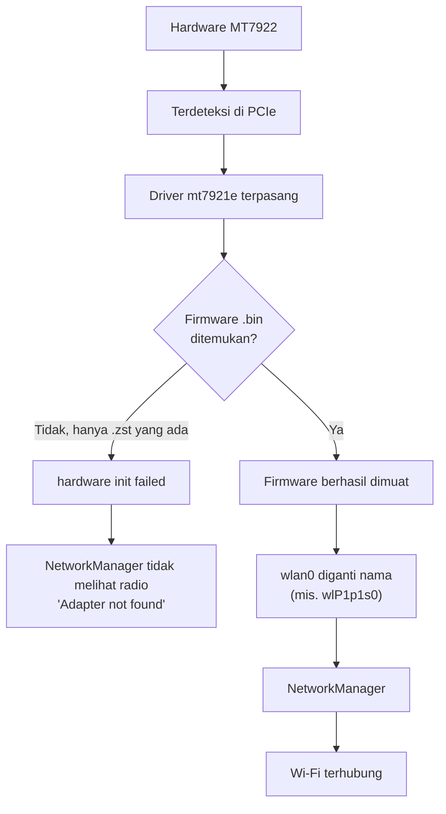

# Penyiapan Wi-Fi MediaTek MT7922 (Kernel Tegra)

<RoleBadge role="technician" />

Ini adalah **langkah 1** dari [alur penyiapan Hotspot Wi-Fi + Klien](/id/setup/wifi-hotspot#alur-penyiapan):
perbaiki dulu firmware radio onboard di sini, lalu kembali dan lanjutkan dengan provisioning hotspot.

**Kartu kelas MediaTek MT7922 adalah radio onboard primary proyek ini**: selain menjadi klien WiFi
biasa, kartu ini bisa menjalankan access point hotspot secara konkuren pada radio fisik yang sama
(lihat [Radio primary vs. backup dongle](/id/setup/wifi-hotspot#radio-primary-vs-backup-dongle)),
tanpa perlu dongle USB. Unit yang dibangun dengan Realtek RTL8822CE yang lebih lama tidak mendukung
mode konkuren tersebut, dan selalu butuh backup dongle untuk hotspot-nya, lihat
[Hotspot Wi-Fi + Klien](/id/setup/wifi-hotspot) untuk jalur itu.

Di kernel Tegra (Jetson), driver in-tree `mt7921e` sudah tersedia, tetapi paket firmware yang
diinstal Ubuntu terkadang hanya menyediakan bentuk terkompresi `.zst` dari file firmware, sementara
build kernel tertentu masih meminta bentuk polos tanpa kompresi. Akibatnya kartu terdeteksi tetapi
tidak pernah menyala, dan hotspot diam-diam jatuh ke backup dongle (jika kebetulan ada yang
dikonfigurasi) alih-alih memakai jalur primary yang seharusnya.

## Lingkungan yang tervalidasi

| Komponen | Nilai |
| --- | --- |
| OS | Ubuntu 24.04.4 LTS |
| Arsitektur | arm64 |
| Kernel | `6.8.12-1021-tegra` |
| Kartu Wi-Fi | MediaTek MT7922 |
| PCI ID | `14c3:0616` |
| Driver | `mt7921e` |

::: warning Solusi spesifik kernel, bukan perbaikan universal
Ini spesifik untuk Ubuntu 24.04 pada kernel `6.8.12-1021-tegra`, sesuai yang ditemukan pada proyek
ini. Kernel mainline atau Ubuntu yang lebih baru mungkin sudah mendekompresi firmware `.zst` saat
dimuat, sehingga ekstraksi manual pada panduan ini tidak diperlukan. Selalu lakukan
[Langkah 1](#_1-verifikasi-hardware-dan-driver) dan [Langkah 2](#_2-cek-firmware-mt7922) terlebih
dahulu untuk memastikan gejalanya benar-benar ada sebelum menerapkan perbaikan ini.
:::

## 1. Verifikasi hardware dan driver

```bash
lspci -nnk | grep -A3 -iE 'network|wireless'
```

Yang diharapkan:

```
MEDIATEK Corp. MT7922 802.11ax PCI Express Wireless Network Adapter [14c3:0616]
Kernel driver in use: mt7921e
Kernel modules: mt7921e
```

Jika `mt7921e` sudah muncul dan berfungsi, jangan pasang driver pihak ketiga: driver in-tree sudah
benar, masalahnya (jika ada) ada di firmware, bukan drivernya.

::: warning Jika kartunya sama sekali tidak muncul di sini, atau `mt7921e` bukan driver pada sistem ini
Dua kegagalan berbeda, keduanya lebih jarang daripada masalah firmware yang menjadi topik panduan ini:

- **Kartunya sama sekali tidak ada di `lspci`.** Periksa apakah kartunya benar-benar terpasang
  (`lspci | grep -i network` seharusnya menampilkan *beberapa* perangkat wireless). Jika sama sekali
  tidak ada apa pun, ini adalah masalah hardware (pasang ulang kartunya, periksa koneksi fisiknya),
  bukan sesuatu yang bisa diperbaiki langkah-langkah di bawah.
- **Kartunya terdaftar, tapi tanpa baris `Kernel driver in use`, atau dengan driver yang berbeda.**
  Konfirmasi modulnya sendiri ada pada kernel ini:

  ```bash
  modinfo mt7921e
  ```

  `mt7921e` sudah termasuk dalam paket kernel L4T (Tegra) pada lingkungan tervalidasi proyek ini di
  bawah, tidak ada yang perlu dibangun atau diunduh terpisah, berbeda dari driver backup dongle.
  Jika `modinfo` melaporkan `ERROR: Module mt7921e not found`, pohon modul kernel yang sedang
  berjalan itu sendiri kehilangan modul tersebut, masalah packaging kernel, bukan masalah firmware:

  ```bash
  uname -r
  sudo apt install --reinstall "linux-modules-$(uname -r)"
  ```

  Jika paket tersebut tidak ada untuk build kernel ini, image L4T/JetPack yang dipakai untuk
  mem-flash unit ini kehilangan modul tersebut sama sekali, perlakukan seperti masalah hardware:
  me-reflash atau meng-upgrade L4T BSP adalah perbaikannya, bukan apa pun di panduan ini.
:::

## 2. Cek firmware MT7922

```bash
ls -l /lib/firmware/mediatek/ | grep -i MT7922
```

Pada kasus yang menjadi dasar panduan ini, direktori tersebut hanya berisi file terkompresi:

```
WIFI_RAM_CODE_MT7922_1.bin.zst
WIFI_MT7922_patch_mcu_1_1_hdr.bin.zst
```

tetapi kernel meminta nama tanpa kompresi:

```
WIFI_RAM_CODE_MT7922_1.bin
WIFI_MT7922_patch_mcu_1_1_hdr.bin
```

Konfirmasi dengan:

```bash
sudo dmesg | grep -iE 'mt792|firmware'
```

Error yang menjadi gejalanya terlihat seperti ini:

```
Direct firmware load for mediatek/WIFI_RAM_CODE_MT7922_1.bin failed with error -2
Direct firmware load for mediatek/WIFI_MT7922_patch_mcu_1_1_hdr.bin failed with error -2
mt7921e ... hardware init failed
```

`error -2` adalah `ENOENT`: kernel tidak menemukan file dengan nama persis tersebut, dan tidak
mendekompresi `.zst` secara otomatis pada build kernel ini.

::: warning Jika `/lib/firmware/mediatek/` tidak ada, atau tidak punya file `.bin` maupun `.zst`
Berbeda dari ketidakcocokan di atas, ini berarti paket firmware-nya sendiri tidak pernah terinstal,
bukan cuma terinstal dalam format yang salah:

```bash
sudo apt update
sudo apt install --reinstall linux-firmware
ls -l /lib/firmware/mediatek/ | grep -i MT7922
```

`linux-firmware` adalah paket yang menyediakan file-file ini, `./setup.sh --provision-network`
sudah mencoba reinstall persis ini secara otomatis sebagai preflight saat ia melihat interface radio
onboard tidak pernah muncul, lihat [Hotspot Wi-Fi + Klien § Provisioning
hotspot](/id/setup/wifi-hotspot#provisioning-hotspot-satu-kali-per-unit). Jika percobaan otomatis
sudah berjalan dan interface-nya tetap tidak muncul, menjalankan ulang secara manual jarang membantu
juga, periksa apa yang sebenarnya muncul di `/lib/firmware/mediatek/` dengan perintah di atas. Jika
file-nya kembali sebagai `.zst` (kasus umum pada kernel proyek ini), lanjutkan ke langkah 3 dan 4 di
bawah untuk mendekompresnya. Jika direktorinya masih kosong atau instalasi paketnya sendiri gagal,
itu menunjuk ke package cache/mirror Ubuntu yang rusak atau tidak lengkap, bukan sesuatu yang
spesifik untuk kartu ini, `apt-cache policy linux-firmware` dan `sudo apt update` polos adalah
langkah berikutnya yang biasa diperiksa.
:::

## 3. Pastikan `zstd` tersedia

```bash
which zstd
```

Jika belum ada:

```bash
sudo apt update
sudo apt install zstd
```

## 4. Ekstrak firmware `.zst` menjadi `.bin`

```bash
cd /lib/firmware/mediatek

sudo zstd -d -f WIFI_RAM_CODE_MT7922_1.bin.zst \
    -o WIFI_RAM_CODE_MT7922_1.bin

sudo zstd -d -f WIFI_MT7922_patch_mcu_1_1_hdr.bin.zst \
    -o WIFI_MT7922_patch_mcu_1_1_hdr.bin
```

Verifikasi bahwa kedua bentuk kini ada berdampingan:

```bash
ls -lh /lib/firmware/mediatek/*MT7922*
```

Yang diharapkan:

```
WIFI_RAM_CODE_MT7922_1.bin
WIFI_RAM_CODE_MT7922_1.bin.zst
WIFI_MT7922_patch_mcu_1_1_hdr.bin
WIFI_MT7922_patch_mcu_1_1_hdr.bin.zst
```

::: info Jangan hapus file `.zst`
Jangan hapus file aslinya. Langkah ini hanya menambahkan salinan `.bin` hasil dekompresi di
sampingnya; file `.zst` asli tetap ada di tempatnya untuk keperluan apa pun yang mengandalkan
keberadaannya (misalnya verifikasi `dpkg`, pembaruan paket di masa depan).
:::

## 5. Reload driver

Tidak perlu reboot:

```bash
sudo modprobe -r mt7921e
sudo modprobe mt7921e
```

Lalu periksa:

```bash
sudo dmesg | grep -iE 'mt792|firmware' | tail -50
```

Jika berhasil, error firmware sebelumnya hilang dan muncul baris seperti ini:

```
ASIC revision: 79220010
HW/SW Version: ...
WM Firmware Version: ...
wlP1p1s0: renamed from wlan0
```

## 6. Verifikasi NetworkManager

```bash
nmcli device
```

Yang diharapkan:

```
wlP1p1s0   wifi   connected   eduroam
```

Nama interface tidak harus `wlP1p1s0`: itu tergantung pada predictable network interface naming
sistem, dan bisa berbeda antar mesin.

## Diagnosis



## Setup sekali jalan untuk pemasangan berikutnya

Untuk mesin lain dengan kondisi yang sama (MT7922, firmware `.zst` tersedia, kernel meminta `.bin`),
ini adalah keseluruhan perbaikannya:

```bash
sudo apt update
sudo apt install zstd

cd /lib/firmware/mediatek

sudo zstd -d -f WIFI_RAM_CODE_MT7922_1.bin.zst \
    -o WIFI_RAM_CODE_MT7922_1.bin

sudo zstd -d -f WIFI_MT7922_patch_mcu_1_1_hdr.bin.zst \
    -o WIFI_MT7922_patch_mcu_1_1_hdr.bin

sudo modprobe -r mt7921e
sudo modprobe mt7921e

nmcli device
```

## Terkait

- [Hotspot Wi-Fi + Klien § Alur penyiapan](/id/setup/wifi-hotspot#alur-penyiapan): lanjutkan ke sini
  setelah halaman ini, langkah 2 dan 3 (provisioning hotspot, verifikasi), langkah 4 (backup dongle)
  opsional.
- [Hotspot Wi-Fi + Klien § Radio primary vs. backup dongle](/id/setup/wifi-hotspot#radio-primary-vs-backup-dongle):
  kenapa kartu ini tidak butuh dongle, dan apa yang masih membutuhkannya.
- [Pemecahan Masalah](/id/setup/troubleshooting): diagnostik teknisi secara umum.
