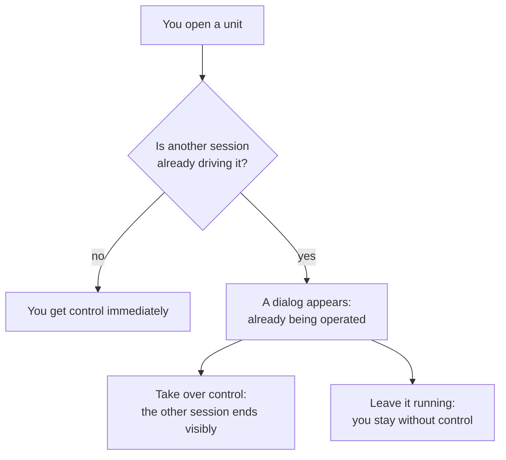
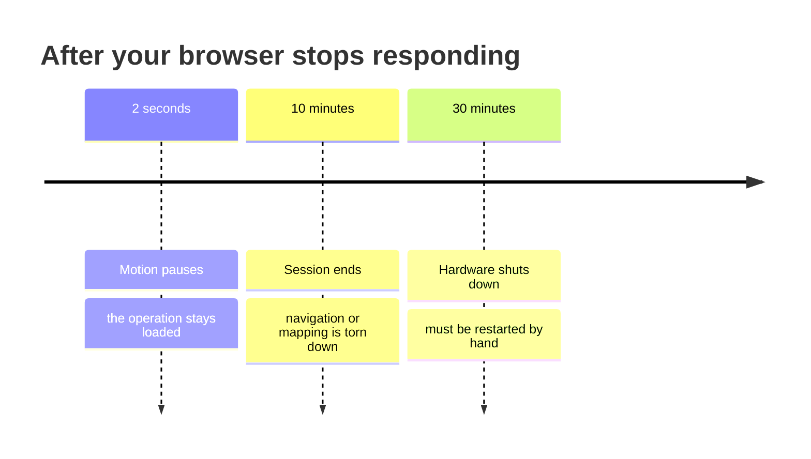
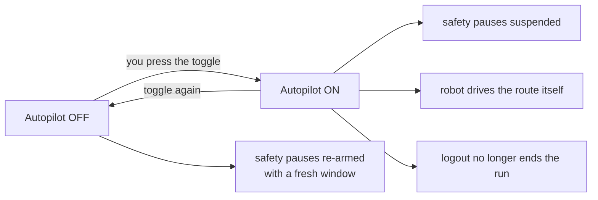
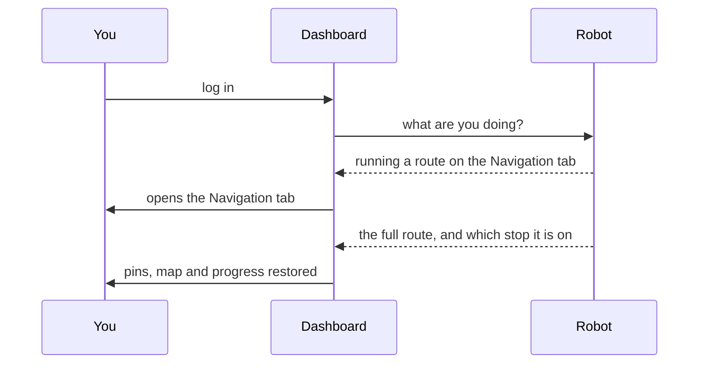

# Bagaimana Robot Berperilaku

<RoleBadge role="user" />

MSD700 melakukan beberapa hal secara mandiri, tanpa diminta: ia berhenti saat Anda menghilang, ia menolak
membiarkan dua orang mengemudikan sekaligus, dan ia mengingat apa yang sedang dilakukannya saat Anda kembali. Tidak
satu pun dari itu bersifat sembarangan, dan mengetahui aturannya membuat perbedaan antara "robotnya melakukan sesuatu yang aneh"
dan "wajar saja begitu."

Halaman ini adalah versi bahasa sederhananya. Detail rekayasanya ada di
[State and Behavior](/id/development/state-and-behavior).

## Apa yang sedang dilakukan robot saat ini

Dashboard selalu menampilkan satu status untuk robot. Berikut yang benar-benar akan Anda lihat.

| Status | Artinya | Normal? |
| --- | --- | --- |
| **Idle** | Tidak ada yang berjalan. Siap menerima perintah. | Ya |
| **Manual** | Anda sedang mengemudikan dengan W-A-S-D. | Ya |
| **On Progress** | Menuju titik tertentu, atau menjalankan rute. | Ya |
| **Arrived** | Mencapai goal, atau menyelesaikan sesi coverage. | Ya |
| **Mapping** | Sedang membangun peta. | Ya |
| **Paused** | Anda menjedanya. Ia melanjutkan dari titik terakhir. | Ya |
| **Robot Stuck** | Seharusnya bergerak namun tidak bergerak. | Lihat [di bawah](#robot-stuck) |
| **Emergency Stopped** | E-Stop sedang diaktifkan. Tidak ada yang bergerak sampai dilepaskan. | Hanya jika Anda yang melakukannya |

::: info Robotnya yang menyimpan status, bukan browser Anda
Setiap status di atas tersimpan pada robot itu sendiri. Itulah sebabnya menutup tab, me-refresh, atau
beralih ke komputer lain tidak menghilangkan operasi Anda, dan itulah sebabnya sakelar toggle pada
panel akan kembali ke apa yang sebenarnya sedang aktif pada robot, bukan apa yang terakhir Anda klik.
:::

## Hanya satu orang yang mengemudikan pada satu waktu

| Yang Anda lihat | Artinya | Yang bisa Anda lakukan |
| --- | --- | --- |
| Tidak ada yang khusus | Unit ini bebas | Kemudikan |
| Lencana **In Use** pada daftar unit | Sesi lain sedang mengemudikan: tab kedua, operator lain, atau dashboard lokal unit itu sendiri | Buka unit, lalu tentukan pilihan pada dialog |
| Dialog **"This unit is already being operated from …"** | Sesi Anda ditolak karena ada pihak lain yang sedang mengemudikan | **Take over control**, atau **Leave it running** |

::: warning Dua sesi tidak bisa mengemudikan bersamaan
Itu memang disengaja. Dua sesi yang masing-masing mengirim perintah ke satu robot akan saling
bertumpang tindih, dan tidak satu pun akan pernah diberi tahu tentang yang lain. Sesi mana pun yang mengambil alih menang, dan yang lain
diberi tahu bahwa ia kehilangan kendali, alih-alih diam-diam mengirim perintah yang tak diterapkan siapa pun.
:::

Kendali adalah **lease** yang harus diperbarui. Jika browser Anda berhenti memperbaruinya, lease itu berakhir sekitar 15
detik kemudian dan unit menjadi bebas untuk orang berikutnya. Itulah yang membuat tab yang crash atau
laptop yang tertutup tidak lagi menahan robot agar tak bisa dipakai siapa pun.

## Apa yang terjadi saat Anda terputus

Robot memantau dashboard Anda. Ketika ia berhenti mendengar kabar dari Anda, tiga hal terjadi dengan
jeda yang semakin meningkat.

| Setelah | Yang terjadi | Pulih sendiri? |
| --- | --- | --- |
| **2 detik** | Robot berhenti bergerak. Apa pun yang sedang dilakukannya tetap tersimpan di bawahnya. | **Ya.** Sambungkan kembali dan ia melanjutkan dari titik berhentinya |
| **10 menit** | Seluruh operasi dibongkar dan robot menjadi idle. | Tidak. Mulai ulang operasinya |
| **30 menit** | Semua perangkat keras mati. | Tidak. Dibutuhkan teknisi atau restart eksplisit |

::: info Halaman mana yang Anda buka itu penting
Jeda 2 detik hanya menghitung waktu ketika halaman yang memegang operasi yang sedang berjalan berhenti merespons.
Duduk di daftar unit, atau di halaman login, tidak dianggap menahan robot yang berjalan: halaman-halaman itu
sengaja dibuat read-only agar meninggalkan dashboard terbuka di suatu tempat tidak pernah dianggap sebagai mengawasi
robot.
:::

### Mematikan jeda dengan sengaja: Autopilot

Autopilot adalah cara Anda mengatakan "saya diizinkan untuk pergi." Dengan mode ini aktif:

- Robot tetap berjalan dengan **tanpa browser yang terhubung sama sekali**.
- Jeda akibat terputus, idle 10 menit, dan shutdown 30 menit semuanya ditangguhkan.
- Robot itu sendiri yang mengambil alih untuk melangkah melalui titik henti Anda, bukan browser yang melakukannya.
- Logout **tidak** menghentikan proses yang berjalan.

::: danger Autopilot berarti robot akan terus bergerak tanpa ada yang mengawasi
Itu memang tujuan utamanya, dan itu pilihan yang tepat untuk rute panjang tanpa pengawasan. Itu
pilihan yang salah untuk apa pun di dekat orang atau di ruang yang belum pernah Anda jalankan sebelumnya. Mematikannya kembali
akan langsung mengaktifkan ulang setiap jeda keselamatan.
:::

::: info Autopilot menjaga robot tetap berjalan; ia tidak mengunci kursi Anda
Lease kendali Anda tetap berakhir setelah 15 detik tanpa diperbarui. Orang lain bisa mengambil unit itu
dan mengambil alih proses yang sedang berjalan. Prosesnya tetap berlanjut baik itu terjadi atau tidak.
:::

## Kembali lagi

Masuk kembali setelah menutup semuanya dan dashboard akan mengembalikan Anda ke kondisi semula.

Robot mengembalikan seluruh operasi: titik henti Anda, sedang di mana posisinya, peta, dan area
coverage apa pun. Tidak satu pun dari itu berasal dari browser Anda, itulah sebabnya semuanya tetap bertahan di komputer yang berbeda.

| Situasi | Yang Anda dapatkan kembali |
| --- | --- |
| Refresh di tengah rute | Semuanya, dan rute berlanjut |
| Menutup tab, membuka yang baru | Semuanya, dan rute berlanjut |
| Login di mesin yang berbeda | Semuanya, dan rute berlanjut |
| Robot sedang dijeda | Semuanya, masih dijeda. Anda tekan play |
| Robot selesai saat Anda tidak ada | Status selesai, bukan proses hantu |

::: info Membuka peta dari halaman Database adalah reset yang disengaja
Itu satu-satunya aksi yang menghapus status sesi saat ini alih-alih memulihkannya. Jika Anda ingin
melanjutkan apa yang sedang berjalan, kembalilah ke unit alih-alih membuka ulang petanya.
:::

## Robot Stuck

Banner ini berarti robot meyakini bahwa dirinya seharusnya bergerak dan ternyata tidak.

| Kapan muncul | Biasanya |
| --- | --- |
| Sebentar, saat belokan tajam | Normal. Abaikan saja |
| Tepat setelah memulai sesi coverage area | Normal. Sedang menghitung jalur sapuan dan bisa memakan waktu hingga satu menit |
| Selama beberapa menit sementara robot jelas tidak bergerak | Halangan nyata, atau kegagalan perencanaan |
| Saat robot terlihat sedang berjalan | Bug. Laporkan, jangan dikerjain sendiri |

Jika tetap muncul selama beberapa menit, periksa feed kamera untuk melihat sesuatu yang menghalangi, lalu lihat
[Troubleshooting](/id/user-guide/troubleshooting).

## Berhenti Darurat

E-Stop bukan perintah biasa dan tidak mengantre di belakang apa pun.

- Ia mengungguli setiap sumber gerakan lain pada robot, sehingga langsung berlaku apa pun
  yang sedang berjalan.
- Ia tetap aktif hingga dilepaskan secara eksplisit.
- Ia selalu tersedia, di setiap halaman, terlepas dari siapa yang memegang kendali.

::: warning Uji sekali di setiap unit baru
Sebaiknya sebelum Anda membutuhkannya, dengan ruang bebas yang jelas di sekitar robot. Sebuah unit bisa terlihat sepenuhnya
terhubung padahal jalur perintahnya rusak di satu arah, dan E-Stop adalah persis hal yang tidak
ingin Anda temukan hal itu di saat genting.
:::

## Terkait

- [Panduan Cepat](/id/user-guide/quick-start)
- [Navigasi](/id/user-guide/navigation)
- [FAQ](/id/user-guide/faq)
- [Troubleshooting](/id/user-guide/troubleshooting)
