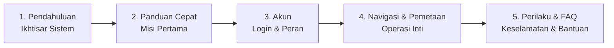

# Panduan Pengguna ROS Web UI

<RoleBadge role="user" />

Selamat datang di **Panduan Pengguna Operator MSD700**. Dokumentasi ini dirancang untuk operator armada, peneliti, dan teknisi lapangan yang menggunakan dashboard web untuk mengendalikan, memetakan, dan mengawasi robot otonom MSD700. Tidak diperlukan pengalaman pemrograman atau robotika.

## Tentang MSD700

**MSD700** adalah robot mobile otonom yang dirancang dan diproduksi oleh **Nakayama Iron Works Ltd.** untuk pemetaan dan navigasi otonom di lingkungan industri.

Dashboard **ROS Web UI** adalah antarmuka operator untuk platform MSD700, dikembangkan oleh **ITB de Labo**. Pusat kendali berbasis web ini memungkinkan Anda memantau, memerintah, dan mengelola operasional robot dari perangkat mana pun yang memiliki browser.

## Apa yang Bisa Anda Lakukan

Dengan ROS Web UI, Anda dapat:

- **Membuat Peta**: Kemudikan robot mengelilingi area baru untuk otomatis membangun denah digital
- **Navigasi**: Klik di mana saja pada peta untuk mengirim robot ke lokasi tersebut dengan penghindaran rintangan otomatis
- **Menyapu Area**: Gambar zona dan perintahkan robot untuk menyapu seluruh ruangan atau koridor secara sistematis
- **Memantau Langsung**: Lihat rekaman kamera robot secara real-time dengan latensi sangat rendah
- **Mengelola Rute**: Simpan jalur yang sering dilalui dan rangkai menjadi playlist misi otomatis
- **Mengelola Armada**: Jika Anda administrator, kelola beberapa robot, operator, dan profil penyewaan
- **Bekerja Offline**: Gunakan dashboard lengkap langsung di Wi-Fi lokal robot tanpa internet

## Cara Menggunakan Panduan Ini

Setiap bagian di bawah menjelaskan satu fitur langkah demi langkah, ditulis untuk penggunaan sehari-hari, bukan untuk developer. Baru mengenal MSD700? Mulai dari **Pendahuluan** dan **Panduan Cepat**. Sudah familiar dengan platformnya? Langsung menuju fitur yang Anda butuhkan.

<LinkCards>
  <LinkCard icon="📖" title="Pendahuluan" details="Pelajari tentang platform MSD700, kemampuan perangkat keras, dan arsitektur cloud." link="/id/user-guide/introduction" />
  <LinkCard icon="🚀" title="Panduan Cepat" details="Instruksi langkah demi langkah untuk masuk, memilih robot, dan menjalankan misi pertama Anda." link="/id/user-guide/quick-start" />
  <LinkCard icon="👥" title="Akun & Akses" details="Masuk, buat akun, dan pahami perbedaan izin operator vs admin." link="/id/user-guide/accounts" />
  <LinkCard icon="🧭" title="Navigasi" details="Kendali manual joystick, mengirim robot ke suatu lokasi, dan misi Autopilot." link="/id/user-guide/navigation" />
  <LinkCard icon="🗺️" title="Pemetaan" details="Buat peta baru dengan mengemudikan robot mengelilingi area. Play, pause, dan simpan." link="/id/user-guide/mapping" />
  <LinkCard icon="🗄️" title="Peta & Database" details="Lihat, cari, ganti nama, dan hapus peta yang tersimpan." link="/id/user-guide/database" />
  <LinkCard icon="📍" title="Rute & Coverage" details="Simpan rute titik-ke-titik dan gambar area untuk penyapuan sistematis." link="/id/user-guide/routes-coverage" />
  <LinkCard icon="📷" title="Kamera Langsung" details="Lihat sudut pandang robot secara real-time dari mana saja." link="/id/user-guide/camera" />
  <LinkCard icon="🤖" title="Bagaimana Robot Berperilaku" details="Pahami watchdog keselamatan, lease operasi, persistensi Autopilot, dan pemulihan sesi." link="/id/user-guide/behavior" />
  <LinkCard icon="🛠️" title="Konsol Admin" details="Untuk manajer armada: tambah operator, kelola penyewaan, dan pantau status armada." link="/id/user-guide/admin-console" />
  <LinkCard icon="❓" title="Tanya Jawab (FAQ)" details="Jawaban untuk pertanyaan operasional umum mengenai baterai, peta, dan konektivitas." link="/id/user-guide/faq" />
  <LinkCard icon="🩹" title="Pemecahan Masalah" details="Solusi cepat untuk gejala umum operator seperti video macet dan goal dibatalkan." link="/id/user-guide/troubleshooting" />
</LinkCards>

## Urutan Baca yang Disarankan

1. **[Pendahuluan](/id/user-guide/introduction)**: Pahami platform, perangkat keras, dan arsitektur cloud
2. **[Panduan Cepat](/id/user-guide/quick-start)**: Masuk dan jalankan misi pertama Anda dalam beberapa menit
3. **[Akun & Akses](/id/user-guide/accounts)**: Siapkan login Anda dan pahami peran operator vs admin
4. **[Navigasi](/id/user-guide/navigation)**: Pelajari cara mengendalikan robot
5. **[Pemetaan](/id/user-guide/mapping)**: Buat peta pertama Anda
6. **[Peta & Database](/id/user-guide/database)**: Kelola peta yang tersimpan
7. **[Rute & Coverage](/id/user-guide/routes-coverage)**: Rencanakan misi otomatis
8. **[Kamera Langsung](/id/user-guide/camera)**: Pantau robot dari jarak jauh
9. **[Bagaimana Robot Berperilaku](/id/user-guide/behavior)**: Pahami jeda keselamatan, lease, dan Autopilot
10. **[Konsol Admin](/id/user-guide/admin-console)**: (Khusus manajer armada) Kelola operator dan unit

## Persyaratan Sistem

- **Browser yang Didukung**: Google Chrome (disarankan) atau Microsoft Edge.
- **Hanya desktop**: Gunakan laptop atau desktop dengan jendela minimal 1366 x 768. Ponsel dan tablet diblokir dengan pemberitahuan satu halaman penuh, dan jendela desktop yang lebih kecil ditutup overlay pemblokir: bilah kendali yang terlihat separuh tidak boleh mengendalikan robot yang sedang aktif.
- **Jaringan**: Akses internet untuk dashboard cloud (`msd.nglobal.jp`), atau koneksi Wi-Fi lokal saat mengoperasikan robot secara offline di lapangan.

## Butuh Bantuan?

- Cek bagian **Pemecahan Masalah** di akhir setiap panduan, atau halaman [Pemecahan Masalah](/id/user-guide/troubleshooting) khusus
- Lihat [FAQ](/id/user-guide/faq)
- Hubungi administrator sistem Anda atau dukungan ITB de Labo

---

**MSD700** adalah produk dari **Nakayama Iron Works Ltd.**
**ROS Web UI** dikembangkan oleh **ITB de Labo**
