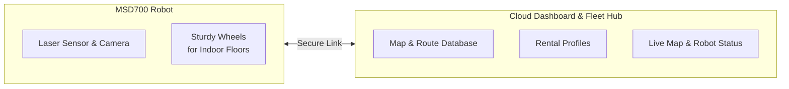

# Pendahuluan MSD700

<RoleBadge role="user" />

## Apa itu MSD700?

**MSD700** adalah robot mobile otonom kelas industri yang dirancang dan diproduksi oleh **Nakayama Iron Works Ltd.** Dashboard **ROS Web UI** yang digunakan untuk mengoperasikannya dikembangkan oleh **ITB de Labo**. Robot ini dirancang khusus untuk melakukan pemetaan lingkungan otonom, navigasi titik-ke-titik, dan coverage area sistematis di lingkungan indoor yang kompleks seperti gudang, koridor kantor, terowongan, dan lantai industri terbuka.

Dilengkapi dengan sensor laser 360 derajat dan kamera, robot ini membangun denah digital yang akurat secara real time saat Anda mengendarainya berkeliling. (Teknik ini disebut SLAM: robot menentukan posisinya sendiri sambil menggambar peta.)

## Kemampuan Utama Operator

1. **Pemetaan**: Kemudikan robot melintasi ruang baru untuk membuat denah digital.
2. **Navigasi Titik-ke-Titik**: Klik di mana saja pada peta untuk mengirim robot ke sana; robot mengelak dari rintangan dengan sendirinya.
3. **Penyapuan Area**: Gambar garis luar ruangan atau koridor dan robot membersihkan atau memindai seluruh zona jalur demi jalur.
4. **Playlist Misi**: Rangkaikan beberapa rute dan zona menjadi satu urutan tanpa pengawasan.
5. **Auto-Align**: Jika posisi robot pada peta terlihat meleset, perbaiki di tempat tanpa memutar robot.
6. **Video Langsung**: Pantau apa yang dilihat robot secara real time.
7. **Operasi Offline**: Tidak ada internet di lokasi? Hubungkan langsung ke Wi-Fi robot dan gunakan dashboard lengkap.

## Arsitektur Sistem untuk Pengguna

Sistem ini terdiri dari dua lapisan utama:

| Lapisan | Komponen | Interaksi Pengguna |
| --- | --- | --- |
| **Dashboard Cloud** | Server Pusat (`https://msd.nglobal.jp`) | Situs web tempat Anda masuk, mengelola peta, menetapkan rute, dan memeriksa semua robot yang disewa. |
| **Robot Fisik (Unit)** | Komputer Onboard | Mesin yang menjalankan perintah Anda. Setiap robot memiliki ID unik dan terhubung secara aman ke cloud. |

## Peran dan Akses Pengguna

Akses ke robot diatur oleh **Profil Penyewaan (Rental Profiles)**:

- **Operator Armada**: Akun pengguna standar yang ditetapkan ke satu atau lebih profil penyewaan. Anda dapat mengemudikan robot yang ditetapkan, merekam peta, membuat rute, dan memeriksa status robot.
- **Administrator Lab**: Mengelola profil penyewaan penyewa, menyediakan akun operator, dan menyetujui pendaftaran perangkat keras robot baru.

## Langkah Selanjutnya

- Lanjutkan ke [Panduan Cepat](/id/user-guide/quick-start) untuk masuk dan mengendalikan robot pertama Anda.
- Jelajahi panduan fitur untuk [Pemetaan](/id/user-guide/mapping), [Navigasi](/id/user-guide/navigation), dan [Rute & Coverage](/id/user-guide/routes-coverage).
- Tinjau [Bagaimana Robot Berperilaku](/id/user-guide/behavior) untuk memahami watchdog keselamatan dan persistensi Autopilot.
