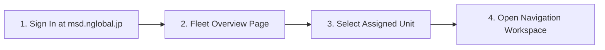
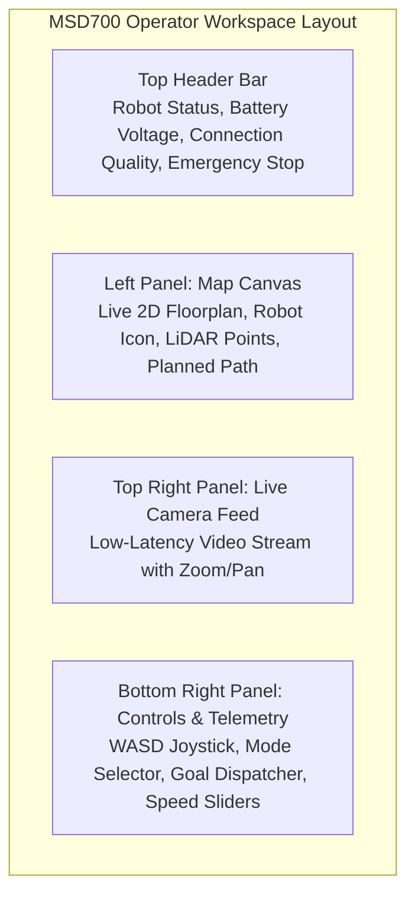
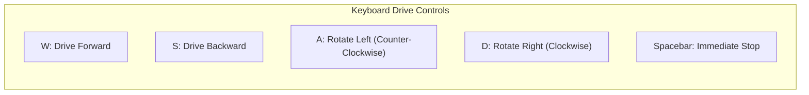
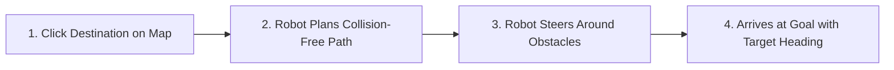

# Panduan Cepat

<RoleBadge role="user" />

Panduan ini memandu Anda melalui proses masuk ke dashboard MSD700, mengambil alih kendali unit robot yang ditetapkan, memuat peta, dan menjalankan misi navigasi pertama Anda.

## Prasyarat

Sebelum memulai, pastikan Anda memiliki:
1. Akun pengguna aktif di dashboard.
2. Setidaknya satu robot yang ditetapkan ke akun Anda oleh administrator.
3. Google Chrome atau Microsoft Edge pada laptop atau komputer desktop.

---

## Langkah 1: Masuk ke Dashboard

1. Buka peramban Anda dan navigasikan ke: `https://msd.nglobal.jp`.
2. Masukkan nama pengguna dan kata sandi Anda, lalu klik **Sign In**.

---

## Langkah 2: Pilih Unit Robot

Setelah masuk, **Fleet Dashboard** menampilkan semua robot yang ditetapkan ke profil penyewaan Anda:

| Lencana Status | Arti | Aksi yang Diizinkan |
| --- | --- | --- |
| <Badge type="tip" text="Online" /> | Robot aktif, terhubung, dan siap menerima perintah. | Klik kartu unit untuk membuka dashboard. |
| <Badge type="warning" text="In Use" /> | Operator lain sedang terhubung aktif. | Anda dapat membuka unit dalam mode lihat saja atau meminta pengambilalihan kendali. |
| <Badge type="danger" text="Offline" /> | Robot mati atau terputus dari jaringan. | Tunggu unit terhubung kembali atau periksa daya perangkat keras. |

Klik kartu robot mana pun yang berstatus **Online** untuk masuk ke ruang kerja kendalinya.

---

## Langkah 3: Memahami Ruang Kerja Operator

Antarmuka operator dibagi menjadi tiga panel operasional utama:

---

## Langkah 4: Memuat Peta

1. Pada header panel kiri, klik dropdown **Select Map**.
2. Pilih peta yang sudah direkam sebelumnya dari daftar (misalnya `Warehouse_Floor_1`).
3. Denah lantai 2D ditampilkan pada kanvas beserta posisi robot saat ini (ikon lingkaran biru dengan panah arah).

::: tip Tidak ada peta yang tersedia?
Jika tidak ada peta dalam dropdown, lihat [Pemetaan](/id/user-guide/mapping) untuk membuat peta pertama Anda.
:::

---

## Langkah 5: Mengendarai Secara Manual (Teleoperasi)

Anda dapat mengendarai robot secara manual menggunakan keyboard atau joystick virtual pada layar:

### Kontrol Teleoperasi:
- **Slider Kecepatan Linear**: Mengatur kecepatan maju maksimum (default: `0.20 m/s`, rentang: `0.05` hingga `0.40 m/s`).
- **Slider Kecepatan Angular**: Mengatur kecepatan putar rotasi (default: `0.40 rad/s`).
- **Joystick Virtual**: Klik dan seret pegangan joystick pada layar ke arah yang diinginkan.

---

## Langkah 6: Mengirim Goal Navigasi (Titik-ke-Titik)

Untuk mengirim robot ke tujuan target secara otonom:

1. Klik tombol **Navigate Goal** pada toolbar kanvas.
2. Klik titik tujuan yang diinginkan pada peta.
3. Klik dan seret ke luar untuk mengatur arah panah heading target, lalu lepaskan.
4. Robot menghitung jalur global bebas tabrakan (garis biru) dan menavigasi secara otonom ke target.

---

## Langkah 7: Berhenti Darurat (E-Stop)

Tombol **Emergency Stop** terletak menonjol di bagian kanan atas setiap halaman:

- **Mengaktifkan E-Stop**: Klik tombol merah **Emergency Stop** (atau tekan tombol `Escape`). Robot langsung mengerem dan menghentikan semua rutinitas otonom.
- **Menghapus E-Stop**: Selesaikan kondisi keselamatan lalu klik **Resume Operations** untuk memulihkan daya motor.

---

## Langkah Selanjutnya

- Pelajari cara melakukan cakupan area sistematis di [Rute & Cakupan](/id/user-guide/routes-coverage).
- Pahami timer keselamatan dan Autopilot di [Bagaimana Robot Berperilaku](/id/user-guide/behavior).
