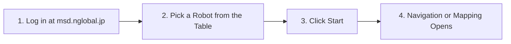
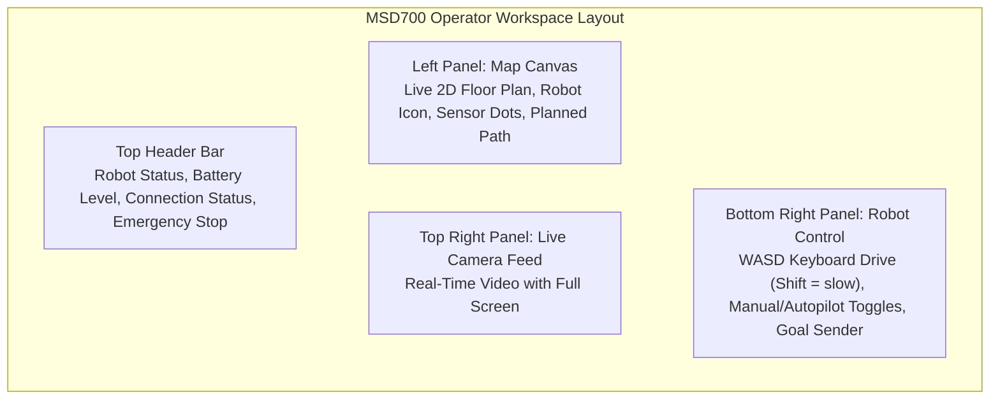
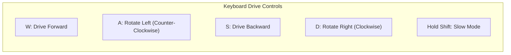
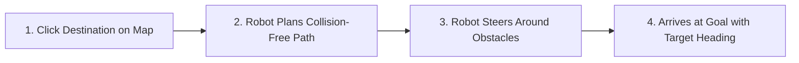

# Panduan Cepat

<RoleBadge role="user" />

Panduan ini memandu Anda melalui proses masuk ke dashboard MSD700, mengambil alih kendali unit robot yang ditetapkan, memuat peta, dan menjalankan misi navigasi pertama Anda.

## Prasyarat

Sebelum memulai, pastikan Anda memiliki:
1. Akun pengguna aktif di dashboard.
2. Setidaknya satu robot yang ditetapkan ke akun Anda oleh administrator.
3. Google Chrome atau Microsoft Edge pada laptop atau komputer desktop.

---

## Langkah 1: Masuk ke Dashboard

1. Buka browser Anda dan navigasikan ke: `https://msd.nglobal.jp`.
2. Masukkan nama pengguna dan kata sandi Anda, lalu klik **Proceed**.

---

## Langkah 2: Pilih Unit Robot

Setelah masuk, sebuah tabel menampilkan semua robot yang ditetapkan ke profil penyewaan Anda:

| Status | Arti | Yang Harus Dilakukan |
| --- | --- | --- |
| **Ready** | Robot terhubung dan bebas. | Pilih barisnya dan klik **Start**. |
| **In Use** | Operator lain sedang mengendalikannya. | Tunggu, atau koordinasikan dengan mereka. |
| **Pinging** | Dashboard masih memeriksa statusnya. | Tunggu beberapa detik; status akan terbarui otomatis. |
| **Not Set** | Robot tidak bisa dijangkau saat ini. | Tunggu hingga terhubung kembali atau periksa daya perangkat keras. |

Pilih baris berstatus **Ready** dan klik **Start**: dashboard akan membuka [Navigasi](/id/user-guide/navigation) (atau [Pemetaan](/id/user-guide/mapping), jika itu yang sedang dilakukan robot).

---

## Langkah 3: Memahami Ruang Kerja Operator

Antarmuka operator dibagi menjadi tiga panel operasional utama:

---

## Langkah 4: Memuat Peta

1. Buka peta dari halaman **Database** (atau pemilih peta di halaman Navigasi).
2. Pilih peta tersimpan (misalnya `Warehouse_Floor_1`).
3. Denah lantai 2D ditampilkan pada kanvas beserta posisi robot saat ini (ikon robot dengan panah arah).

::: tip Tidak ada peta yang tersedia?
Jika tidak ada peta dalam dropdown, lihat [Pemetaan](/id/user-guide/mapping) untuk membuat peta pertama Anda.
:::

---

## Langkah 5: Mengemudikan Secara Manual (Teleoperasi)

Anda mengemudikan robot secara manual dengan keyboard:

### Kontrol Teleoperasi:
- **W / S**: Maju / mundur dengan kecepatan normal (`0.40 m/s`).
- **A / D**: Belok kiri / kanan.
- **Tahan Shift untuk mode lambat**: Gerakan presisi `0.20 m/s` untuk ruang sempit dan pemetaan. Petunjuk di bawah kontrol berbunyi "Drive with W A S D · hold Shift = slow".
- **Lepaskan semua tombol** (atau klik **Stop**) untuk menghentikan robot seketika.

---

## Langkah 6: Mengirim Goal Navigasi (Titik-ke-Titik)

Untuk mengirim robot ke tujuan target secara otonom:

1. Klik **Single Pinpoint** pada toolbar kanvas.
2. Klik titik tujuan yang diinginkan pada peta.
3. Klik dan seret ke luar untuk mengatur arah panah heading target, lalu lepaskan.
4. Robot menghitung jalur global bebas tabrakan (garis biru) dan menavigasi secara otonom ke target.

---

## Langkah 7: Berhenti Darurat (E-Stop)

Tombol **Emergency Stop** terletak menonjol di bagian kanan atas setiap halaman:

- **Mengaktifkan E-Stop**: Klik tombol merah **Emergency Stop**. Robot langsung mengerem dan menghentikan semua rutinitas otonom.
- **Setelah E-Stop**: Dashboard menampilkan halaman **Emergency Stop Activated**. Periksa situasi di lapangan; jika semuanya aman, restart robot dan masuk kembali melalui tombol **Go to LOGIN page** untuk melanjutkan operasi.

---

## Langkah Selanjutnya

- Pelajari cara melakukan coverage area sistematis di [Rute & Coverage](/id/user-guide/routes-coverage).
- Pahami timer keselamatan dan Autopilot di [Bagaimana Robot Berperilaku](/id/user-guide/behavior).
