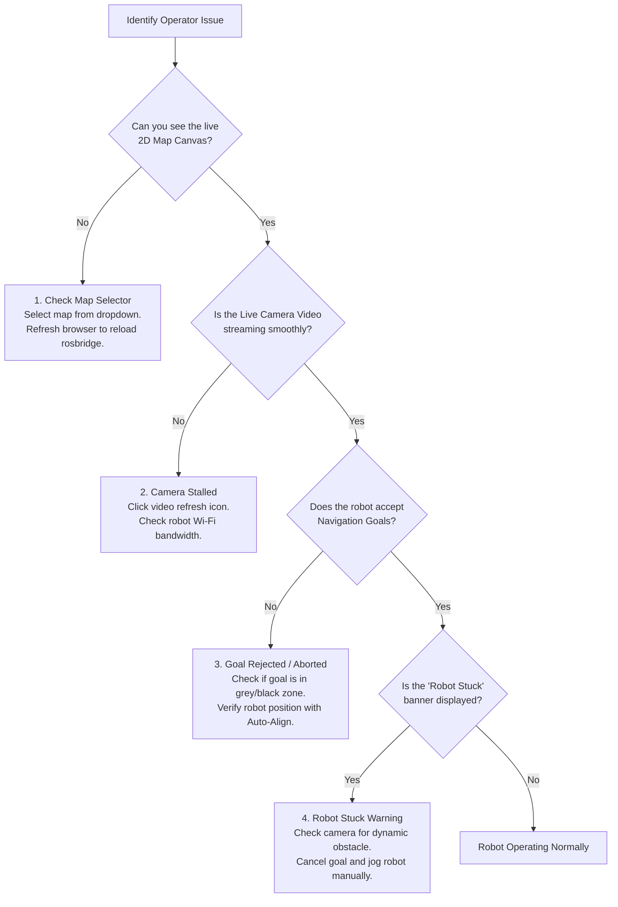

# Panduan Pemecahan Masalah Operator

<RoleBadge role="user" />

Panduan ini menyediakan solusi cepat untuk gejala operasional umum yang ditemui saat mengendalikan robot MSD700 dari dashboard web.

::: info Kepemilikan
Tiga halaman troubleshooting berbagi gejala per peran: halaman ini memegang perbaikan operator (pilih peta, refresh, retry), [Panduan Pemecahan Masalah Teknisi](/id/setup/troubleshooting) memegang perbaikan teknisi, dan [Diagnostik Pengembang](/id/development/troubleshooting-guide) memegang root cause. Bila perbaikan butuh terminal, tempatnya di salah satu halaman itu, ditautkan dari sini.
:::

::: tip Diagnostik Teknis atau Perangkat Keras
Untuk error server tingkat rendah, log kontainer Docker, atau diagnostik driver ROS, lihat [Panduan Pemecahan Masalah Teknisi](/id/setup/troubleshooting) atau [Diagnostik Pengembang](/id/development/troubleshooting-guide).
:::

## Diagram Alur Diagnostik Operator

---

## Masalah Umum dan Solusinya

### 1. Kanvas Peta Kosong atau Loading Spinner Tanpa Henti
- **Gejala**: Halaman navigasi terbuka, tetapi area tengah tetap berupa layar abu-abu gelap dengan loader berputar.
- **Kemungkinan Penyebab**:
  - Belum ada peta aktif yang dipilih untuk unit ini.
  - Koneksi WebSocket peramban ke `rosbridge` sempat terputus sementara.
- **Tindakan Operator**:
  1. Lihat dropdown **Select Map** di kiri atas. Jika menampilkan "No Map Loaded", klik dan pilih peta fasilitas Anda.
  2. Jika peta sudah dipilih tetapi masih kosong, refresh tab peramban Anda (`Ctrl + F5` atau `Cmd + Shift + R`).
  3. Verifikasi bahwa lencana status unit di header menampilkan **Online** (hijau).

---

### 2. Feed Video Kamera Langsung Beku atau Hitam
- **Gejala**: Jendela kamera menampilkan frame beku, roda berputar, atau kotak hitam.
- **Kemungkinan Penyebab**:
  - Kehilangan paket sementara pada tautan Wi-Fi antara robot dan server.
  - Peramban memblokir negosiasi WebRTC ICE.
- **Tindakan Operator**:
  1. Klik ikon kecil **Refresh Stream** di header kamera.
  2. Jika menggunakan Chrome, pastikan akselerasi perangkat keras diaktifkan di pengaturan peramban.
  3. Jika beroperasi di jaringan fasilitas lokal tanpa internet, pastikan Anda terhubung ke Wi-Fi lokal robot dan mengakses `http://<unit-ip>:3000`.

---

### 3. Goal Navigasi Dibatalkan / Robot Menolak Bergerak
- **Gejala**: Anda mengatur 2D Nav Goal atau memulai rute, tetapi robot berbunyi bip dan status langsung berubah dari `On Progress` kembali ke `Idle` atau `Goal Aborted`.
- **Kemungkinan Penyebab**:
  - Titik tujuan berada di dalam dinding hitam, di dalam halangan, atau dalam buffer inflasi mematikan (dalam jarak 0,575 m dari dinding).
  - Robot kehilangan koordinat lokalisasinya terhadap peta.
- **Tindakan Operator**:
  1. Klik goal di ruang kosong terbuka yang luas (area abu-abu terang), jauh dari dinding dan tiang.
  2. Klik tombol **Auto Align** pada toolbar untuk menyinkronkan ulang pemindaian LiDAR robot dengan peta statis.
  3. Jika Auto-Align gagal, kendarai robot maju 0,5 meter secara manual lalu picu ulang Auto-Align.

---

### 4. Banner "Robot Stuck" Tidak Kunjung Hilang
- **Gejala**: Banner kuning kecoklatan (amber) di bagian atas kanvas bertuliskan "Robot Stuck: Recovery in Progress".
- **Kemungkinan Penyebab**:
  - Seseorang, forklift, atau kotak yang baru diletakkan menghalangi jalur trajektori yang direncanakan.
  - Robot mencoba sesi penyapuan cakupan area di koridor sempit yang lebih kecil dari 1,15 meter.
- **Tindakan Operator**:
  1. Periksa feed kamera langsung dan titik LiDAR merah pada kanvas untuk mencari halangan fisik terdekat.
  2. Jika jalur terhalang oleh objek sementara, tunggu 10 detik; perencana lokal secara otomatis mengarahkan robot mengelilingi halangan setelah jalur terbuka.
  3. Jika robot tidak dapat mengatasi kebuntuan itu, klik **Pause / Cancel Goal**, beralih ke **Manual Drive**, dan kendarai robot ke ruang lantai terbuka sebelum melanjutkan.

---

### 5. Kendali Terkunci: "In Use by Another Operator"
- **Gejala**: Anda membuka sebuah robot dan semua tombol kendali dinonaktifkan dengan banner "In Use".
- **Kemungkinan Penyebab**:
  - Akun operator lain di organisasi Anda sedang mengendarai unit ini.
  - Anda meninggalkan tab atau laptop lain terbuka dan masuk ke robot yang sama.
- **Tindakan Operator**:
  1. Jika banner menampilkan nama rekan yang berbeda, koordinasikan dengan mereka sebelum meminta kendali.
  2. Jika banner menampilkan akun Anda sendiri (misalnya dari tab lama), klik tombol **Take Over Control**. Sesi sebelumnya dilepaskan secara mulus dan kendali berpindah ke jendela aktif Anda.

---

### 6. Emergency Stop Aktif
- **Gejala**: Header berkedip merah dengan tulisan "Emergency Stop Engaged" dan semua pergerakan terkunci.
- **Kemungkinan Penyebab**:
  - Seorang operator menekan tombol `Escape` atau mengklik tombol E-Stop pada layar.
  - Seorang teknisi memicu bumper E-Stop perangkat keras fisik pada robot.
- **Tindakan Operator**:
  1. Verifikasi bahwa lingkungan robot fisik sepenuhnya aman.
  2. Jika E-Stop perangkat keras fisik ditekan, putar dan lepaskan tombol perangkat keras pada chassis robot.
  3. Pada dashboard web, klik **Release Emergency Stop** untuk mengaktifkan kembali pengendali motor.

---

## Jalur Eskalasi

Jika langkah-langkah di atas tidak menyelesaikan masalah:
1. Hubungi **Teknisi Lapangan** di lokasi Anda untuk memeriksa daya perangkat keras fisik dan sensor.
2. Berikan ULID robot kepada teknisi (ditampilkan di header dashboard, misalnya `01JZ8P9WZ...`).
3. Arahkan teknisi ke [Panduan Pemecahan Masalah Teknisi](/id/setup/troubleshooting).
