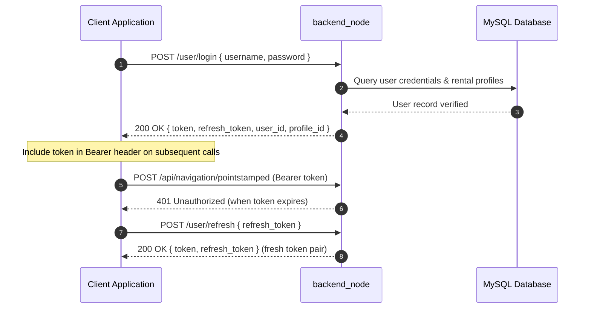
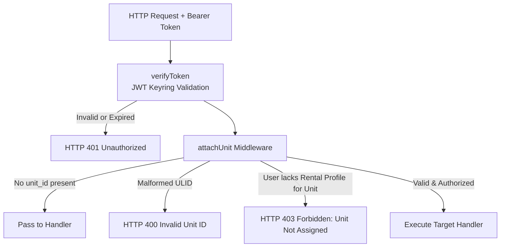

# APIリファレンス

<RoleBadge role="developer" />

このドキュメントは、`backend_node` (Express API サーバー) の完全な REST API リファレンスであり、すべてのエンドポイント、認証メカニズム、リクエスト パラメーター、応答構造、HTTP ステータス コードについて詳しく説明しています。

これらのエンドポイントによってラップされる MQTT ペイロードについては、[メッセージ コントラクト](/ja/development/message-contracts) を参照してください。有限状態マシンについては、[状態と動作](/ja/development/state-and-behavior) を参照してください。システムアーキテクチャについては、「アーキテクチャ」(@@MU3@@)を参照してください。

## API 規約

### ベース URL

|環境 |ベース URL |ルーティングの説明 |
| --- | --- | --- |
| **実稼働サーバー** | `https://msd.nglobal.jp/services/rosbackend` | Apache2 経由で `localhost:5000` にリバース プロキシ接続 |
| **開発サーバー** | `http://<server-ip>:5001` |開発バックエンドコンテナへの直接 HTTP アクセス |
| **ユニット ローカル サーバー** | `http://<unit-ip>:5002` | `backend_local` オンボードの Jetson SBC への直接 HTTP アクセス |

### 認証と認可

すべての保護されたルートには、JSON Web トークン (JWT) を含む HTTP `Authorization` ヘッダーが必要です。

```http
Authorization: Bearer <access_token>
Content-Type: application/json
```

トークンは HS256 を使用して暗号署名され、共有キーリング (`/srv/msd/secrets/jwt_keyring`) に対して検証されます。アクティブな秘密鍵は新しいトークンに署名しますが、最近ローテーションされた鍵は移行猶予期間中は有効のままです。



|トークンの要求 `typ` |範囲と承認 |拒否ルール |
| --- | --- | --- |
| **標準オペレータ** (不在または `operator`) |割り当てられたロボット フリートの操作とマップへの完全なアクセス。 |有効期限が切れているか、無効なシークレットで署名されている場合は拒否されます。 |
| `refresh` | `/user/refresh` 限定で受け付けております。 |標準 API ミドルウェアによって HTTP 401 で拒否されました。
| `admin` |管理ルート（`/admin/api/*`）で受け付けます。 |ユーザーコンテキストが欠如しているため、標準のロボットオペレータールートでは拒否されます。 |

### ユニット認可ミドルウェア (`attachUnit`)

リクエストが特定のロボットをアドレス指定するたびに、リクエスト本文の `unit_id` フィールド (またはクエリ パラメーター) が `attachUnit` ミドルウェアを通じて処理されます。



## 標準応答エンベロープ

### 成功の応答
```json
{
  "success": true,
  "msg": "Command executed successfully.",
  "details": {
    "status": true,
    "message": "Goal published to move_base"
  }
}
```

### エラー応答
```json
{
  "success": false,
  "msg": "Robot rejected command: emergency stop active."
}
```

### 配列/リスト応答
```json
{
  "success": true,
  "data": [
    {
      "id": 1,
      "ulid": "01JZ8QK2H0000000000000MAP",
      "display_name": "Main Warehouse Floor",
      "created_at": "2026-08-15T10:30:00Z"
    }
  ]
}
```

## 認証エンドポイント

### 1. ユーザーログイン
`POST /user/login`

オペレーターアカウントを認証し、アクセス/リフレッシュトークンを発行します。

- **リクエスト本文**:
```json
{
  "username": "operator1",
  "password": "SecurePassword123"
}
```
- **応答 (200 OK)**:
```json
{
  "success": true,
  "token": "eyJhbGciOiJIUzI1NiIs...",
  "refresh_token": "eyJhbGciOiJIUzI1NiIs...",
  "user_id": "01JZ7YV5CQUSER00000000000",
  "role": "operator",
  "profile_id": 4
}
```

### 2. トークンのリフレッシュ
`POST /user/refresh`

有効なリフレッシュ トークンを新しいトークン ペアと交換します。

- **リクエスト本文**:
```json
{
  "refresh_token": "eyJhbGciOiJIUzI1NiIs..."
}
```
- **応答 (200 OK)**:
```json
{
  "success": true,
  "token": "eyJhbGciOiJIUzI1NiIs...",
  "refresh_token": "eyJhbGciOiJIUzI1NiIs..."
}
```

## 部隊管理と艦隊運用

### 1. アクセス可能なユニットをリストする
`GET /api/units`

認証されたユーザーのアクティブなレンタル プロファイルに割り当てられているすべての登録ロボットを返します。

- **ヘッダー**: `Authorization: Bearer <token>`
- **応答 (200 OK)**:
```json
{
  "success": true,
  "data": [
    {
      "unit_id": "01JZ8P9WZ0UNIT00000000000",
      "unit_name": "Unit 01",
      "model": "MSD700",
      "status": "online",
      "is_in_use": false,
      "active_page": "navigation",
      "battery": 94.2
    }
  ]
}
```

### 2. ロボットのハートビート Ping
`POST /api/units/ping`

liveness ハートビートを送信し、オペレーティング リースを更新し、現在のテレメトリを返します。

- **ヘッダー**: `Authorization: Bearer <token>`
- **リクエスト本文**:
```json
{
  "unit_id": "01JZ8P9WZ0UNIT00000000000",
  "session_id": "8b1c3f2a-605d-4871-bc01-e28a9b3d1f04",
  "claim": true,
  "release": false,
  "page": "navigation",
  "force_takeover": false
}
```
- **応答 (200 OK)**:
```json
{
  "success": true,
  "data": {
    "status": true,
    "robot_activity": "navigation_point_published",
    "battery": 91.0,
    "uptime": 128.5,
    "hw_status": "ready",
    "manual_override": false,
    "autopilot": false,
    "in_use": false,
    "origin_conflict": false
  }
}
```

### 3. 緊急停止/一時停止
`POST /api/hardware/emergency`

ハードウェアの緊急停止または動作一時停止を切り替えます。

- **ヘッダー**: `Authorization: Bearer <token>`
- **リクエスト本文**:
```json
{
  "unit_id": "01JZ8P9WZ0UNIT00000000000",
  "action": "activate"
}
```
- **応答 (200 OK)**:
```json
{
  "success": true,
  "msg": "Emergency stop state updated."
}
```

## ナビゲーションとミッションの派遣

### 1. ナビゲーションモードを初期化する
`POST /api/navigation/init`

指定されたマップを使用してロボット上のナビゲーション スタックを起動します。

- **ヘッダー**: `Authorization: Bearer <token>`
- **リクエスト本文**:
```json
{
  "unit_id": "01JZ8P9WZ0UNIT00000000000",
  "map_name": "01JZ8QK2H0000000000000MAP"
}
```

### 2. 派遣のウェイポイント目標
`POST /api/navigation/pointstamped`

単一のターゲット目的地座標をロボットのナビゲーション スタックに送信します。

- **ヘッダー**: `Authorization: Bearer <token>`
- **リクエスト本文**:
```json
{
  "unit_id": "01JZ8P9WZ0UNIT00000000000",
  "X": 5.25,
  "Y": -3.10,
  "Z": 0.0
}
```

### 3. ボストロフェドン地域のカバーを開始する
`POST /api/boustrophedon/init`

定義されたポリゴン境界を越える自律的なバストフェドン スイープ カバレッジを開始します。

- **ヘッダー**: `Authorization: Bearer <token>`
- **リクエスト本文**:
```json
{
  "unit_id": "01JZ8P9WZ0UNIT00000000000",
  "areas": [
    [
      { "x": 0.0, "y": 0.0 },
      { "x": 12.0, "y": 0.0 },
      { "x": 12.0, "y": 6.0 },
      { "x": 0.0, "y": 6.0 }
    ]
  ],
  "exclusions": [
    [
      { "x": 4.0, "y": 2.0 },
      { "x": 6.0, "y": 2.0 },
      { "x": 6.0, "y": 4.0 },
      { "x": 4.0, "y": 4.0 }
    ]
  ]
}
```

## マッピング (SLAM) 操作

### 1. マッピングセッションの開始
`POST /api/mapping/start`

ターゲット ユニットで SLAM (gmapping) モードを開始します。

- **リクエスト本文**: `{ "unit_id": "01JZ8P9WZ0UNIT00000000000" }`

### 2. マッピングを停止してマップを保存する
`POST /api/mapping/stop`

アクティブな占有グリッドを保存し、サムネイル メタデータを生成し、アセットをアップロードします。

- **リクエスト本文**:
```json
{
  "unit_id": "01JZ8P9WZ0UNIT00000000000",
  "display_map_name": "Warehouse Sector 4",
  "homebase_x": 0.0,
  "homebase_y": 0.0
}
```
- **応答 (200 OK)**:
```json
{
  "success": true,
  "request_id": "9b1deb4d-3b7d-4bad-9bdd-2b0d7b3dcb6d",
  "map_ulid": "01JZ8QK2H0000000000000MAP"
}
```

## 地図とルートのデータ管理

### 1. リストマップ
`GET /api/maps?profile_id=4`

- **応答 (200 OK)**:
```json
{
  "success": true,
  "data": [
    {
      "id": 12,
      "ulid": "01JZ8QK2H0000000000000MAP",
      "display_name": "Warehouse Ground Floor",
      "thumbnail_url": "/services/media/thumbnails/01JZ8QK2H0000000000000MAP.png",
      "created_at": "2026-08-10T14:20:00Z",
      "modified_at": "2026-08-10T14:20:00Z"
    }
  ]
}
```

### 2. カスタムウェイポイントルートを保存する
`POST /api/routes`

- **リクエスト本文**:
```json
{
  "profile_id": 4,
  "map_id": "01JZ8QK2H0000000000000MAP",
  "route_name": "Inspection Loop Alpha",
  "route_type": "round-trip",
  "waypoints": [
    { "x": 1.0, "y": 2.0, "yaw": 0.0 },
    { "x": 5.0, "y": 2.0, "yaw": 1.57 }
  ]
}
```

## オートアラインシステム

`POST /api/autoalign/start`

パーティクル フィルターの収束検証と、参照ジオメトリに対する自動方向調整を開始します。

- **リクエスト本文**: `{ "unit_id": "01JZ8P9WZ0UNIT00000000000" }`
- **応答 (200 OK)**:
```json
{
  "success": true,
  "msg": "Auto align algorithm initiated."
}
```

## 関連ドキュメント

- [メッセージ コントラクト](/ja/development/message-contracts): MQTT および ROS トピックのシリアル化形式。
- [状態と動作](/ja/development/state-and-behavior): 詳細なステート マシンと障害遷移。
- [データベース スキーマ](/ja/development/database-schema): MySQL テーブルとエンティティ関係モデル。