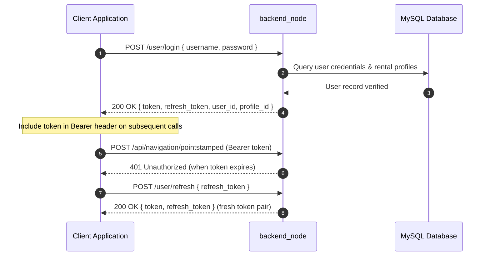
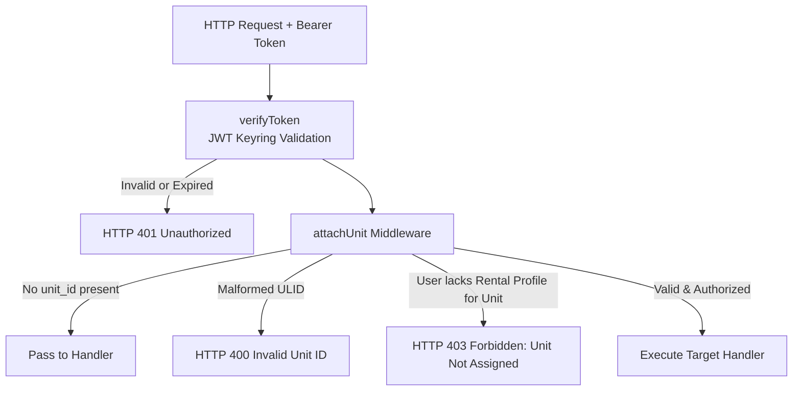

# REST API リファレンス

<RoleBadge role="developer" />

このドキュメントは `backend_node`(Express API サーバー)の完全な REST API リファレンスであり、すべてのエンドポイント、認証メカニズム、リクエストパラメータ、レスポンス構造、HTTP ステータスコードを詳述する。

これらのエンドポイントがラップする MQTT ペイロードについては[メッセージ仕様](/ja/development/message-contracts)を、有限状態機械については[State and Behavior](/ja/development/state-and-behavior)を、システムアーキテクチャについては[アーキテクチャ](/ja/development/architecture)を参照。

## API の規約

### ベース URL

| 環境 | ベース URL | ルーティングの説明 |
| --- | --- | --- |
| **本番サーバー** | `https://msd.nglobal.jp/services/rosbackend` | Apache2 経由で `localhost:5000` へリバースプロキシ |
| **開発サーバー** | `http://<server-ip>:5001` | 開発用バックエンドコンテナへの直接 HTTP アクセス |
| **ユニットローカルサーバー** | `http://<unit-ip>:5002` | Jetson SBC 上の `backend_local` への直接 HTTP アクセス |

### 認証と認可

保護されたルートはすべて、JSON Web Token (JWT) を含む HTTP `Authorization` ヘッダーを要求する:

```http
Authorization: Bearer <access_token>
Content-Type: application/json
```

トークンは HS256 で暗号署名され、共有キーリング(`/srv/msd/secrets/jwt_keyring`)に対して検証される。アクティブな秘密鍵が新しいトークンに署名する一方、直近でローテーションされた鍵も移行猶予期間中は有効なままとなる。



| トークンクレーム `typ` | スコープと受理条件 | 拒否ルール |
| --- | --- | --- |
| **Standard Operator**(不在または `operator`) | 割り当てられたロボット群の運用とマップへのフルアクセス。 | 期限切れ、または無効な秘密鍵で署名されている場合は拒否。 |
| `refresh` | `/user/refresh` でのみ受理。 | 標準の API ミドルウェアは HTTP 401 で拒否。 |
| `admin` | 管理系ルート(`/admin/api/*`)で受理。 | ユーザーコンテキストを持たないため、標準のロボットオペレータールートでは拒否。 |

### ユニット認可ミドルウェア(`attachUnit`)

リクエストが特定のロボットを対象とする場合、リクエストボディ(またはクエリパラメータ)内の `unit_id` フィールドは `attachUnit` ミドルウェアを通じて処理される:



## 標準レスポンスエンベロープ

### 成功レスポンス
```json
{
  "success": true,
  "msg": "Command executed successfully.",
  "details": {
    "status": true,
    "message": "Goal published to move_base"
  }
}
```

### エラーレスポンス
```json
{
  "success": false,
  "msg": "Robot rejected command: emergency stop active."
}
```

### 配列 / リストレスポンス
```json
{
  "success": true,
  "data": [
    {
      "id": 1,
      "ulid": "01JZ8QK2H0000000000000MAP",
      "display_name": "Main Warehouse Floor",
      "created_at": "2026-08-15T10:30:00Z"
    }
  ]
}
```

## 認証エンドポイント

### 1. ユーザーログイン
`POST /user/login`

オペレーターアカウントを認証し、アクセストークン/リフレッシュトークンを発行する。

- **リクエストボディ**:
```json
{
  "username": "operator1",
  "password": "SecurePassword123"
}
```
- **レスポンス (200 OK)**:
```json
{
  "success": true,
  "token": "eyJhbGciOiJIUzI1NiIs...",
  "refresh_token": "eyJhbGciOiJIUzI1NiIs...",
  "user_id": "01JZ7YV5CQUSER00000000000",
  "role": "operator",
  "profile_id": 4
}
```

### 2. トークンリフレッシュ
`POST /user/refresh`

有効なリフレッシュトークンを新しいトークンペアと交換する。

- **リクエストボディ**:
```json
{
  "refresh_token": "eyJhbGciOiJIUzI1NiIs..."
}
```
- **レスポンス (200 OK)**:
```json
{
  "success": true,
  "token": "eyJhbGciOiJIUzI1NiIs...",
  "refresh_token": "eyJhbGciOiJIUzI1NiIs..."
}
```

## ユニット管理とフリート運用

### 1. アクセス可能なユニットの一覧取得
`GET /api/units`

認証済みユーザーのアクティブなレンタルプロファイルに割り当てられた、登録済みロボットをすべて返す。

- **ヘッダー**: `Authorization: Bearer <token>`
- **レスポンス (200 OK)**:
```json
{
  "success": true,
  "data": [
    {
      "unit_id": "01JZ8P9WZ0UNIT00000000000",
      "unit_name": "Unit 01",
      "model": "MSD700",
      "status": "online",
      "is_in_use": false,
      "active_page": "navigation",
      "battery": 94.2
    }
  ]
}
```

### 2. ロボットハートビート Ping
`POST /api/units/ping`

生存確認のハートビートを送信し、運用リースを更新し、現在のテレメトリを返す。

- **ヘッダー**: `Authorization: Bearer <token>`
- **リクエストボディ**:
```json
{
  "unit_id": "01JZ8P9WZ0UNIT00000000000",
  "session_id": "8b1c3f2a-605d-4871-bc01-e28a9b3d1f04",
  "claim": true,
  "release": false,
  "page": "navigation",
  "force_takeover": false
}
```
- **レスポンス (200 OK)**:
```json
{
  "success": true,
  "data": {
    "status": true,
    "robot_activity": "navigation_point_published",
    "battery": 91.0,
    "uptime": 128.5,
    "hw_status": "ready",
    "manual_override": false,
    "autopilot": false,
    "in_use": false,
    "origin_conflict": false
  }
}
```

### 3. 緊急停止 / 一時停止
`POST /api/hardware/emergency`

ハードウェア緊急停止または動作の一時停止を切り替える。

- **ヘッダー**: `Authorization: Bearer <token>`
- **リクエストボディ**:
```json
{
  "unit_id": "01JZ8P9WZ0UNIT00000000000",
  "action": "activate"
}
```
- **レスポンス (200 OK)**:
```json
{
  "success": true,
  "msg": "Emergency stop state updated."
}
```

## ナビゲーションとミッション送出

### 1. ナビゲーションモードの初期化
`POST /api/navigation/init`

指定されたマップでロボット上のナビゲーションスタックを起動する。

- **ヘッダー**: `Authorization: Bearer <token>`
- **リクエストボディ**:
```json
{
  "unit_id": "01JZ8P9WZ0UNIT00000000000",
  "map_id": "01JZ8QK2H0000000000000MAP"
}
```

マップは、このユニットが記録し、かつ呼び出し元が参加しているレンタル内のものでなければならない。呼び出し元からは見えていても**別の**ロボットに属するマップを指定すると、`404` と `"That map does not belong to this unit"` で拒否される。2026-09-10 以前はこのチェックがなく、そのままロボットへ転送されていた。その結果ロボットは一度もアップロードしたことのないマップファイルを取得しようとし、ナビゲーションは立ち上がらず、失敗はユニット側のログにしか現れなかった一方で、ダッシュボードにはすでに起動成功と表示されていた。

### 2. ウェイポイントゴールの送出
`POST /api/navigation/pointstamped`

単一の目標座標をロボットのナビゲーションスタックへ送信する。

- **ヘッダー**: `Authorization: Bearer <token>`
- **リクエストボディ**:
```json
{
  "unit_id": "01JZ8P9WZ0UNIT00000000000",
  "X": 5.25,
  "Y": -3.10,
  "Z": 0.0
}
```

### 3. ブストロフェドン範囲カバレッジの開始
`POST /api/boustrophedon/init`

定義されたポリゴン境界に対して、自律的なブストロフェドン網羅走行を起動する。

- **ヘッダー**: `Authorization: Bearer <token>`
- **リクエストボディ**:
```json
{
  "unit_id": "01JZ8P9WZ0UNIT00000000000",
  "areas": [
    [
      { "x": 0.0, "y": 0.0 },
      { "x": 12.0, "y": 0.0 },
      { "x": 12.0, "y": 6.0 },
      { "x": 0.0, "y": 6.0 }
    ]
  ],
  "exclusions": [
    [
      { "x": 4.0, "y": 2.0 },
      { "x": 6.0, "y": 2.0 },
      { "x": 6.0, "y": 4.0 },
      { "x": 4.0, "y": 4.0 }
    ]
  ]
}
```

## マッピング (SLAM) 操作

### 1. マッピングセッションの開始
`POST /api/mapping/start`

対象ユニットで SLAM (gmapping) モードを開始する。

- **リクエストボディ**: `{ "unit_id": "01JZ8P9WZ0UNIT00000000000" }`

### 2. マッピングの停止とマップの保存
`POST /api/mapping/stop`

アクティブな占有格子地図を保存し、サムネイルのメタデータを生成し、アセットをアップロードする。

- **リクエストボディ**:
```json
{
  "unit_id": "01JZ8P9WZ0UNIT00000000000",
  "display_map_name": "Warehouse Sector 4",
  "homebase_x": 0.0,
  "homebase_y": 0.0
}
```
- **レスポンス (200 OK)**:
```json
{
  "success": true,
  "request_id": "9b1deb4d-3b7d-4bad-9bdd-2b0d7b3dcb6d",
  "map_ulid": "01JZ8QK2H0000000000000MAP"
}
```

## マップとルートのデータ管理

### 1. マップ一覧の取得
`GET /api/maps_data?unit_id=<unit ULID>`

`unit_id` はワイヤー上は任意だが、オペレーターが目にするものに関しては実質的に必須である。指定しない場合、レスポンスは呼び出し元のレンタルスコープ内の全マップとなり、これはアーカイブ画面や管理画面が求める挙動である。指定した場合はそのロボットが記録したマップに絞り込まれ、これが Database ページに必要な挙動となる。1つのレンタルに複数台のロボットが紐づくことがあり、兄弟機が記録したマップは、このロボットではナビゲーションに使用できない。呼び出し元がアクティブなレンタルを持たないユニットを指定した場合は、空リストではなく `403` が返る。`GET /api/maps/:mapId` も同じパラメータを受け取り、同じスコープが適用される。

- **レスポンス (200 OK)**:
```json
{
  "success": true,
  "data": [
    {
      "id": "01JZ8QK2H0000000000000MAP",
      "map_name": "Warehouse Ground Floor",
      "unit_id": "01JZ7K3M9QA0B1C2D3E4F5G6H7",
      "unit_name": "unit1",
      "created_by_username": "operator1",
      "modified_by_username": "operator1",
      "created_at": "2026-08-10T14:20:00Z",
      "modified_at": "2026-08-10T14:20:00Z",
      "homebase_x": 0.0,
      "homebase_y": 0.0
    }
  ]
}
```

::: warning マップ名の一意性は (ユニット, レンタル) 単位でしかない
1つのレンタルに紐づく2台のロボットが、それぞれ `hazard test` という名前のマップを持つことがあり、これらは ULID の異なる別々のマップである。マップ一覧を名前で重複排除してはならない。2件目を捨てると実在するマップが失われ、隣のロボットのものだけが残ってしまい、その名前を開くと、このロボットでは読み込めない ULID に解決されてしまう。重複排除は `id` で行い、スコープは `unit_id` で絞ること。
:::

### 2. カスタムウェイポイントルートの保存
`POST /api/routes`

- **リクエストボディ**:
```json
{
  "profile_id": 4,
  "map_id": "01JZ8QK2H0000000000000MAP",
  "route_name": "Inspection Loop Alpha",
  "route_type": "round-trip",
  "waypoints": [
    { "x": 1.0, "y": 2.0, "yaw": 0.0 },
    { "x": 5.0, "y": 2.0, "yaw": 1.57 }
  ]
}
```

## Auto Align システム

`POST /api/autoalign/start`

パーティクルフィルタの収束検証と、参照ジオメトリに対する自動姿勢合わせを開始する。

- **リクエストボディ**: `{ "unit_id": "01JZ8P9WZ0UNIT00000000000" }`
- **レスポンス (200 OK)**:
```json
{
  "success": true,
  "msg": "Auto align algorithm initiated."
}
```

## 関連ドキュメント

- [メッセージ仕様](/ja/development/message-contracts): MQTT および ROS トピックのシリアライズ形式。
- [State and Behavior](/ja/development/state-and-behavior): 詳細な状態機械と失敗時の遷移。
- [データベース設計](/ja/development/database-schema): MySQL テーブルとエンティティ関係モデル。
