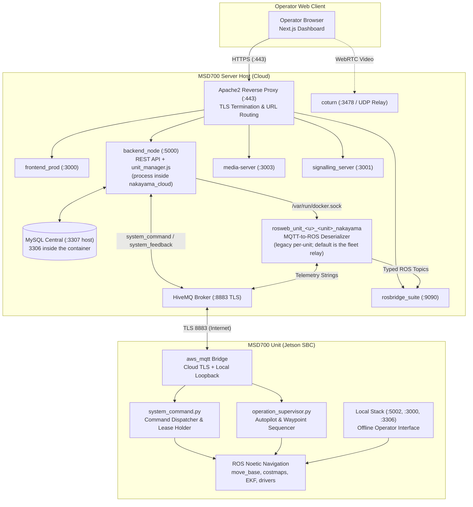
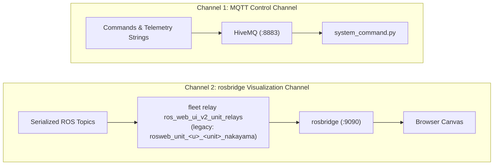
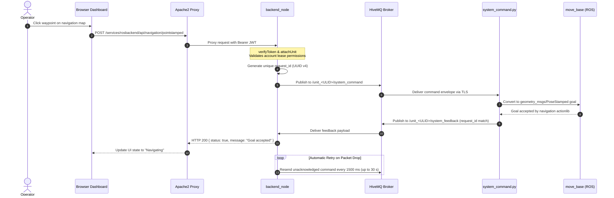
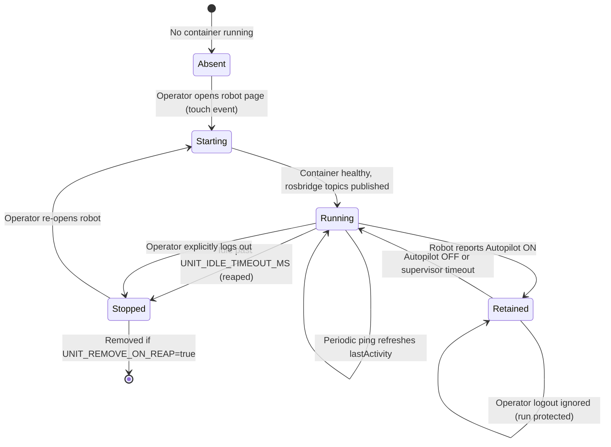
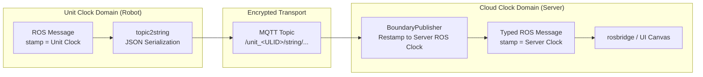
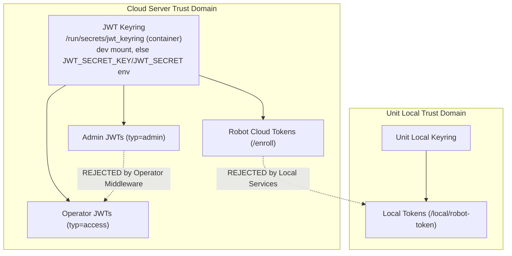
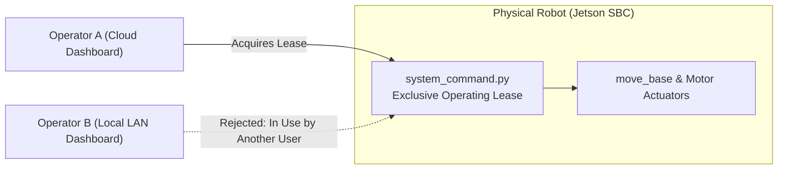

# アーキテクチャ

<RoleBadge role="developer" />

このドキュメントは MSD700 自律ロボティクスプラットフォームのアーキテクチャ設計を詳述し、コンポーネント同士がどう相互作用するか、コンポーネント間のデータ境界、そして各サブシステムの背後にあるエンジニアリング上の根拠を説明します。

リポジトリの場所については [リポジトリ構成](/ja/development/repository-structure) を、正確なデータペイロードについては [メッセージ仕様](/ja/development/message-contracts) を、有限状態機械については [State and Behavior](/ja/development/state-and-behavior) を、デプロイトポロジーについては [System Setup](/ja/setup/system-setup) を参照してください。

## 2マシンモデル

MSD700 における中心的なアーキテクチャ上の決定は、**ユニット(物理ロボット)が完全なローカルサーバースタックを実行する**一方で、**MSD700 サーバー(クラウド)**がフリート全体の中央管理スタックを実行する、というものです。両者は同一のデータ構造を共有するピアであり、暗号化された MQTT トランスポートで接続されています。

| 軸 | MSD700 ユニット(ロボット) | MSD700 サーバー(クラウド) |
| --- | --- | --- |
| **実行内容** | ROS 1 Noetic の bringup、move_base、gmapping、センサードライバー、加えて `backend_local`、`db_local`、`mosquitto_local`、`frontend_local`。 | 中央の `backend_node`、`db`(MySQL)、`hivemq`(MQTT ブローカー)、`rosbridge`、`signalling_server`、`media-server`、`frontend_prod`。 |
| **権限** | 稼働中の物理ロボット、センサー読み取り値、ローカルの operation lease、生のマップ記録を所有する。 | ユーザーアカウント、認証キーリング、レンタルプロファイル、ロボット登録レジストリ、フリート全体で同期されたマップ/ルートを所有する。 |
| **耐障害性** | インターネットまたは Wi-Fi 接続が完全に失われている間も自律的にオフラインで動作する。 | ロボットのシャットダウン、ネットワーク切断、再起動を経てもフリートのメタデータを失わずに存続する。 |
| **制約** | 自身のグローバルなアイデンティティを割り当てることはできない(初回のクラウド登録が必要)。 | アクティブなロボット接続なしに物理ロボットを動かすことはできない。 |

::: tip コア設計原則: オフラインキャッシュとしてのローカル
ユニットのローカルスタックは**クラウドのオフラインファーストなキャッシュであり、孤立したサイロではありません**。登録済みのユニットは、アクティブなインターネット接続なしに無期限に機能します。ネットワーク接続が復旧すると、記録されたマップ、実行されたルート、設定状態は自動的にクラウドへ同期し返されます。
:::

## コンポーネント概要

| コンポーネント | 技術 | 責務 | ホストの場所 |
| --- | --- | --- | --- |
| **フロントエンドダッシュボード** | Next.js、React、TypeScript | マップキャンバス、テレメトリウィジェット、手動テレオペ、ナビゲーションコントロールを備えたシングルページのオペレーターインターフェース。 | `ROS-dashboard-next-ts`(クラウドでは `frontend_prod`/`frontend_dev`、ユニットでは `frontend_local` としてビルド) |
| **backend_node** | Node.js、Express | 認証ミドルウェア、マップ/ルート/エリア/プレイリストの CRUD、ロボットコマンドのディスパッチ、同期の調整。 | `nakayama_cloud` サービス内のプロセス(`ros-web-ui/source/dependencies/ROS-dashboard-backend`) |
| **multi_unit.py / cloud_multi.launch** | Python、ROS 1 Noetic | `/unit_<ULID>/...` 名前空間を介して、単一の統合 ROS ランタイム内ですべてのロボットにサービスを提供する、マルチユニット・テンプレート化リレーノード。 | フリートリレーコンテナ(`ros_web_ui_v2_unit_relays[_dev]`)。コードデプロイがフリート全体のデータプレーン障害にならないよう、意図的にバックエンドから分離されている | 
| **gen_bridge_params.py / nakayama_cloud_multi.launch** | Python、ROS 1 Noetic | MQTT ブリッジのトピックマップをユニットのロスターにわたって展開し、1つの `mqtt_client` nodelet と1つの TLS 接続がフリート全体にサービスを提供できるようにする。 | フリートリレーコンテナ(`ros_web_ui_v2_unit_relays[_dev]`) |
| **unit_manager.js(レガシー)** | Node.js(Docker API) | (非推奨)ロボット1台につき1コンテナをインスタンス化していたレガシーな動的コンテナマネージャー。単一 ROS ランタイムのマルチユニットリレーに置き換えられた。 | `backend_node` に組み込み |
| **rosbridge** | `rosbridge_suite`(WebSocket) | port 9090(開発9091)経由で、すべてのユニットのライブ ROS トピックをブラウザキャンバスへストリーミングする統合 WebSocket ブリッジ。 | `nakayama_cloud` コンテナ内およびユニットのローカルスタック |
| **HiveMQ(MQTT)** | HiveMQ CE(Java) | port 8883(TLS)経由でロボットとサーバーを接続する、暗号化された高スループットのメッセージブローカー。 | サーバーコンテナ(`hivemq` / `hivemq_dev`) |
| **MySQL データベース** | MySQL 8.0 | ユーザーアカウント、レンタルプロファイル、登録済みユニットレコード、ルートジオメトリ、カスタムエリア境界、同期ジャーナルを保存する。 | サーバー(`db` / `db_dev`)およびユニット(`db_local`) |
| **media-server** | Node.js、Express | マップアセットのアップロード、サムネイル生成を管理し、静的な `.pgm` および `.yaml` マップファイルを配信する。 | サーバーコンテナおよびユニットコンテナ(`media_local`) |
| **signalling_server** | Node.js(WebSocket) | ロボットカメラとオペレーターのブラウザ間の直接ビデオストリーミングを仲介する WebRTC ピアネゴシエーションサーバー。 | サーバーコンテナ(`signalling`)およびユニットコンテナ(`signalling_local`) |
| **coturn** | Coturn(C) | NAT トラバーサルが直接のピアツーピア WebRTC ビデオを妨げる際のメディアフォールバックを提供する、RFC 5766 TURN / STUN リレーサーバー。 | コンテナ化された`coturn`サービス(`ros_web_ui_v2_coturn`、`network_mode: host`、本番専用プロファイル)：コンテナ切り替え前はsystemdサービスがこの役割を担っていた |
| **Apache2** | Apache HTTP Server | TLS 終端、セキュリティヘッダーの処理、`/services/...` パス経由のすべての公開トラフィックのルーティングを担当する。 | サーバーホスト(ネイティブサービス) |
| **ROS ロボットパッケージ** | C++、Python、ROS 1 Noetic | `msd700_robot`(ナビゲーション、SLAM、ボウストロフェドン・カバレッジ、EKF、センサードライバー)と `ros-web-ui` のブリッジパッケージ(`topic2string`、`system_command`、`operation_supervisor`)。 | Jetson SBC(`msd700` コンテナ) |

## システムトポロジーとデータフロー

### アーキテクチャ上の主要ルール:
1. **単一の公開入り口としての Apache**: すべての HTTP および WebSocket リクエストは Apache の port 443 を通って入ります。バックエンドサービスは内部ポートまたはループバックアドレスにバインドします。ロボットが直接到達する唯一の外部ポートは、port 8883(TLS)の HiveMQ です。
2. **コマンドは ROS ではなく MQTT 経由で流れる**: `backend_node` がディスパッチするコマンドは `/unit_<ULID>/system_command` MQTT トピックに乗り、`/unit_<ULID>/system_feedback` 経由で確認応答されます。クラウド上の ROS トピックは、ブラウザのマップキャンバスとテレメトリ表示に供給するためだけに存在します。
3. **デシリアライザーとしてのユニット単位コンテナ**: コンテナ `rosweb_unit_<u>_<unit>_nakayama`(レガシーなユニット単位の経路。フリートのデフォルト`ros_web_ui_v2_unit_relays`が代わりに全ユニットにサービス提供する)はオンデマンドで実行され、MQTT からの JSON/文字列ペイロードをネイティブな ROS メッセージ(`nav_msgs/OccupancyGrid`、`geometry_msgs/PoseStamped`、`sensor_msgs/LaserScan`)へ変換し戻すことで、`rosbridge` がそれをダッシュボードへストリーミングできるようにします。

## 2つの診断チャネル

このプラットフォームは、それぞれ独立して障害を起こす2つの別々の通信チャネルを使用します。

| チャネル | トランスポート | 運ばれるデータ | 障害時の症状 |
| --- | --- | --- | --- |
| **MQTT** | TCP / TLS(8883) | コマンド、確認応答、ポーズ文字列、ステータス ping。 | コンソール上でロボットが**オフライン**と表示される。コマンドは即座に HTTP 504 で失敗する。 |
| **rosbridge** | WebSocket(WSS) | 型付き ROS メッセージ(`/map`、`/robot_pose`、`/scan`、`/global_plan`)。 | ロボットは**オンライン**と表示されコマンドも受け付けるが、マップキャンバスは空のまま。 |
| **ユニットリレーコンテナ** | サーバー上の Docker | MQTT 文字列を型付き ROS トピックへ変換して rosbridge へ渡す。 | ロボットはオンラインで rosbridge も接続されているが、フリートリレーがダウンしている。あるいはレガシーなユニット単位の経路では `rosweb_unit_<u>_<unit>_nakayama` が停止または非アクティブによって reap されている。ため、キャンバスは空のまま。 |

## エンドツーエンドのコマンド実行フロー

オペレーターがロボットに指示を出す場合(例: マップ上のウェイポイントをクリックする):

### 重要な実装の詳細:
- **HTTP レスポンスはロボットの状態を反映する**: `backend_node` は、一致する `request_id` を持つ `system_feedback` がロボットから届くまで HTTP 接続を開いたまま保持します。504 Gateway Timeout ステータスは、ロボットがそのコマンドを一度も処理しなかったことを意味します。
- **選択的なコマンドリトライ**: 状態を変更するコマンド(ナビゲーションゴール、モード切替、E-Stop)は、確認応答されるまで1500ミリ秒ごとにリトライされます。ハートビート ping は**決してリトライされません**。ping の欠落こそが、セーフティウォッチドッグがゼロツイストの緊急停止を開始するために使う正確なシグナルだからです。

## ユニット単位コンテナのライフサイクル

::: info フリートリレーがデフォルト
マルチユニットのテレメトリは、名前空間化されたトピック(`/unit_<ULID>/...`)とテンプレート化されたリレー(`multi_unit.py` / `cloud_multi.launch`、および MQTT 側の `nakayama_cloud_multi.launch`)を通じて、フリート全体にサービスを提供する単一の**フリートリレー**コンテナによって処理されます。そのロスターは `units` テーブルから得られるため、ロボットを登録することだけが、それを到達可能にするために必要なことです。下記のユニット単位の経路は依然として提供されており、環境変数1つで切り替えられますが、この2つを同じユニットに対して同時に実行してはいけません。[ユニットコンテナライフサイクル](/ja/development/unit-container-lifecycle#フリートリレー-すべてのユニットに1つのコンテナ) を参照してください。
:::

ユニット単位の経路では、`backend_node` 内部の `unit_manager.js` が `/var/run/docker.sock` 経由で、アクティブなユニットごとに1つのコンテナを動的に管理します。

| 設定変数 | デフォルト値 | 説明 |
| --- | --- | --- |
| `UNIT_MANAGER_ENABLED` | `true`(サーバー)、`false`(ユニット) | 動的コンテナ管理がアクティブかどうかを制御する。 |
| `UNIT_IMAGE` | `ros-noetic-webui-app-v2:latest`(dev では `:dev`) | ユニットリレー用にインスタンス化される Docker イメージ。 |
| `UNIT_IDLE_TIMEOUT_MS` | `1800000`(30分) | コンテナが reap されるまでのオペレーター非アクティブ時間。 |
| `UNIT_REAP_INTERVAL_MS` | `60000`(1分) | バックグラウンドリーパー掃引の頻度。 |
| `UNIT_REMOVE_ON_REAP` | `false` | true の場合コンテナを削除し、false の場合は停止状態を保持する。 |
| `UNIT_MODE` | `prod`(または `dev`) | ポートオフセットを選択する(クラウドROS master 11311/11312、rosbridge 9090/9091)。ユニット自身のroscoreは11321/11322であり、これらではない。 |

::: warning Autopilot 保持ガード
ロボットが **Autopilot モード**で自律ミッションを実行している間、そのリレーコンテナは **Retained** 状態に入ります。Retained 状態のコンテナはアイドルタイムアウトの対象外となり、オペレーターがログアウトしたりブラウザを閉じたりしても終了されず、継続的なミッション監視が保証されます。
:::

## クロックドメイン境界と時刻同期

ロボットのオンボードコンピュータとクラウドサーバーは、それぞれ独立したシステムクロックを持つ別々の ROS master インスタンスを実行します。タイムスタンプの乖離を防ぐため、MQTT を跨ぐすべてのジオメトリックメッセージは、`BoundaryPublisher` によって ingress 時にローカルの ROS 時刻へ再スタンプされます。

::: danger クロックの再スタンプが必須である理由
時刻の再スタンプを省略すると、RViz や Web レンダラーで即座に `TF_OLD_DATA` 警告が発生します。さらに、アクティブな `/clock` ジェネレーターなしにあるマスター上で `/use_sim_time` が有効になっている場合、TF ツリーの評価は完全にフリーズします。
:::

## マルチティア・トラストドメインとセキュリティ

MSD700 アーキテクチャは、3つの異なるセキュリティトラストドメインを強制します。あるドメイン内で発行された資格情報は、他のドメインによって厳格に拒否されます。

1. **オペレータートークン**: コンテナ内の`/run/secrets/jwt_keyring`にあるキーリングに対して検証される標準の HS256 JWT(`typ=access`)(devサービスでは`${SECRETS_DIR:-/srv/msd/secrets}/jwt_keyring.dev.json`からマウント。本番では`JWT_SECRET_KEY`/`JWT_SECRET`にフォールバック)。トークンにはユーザー ID とアカウントスコープが含まれます。管理者トークン(`typ=admin`)は標準のロボット操作ルートによって拒否されます。
2. **ロボットクラウドトークン**: 物理ロボットの登録時に生成されたデバイスシークレットを使って `/enroll/token` によって発行されます。有効期間は12時間(`ACCESS_TOKEN_TTL`)で、システム起動のたびに更新されます。リフレッシャーと起動時のアイデンティティ解決器は**同じ**バックエンド(`run_msd.sh` の `ENROLL_BASE_URL`)を対象とします。バックグラウンドのリフレッシュ中に発生した `401 reenroll` はログに記録されるだけで、`device.json` には一切触れません。
3. **ユニットローカルトークン**: Jetson コンピュータ上の `backend_local` によってローカルに発行されます。クラウド署名済みのトークンは、ネットワーク分断中の完全なローカル自律性を確保するため、ローカルエンドポイントによって意図的に拒否されます。

## Operating Lease: マルチオペレーター競合の防止

ロボットはクラウド Web インターフェースとオンボードのローカルネットワークダッシュボードの両方からアクセスできるため、物理ロボットは単一の**Operating Lease**を強制します。

- リースは(`system_command.py` 内部の)**ロボット**上で保持され、サーバーのバックエンド上では保持されません。
- オペレーターがロボットダッシュボードを開くと、クライアントはハートビート ping によって継続的に更新される15秒のリースを取得します。
- 2人目のオペレーターがコマンドの送信を試みると、ロボットは `In Use` ステータスを返します。テイクオーバーには、元のオペレーターによる明示的な確認、またはリースの失効が必要です。

## 状態の所有権と永続化のマトリクス

MSD700 のコアとなるアーキテクチャ原則: **物理ロボットが唯一絶対の信頼できる情報源です**。トグル、リース、運用上の進捗は、ロボットのコンピュータ(`system_command.py` と `operation_supervisor.py`)上に存在し、ブラウザタブのクローズ、サーバーの再起動、ネットワークの切断を経ても生き残ります。

| 状態ドメイン | 主たる所有者 | 永続化の範囲 | 読み取り側の消費者 |
| --- | --- | --- | --- |
| **ロボットアクティビティ** | `system_command.py`(`RobotStateTracker`) | ブラウザのクローズとバックエンドの再起動を経ても存続する。 | テレメトリ ping レスポンス |
| **Operating Lease** | `system_command.py` | サーバーの再起動を経ても存続する。更新されない場合15秒で失効する。 | Ping フィードバック(`in_use`、`origin_conflict`) |
| **Autopilot / 手動モード** | `system_command.py` | ブラウザタブのクローズを経ても存続する。 | テレメトリ ping レスポンス |
| **アクティブミッションバッチ** | `operation_supervisor.py` | ブラウザのクローズを経ても存続する。RAM に保存される。 | ラッチされた `/string/operation_snapshot` |
| **コンテナライフサイクル** | `unit_manager.js`(サーバー RAM) | サーバーランタイムのみ。起動時に `adoptExisting()` によって再構築される。 | 管理者用 Web コンソールとリーパー |
| **UI ドラフト & 選択状態** | ブラウザの `sessionStorage` | セッションの寿命。タブを閉じるとクリアされる。 | ダッシュボードの React コンポーネント |
| **フリートレコード & マップ** | 中央 MySQL(`db`) | 永続的な保存。 | バックエンド REST API |

::: warning ブラウザストレージの制限
ブラウザタブを閉じると `sessionStorage` はクリアされます。シームレスなミッション再開を保証するため、アクティブなウェイポイントとカバレッジ境界は `/string/operation_snapshot` にラッチされます。オペレーターが新しいタブでダッシュボードを再度開くと、UI はこのラッチされたトピックをサブスクライブし、アクティブな run を完全に再構築します。セッション復旧の仕組み全体については [ナビゲーション: 手動オーバーライド & Autopilot](/ja/development/webui/navigation/manual-and-autopilot) を、このテーブルの「Operating Lease」および「Autopilot」の行が依存するロボット側のタイミング階層については [セーフティウォッチドッグ](/ja/development/ros/safety-watchdog) を参照してください。
:::

## 関連ドキュメント

- [メッセージ仕様](/ja/development/message-contracts): MQTT、ROS、WebSocket ペイロードの完全な仕様。
- [State and Behavior](/ja/development/state-and-behavior): ナビゲーション、ボウストロフェドン・スイープ、E-Stop の詳細なステートマシン。
- [API リファレンス](/ja/development/api-reference): REST API エンドポイントと認証コントラクト。
- [データベース設計](/ja/development/database-schema): MySQL スキーマ、テーブル、外部キー、マイグレーションスクリプト。
- [カメラストリーミング](/ja/development/webui/camera/overview): WebRTC ビデオパイプラインと ICE candidate ネゴシエーション。
- [データ同期](/ja/development/data-sync): ユニットキャッシュと中央サーバー間の同期メカニズム。
