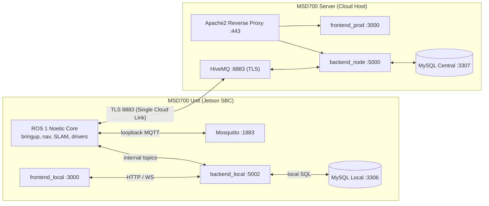
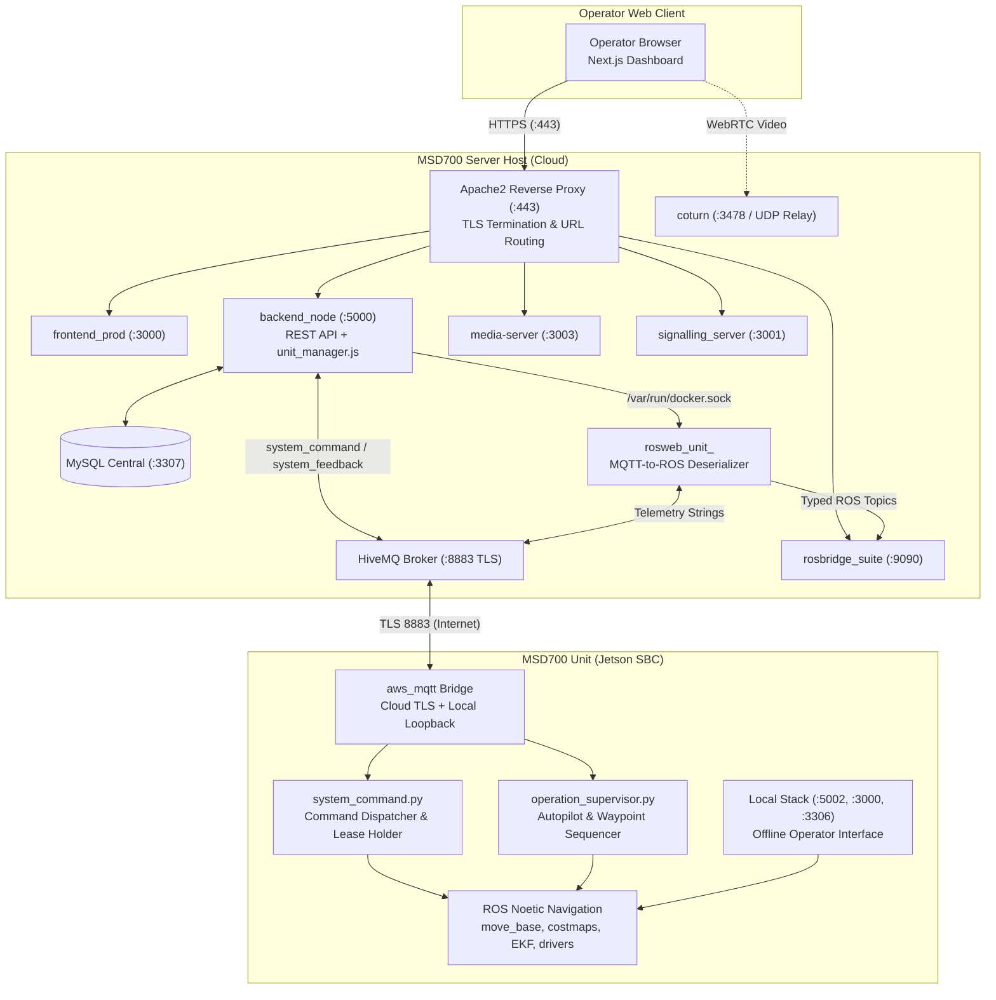
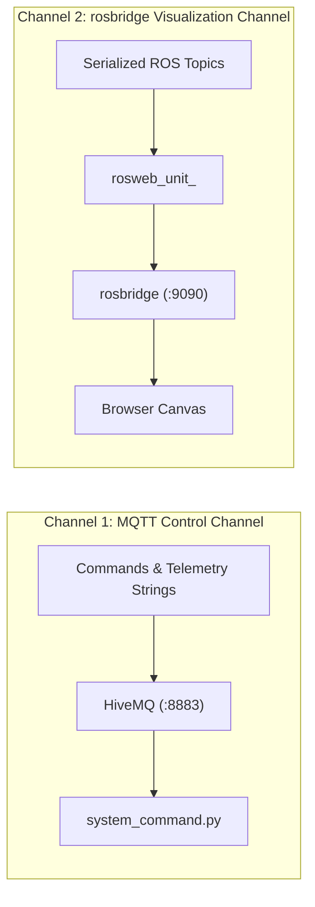
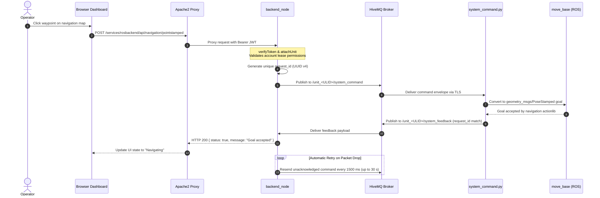
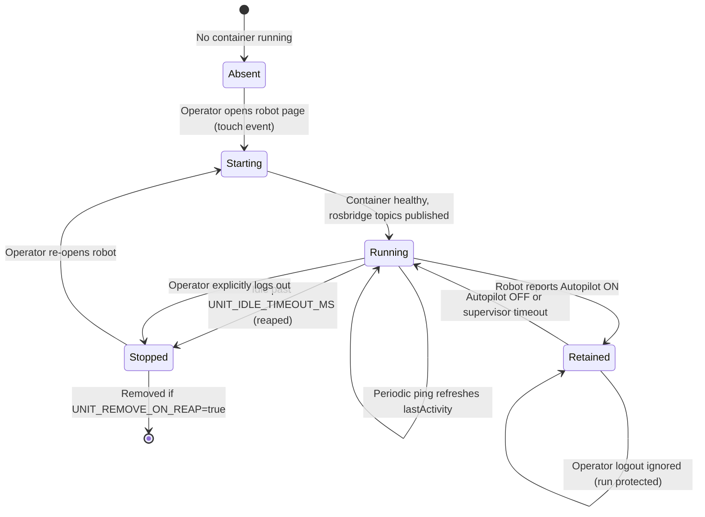
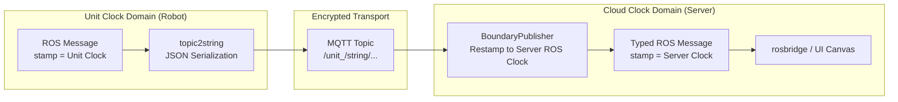
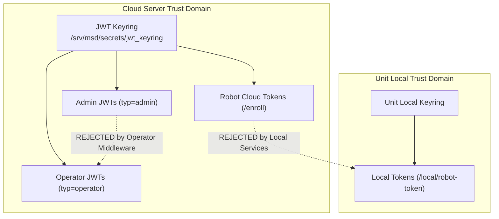
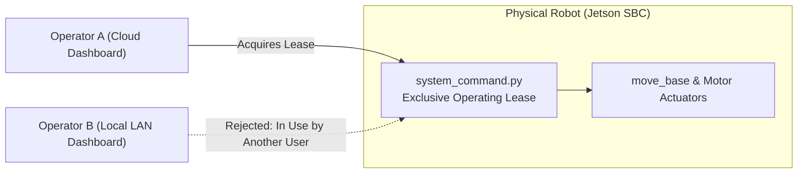

# 建築

<RoleBadge role="developer" />

このドキュメントでは、MSD700 自律ロボット プラットフォームのアーキテクチャ設計について詳しく説明し、コンポーネントがどのように相互作用するか、コンポーネント間のデータ境界、およびすべてのサブシステムの背後にあるエンジニアリング理論的根拠を説明します。

リポジトリの場所については、「リポジトリの構造」(@@MU1@@) を参照してください。正確なデータ ペイロードについては、[メッセージ コントラクト](/ja/development/message-contracts) を参照してください。有限状態マシンについては、[状態と動作](/ja/development/state-and-behavior) を参照してください。導入トポロジについては、[システム セットアップ](/ja/setup/system-setup) を参照してください。

## 2 台のマシンのモデル

MSD700 の中心的なアーキテクチャ上の決定は、**ユニット (物理ロボット) が完全なローカル サーバー スタック**を実行し、**MSD700 サーバー (クラウド)** がフリート全体の中央管理スタックを実行することです。これらは同一のデータ構造を共有するピアであり、暗号化された MQTT トランスポートを介して接続されます。

|寸法 | MSD700ユニット（ロボット） | MSD700 サーバー (クラウド) |
| --- | --- | --- |
| **実行** | ROS 1 Noetic Bringup、move_base、gmapping、センサー ドライバー、および `backend_local`、`db_local`、`mosquitto_local`、および `frontend_local`。 |セントラル `backend_node`、`db` (MySQL)、`hivemq` (MQTT ブローカー)、`rosbridge`、`signalling_server`、`media-server`、および `frontend_prod`。 |
| **権限** |ライブの物理ロボット、センサーの読み取り値、ローカル オペレーション リース、生の地図記録を所有します。 |ユーザー アカウント、認証キーリング、レンタル プロファイル、ロボット登録レジストリ、およびフリート全体で同期されたマップ/ルートを所有します。 |
| **フォールト トレランス** |インターネットまたは Wi-Fi 接続が完全に失われた場合でも、自律的にオフラインで動作します。 |フリートのメタデータを失うことなく、ロボットのシャットダウン、ネットワークの切断、再起動に耐えます。 |
| **制約** |独自のグローバル ID を割り当てることはできません (初期のクラウド登録が必要です)。 |アクティブなロボット接続がないと物理ロボットを移動できません。 |

::: tip Core Design Principle: Local as Offline Cache
ユニットのローカル スタックは、**クラウドのオフライン優先キャッシュであり、分離されたサイロ**ではありません。登録されたユニットは、アクティブなインターネット接続がなくても無期限に機能します。ネットワーク接続が復元されると、記録されたマップ、実行されたルート、構成状態が自動的にクラウドに同期されます。
:::

## コンポーネントの概要

|コンポーネント |テクノロジー |責任 |ホストの場所 |
| --- | --- | --- | --- |
| **フロントエンド ダッシュボード** | Next.js、React、TypeScript |マップ キャンバス、テレメトリ ウィジェット、手動テロップ、およびナビゲーション コントロールを備えた単一ページのオペレーター インターフェイス。 | `ROS-dashboard-next-ts` (クラウド上では `frontend_prod` として、ユニット上では `frontend_local` として構築) |
| **バックエンドノード** | Node.js、Express |認証ミドルウェア、マップ/ルート/エリア/プレイリストの CRUD、ロボット コマンド ディスパッチ、同期調整、コンテナー ライフサイクル マネージャー (`unit_manager.js`)。 | `ros-web-ui/source/dependencies/ROS-dashboard-backend` |
| **unit_manager.js** | Node.js (Docker API) | `/var/run/docker.sock` を介してサーバー上のユニットごとのリレー コンテナ (`rosweb_unit_<ULID>`) を動的にスピンアップして取得します。 | `backend_node` 内に埋め込み |
| **ロズブリッジ** | `rosbridge_suite` (WebSocket) |ライブ ROS トピック (ロボットのポーズ、レーザー スキャン、コストマップ、グローバル プラン) を WebSocket 経由でブラウザ キャンバスにブリッジします。 |クラウドコンテナ(`nakayama_cloud`)とユニットローカルスタック |
| **HiveMQ (MQTT)** | HiveMQ CE (Java) |ロボットをポート 8883 (TLS) 経由でサーバーに接続する、暗号化された高スループットのメッセージ ブローカー。 |サーバーコンテナ (`hivemq` / `hivemq_dev`) |
| **MySQL データベース** | MySQL 8.0 |ユーザー アカウント、レンタル プロファイル、登録済みユニット レコード、ルート ジオメトリ、カスタム エリア境界、および同期ジャーナルを保存します。 |サーバー（`db` / `db_dev`）とユニット（`db_local`） |
| **メディアサーバー** | Node.js、Express |マップ アセットのアップロード、サムネイルの生成を管理し、静的な `.pgm` および `.yaml` マップ ファイルを提供します。 |サーバーコンテナとユニットコンテナ (`media_local`) |
| **信号サーバー** | Node.js (WebSocket) | WebRTC ピア ネゴシエーション サーバーは、ロボット カメラとオペレーターのブラウザ間の直接ビデオ ストリーミングを促進します。 |サーバーコンテナ(`signalling`)とユニットコンテナ(`signalling_local`) |
| **コーターン** |コターン(C) | RFC 5766 TURN / STUN リレー サーバーは、NAT トラバーサルによって直接ピアツーピア WebRTC ビデオが妨げられる場合にメディア フォールバックを提供します。 |サーバーホスト (`coturn` サービス、ホストネットワーキング) |
| **Apache2** | Apache HTTP サーバー | TLS 終端、セキュリティ ヘッダーを処理し、すべてのパブリック トラフィックを `/services/...` パス経由でルーティングします。 |サーバーホスト（ネイティブサービス） |
| **ROS ロボット パッケージ** | C++、Python、ROS 1 ノエティック | `msd700_robot` (ナビゲーション、SLAM、バストロフェドン カバレッジ、EKF、センサー ドライバー) および `ros-web-ui` ブリッジ パッケージ (`topic2string`、`system_command`、`operation_supervisor`)。 | Jetson SBC (`msd700` コンテナ) |

## システム トポロジとデータ フロー

### アーキテクチャ上の重要なルール:
1. **単一のパブリック Ingress としての Apache**: すべての HTTP および WebSocket リクエストは Apache ポート 443 を介して入力されます。バックエンド サービスは内部ポートまたはループバック アドレスにバインドされます。ロボットが直接到達できる唯一の外部ポートは、ポート 8883 (TLS) 上の HiveMQ です。
2. **コマンド フローは ROS ではなく MQTT を介して**: `backend_node` によってディスパッチされたコマンドは、`/unit_<ULID>/system_command` MQTT トピックに乗り、`/unit_<ULID>/system_feedback` を介して確認されます。クラウド内の ROS トピックは、ブラウザーのマップ キャンバスとテレメトリ表示にフィードを提供するためだけに存在します。
3. **デシリアライザーとしてのユニットごとのコンテナ**: コンテナ `rosweb_unit_<ULID>` はオンデマンドで実行され、MQTT からの JSON/文字列ペイロードをネイティブ ROS メッセージ (`nav_msgs/OccupancyGrid`、`geometry_msgs/PoseStamped`、`sensor_msgs/LaserScan`) に変換し、`rosbridge` がそれらをダッシュ​​ボードにストリーミングできるようにします。

## 2 つの診断チャネル

プラットフォームは、独立して失敗する 2 つの別個の通信チャネルを使用します。

|チャンネル |輸送 |伝送されるデータ |障害の症状 |
| --- | --- | --- | --- |
| **MQTT** | TCP / TLS (8883) |コマンド、確認応答、ポーズ文字列、ステータス ping。 |ロボットはコンソールに**オフライン**と表示されます。コマンドは HTTP 504 ですぐに失敗します。
| **ロズブリッジ** | WebSocket (WSS) |入力された ROS メッセージ (`/map`、`/robot_pose`、`/scan`、`/global_plan`)。 |ロボットは **オンライン** として表示され、コマンドを受け入れますが、マップ キャンバスは空白のままです。 |
| **ユニットリレーコンテナ** |サーバー上の Docker | MQTT 文字列を rosbridge の型付き ROS トピックに変換します。 |ロボットはオンラインで rosbridge に接続されていますが、`rosweb_unit_<ULID>` が停止しているか、非アクティブなためにリープされているため、キャンバスは空白のままです。 |

## エンドツーエンドのコマンド実行フロー

オペレーターがロボットに命令するとき (たとえば、地図上のウェイポイントをクリックする):

### 重要な実装の詳細:
- **HTTP 応答はロボットの状態を反映します**: `backend_node` は、一致する `request_id` を持つ `system_feedback` がロボットから到着するまで、HTTP 接続を開いたままにします。ステータス 504 Gateway Timeout は、ロボットがコマンドを処理しなかったことを示します。
- **選択的コマンド再試行**: 変更コマンド (ナビゲーション目標、モード切り替え、緊急停止) は、確認されるまで 1500 ミリ秒ごとに再試行されます。ハートビート ping は **決して再試行されません**: ping のドロップは、安全ウォッチドッグがゼロツイスト緊急停止を開始するために使用する正確な信号です。

## ユニットごとのコンテナーのライフサイクル

サーバーのメモリと CPU を節約するために、サーバーは非アクティブなロボットに対して永続的な ROS マスター ノードを実行しません。代わりに、`backend_node` 内の `unit_manager.js` がアクティブなユニットごとに 1 つのコンテナを動的に管理します。

|構成変数 |デフォルト値 |説明 |
| --- | --- | --- |
| `UNIT_MANAGER_ENABLED` | `true` (サーバー)、`false` (ユニット) |動的コンテナ管理をアクティブにするかどうかを制御します。 |
| `UNIT_IMAGE` | `ros-noetic-webui-app-v2:latest` (開発では `:dev`) |ユニットリレー用にインスタンス化された Docker イメージ。 |
| `UNIT_IDLE_TIMEOUT_MS` | `1800000` (30 分) |コンテナーが刈り取られるまでのオペレーターの非アクティブ期間。 |
| `UNIT_REAP_INTERVAL_MS` | `60000` (1分) |バックグラウンド リーパー スイープの頻度。 |
| `UNIT_REMOVE_ON_REAP` | `false` | true の場合、コンテナーを削除します。 false の場合、停止したままになります。 |
| `UNIT_MODE` | `prod` (または `dev`) |ポート オフセットを選択します (ROS マスター 11311/11312、rosbridge 9090/9091)。 |

::: warning Autopilot Retention Guard
ロボットが **オートパイロット モード**で自律ミッションを実行すると、その中継コンテナは **保持** 状態になります。保持されたコンテナはアイドル タイムアウトの対象外であり、オペレータがログアウトするかブラウザを閉じても終了されないため、継続的なミッション監視が保証されます。
:::

## クロックドメインの境界と時間の同期

ロボットのオンボード コンピューターとクラウド サーバーは、独立したシステム クロックを持つ別個の ROS マスター インスタンスを実行します。タイムスタンプの相違を防ぐため、MQTT を通過するすべてのジオメトリック メッセージは、入力時に `BoundaryPublisher` を介してローカル ROS 時間に再スタンプされます。

::: danger Why Clock Restamping Is Mandatory
タイム リスタンプを省略すると、RViz および Web レンダラーで即座に `TF_OLD_DATA` 警告が表示されます。さらに、アクティブな `/clock` ジェネレーターがない 1 つのマスターで `/use_sim_time` が有効になっている場合、TF ツリーの評価は完全にフリーズします。
:::

## 多層の信頼ドメインとセキュリティ

MSD700 アーキテクチャは、3 つの異なるセキュリティ信頼ドメインを強制します。 1 つのドメイン内で発行された資格情報は、他のドメインでは厳密に拒否されます。

1. **オペレーター トークン**: `/srv/msd/secrets/` キーリングに対して検証された標準 HS256 JWT。トークンにはユーザー ID とアカウントのスコープが含まれます。管理者トークン (`typ=admin`) は、標準のロボット操作ルートでは拒否されます。
2. **ロボット クラウド トークン**: 物理ロボットの登録時に生成されたデバイス シークレットを使用して、`/enroll/token` によって作成されました。 12 時間有効で、システムが起動するたびに更新されます。
3. **ユニット ローカル トークン**: Jetson コンピューター上の `backend_local` によってローカルに発行されます。クラウド署名トークンは、ネットワーク分割中の完全なローカル自律性を確保するために、ローカル エンドポイントによって意図的に拒否されます。

## オペレーティング リース: 複数のオペレーター間の競合の防止

ロボットはクラウド Web インターフェイスとオンボード ローカル ネットワーク ダッシュボードの両方からアクセスできるため、物理ロボットは単一の **オペレーティング リース**を適用します。

- リースはサーバー バックエンドではなく、**ロボット** (`system_command.py` 内) で保持されます。
- オペレーターがロボット ダッシュボードを開くと、クライアントはハートビート ping によって継続的に更新される 15 秒のリースを取得します。
- 2 番目のオペレーターがコマンドを送信しようとすると、ロボットは `In Use` ステータスを返します。引き継ぎには、元のオペレーターからの明示的な確認またはリース期限が必要です。

## 関連ドキュメント

- [メッセージ コントラクト](/ja/development/message-contracts): MQTT、ROS、および WebSocket ペイロードの完全な仕様。
- [状態と動作](/ja/development/state-and-behavior): ナビゲーション、ブーストロフェドン スイープ、非常停止のための詳細なステート マシン。
- [API リファレンス](/ja/development/api-reference): REST API エンドポイントと認証コントラクト。
- [データベース スキーマ](/ja/development/database-schema): MySQL スキーマ、テーブル、外部キー、および移行スクリプト。
- [カメラ ストリーミング](/ja/development/camera-streaming): WebRTC ビデオ パイプラインと ICE 候補のネゴシエーション。
- [データ同期](/ja/development/data-sync): ユニット キャッシュと中央サーバー間の同期メカニズム。