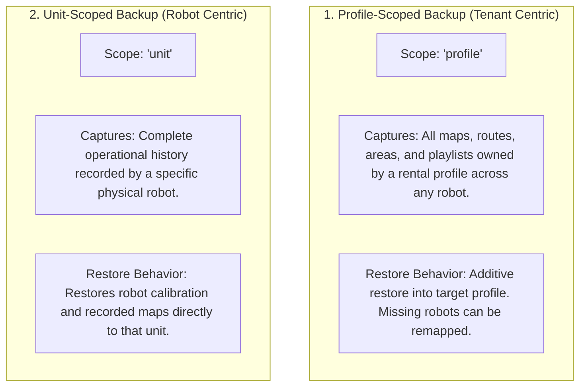

# バックアップ、復元、データ移行

<RoleBadge role="developer" />

このドキュメントでは、MSD700 のデータベース バックアップ アーキテクチャ、エクスポート/インポート アーカイブ構造、レンタル プロファイル転送メカニズム、および移行スクリプトについて詳しく説明します。

## デュアルスコープ バックアップ アーキテクチャ

プラットフォームは、2 つの独立したバックアップ スコープをサポートしています。



|寸法 |プロファイル スコープのバックアップ |ユニットスコープのバックアップ |
| --- | --- | --- |
| **主スコープ キー** | `profile_id` (レンタルプロフィール) | `unit_id` (物理ロボット ULID) |
| **典型的な使用例** |顧客の地図とルートを代替ロボットに移行します。 |工場でのハードウェアの保守または改修の前にロボットをアーカイブします。 |
| **データが含まれています** |そのプロファイルのマップ、ウェイポイント、プレイリスト、およびユーザー メタデータ。 |すべてのマップとセンサー記録は、その特定のハードウェア ユニットから生成されます。 |
| **復元戦略** |追加的 (無関係なテナント データを上書きせずに更新/挿入)。 |ハードウェアユニットへの直接復元。 |

## アーカイブ構造 (`.tar.gz`)

バックアップは、構造化メタデータとバイナリ マップ ファイルを含む圧縮 `.tar.gz` アーカイブとしてエクスポートされます。

```
msd700_backup_01JZ8QK2H.tar.gz
├── manifest.json            # Version 2 archive manifest and metadata
├── database_dump.sql        # Scoped SQL insert statements
└── maps/                    # Binary map images (.pgm, .yaml, .png)
    ├── 01JZ8QK2H0001.pgm
    ├── 01JZ8QK2H0001.yaml
    └── 01JZ8QK2H0001_thumb.png
```

### マニフェスト形式 (`manifest.json`)

```json
{
  "manifest_version": "2.0",
  "scope": "profile",
  "profile_id": "01JZ7YV5CQPROF00000000000",
  "tenant_name": "Acme Logistics",
  "created_at": "2026-08-15T14:30:00Z",
  "created_by": "01JZ7YV5CQUSER00000000000",
  "counts": {
    "maps": 4,
    "routes": 12,
    "areas": 6,
    "playlists": 2
  }
}
```

## REST API バックアップ操作

### 1. アーカイブのエクスポート
`POST /api/backup/export`

`.tar.gz` アーカイブを生成してダウンロードします。

- **リクエスト本文**:
```json
{
  "scope": "profile",
  "profile_id": "01JZ7YV5CQPROF00000000000"
}
```

### 2. アーカイブのインポートと復元
`POST /api/backup/import`

アーカイブをアップロードし、追加的に適用します。

- **リクエスト ペイロード**: `file: <archive.tar.gz>` とターゲット `profile_id` を含むマルチパート フォーム データ。

## スキーマ移行スクリプト

データベース スキーマの進化は、`ros-web-ui/source/dependencies/ROS-dashboard-backend/scripts/` の自動スクリプトによって管理されます。

|スクリプト名 |目的 |実行コマンド |
| --- | --- | --- |
| `migrate_unit_id_refactor.js` |従来のユーザー名/ユニット名のパスを ULID アドレス指定に移行します。 | `node migrate_unit_id_refactor.js --apply` |
| `migrate_enrolment.js` | 32 バイトの nonce 認証用の `pending_units` テーブルと `unit_devices` テーブルを作成します。 | `node migrate_enrolment.js --apply` |
| `migrate_sync.js` |オフライン データ同期用に `sync_state` テーブルと `sync_tombstones` テーブルをインストールします。 | `node migrate_sync.js --profile dev --apply` |
| `migrate_backup_scope.js` | `profile_backups` テーブルを `scope` 列でアップグレードします。 | `node migrate_backup_scope.js --profile dev --apply` |

::: danger Migration Testing Rule
移行スクリプトは、ポート 3307 で運用環境に適用する前に、**ポート 3308** で開発データベースに対して必ずテストしてください。移行スクリプトには、偶発的なターゲットの不一致を防ぐために、明示的な `--profile` 引数が必要です。
:::

## 関連ドキュメント

- [データベース スキーマ](/ja/development/database-schema): 完全な MySQL テーブル定義と外部キー。
- [データ同期](/ja/development/data-sync): オフライン データ レプリケーションと競合解決。
- [API リファレンス](/ja/development/api-reference): フリート管理用の REST API エンドポイント。