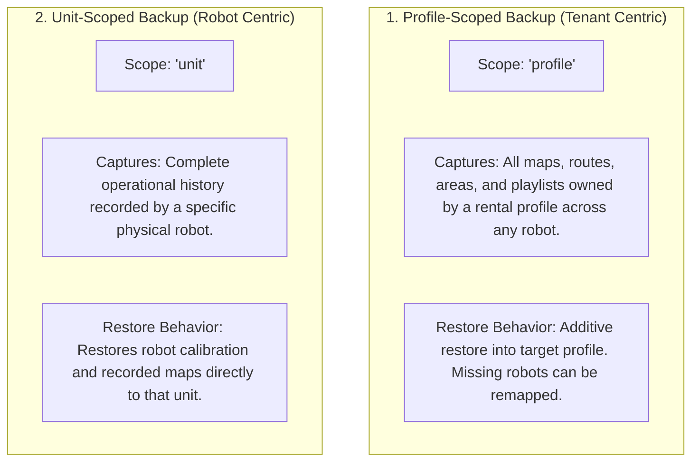

# バックアップ、リストア、データ移行

<RoleBadge role="developer" />

このドキュメントは、MSD700 におけるデータベースバックアップアーキテクチャ、エクスポート/インポートのアーカイブ構造、レンタルプロファイル転送の仕組み、マイグレーションスクリプトについて詳述します。

## 2軸バックアップアーキテクチャ

このプラットフォームは2つの独立したバックアップスコープをサポートします。



| 軸 | プロファイルスコープのバックアップ | ユニットスコープのバックアップ |
| --- | --- | --- |
| **主スコープキー** | `profile_id`(レンタルプロファイル) | `unit_id`(物理ロボットの ULID) |
| **典型的なユースケース** | 顧客のマップとルートを代替ロボットへ移行する。 | 工場でのハードウェア整備やリファービッシュの前にロボットをアーカイブする。 |
| **含まれるデータ** | そのプロファイルのマップ、ウェイポイント、プレイリスト、ユーザーメタデータ。 | その特定のハードウェアユニットを起点とするすべてのマップとセンサー記録。 |
| **リストア戦略** | アディティブ(無関係なテナントデータを上書きしない upsert)。 | ハードウェアユニットへの直接リストア。 |

## アーカイブ構造(`.tar.gz`)

バックアップは、構造化されたメタデータとバイナリのマップファイルを含む圧縮 `.tar.gz` アーカイブとしてエクスポートされます。

```
msd700_backup_01JZ8QK2H.tar.gz
├── manifest.json            # Version 2 archive manifest and metadata
├── database_dump.sql        # Scoped SQL insert statements
└── maps/                    # Binary map images (.pgm, .yaml, .png)
    ├── 01JZ8QK2H0001.pgm
    ├── 01JZ8QK2H0001.yaml
    └── 01JZ8QK2H0001_thumb.png
```

### マニフェスト形式(`manifest.json`)

```json
{
  "manifest_version": "2.0",
  "scope": "profile",
  "profile_id": "01JZ7YV5CQPROF00000000000",
  "tenant_name": "Acme Logistics",
  "created_at": "2026-08-15T14:30:00Z",
  "created_by": "01JZ7YV5CQUSER00000000000",
  "counts": {
    "maps": 4,
    "routes": 12,
    "areas": 6,
    "playlists": 2
  }
}
```

## REST API のバックアップ操作

すべてのバックアップルートは`/admin/api`配下にある(管理者トークンが必要)。`/api/backup/export`や`/api/backup/import`というエンドポイントは存在しない。

### 1. バックアップの作成
`POST /admin/api/profiles/:id/backups`(プロファイルスコープ)または`POST /admin/api/units/:id/backups`(ユニットスコープ)

プロファイルまたはユニットのバックアップレコードを作成する。

### 2. アーカイブのダウンロード
`GET /admin/api/backups/:id/download`

`.tar.gz`アーカイブをダウンロードする。

### 3. アーカイブのアップロード
`POST /admin/api/backups/upload`

アーカイブをアップロードする(生ボディ)。事前に`POST /admin/api/backups/:id/plan`でプランをプレビューする。

### 4. アーカイブのリストア
`POST /admin/api/backups/:id/restore`

アップロードされたアーカイブをアディティブに適用する。

### 5. バックアップの一覧
`GET /admin/api/backups`

## アーカイブ機構

パッキングは2つのスクリプトが担うため、未検証アップロードへの `tar` シェルアウトは決して行わない:

- `profile_archive.js` は1つのDBスライス+マップファイルを `.tar.gz`(`manifest.json` + `files/<mapId>.pgm|yaml|png`)に詰め/開く。プロファイルスコープ(1テナント)またはユニットスコープ(1ロボット、任意でレンタル跨ぎ)用。`users` は決して運ばず(既存アカウントへのメンバーシップ/著者紐付けのみ)、空きULID再利用、奪取済みは再マップ、上書きなし。主要関数:`buildArchive`、`readArchive`、`buildRestorePlan`、`restoreArchive`。
- `tar_archive.js` はその下の最小インメモリustarリーダー/ライター:`packTar`/`unpackTar`、許可リスト(`^files/<ULID>.(pgm|yaml|png)$`)、チェックサム/切詰め検査、非通常ファイル skip——ステージングdirなし、CLI展開なし。

## スキーママイグレーションスクリプト

データベーススキーマの変更は、`ros-web-ui/source/dependencies/ROS-dashboard-backend/scripts/` 内の自動化されたスクリプトによって管理されます。

| スクリプト名 | 用途 | 実行コマンド |
| --- | --- | --- |
| `migrate_unit_id_refactor.js` | 従来の username/unitname パスを ULID アドレス指定へ移行する。 | `node migrate_unit_id_refactor.js --profile server_dev --apply` |
| `migrate_enrolment.js` | nonce 認証のために `pending_units` と `unit_devices` テーブルを作成する。 | `node migrate_enrolment.js --profile server_dev --apply` |
| `migrate_sync.js` | オフラインデータ同期のために `sync_state` と `sync_tombstones` テーブルをインストールする。 | `node migrate_sync.js --profile server_dev --apply` |
| `migrate_backup_scope.js` | `profile_backups` テーブルに `scope` カラムを追加してアップグレードする。 | `node migrate_backup_scope.js --profile server_dev --apply` |

::: danger マイグレーションのテストルール
マイグレーションスクリプトは、port 3307 の本番環境に適用する前に、必ず port 3308 の開発用データベースに対してテストしてください。マイグレーションスクリプトは、対象の取り違えを誤って起こさないよう、明示的な `--profile` 引数を必要とします。
:::

## 関連ドキュメント

- [データベース設計](/ja/development/database-schema): MySQL テーブル定義と外部キーの全体。
- [データ同期](/ja/development/data-sync): オフラインデータのレプリケーションと競合解決。
- [API リファレンス](/ja/development/api-reference): フリート管理用の REST API エンドポイント。
