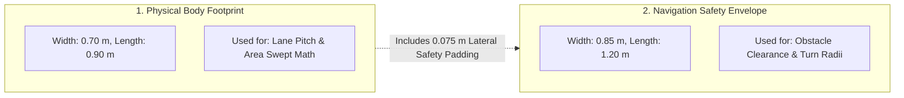
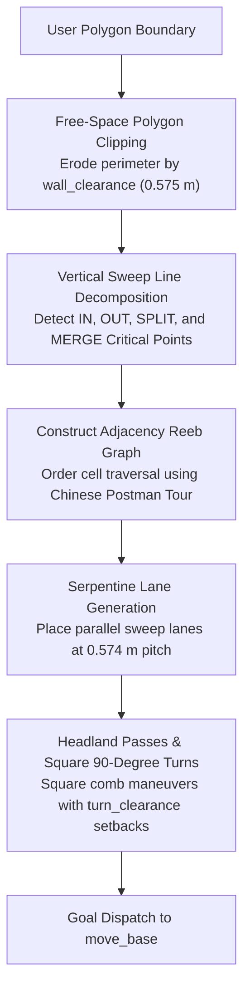
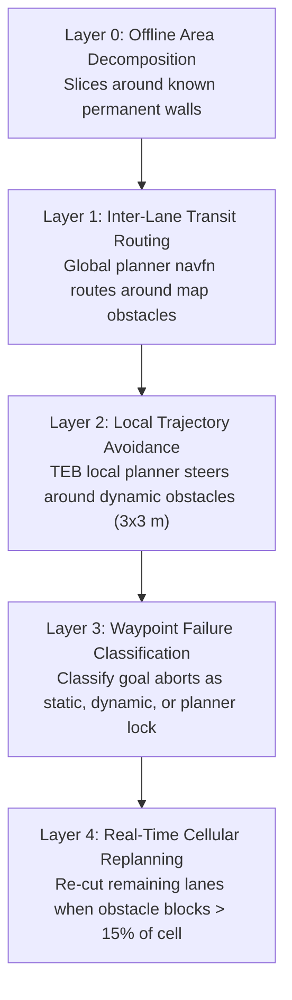
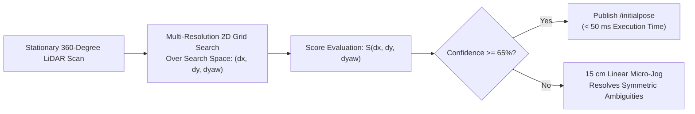

# Boustrophedon カバレッジとゼロスピン アライメント アーキテクチャ

<RoleBadge role="developer" />

このドキュメントでは、Boustrophedon Cellular Decomposition カバレッジ プランニング パイプライン、デュアル ジオメトリ クリアランス計算、5 層障害物管理、および Correlative Scan Matcher (CSM) ゼロスピン アライメントの包括的なアルゴリズム仕様を提供します。

## デュアル ロボット ジオメトリ

MSD700 カバレッジ計画の基本的な設計原則は、**ロボットには、異なる計算に使用される 2 つの異なる幾何学的寸法がある**ということです。

|幾何学的定義 |サイズ 寸法 |アルゴリズムの使用法 |
| --- | --- | --- |
| **肉体** (`~body_footprint`) |長さ 0.90 m x 幅 0.70 m |レーンピッチとスイープエリア到達計算を決定します。 |
| **コストマップ安全封筒** |長さ 1.20 m x 幅 0.85 m | TEB ローカル プランナーの許可と実現可能性の転換を強制します。 |

`costmap_common_params.yaml` のコストマップ エンベロープには、意図的な安全パッド (片側あたり横方向 0.075 m、縦方向 0.150 m) が含まれています。 `path_coverage_node` は、`/move_base/global_costmap/footprint` からエンベロープを直接読み取り、ナビゲーション プランナーとの同期を維持します。

### 派生クリアランス定数 (`libs/coverage_geometry.py`)

|クリアランス定数 |値 |数式 |
| --- | --- | --- |
| `wall_clearance` | **0.575 m** | $r_{\text{刻印}} (0.425\text{ m}) + d_{\min} (0.150\text{ m})$ |
| `turn_clearance` | **0.885 m** | $r_{\text{外接}} (0.735\text{ m}) + d_{\min} (0.150\text{ m})$ |
| `pitch` | **0.574 m** | $w_{\text{body}} (0.70\text{ m}) \times (1 - \text{overlap} (0.18))$ |

### 物理的な幾何学的制限:
- **ロボットが進入できる最も狭い廊下**: **1.15 m** ($2 \times \text{wall\_clearance}$)。
- **180 度回転できる最も狭い廊下ロボット**: **1.77 m** ($2 \times \text{turn\_clearance}$)。
- **2 車線の清掃に相当する最も狭い廊下**: **1.72 m**。
- **壁に沿った到達不能な境界ストリップ**: **0.225 m** ($\text{wall\_clearance} - \frac{w_{\text{body}}}{2}$)。

::: info Attainment vs Raw Coverage
周囲 0.225 m のストリップは衝突せずに横断できないため、長方形の部屋 (例: 3 x 6 m) は理論上の最大カバー率 **78.6%** に達します。システムのパフォーマンスは、未調整の生の面積の割合ではなく、**到達率** (実際に掃引された到達可能なフロアの割合) によって測定されます。
:::

---

## ブストロフェドンの細胞分解アルゴリズム

カバレッジ プランナーは、内部障害物のある任意の凹面の多角形境界を、凸面の障害物のないサブセルに分解します。

### クリティカルポイントの分類:
$x$ 軸に沿った垂直スイープ ラインの進行中、境界頂点は自由空間のローカル接続に基づいて分類されます。
1. **IN クリティカル ポイント**: 空き領域が拡大すると、新しいセルが開きます。
2. **OUT クリティカル ポイント**: セルは境界が収束すると終了します。
3. **分割臨界点**: 内部障害物により、アクティブ セルが 2 つの異なる並列サブセルに分割されます。
4. **臨界点をマージ**: 2 つの平行なサブセルが障害物の後縁を越えて再結合します。

---

## 5 層の障害物管理

---

## ゼロスピン方向のアライメント (相関スキャン マッチング)

ロボットが事前に記録されたマップ上で未知のポーズに配置される場合、従来の AMCL では粒子の分散を崩壊させるためにその場で 360 度回転する必要があります。

MSD700 は **相関スキャン マッチング (CSM)** を実装し、動きを伴わずに方向と位置を瞬時に計算します。

### 数学的定式化:
$N$ レーザー スキャン ポイント $\mathbf{p}_i = [x_i, y_i]^T$ と静的占有グリッド マップ $M(x, y)$ が与えられると、スキャン マッチャーは相関スコアを最大化する剛体変換 $(\Delta x, \Delta y, \Delta \theta)$ を見つけます。

$$S(\Delta x, \Delta y, \Delta \theta) = \sum_{i=1}^N M\left( \mathbf{R}(\Delta \theta) \mathbf{p}_i + \begin{bmatrix} \Delta x \\ \Delta y \end{bmatrix} \right)$$

$\mathbf{R}(\Delta \theta)$ は 2D 回転行列です。
$$\mathbf{R}(\Delta \theta) = \begin{bmatrix} \cos(\Delta \theta) & -\sin(\Delta \theta) \\ \sin(\Delta \theta) & \cos(\Delta \theta) \end{bmatrix}$$

一致スコアの信頼度が $65\%$ を超えると、推定されたポーズが `/initialpose` に公開され、回転モーションがゼロの $50\text{ ms}$ 未満でロボットの位置を特定します。

## 関連ドキュメント

- [シミュレーション](/ja/development/simulation): 倉庫のテスト環境とスケール モデル。
- [メッセージ コントラクト](/ja/development/message-contracts): カバレッジ コマンド エンベロープと ACK プロトコル。
- [状態と動作](/ja/development/state-and-behavior): ナビゲーションとカバレッジの有限状態マシン。