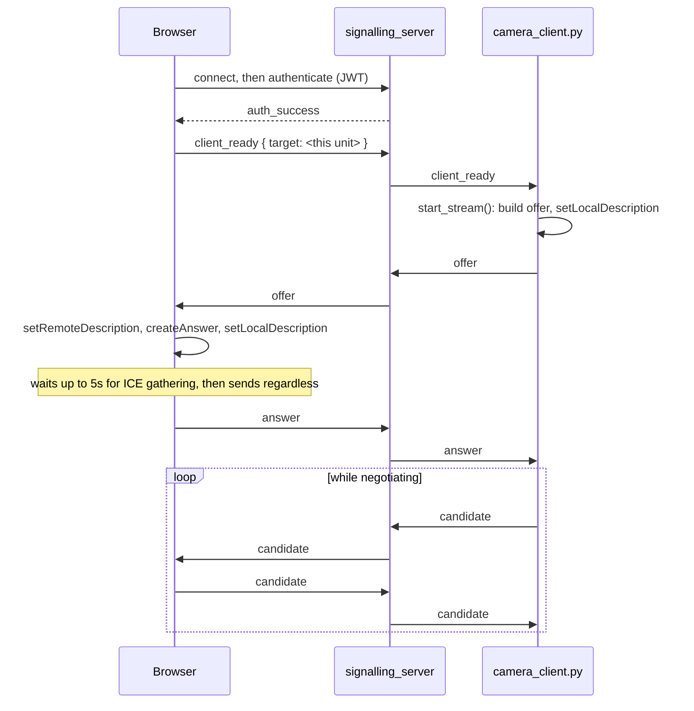
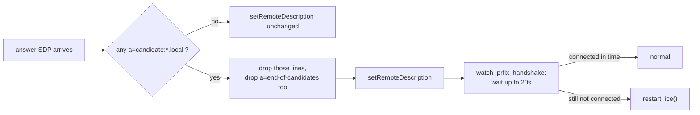

# カメラストリーミング

<RoleBadge role="developer" />

ライブ カメラ フィードがロボットからオペレーターのブラウザに送信される仕組み: WebRTC シグナリング、ICE
ネゴシエーション、およびインターネットのないユニットでネゴシエーションを壊す 1 つの Chrome の動作。どこへ
`signalling_server` と `coturn` はより広いシステム内にあります。を参照してください。
【建築】(@@MU1@@)。製作用TURNリレー専用
設定については、[サーバーのセットアップ § TURN リレー](/ja/setup/server-setup#_6-the-turn-relay-production-only) を参照してください。このページ
これらのどちらにも含まれていないこと、つまりハンドシェイク自体、およびユニットローカルパスが必要な理由について説明します。
クラウド パスとは処理が異なります。

::: info Video is peer to peer; only negotiation crosses the server
`signalling_server` は `camera_client.py` との間で SDP オファー、回答、ICE 候補を交換します。
ブラウザ。接続が確立されると、ビデオ フレームは接続されることはなく、直接流れます。
ロボットとブラウザ間、または直接パスが存在しない場合は `coturn` 経由。
:::

## カメラ 1 台、ピア接続 2 台

`camera_client.py` はそれ自体のコンテナではありません。ロボットコンテナ内で実行されます。
`camera_client` `run_msd.sh` によって開始された tmux ウィンドウ (「
[Docker リファレンス § ユニット: run_msd.sh](/ja/setup/docker-reference#unit-run-msd-sh))。単一の物理的
カメラは、その 1 つのプロセス内の**2** の独立した `CameraClient` オブジェクトによって共有されます (1 つはピアリングされています)
クラウドを使用すると、ユニット独自の LAN 上で開いているダッシュボードとピアリングされ、それぞれが独自の
WebSocket 接続と独自の `RTCPeerConnection`。

|ターゲット | WebSocket のシグナリング |メディア / バックエンド |スタン/ターン |
| --- | --- | --- | --- |
|クラウド制作 | `wss://msd.nglobal.jp/services/signalling` (`:3001` への Apache プロキシ) |メディア `:3003`、バックエンド `:5000` | Google STUN + 本番 `coturn` リレー |
|クラウド開発 | `ws://<server-ip>:4001` |メディア `:4003`、バックエンド `:5001` |実稼働と同じ (リレー 1 つ、共有) |
|ユニットローカル | `ws://<unit-ip>:3001` |メディア `:3003`、バックエンド `:5002` | **デフォルトではなし** |

## デフォルトでユニットローカルパスに STUN/TURN がない理由

インターネット ルートのないユニットは `getaddrinfo` の解決に失敗し、`stun.l.google.com` が発生し、`aiortc` が発生します
この障害は `setLocalDescription` から直接発生したものです。接続の劣化ではなく、接続の停止です。
`start_stream()`、カメラ、信号サーバー、および
ダッシュボードはすべて正常です。ここではオペレータのブラウザとロボットが同じLANを共有しているため、
この場合、ホスト候補はすでに到達可能です。リレーが解決できることは何もありません。

`camera_client.py` とダッシュボードの `VideoStreamComponent` は両方とも同じ規則を読み取ります。
ICE サーバー リスト: 設定を解除すると、クラウドのデフォルト (Google STUN と運用 TURN) に戻ります。
資格情報)、リテラル文字列 `none` は、リストを未設定のままにするのではなく完全にクリアします。
`LOCAL_STUN_URLS` / `LOCAL_TURN_URL` / `LOCAL_TURN_USERNAME` / `LOCAL_TURN_CREDENTIAL` で
`msd700_noetic/docker/.env` のデフォルトは `none` であり、これを設定する価値があるのはまさにこの理由です。
LAN に本当にリレーが必要なユニット (セグメント化されたネットワーク、ロボット間のキャプティブ Wi-Fi ブリッジ)
とオペレーター）。

## 握手



`signalling_server` は、`target` によってキーが設定されたステートレス リレーです。SDP コンテンツを検査することはなく、検査するだけです。
指定された 2 つのピア間でメッセージをルーティングします。認証には有効な情報のみが必要です。
`userId` または `username` を含むキーリング検証済みトークン。その主張はロボットにとって負担となる
ただし、トークンはオペレーター トークン パスとロボット トークン パスに共通するものであるため、特にトークンです。あ
ロボット トークンが欠落している `userId` はここでは完全に拒否されます。そのため、クラウドとユニットローカルの両方が
トークン発行者はこれを明示的に設定します ([アーキテクチャ § 信頼ドメイン](/ja/development/architecture#trust-domains) を参照)。

## mDNS 候補のバグ (2026-08-14)

最新の Chrome では、ホストの実際の LAN アドレスを ICE 候補に含めません。ランダムに鋳造します
代わりに `<uuid>.local` という名前を使用し、それを解決するためにマルチキャスト DNS に依存します。これは、プライバシー機能です。
受信側が mDNS に参加できることを前提としています。デフォルト ルートのないユニットでは、次のことはできません。

```
OSError: [Errno 19] No such device
  at aioice/mdns.py, joining 224.0.0.251 with INADDR_ANY
  raised out of add_remote_candidate()
```

重要な詳細は、これが提起される場所です。候補者ごとではなく、`add_remote_candidate` からです。
それ自体が `setRemoteDescription` 呼び出し全体を中止します。解決できない候補が 1 つあります
ブラウザの応答には
使用可能なパブリック IP: DNS の問題とまったく同じ症状で、これにより、
上記の無関係な STUN 解決の失敗と混同してください。

### 修正

`_strip_mdns_candidates()` は、アドレスが `.local` で終わる `a=candidate:` 行を
`aiortc` に渡す前に回答し、一部の候補者に対しても同じことを行います。
`handle_ice_candidate`。接続にとって最も重要である可能性が高い候補はいずれにせよ消えてしまったので、
これは、次に何が起こるかによってのみ機能します。

- **`a=end-of-candidates` も、他のものがあった場合には常に削除されます。** そのままにしておくと、
  `aioice` に「これ以上候補者は来ません」と伝え、エージェントにはリモート候補者がゼロで何もありません
  left to wait for は、ブラウザ自体の接続チェックが行われる前に、接続が失敗したことを宣言します。
  到着するチャンス。
- **回復メカニズムはピア再帰検出 (RFC 8445 §7.2.1.3) であり、名前解決ではありません。**
  ロボットは依然として独自のホスト候補をアドバタイズします。ブラウザの STUN 接続チェックが完了したら
  それらの 1 つに到達すると、`aioice` はそのパケットの送信元からブラウザの実際のアドレスを学習します。
  `.local` 名前を解決する必要はありません。これが、候補者を剥奪することが*死者を取り除くことである理由です
  重量*、接続への唯一のパスは削除されません。
- **制限された待機により、`aioice` 自身の (存在しない) タイムアウトが置き換えられます。** リモート候補もなし。
  候補の終わりのマーカー、`aioice` は無期限に待機します: ピア再帰的な場合は正しい動作
  検出はまだ来ています。ハンドシェイク中にブラウザーのタブが閉じられた場合、間違った動作が行われます。
  `_watch_prflx_handshake()` スリープ `MDNS_PRFLX_WAIT_S` (デフォルトは 20 秒。
  実際の接続チェックは通常 1 秒以内に完了し、次の場合は `restart_ice()` を呼び出します。
  それまでに接続はまだ `connected`/`completed` ではありません。



::: warning Stripping applies to both targets, not just unit-local
mDNS 候補は、クラウド ターゲットに対しても同様に役に立ちません。mDNS 候補は、クラウド経由で到達できないアドレスを指定します。
DNSに関係なくインターネット。修正は `CameraClient` に基づいて行われるのではなく、無条件です。
インスタンスが答えを処理しています。
:::

## 再接続して再試行してください

`camera_client.py` の接続ループは永久に断念することはありません。以前のバージョンは、
試行予算を固定し、誰かが手動で `run_msd.sh` を再起動するまでカメラを停止したままにしました。再試行
遅延はジッターを伴う指数関数的なバックオフです。2 秒を基本とし、失敗した試行ごとに 2 倍になり、上限は 60 です
1 つのクラウド シグナリング サーバーを共有するユニットのフリートが再試行しないようにランダム化されます。
共有停止後も確実に実行されます。

トランスポート レベルの ICE 障害 (`iceConnectionState` が `failed` に達する) が `restart_ice()` をトリガーします
直接: 古いピア接続が切断され、同じ ICE 構成で新しいピア接続が構築されます。
トラックとデータ チャネルが再接続され、新しいオファーが `isRestart` フラグとともに送信されます。これは別です
物理カメラの再起動は 15 秒に 1 回に制限されており、相互に行われます。
両方が共有する同じ `/dev/videoN` の電源を再投入するため、進行中の再起動とは排他的です。
`CameraClient` インスタンス。

## ブラウザ側のストール検出

ダッシュボードの `RTCPeerConnection` は、`offer` が到着したときにのみ作成され、ページ上に熱心に表示されるわけではありません
ロードします。ネイティブ `oniceconnectionstatechange` を超えて (ブラウザ独自の `oniceconnectionstatechange` をトリガーします)
`restartIce()` 上 `failed`)、別のウォッチドッグが 2 秒ごとに `getStats()` をポーリングしてチェックします
受信ビデオ トラックの `framesDecoded` がまだ進行中かどうか。 6で動かなかった場合
`connected` を報告するトランスポートにもかかわらず、ストリームは `stalled` とマークされます。これがそれです
障害モード ICE 自身のステート マシンが認識できない: ロボット プロセスが停止したか、ネットワークが停止した
静かに暗くなりますが、ピア接続自体は何も異常に気づきませんでした。

特定のダッシュボードが 2 つのビルドのどちらと通信するかは、実行時ではなく **ビルド時** に決定されます。
`NEXT_PUBLIC_SIGNALLING_URL` は `frontend_prod` / `frontend_dev` / `frontend_local` にベイクされます
別途参照してください ([リポジトリ構造 § ROS-dashboard-next-ts](/ja/development/repository-structure) を参照)。
ユニットローカル ビルドではさらに一歩進んで、すべての `NEXT_PUBLIC_*` の *host* 部分を交換します。
これを含むサービス URL は、実行時に `window.location.hostname` に対して、
ビルド時のポート。同じ `frontend_local` イメージは、DHCP リースの変更やオペレータの後も存続します。
純粋なビルド時の URL ではできない、別のホスト名によってユニットに到達します。

## ここに変更をデプロイします

`camera_client.py` は、クラウド専用パスと `local_dev` パスの両方で常にバインド マウントされます。アン
ホスト上の編集は、次回 `run_msd.sh` が tmux ウィンドウを (再) 開始したときに有効になります。イメージはビルドされません
関与している。対照的に、`signalling_server` は `Dockerfile.webui-local` サービスの 1 つです。
**`COPY`s** をユニット独自のローカル スタック イメージにコピーします。変更がある場合は同じ再構築が必要です
`docker-manager.sh` はすでにダッシュボードとバックエンド イメージの古さをチェックしています (「
[Docker リファレンス § `up` が行うことの順序](/ja/setup/docker-reference#what-up-does-in-order))。
これを忘れると、そこに記載されている失効エラーとまったく同じように見えます。スタックが起動します。
クリーンで、編集前からシグナリング ロジックを提供します。

## 関連

- [アーキテクチャ § コンポーネント](/ja/development/architecture#components) および
  [§ 信頼ドメイン](/ja/development/architecture#trust-domains)
- [サーバーのセットアップ § TURN リレー](/ja/setup/server-setup#_6-the-turn-relay-production-only)
- [Docker リファレンス § ユニット: run_msd.sh](/ja/setup/docker-reference#unit-run-msd-sh)
- [メッセージコントラクト](/ja/development/message-contracts)