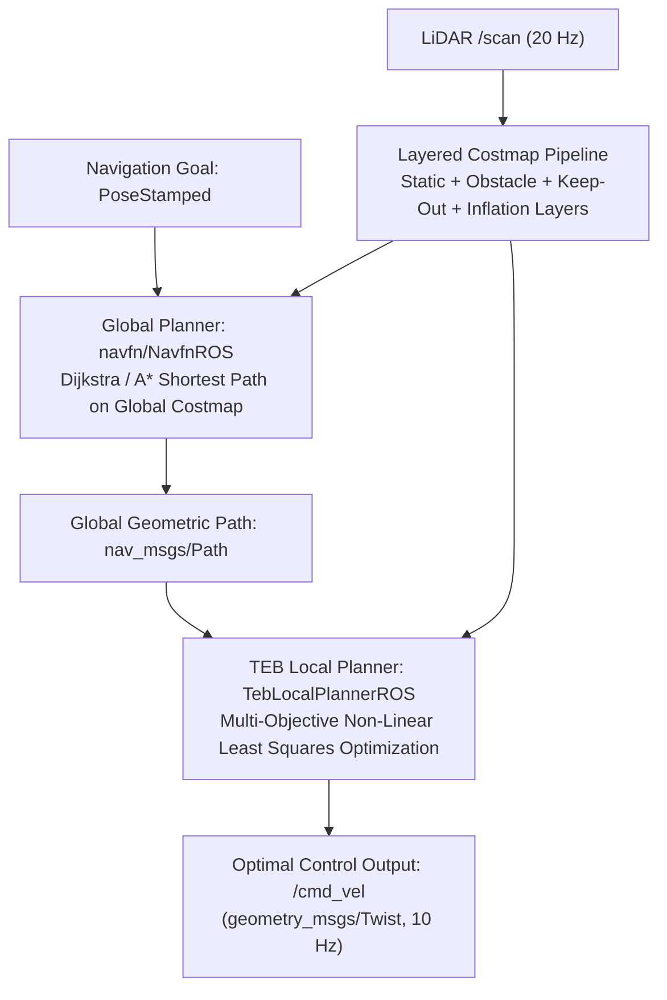

# Costmaps and Motion Planners

<RoleBadge role="developer" />

This document details the layered costmap architecture, global path planning algorithms (`navfn`), and local trajectory optimization mechanics (`teb_local_planner`) implemented in the MSD700 navigation stack.

## Motion Planning Pipeline



---

## Layered Costmap Architecture

The environment is represented as a 2D occupancy grid where each cell holds a cost value between $0$ (free space) and $254$ (lethal obstacle).

### Cost Calculation and Exponential Inflation Decay

When an obstacle cell is identified at position $\mathbf{p}_{obs}$, the cost of any neighboring cell at distance $d = \|\mathbf{p} - \mathbf{p}_{obs}\|$ is computed by the inflation layer:

$$\text{Cost}(d) = \begin{cases}
254 & \text{if } d \le r_{\text{inscribed}} \quad (\text{Lethal Obstacle Buffer}) \\
\text{round}\left( 253 \cdot \exp\left(-\alpha \cdot (d - r_{\text{inscribed}})\right) \right) & \text{if } r_{\text{inscribed}} < d \le r_{\text{inflation}} \\
0 & \text{if } d > r_{\text{inflation}} \quad (\text{Free Space})
\end{cases}$$

### Configured Inflation Parameters:
- **Inscribed Radius ($r_{\text{inscribed}}$)**: $0.35\text{ m}$ (half the width of the planning footprint, `0.90 x 0.70 m`).
- **Inflation Radius ($r_{\text{inflation}}$)**: $0.25\text{ m}$ (lowered from $0.70\text{ m}$ on 2026-09-11).
- **Cost Scaling Factor ($\alpha$)**: $4.0$.

::: warning The gradient band is currently empty
$r_{\text{inflation}} < r_{\text{inscribed}}$, so the middle case of the piecewise cost above never
applies: every inflated cell is inside the inscribed radius and takes the flat $253$, and nothing is
inflated past $0.25\text{ m}$. The result is a hard $0.25\text{ m}$ collar with no decay tail, and
that collar is narrower than the half-width the robot actually occupies, so navfn will route a
centre-line a wall cannot accommodate and TEB has to deviate from it (`inflation_dist` $0.75$,
`weight_inflation` $5.0$, plus the footprint check, are what hold the body off the wall).
Restoring a real gradient means a value above $0.35\text{ m}$.
:::

```yaml
# config/costmap/costmap_common_params.yaml
footprint: [[-0.45, -0.35], [0.45, -0.35], [0.45, 0.35], [-0.45, 0.35]]
footprint_padding: 0.01

obstacle_layer:
  enabled: true
  max_obstacle_height: 2.0
  min_obstacle_height: 0.0
  obstacle_range: 5.5
  raytrace_range: 6.0
  observation_sources: laser_scan_sensor
  laser_scan_sensor:
    sensor_frame: base_scan
    data_type: LaserScan
    topic: /scan
    marking: true
    clearing: true

inflation_layer:
  enabled: true
  inflation_radius: 0.25
  cost_scaling_factor: 4.0
```

---

## Timed-Elastic-Band (TEB) Trajectory Optimization

The `teb_local_planner` formulates trajectory generation as a non-linear multi-objective optimization problem over a sequence of robot states $\mathbf{s}_k = [x_k, y_k, \theta_k]^T$ and time differences $\Delta T_k$:

$$\mathcal{B} = \left\{ \mathbf{s}_0, \Delta T_0, \mathbf{s}_1, \Delta T_1, \dots, \mathbf{s}_N \right\}$$

### Objective Function:
The planner minimizes a weighted sum of objective penalty functions:

$$V(\mathcal{B}) = \sum_k \left( \gamma_{\text{time}} \cdot \Delta T_k^2 + \gamma_{\text{path}} \cdot \|\mathbf{s}_{k+1} - \mathbf{s}_k\|^2 + \gamma_{\text{obs}} \cdot f_{\text{obs}}(\mathbf{s}_k) + \gamma_{\text{kin}} \cdot f_{\text{kin}}(\mathbf{s}_k, \mathbf{s}_{k+1}) \right)$$

### Key Penalty Functions:
1. **Time-Optimality Penalty**:
   $$f_{\text{time}}(\Delta T_k) = \Delta T_k^2$$
   Encourages the robot to reach the goal in minimal time within velocity limits ($v_{\max} = 0.40\text{ m/s}$, $\omega_{\max} = 1.0\text{ rad/s}$).

2. **Obstacle Clearance Penalty**:
   $$f_{\text{obs}}(\mathbf{s}_k) = \begin{cases}
   \left( d_{\min} - \text{dist}(\mathbf{s}_k, \mathcal{O}) \right)^2 & \text{if } \text{dist}(\mathbf{s}_k, \mathcal{O}) < d_{\min} \\
   0 & \text{otherwise}
   \end{cases}$$
   Where $d_{\min} = 0.150\text{ m}$ is the minimum obstacle clearance distance.

3. **Kinematic Non-Holonomic Constraint**:
   Penalizes lateral sliding velocity to enforce differential drive kinematics:
   $$\dot{y}_k \cdot \cos(\theta_k) - \dot{x}_k \cdot \sin(\theta_k) = 0$$

---

## Keep-Out Zones and Dynamic Reconfigure

1. **Keep-Out Grid Layer (`keepout_layer`)**: Subscribes to `/msd700/keepout_grid` where custom operator polygons are rasterized into cost $254$ cells, preventing the global and local planners from generating trajectories across excluded zones.
2. **Coverage Mode Adaptation**: During boustrophedon sweep passes, `path_coverage_node` lowers forward drive weight (`weight_kinematics_forward_drive`) from `1000.0` to `5.0` via `dynamic_reconfigure`, allowing smooth 90-degree comb pivot turns without stalling.

## Related Documentation

- [Boustrophedon Coverage](/ja/development/boustrophedon-and-alignment): Coverage geometry and cell decomposition.
- [Sensor Fusion and Control](/ja/development/sensor-fusion-and-control): Kinematic state estimation and EKF.
- [Simulation](/ja/development/simulation): Warehouse testing environment.
