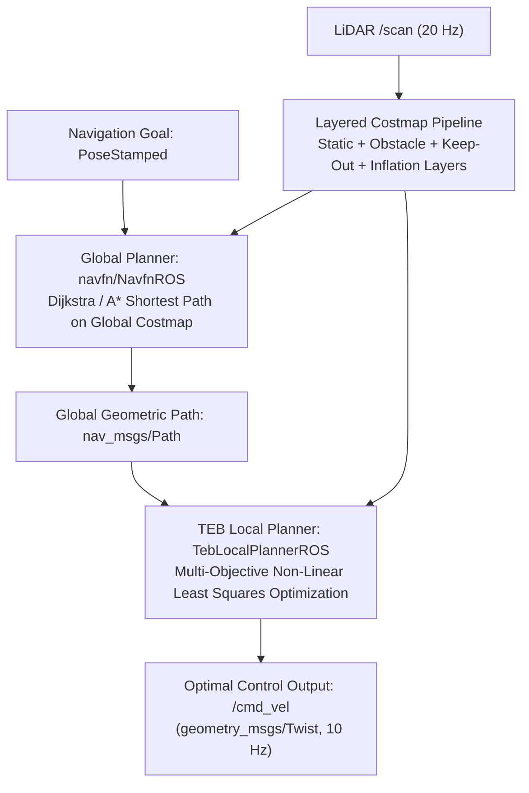

# コストマップとモーション プランナー

<RoleBadge role="developer" />

このドキュメントでは、MSD700 ナビゲーション スタックに実装されている階層化コストマップ アーキテクチャ、グローバル パス プランニング アルゴリズム (`navfn`)、およびローカル軌道最適化メカニズム (`teb_local_planner`) について詳しく説明します。

## モーション プランニング パイプライン



---

## 階層化されたコストマップ アーキテクチャ

環境は 2D 占有グリッドとして表され、各セルは $0$ (空きスペース) から $254$ (致命的な障害物) までのコスト値を保持します。

### コスト計算と指数関数的インフレ減衰

障害セルが $\mathbf{p}_{obs}$ の位置で特定されると、距離 $d = \|\mathbf{p} - \mathbf{p}_{obs}\|$ にある隣接セルのコストがインフレーション層によって計算されます。

$$\text{コスト}(d) = \begin{件}
254 & \text{if } d \le r_{\text{刻印}} \quad (\text{致命的な障害物バッファ}) \\
\text{round}\left( 253 \cdot \exp\left(-\alpha \cdot (d - r_{\text{刻印}})\right) \right) & \text{if } r_{\text{刻印}} < d \le r_{\text{インフレ}} \\
0 & \text{if } d > r_{\text{インフレ}} \quad (\text{空き容量})
\end{件}$$

### 設定されたインフレパラメータ:
- **内接半径 ($r_{\text{inscribed}}$)**: $0.425\text{ m}$ (安全封筒の幅の半分)。
- **インフレ半径 ($r_{\text{inflation}}$)**: $0.575\text{ m}$ ($r_{\text{inscribed}} + 0.150\text{ m}$ 安全マージン)。
- **コスト スケーリング ファクター ($\alpha$)**: $5.0$。

```yaml
# config/costmap/costmap_common_params.yaml
footprint: [[-0.60, -0.425], [-0.60, 0.425], [0.60, 0.425], [0.60, -0.425]]
footprint_padding: 0.01

obstacle_layer:
  enabled: true
  max_obstacle_height: 2.0
  min_obstacle_height: 0.0
  obstacle_range: 5.5
  raytrace_range: 6.0
  observation_sources: laser_scan_sensor
  laser_scan_sensor:
    sensor_frame: base_scan
    data_type: LaserScan
    topic: /scan
    marking: true
    clearing: true

inflation_layer:
  enabled: true
  inflation_radius: 0.575
  cost_scaling_factor: 5.0
```

---

## タイムエラスティックバンド (TEB) 軌道の最適化

`teb_local_planner` は、一連のロボット状態 $\mathbf{s}_k = [x_k, y_k, \theta_k]^T$ と時間差 $\Delta T_k$ にわたる非線形多目的最適化問題として軌道生成を定式化します。

$$\mathcal{B} = \left\{ \mathbf{s}_0, \Delta T_0, \mathbf{s}_1, \Delta T_1, \dots, \mathbf{s}_N \right\}$$

### 目的関数:
プランナーは、目的のペナルティ関数の重み付き合計を最小化します。

$$V(\mathcal{B}) = \sum_k \left( \gamma_{\text{時間}} \cdot \Delta T_k^2 + \gamma_{\text{path}} \cdot \|\mathbf{s}_{k+1} - \mathbf{s}_k\|^2 + \gamma_{\text{obs}} \cdot f_{\text{obs}}(\mathbf{s}_k) + \gamma_{\text{kin}} \cdot f_{\text{kin}}(\mathbf{s}_k, \mathbf{s}_{k+1}) \right)$$

### 主なペナルティ機能:
1. **時間最適化ペナルティ**:
   $$f_{\text{時間}}(\Delta T_k) = \Delta T_k^2$$
   ロボットが速度制限内 ($v_{\max} = 0.40\text{ m/s}$、$\omega_{\max} = 1.0\text{ rad/s}$) 内で最小限の時間でゴールに到達するように促します。

2. **障害物クリアランスペナルティ**:
   $$f_{\text{obs}}(\mathbf{s}_k) = \begin{cases}
   \left( d_{\min} - \text{dist}(\mathbf{s}_k, \mathcal{O}) \right)^2 & \text{if } \text{dist}(\mathbf{s}_k, \mathcal{O}) < d_{\min} \\
   0 & \text{そうでない場合}
   \end{件}$$
   $d_{\min} = 0.150\text{ m}$ は障害物との最小距離です。

3. **運動学的非ホロノミック制約**:
   横方向のスライド速度にペナルティを課して、差動駆動運動学を適用します。
   $$\dot{y}_k \cdot \cos(\theta_k) - \dot{x}_k \cdot \sin(\theta_k) = 0$$

---

## キープアウト ゾーンと動的再構成

1. **キープアウト グリッド レイヤー (`keepout_layer`)**: `/msd700/keepout_grid` をサブスクライブし、カスタム オペレーター ポリゴンがコスト $254$ のセルにラスタライズされ、グローバルおよびローカル プランナーが除外ゾーンを越える軌道を生成するのを防ぎます。
2. **カバレッジ モードの適応**: ブーストロフェドン スイープ パス中、`path_coverage_node` はフォワード ドライブ ウェイト (`weight_kinematics_forward_drive`) を `1000.0` から `dynamic_reconfigure` 経由で `5.0` に下げ、失速することなくスムーズな 90 度のコーム ピボット ターンを可能にします。

## 関連ドキュメント

- [Boustrophedon Coverage](/ja/development/boustrophedon-and-alignment): カバレッジのジオメトリとセルの分解。
- [センサーフュージョンと制御](/ja/development/sensor-fusion-and-control): 運動学的状態推定と EKF。
- [シミュレーション](/ja/development/simulation): 倉庫のテスト環境。