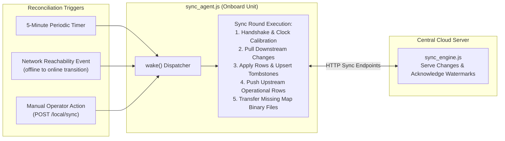
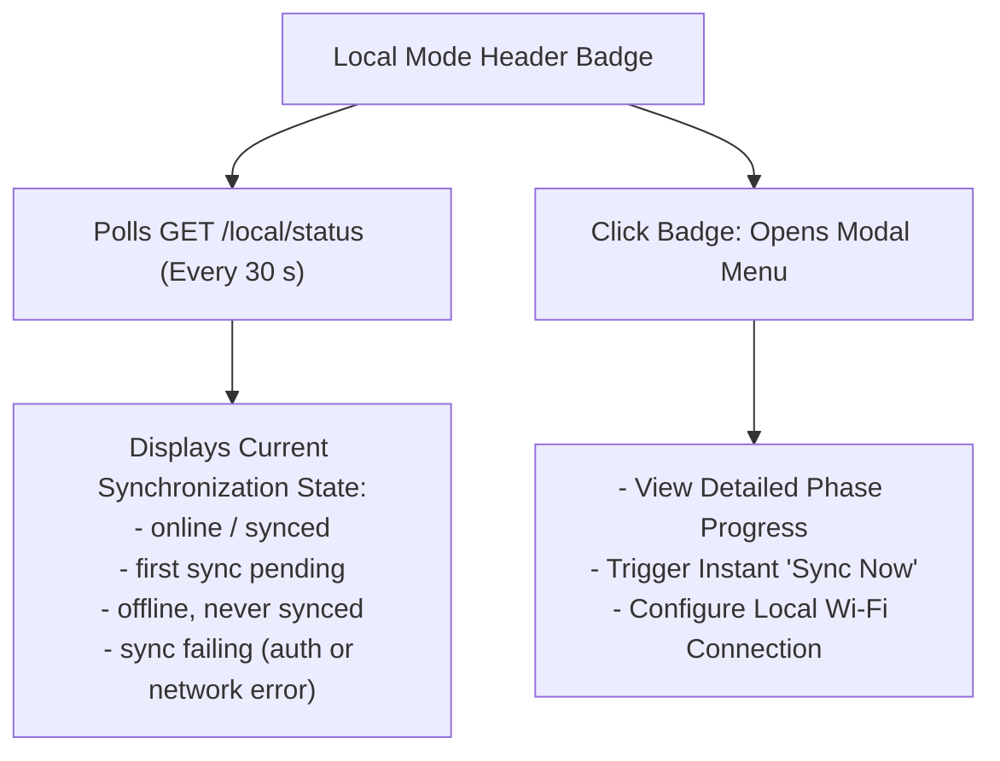

# データ同期

<RoleBadge role="developer" />

このドキュメントでは、ユニットのローカル MySQL データベース (`ROS_DB`) と中央のクラウド データベースが、断続的なワイヤレス接続全体で双方向の一貫性を維持する方法について詳しく説明します。

反復的な調整ループ (`sync_agent.js`、`sync_engine.js`、`sync_tables.js`)、競合解決アルゴリズム、ウォーターマーク追跡、およびローカル モード オペレーター ステータス バッジについて説明します。

HTTP 同期コントラクトについては、[API リファレンス](/ja/development/api-reference) を参照してください。リアルタイムのマップ保存アップロードについては、[状態と動作](/ja/development/state-and-behavior) を参照してください。

::: info Core Principle: Local as Cache
ユニットは、一度登録されると無期限にオフラインで機能します。ユーザー アカウント、権限、レンタル プロファイルはクラウドから生成され、ロボットに記録されたマップ、ルート、プレイリストは、ネットワーク リンクが確立されるとクラウドに同期されます。
:::

## テーブル同期方式

すべてのデータベース テーブルが同じ方向に同期するわけではありません。

|同期方向 |影響を受けるテーブル |アーキテクチャの理論的根拠 |
| --- | --- | --- |
| **ダウンストリームのみ** (クラウドからユニット) | `units`、`rental_profiles`、`users` (オフライン ログイン用の bcrypt パスワード ハッシュを含む)、`profile_members`、`profile_units`。 |セキュリティ境界: ID とレンタル テナントは厳密にクラウド サーバー上で発生します。ローカル ユニットは、新しいグローバル アカウントを作成したり、独自のフリート テナントを再割り当てしたりすることはできません。 |
| **双方向** (行ごとに最終書き込み優先) | `maps_data`、`routes_data`、`areas_data`、`playlists_data`。 |運用データは、ロボットに記録された SLAM マップと、Web ダッシュボードで作成されたウェイポイント ルートまたはプレイリストの両方で作成されます。 |

バイナリ アセット (`.pgm` 占有グリッド、`.yaml` メタデータ、マップ サムネイルなど) は専用エンドポイント (`/sync/file/:mapId/:kind`) 経由で同期され、正確なファイル サイズによって検証されます。

## 同期メカニズム

### 主要コンポーネント:
- **`sync_agent.js`**: ユニット上で排他的に実行され、ポーリング タイマー、到達可能性プローブ、クラウド エンドポイントへのアウトバウンド HTTP 呼び出しを管理します。 (クラウドは NAT の背後でロボットにダイヤルインしません)。
- **`sync_engine.js`**: ウォーターマークに基づいて変更された行をクエリし、更新/挿入を実行し、削除トゥームストーンを管理する両側の共有ライブラリ。
- **`sync_tables.js`**: 各テーブルの同期方向、主キー、競合解決ルールを定義します。

## 競合解決ルール

競合の解決は、決定論的な **Last-Write-Wins per row** 戦略に従います。

1. **行レベルの粒度**: 新しい行が古いレコードを完全に置き換えます。
2. **トゥームストーンの削除**: レコードを削除すると、`deleted_at` タイムスタンプを持つエントリが `sync_tombstones` に生成されます。最近の削除は古い編集よりも優先されます。
3. **クロック スキュー補償**: 最初のハンドシェイク中に、ユニットはクラウド サーバー時間に対して `clock_offset_ms` を計算します。すべてのローカル タイムスタンプは、比較前にクラウド時間参照フレームに正規化されます。
4. **決定的タイブレ​​ーク**: タイムスタンプが正確に一致する場合、削除は編集よりも優先され、クラウド バージョンはユニット バージョンよりも優先されます。
5. **名前の衝突処理**: オフライン中に 2 人のオペレーターが同じ名前で異なるルートまたはマップを作成した場合、後の同期では既存のデータを上書きするのではなく、増分サフィックス (例: `(1)`、`(2)`) が自動的に追加されます。

## ローカル モード ステータス バッジ

ローカル ダッシュボード ビルド (`NEXT_PUBLIC_DEPLOYMENT_MODE=local`) では、右上のヘッダーにローカル モード バッジが表示されます。

### 詳細な同期フェーズ:
1. `token`: ロボットの資格情報を使用してクラウド サーバーで認証します。
2. `handshake`: ウォーターマークを交換し、クロック オフセットを調整します。
3. `pull`: ダウンストリーム アカウントとプロファイルの更新をダウンロードしています。
4. `apply`: プルしたレコードをローカル MySQL にコミットします。
5. `push`: ローカルに記録された地図とルートをクラウドにアップロードします。
6. `files`: バイナリ `.pgm` および `.yaml` マップ イメージを転送します。
7. `finish`: コミットされたウォーターマークを確認します。

## 関連ドキュメント

- [API リファレンス](/ja/development/api-reference): REST 同期エンドポイントとペイロード。
- [状態と動作](/ja/development/state-and-behavior): マップの保存とストレージ レプリケーション フロー。
- [アーキテクチャ](/ja/development/architecture): ハードウェアおよびクラウドの信頼ドメイン モデル。
- [データベース スキーマ](/ja/development/database-schema): `sync_state` および `sync_tombstones` のスキーマ定義。