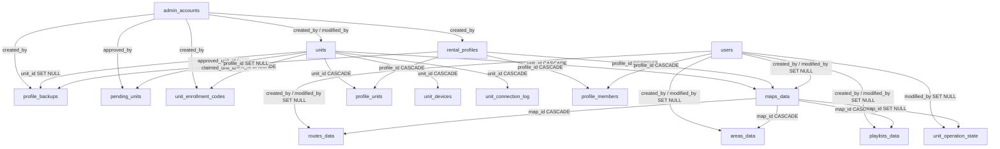

# データベーススキーマ

<RoleBadge role="developer" />

`ROS_DB` の 18 個のテーブル。目的別にグループ化されており、間に外部キーが含まれています。の
正規のソースは `ROS-dashboard-backend/sql/init.sql` で、空の MySQL に対してのみ実行されます。
データディレクトリ。既存のデプロイメントでは、移行スクリプトを通じてスキーマの変更が取得されます。
代わりに `ROS-dashboard-backend/scripts/` (`migrate_unit_id_refactor.js`、`migrate_enrolment.js`、
`migrate_sync.js`、`migrate_backup_scope.js`)。 API が実際に返す行の形状については、
[API リファレンス](/ja/development/api-reference) を参照してください。このページでは列と関係について説明します。
応答 JSON ではありません。

## ID とアクセス

|表 |目的 |キー列 |
| --- | --- | --- |
| `users` |オペレーターアカウント | `id` (ULID、PK)、`username`、`email`、`password` (bcrypt)、`status` (`active`/`suspended`) |
| `admin_accounts` |バックオフィスアカウント、`users` から意図的に分離 | `id` (ULID、PK)、`role` (`superadmin`/`admin`)、`must_change_password` |
| `rental_profiles` |レンタルごとに 1 列。一時停止すると、ユニットとそのデータの両方がメンバーから非表示になり、どちらにも触れなくなります。 `id` (ULID、PK)、`profile_name` (一意)、`tenant_name`、`status` |
| `units` |フリート全体の物理ロボットごとに 1 行。 `unit_name` は名前変更可能な表示ラベルであり、ID ではありません | `id` (ULID、PK): これはロボットのアドレスです。`/unit_<id>/...` |
| `profile_members` |どのアカウントがどのプロファイルに属するか | `UNIQUE(profile_id, user_id)`、両方 `ON DELETE CASCADE` |
| `profile_units` |プロファイルがアクセスできるユニット | `UNIQUE(unit_id)`、**ではありません** `(profile_id, unit_id)` したがって、ユニットを二重に割り当てることはできません。

::: info `users.status` is written, not yet enforced
`PATCH /admin/api/users/:id/status` はこの列を書き込みますが、`/user/login` はそれを読み取りません。
一時停止されたオペレータの既存のセッションは動作し続け、再度ログインできます。この 2 つは
意図的に分離されているため、管理コンソールを立ち上げてもライブ デプロイメントがロックアウトされることはありません
独自のロボットの。ログイン境界でこれを強制するのは、別個の作業です。これは
*一時停止されたレンタル プロファイル*とは異なるメカニズムで、ユニットとそのユニットが直ちに削除されます。
すべてのメンバーのビューからのデータ ([API リファレンス § レンタル プロファイル](/ja/development/api-reference#rental-profiles) を参照)。
:::

## 運用データ (マップごと)

|表 |目的 |キー列 |
| --- | --- | --- |
| `maps_data` |記録された地図 | `unit_id` → `units` (`ON DELETE CASCADE`、どのロボットが録画したのか)、 `profile_id` → `rental_profiles` (`ON DELETE RESTRICT`、どのレンタルが所有しているのか)、 `UNIQUE(map_name, unit_id, profile_id)` |
| `routes_data` |保存されたマルチピンポイントルート | `map_id` → `maps_data` (`ON DELETE CASCADE`)、`route_points` (JSON)、`UNIQUE(route_name, map_id)` |
| `areas_data` |保存されたカバーエリア | `map_id` → `maps_data` (`ON DELETE CASCADE`)、 `area_type` (`cover`/`no_cover`)、 `polygon_points` (JSON)、 `UNIQUE(area_name, map_id)` |
| `playlists_data` |順番にスイープするエリアの順序付きリスト | `map_id` → `maps_data` (`ON DELETE CASCADE`)、`items` (JSON、参照ではなく各領域のジオメトリの **スナップショット**)、`UNIQUE(playlist_name, map_id)` |
| `unit_operation_state` |ユニット自体の現在のモード、バックエンド再起動後の回復用 | PK **は** `unit_id` そのものです。1 台のロボットは 1 つのことしか実行できないからです。

`maps_data` は、ユニットではなく、それを録画したレンタルに意図的にロックされています: ユニット
別のテナントに再レンタルしても、以前のテナントの地図は引き継がれません。
レンタル側は、地図を記録したユニットを運転できなくなっても、地図を保持します。参照
その仕組みについては、[API リファレンス § レンタル プロファイル](/ja/development/api-reference#rental-profiles) をご覧ください。
アクセス層で。

## 登録

|表 |目的 |キー列 |
| --- | --- | --- |
| `unit_devices` |ユニットにバインドされた 1 つのデバイス認証情報 | `UNIQUE(unit_id)`、`secret_hash` + `secret_prev_hash` (前の世代は次にトークン交換が成功するまで有効なままなので、シークレットをローテーションしてもローテーション中にロボットをブリックすることはできません)
| `pending_units` |挨拶したもののまだ引き取られていないロボット | `fingerprint` (一意)、`claim_code`、`nonce_hash`、`status` (`pending`/`approved`/`claimed`/`rejected`)、`contact_count` (このエンドポイントは設計上認証されていないため、連絡先ごとのログではなくカウンター) |
| `unit_enrollment_codes` |ロボットが存在する前に特定のユニットを請求するための使い捨てバウチャー | `unit_id`、`code_hash`、`expires_at`、`used_at` |
| `unit_connection_log` |追加専用の接続履歴 | ULID ではなく、プレーンな `AUTO_INCREMENT` PK を持つ唯一のテーブル。過去 180 日間にパージされました |

完全なやり取りについては、[メッセージ契約 § 登録](/ja/development/message-contracts#enrolment) を参照してください。
これらのテーブルはサポートしています。

## バックアップと同期

|表 |目的 |キー列 |
| --- | --- | --- |
| `profile_backups` |アーカイブマニフェスト | `scope` (`profile` または `unit`: プロファイル スコープのアーカイブは、使用したすべてのロボットにわたる 1 つのテナントをカバーし、ユニット スコープのアーカイブは、それを使用したすべてのテナントにわたる 1 つのロボットをカバーします)、`profile_id`/`unit_id` 両方 `ON DELETE SET NULL` (アーカイブは、アーカイブされたものよりも存続する必要があります) |
| `sync_tombstones` |クロスデバイス同期のレコードを削除する | `UNIQUE(table_name, row_id)`、外部キーはまったくありません。トゥームストーンは行、場合によってはユニットよりも存続する必要があるため、 | を参照します。
| `sync_state` |同期ピアごとに 1 行 | PK `peer` (ユニット上の `'cloud'`、クラウド上のユニットの ULID)、`last_pull_watermark`、`last_push_watermark`、`last_pull_profile_id`、`clock_offset_ms` |

これら 2 つのテーブルが実際にどのように使用されるかについては、[データ同期](/ja/development/data-sync) を参照してください。

## 外部キー、完全な

::: info Attribution is never authorization
`created_by` / `modified_by` 上の `maps_data`、`routes_data`、`areas_data` および `playlists_data` には、
**ユーザー ULID**。決して名前ではなく、誰が行に触れたかを伝えるためにのみ使用され、誰が誰であるかを決定することはありません。
それを表示または変更することができます。どちらも `NULL` であり、アカウントがすでに存在しないクリエイターであることは安全です。
行を分割するのではなく、*unknown* としてレンダリングされます。アクセス自体は完全にレンタルで運営されています
プロファイル ([API リファレンス § レンタル プロファイル](/ja/development/api-reference#rental-profiles) を参照)。
:::

## `created_at` / `modified_at`

2026-08-01 にスキーマ全体で統一されたタイムスタンプ規則
(`created_at TIMESTAMP NOT NULL DEFAULT CURRENT_TIMESTAMP`,
`modified_at TIMESTAMP NOT NULL DEFAULT CURRENT_TIMESTAMP ON UPDATE CURRENT_TIMESTAMP`) は 15 に適用されます
18 テーブルのうち。 3 つは省略ではなく、意図的にそこから外れています。

|表 |代わりに何があるか |なぜ |
| --- | --- | --- |
| `pending_units` | `first_seen_at` / `last_seen_at` |このテーブルは、編集履歴のあるレコードではなく、*連絡先*を追跡します。
| `unit_enrollment_codes` | `created_at` のみ |バウチャーは不変です。そのライフサイクルは `used_at` であり、更新タイムスタンプではありません。
| `unit_connection_log` | `connected_at` のみ |追加専用のログ。行が書き込まれた後は更新されません。

## デプロイメントプロファイルごとのデータベース

データベース名は常に `ROS_DB` です。異なるのはホストとポートです。

|プロフィール |ホスト:ポート |
| --- | --- |
|ユニット (`local_dev`) | `127.0.0.1:3306` (`network_mode: host`)
|クラウド`server_prod` |コンテナ ポート `3306`、ホスト上で `3307` として公開 |
|クラウド`server_dev` |コンテナ ポート `3306`、ホスト上で `3308` として公開 |

`migrate_backup_scope.js` はこのペアリングをハードコーディングしており、**明示的な指定がなければ実行を拒否します。
`--profile`** フラグ。具体的には、フォールバックのデフォルトがメンテナンス スクリプトをポイントできないようにするためです。
間違ったデータベース。 [Docker リファレンス § サービスとポート マップ](/ja/setup/docker-reference#service-and-port-map) を参照してください。
これらのポートが構成プロファイルの残りの部分にどのように適合するかについて説明します。

## 理由を知る価値のあるインデックス

|インデックス |理由 |
| --- | --- |
| `maps_data.unique_map_unit (map_name, unit_id, profile_id)` | 2 つの異なるテナントは、他のテナントのテナントを確認せずに、同じロボット上のマップに同じ名前を付けることができます。
| `profile_units.unique_rented_unit (unit_id)` |二重割り当ては、既存のものを静かに上書きするのではなく、大声で失敗します。
| `unit_devices.unique_device_unit (unit_id)` | 2 つのロボットが同じトピック ルートに書き込むことは決してできません。
| `unit_connection_log.idx_conn_unit_time (unit_id, connected_at)` | 1 つのインデックスでユニットごとの履歴クエリと 180 日のパージ ジョブの両方をサポートします。

## 関連

- [API リファレンス](/ja/development/api-reference): このスキーマに基づいて構築された HTTP サーフェス
- [データ同期](/ja/development/data-sync): `sync_tombstones` と `sync_state` の使用方法
- [メッセージ契約 § 登録](/ja/development/message-contracts#enrolment)
- [建築](/ja/development/architecture)