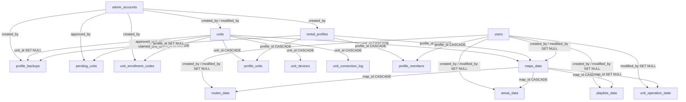

# データベース設計

<RoleBadge role="developer" />

`ROS_DB` にある18のテーブルを、用途ごとにグループ化し、それらの間の外部キーとともに示します。正典となる
情報源は `ROS-dashboard-backend/sql/init.sql` であり、これは空の MySQL データディレクトリに対してのみ
実行されます。既存のデプロイでは、`ROS-dashboard-backend/scripts/` 内のマイグレーションスクリプト
(`migrate_unit_id_refactor.js`、`migrate_enrolment.js`、`migrate_sync.js`、`migrate_backup_scope.js`)を
通じてスキーマの変更を取り込みます。API が実際に返す行の形については
[API リファレンス](/ja/development/api-reference) を参照してください。このページが扱うのはカラムと
関係性であり、レスポンス JSON ではありません。

## 識別とアクセス

| テーブル | 用途 | 主要カラム |
| --- | --- | --- |
| `users` | オペレーターアカウント | `id`(ULID、PK)、`username`、`email`、`password`(bcrypt)、`status`(`active`/`suspended`) |
| `admin_accounts` | バックオフィス用アカウント。`users` とは意図的に分離されている | `id`(ULID、PK)、`role`(`superadmin`/`admin`)、`must_change_password` |
| `rental_profiles` | レンタルごとに1行。これをサスペンドすると、ユニットとそのデータの両方がメンバーから見えなくなるが、どちらにも手を加えない | `id`(ULID、PK)、`profile_name`(一意)、`tenant_name`、`status` |
| `units` | 物理ロボットごとに1行、フリート全体で共通。`unit_name` はリネーム可能な表示ラベルであり、識別子ではない | `id`(ULID、PK): これがロボットのアドレスであり、`/unit_<id>/...` となる |
| `profile_members` | どのアカウントがどのプロファイルに属するか | `UNIQUE(profile_id, user_id)`、両方とも `ON DELETE CASCADE` |
| `profile_units` | プロファイルがアクセスできるユニット | `UNIQUE(unit_id)`。`(profile_id, unit_id)` では**ない**ため、ユニットが二重に割り当てられることは決してない |

::: info `users.status` は書き込まれるが、まだ強制されていない
`PATCH /admin/api/users/:id/status` はこのカラムに書き込みますが、`/user/login` はこれを読みません。
サスペンドされたオペレーターの既存セッションは動作し続け、再びログインすることもできます。この2つは、
管理コンソールを立ち上げることが決して稼働中のデプロイを自身のロボットから締め出すことのないよう、
意図的に分離されています。ログイン境界でこれを強制するのは別の作業です。これは*サスペンドされた
レンタルプロファイル*とは異なるメカニズムであり、後者はユニットとそのデータをすべてのメンバーの
ビューから即座に除去します([管理コンソール § Rentals](/ja/development/webui/admin-console/rentals) 参照)。
:::

## 運用データ(マップごと)

| テーブル | 用途 | 主要カラム |
| --- | --- | --- |
| `maps_data` | 記録されたマップ | `unit_id` → `units`(`ON DELETE CASCADE`、どのロボットが記録したか)、`profile_id` → `rental_profiles`(`ON DELETE RESTRICT`、どのレンタルが所有するか)、`UNIQUE(map_name, unit_id, profile_id)` |
| `routes_data` | 保存された複数ピンポイントルート | `map_id` → `maps_data`(`ON DELETE CASCADE`)、`route_points`(JSON)、`UNIQUE(route_name, map_id)` |
| `areas_data` | 保存されたカバレッジエリア | `map_id` → `maps_data`(`ON DELETE CASCADE`)、`area_type`(`cover`/`no_cover`)、`polygon_points`(JSON)、`UNIQUE(area_name, map_id)` |
| `playlists_data` | 順にスイープするエリアの順序付きリスト | `map_id` → `maps_data`(`ON DELETE CASCADE`)、`items`(JSON。参照ではなく各エリアのジオメトリの**スナップショット**)、`UNIQUE(playlist_name, map_id)` |
| `unit_operation_state` | バックエンド再起動後の復旧のための、ユニット自身の現在のモード | PK 自体が `unit_id` である。1台のロボットは同時に1つのことしかできないため |

`maps_data` は意図的に、ユニットではなくそれを記録したレンタルに紐づけられています。別のテナントに
再レンタルされたユニットは、以前のテナントのマップを一切引き継ぎません。また、レンタルが終了した
テナントは、もはやそのマップを記録したユニットを運転できなくなっても、自分のマップを保持し続けます。
これがアクセス層でどのように働くかについては
[管理コンソール § Rentals](/ja/development/webui/admin-console/rentals) を参照してください。

このルールが答えるのは「この行をそもそも見てよいか」という問いです。これは「この**ロボット**を運転している
間、どのマップが画面に表示されるべきか」という問いとは同じではなく、両者は 2026-09-10 まで混同されて
いました。複数のロボットを保有するレンタルは、データベースページで全ロボットのマップを一緒に一覧表示して
おり、画面上にはどれがどれかを示すものが何もありませんでした。兄弟ロボットのマップを選ぶと、ロボットは
自分が一度も記録したことのないファイルを持つマップ ULID を渡され、navigation init が送信され、ユニットは
マップを解決できず、ダッシュボードが起動成功を報告している間にそのランはそこで停止していました。
`unit_id` は現在、レンタルスコープの上に運用ビューをさらに絞り込みます。両方が必須であり、どちらも
もう一方を置き換えるものではありません。

## 登録

| テーブル | 用途 | 主要カラム |
| --- | --- | --- |
| `unit_devices` | ユニットに紐づく唯一のデバイス資格情報 | `UNIQUE(unit_id)`、`secret_hash` + `secret_prev_hash`(前世代は次回のトークン交換が成功するまで有効であり続けるため、シークレットのローテーション中にロボットが動かなくなることはない) |
| `pending_units` | あいさつはしたがまだクレームされていないロボット | `fingerprint`(一意)、`claim_code`、`nonce_hash`、`status`(`pending`/`approved`/`claimed`/`rejected`)、`contact_count`(このエンドポイントは意図的に未認証であるため、コンタクトごとのログではなくカウンター) |
| `unit_enrollment_codes` | ロボットが存在する前に特定のユニットをクレームするための使い捨てバウチャー | `unit_id`、`code_hash`、`expires_at`、`used_at` |
| `unit_connection_log` | 追記専用の接続履歴 | ULID ではなく普通の `AUTO_INCREMENT` PK を持つ唯一のテーブル。180日を過ぎたものはパージされる |

これらのテーブルがサポートするやり取りの詳細については
[メッセージ仕様 § 登録](/ja/development/message-contracts#enrolment) を参照してください。

## バックアップと同期

| テーブル | 用途 | 主要カラム |
| --- | --- | --- |
| `profile_backups` | アーカイブのマニフェスト | `scope`(`profile` または `unit`: profile スコープのアーカイブは1つのテナントが使用したすべてのロボットにまたがり、unit スコープのアーカイブは1台のロボットを使用したすべてのテナントにまたがる)、`profile_id`/`unit_id` はいずれも `ON DELETE SET NULL`(アーカイブはアーカイブ対象より長く存続しなければならない) |
| `sync_tombstones` | デバイス間同期のための削除記録 | `UNIQUE(table_name, row_id)`、外部キーは一切なし。トゥームストーンは、それが参照する行、そしておそらくユニットよりも長く存続する必要があるため |
| `sync_state` | 同期ピアごとに1行 | PK は `peer`(ユニット上では `'cloud'`、クラウド上ではそのユニットの ULID)、`last_pull_watermark`、`last_push_watermark`、`last_pull_profile_id`、`clock_offset_ms` |

これら2つのテーブルが実際にどう使われるかについては [データ同期](/ja/development/data-sync) を参照してください。

## 外部キー、完全版

::: info 帰属(Attribution)は決して認可(Authorization)ではない
`maps_data`、`routes_data`、`areas_data`、`playlists_data` の `created_by` / `modified_by` は、名前ではなく
**ユーザー ULID** を保存し、誰がその行に触れたかを示すためだけに使われ、誰がそれを見たり変更したりできるかを
決定するためには決して使われません。どちらも `NULL` になっても安全で、アカウントがもう存在しない作成者は、
行を壊すのではなく*不明*としてレンダリングされます。アクセス制御自体は完全にレンタルプロファイルを通じて
行われます([管理コンソール § Rentals](/ja/development/webui/admin-console/rentals) 参照)。
:::

## `created_at` / `modified_at`

2026-08-01 にスキーマ全体で統一されたタイムスタンプ規約
(`created_at TIMESTAMP NOT NULL DEFAULT CURRENT_TIMESTAMP`、
`modified_at TIMESTAMP NOT NULL DEFAULT CURRENT_TIMESTAMP ON UPDATE CURRENT_TIMESTAMP`)は、
18テーブル中15テーブルに適用されています。残り3つは、見落としではなく意図的にこれから外れています。

| テーブル | 代わりに持つもの | 理由 |
| --- | --- | --- |
| `pending_units` | `first_seen_at` / `last_seen_at` | このテーブルが追跡するのは*コンタクト*であり、編集履歴を持つレコードではない |
| `unit_enrollment_codes` | `created_at` のみ | バウチャーは不変であり、そのライフサイクルは更新タイムスタンプではなく `used_at` である |
| `unit_connection_log` | `connected_at` のみ | 追記専用ログであり、行が書き込まれた後に更新されることはない |

## デプロイプロファイルごとのデータベース

データベース名は常に `ROS_DB` です。異なるのはホストとポートです。

| プロファイル | Host:port |
| --- | --- |
| ユニット(`local_dev`) | `127.0.0.1:3306`(`network_mode: host`) |
| クラウド `server_prod` | コンテナポート `3306`、ホスト上では `3307` として公開 |
| クラウド `server_dev` | コンテナポート `3306`、ホスト上では `3308` として公開 |

`migrate_backup_scope.js` はこの組み合わせをハードコードしており、フォールバックのデフォルトが
誤ったデータベースをメンテナンススクリプトの対象にすることが決してないよう、明示的な `--profile`
フラグなしでは**実行を拒否します**。これらのポートが compose プロファイルの他の部分とどう組み合わさるか
については、[Docker リファレンス § サービスとポートのマッピング](/ja/setup/docker-reference#サービスとポートの対応表)
を参照してください。

## 知っておく価値のあるインデックス

| インデックス | 理由 |
| --- | --- |
| `maps_data.unique_map_unit (map_name, unit_id, profile_id)` | 2つの異なるテナントは、同じロボット上で同じ名前のマップを、互いのものを見ることなく付けることができる |
| `profile_units.unique_rented_unit (unit_id)` | 二重割り当ては、既存のものを黙って上書きするのではなく、明確に失敗する |
| `unit_devices.unique_device_unit (unit_id)` | 2台のロボットが同じトピックルートに書き込むことになる事態は決して起こらない |
| `unit_connection_log.idx_conn_unit_time (unit_id, connected_at)` | ユニット単位の履歴クエリと180日パージジョブの両方を、1つのインデックスでサポートする |

## 関連

- [API リファレンス](/ja/development/api-reference): このスキーマの上に構築された HTTP サーフェス
- [データ同期](/ja/development/data-sync): `sync_tombstones` と `sync_state` がどう使われるか
- [メッセージ仕様 § 登録](/ja/development/message-contracts#enrolment)
- [アーキテクチャ](/ja/development/architecture)
