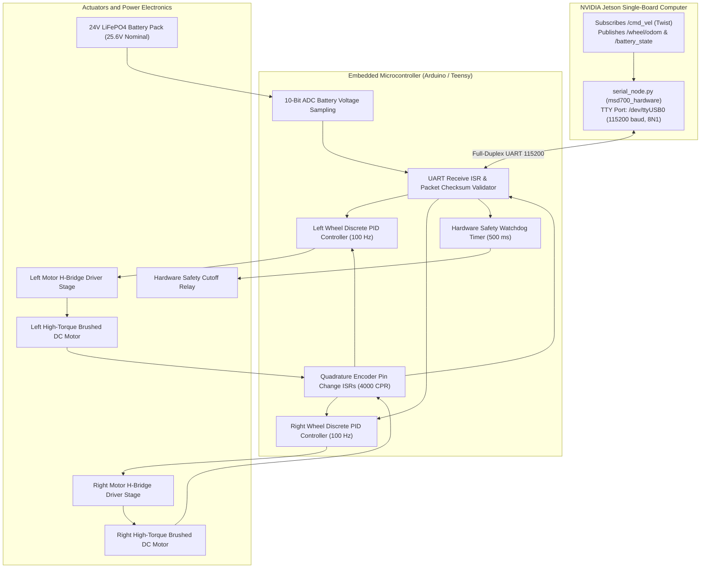

# Firmware, Microcontroller, and Hardware Bus

<RoleBadge role="developer" />

This document provides a deep technical specification of the embedded microcontroller firmware, motor driver interfaces, optical encoder decoding, discrete PID velocity control algorithms, and analog telemetry circuitry implemented on the MSD700 robot.

## Embedded Control Topology

---

## Hardware Electrical Pinout and Wiring

Communication between the NVIDIA Jetson and microcontroller runs over high-speed USB UART with optical isolation:

| Signal Function | Microcontroller Pin | Driver / Peripheral Connection | Electrical Characteristics |
| --- | --- | --- | --- |
| **Left Motor PWM** | Pin 5 (Timer 3) | Left H-Bridge Speed Gate | 0 to 5V Logic, 20 kHz PWM (Quiet Inaudible Drive) |
| **Left Motor DIR** | Pin 4 | Left H-Bridge Direction Input | Logic High: Forward, Logic Low: Reverse |
| **Right Motor PWM** | Pin 6 (Timer 4) | Right H-Bridge Speed Gate | 0 to 5V Logic, 20 kHz PWM |
| **Right Motor DIR** | Pin 7 | Right H-Bridge Direction Input | Logic High: Forward, Logic Low: Reverse |
| **Left Encoder A** | Pin 2 (INT0) | Left Optical Encoder Channel A | 5V TTL Interrupt (Rising/Falling Edge) |
| **Left Encoder B** | Pin 3 (INT1) | Left Optical Encoder Channel B | 5V TTL Interrupt |
| **Right Encoder A** | Pin 18 (INT5) | Right Optical Encoder Channel A | 5V TTL Interrupt |
| **Right Encoder B** | Pin 19 (INT4) | Right Optical Encoder Channel B | 5V TTL Interrupt |
| **Battery Voltage ADC**| Pin A0 (ADC0) | Precision Resistor Divider Output | 0 to 5.0V Analog Voltage |
| **E-Stop Safety Line** | Pin 12 | Hardware Relay Gate Driver | Logic High: Motors Enabled, Low: Cutoff |

---

## Closed-Loop Discrete PID Velocity Control

The firmware runs dual discrete PID control loops at $100\text{ Hz}$ ($\Delta t = 0.01\text{ s}$) with anti-windup clamping to control wheel velocity:

### Discrete Error Formulation:
$$e_k = v_{\text{target}} - v_{\text{measured}}$$

### PID Control Output with Clamping:
$$\text{PWM}_k = K_p \cdot e_k + K_i \sum_{j=0}^k e_j \cdot \Delta t + K_d \cdot \frac{e_k - e_{k-1}}{\Delta t}$$

### Anti-Windup Integrator Protection:
To prevent integrator windup when motors are temporarily loaded or stalled against an incline:

$$\sum e_j \cdot \Delta t = \text{clamp}\left( \sum e_j \cdot \Delta t, -I_{\max}, I_{\max} \right)$$

$$\text{PWM}_k = \text{clamp}(\text{PWM}_k, -\text{PWM}_{\max}, \text{PWM}_{\max})$$

Where $\text{PWM}_{\max} = 255$ ($8$-bit timer resolution).

---

## Battery Voltage Sensing Circuitry

The robot is powered by a 24V LiFePO4 battery pack (full charge: $29.2\text{ V}$, nominal: $25.6\text{ V}$, cutoff: $21.0\text{ V}$).

An onboard voltage divider scales battery voltage down to the $0\text{ to }5\text{ V}$ range of the microcontroller ADC:

$$V_{adc} = V_{bat} \cdot \frac{R_2}{R_1 + R_2}$$

Where $R_1 = 30\text{ k}\Omega$ and $R_2 = 5.1\text{ k}\Omega$ (Divider Ratio $K_{div} = 0.1453$).

### Voltage Reconstruction in Firmware:
$$V_{bat} = \frac{\text{ADC\_RAW}}{1024} \cdot V_{ref} \cdot \left( \frac{R_1 + R_2}{R_2} \right)$$

Where $V_{ref} = 5.00\text{ V}$.

---

## Hardware Safety Watchdog

To prevent runaway robot conditions caused by host OS lockups or severed serial cables, the microcontroller executes an autonomous hardware watchdog:

1. **Timer Expiry**: The watchdog timer register resets to $500\text{ ms}$ upon every valid checksum-verified velocity packet.
2. **Safety Cutoff**: If no packet arrives for $500\text{ ms}$, the microcontroller immediately clamps motor PWM outputs to zero and drops the `ESTOP_RELAY` gate line.

## Related Documentation

- [Sensor Fusion and Control](/ja/development/sensor-fusion-and-control): Odometry integration and EKF.
- [Costmaps and Planners](/ja/development/costmaps-and-planners): Velocity limit parameters.
- [State and Behavior](/ja/development/state-and-behavior): Emergency stop state machines.
