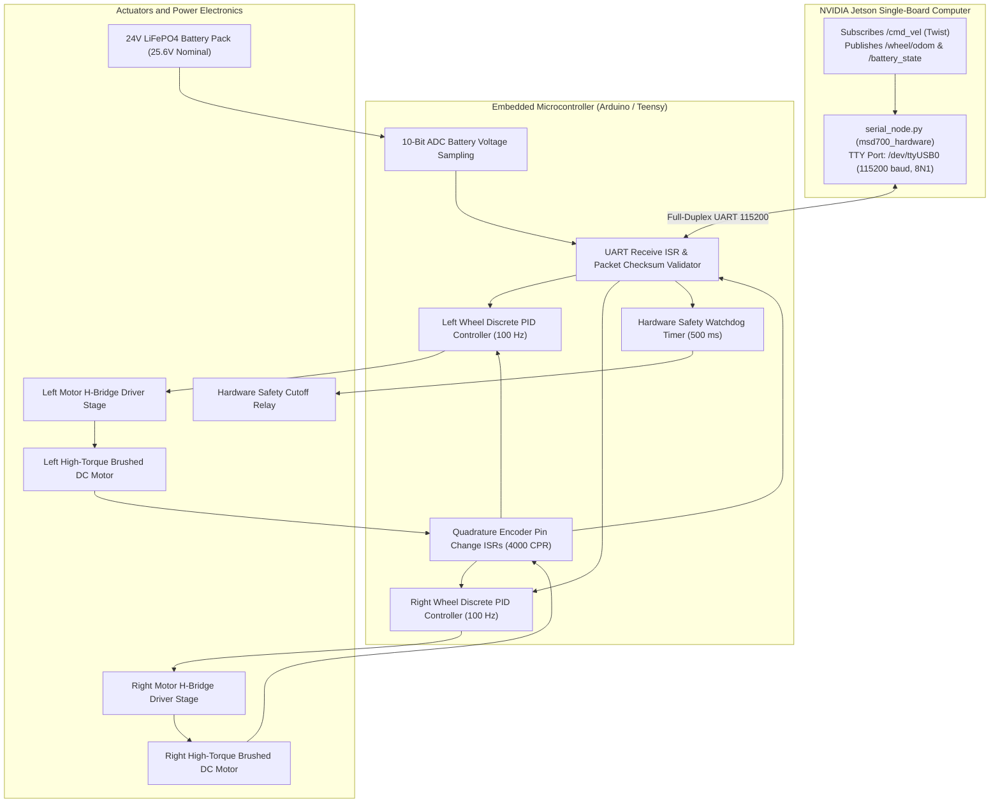

# ファームウェア、マイクロコントローラー、およびハードウェア バス

<RoleBadge role="developer" />

この文書では、MSD700 ロボットに実装された組み込みマイクロコントローラー ファームウェア、モーター ドライバー インターフェイス、光学式エンコーダーのデコード、離散 PID 速度制御アルゴリズム、およびアナログ テレメトリー回路の詳細な技術仕様を提供します。

## 組み込み制御トポロジ

---

## ハードウェアの電気ピン配置と配線

NVIDIA Jetson とマイクロコントローラー間の通信は、光学的に絶縁された高速 USB UART 経由で実行されます。

|信号機能 |マイクロコントローラーピン |ドライバー/周辺機器の接続 |電気的特性 |
| --- | --- | --- | --- |
| **左モーター PWM** |ピン 5 (タイマー 3) |左 H ブリッジ スピード ゲート | 0 ～ 5V ロジック、20 kHz PWM (静かで聞こえないドライブ) |
| **左モーター DIR** |ピン 4 |左 H ブリッジ方向入力 |ロジック High: 順方向、ロジック Low: 逆方向 |
| **右モーター PWM** |ピン 6 (タイマー 4) |右 H ブリッジ スピード ゲート | 0 ～ 5V ロジック、20 kHz PWM |
| **右モーター DIR** |ピン 7 |右 H ブリッジ方向入力 |ロジック High: 順方向、ロジック Low: 逆方向 |
| **左エンコーダー A** |ピン 2 (INT0) |左光学式エンコーダ チャネル A | 5V TTL 割り込み (立ち上がり/立ち下がりエッジ) |
| **左エンコーダー B** |ピン 3 (INT1) |左光学式エンコーダ チャネル B | 5V TTL 割り込み |
| **右エンコーダー A** |ピン 18 (INT5) |右光学式エンコーダ チャンネル A | 5V TTL 割り込み |
| **右エンコーダー B** |ピン 19 (INT4) |右光学式エンコーダ チャンネル B | 5V TTL 割り込み |
| **バッテリー電圧 ADC**|ピン A0 (ADC0) |高精度抵抗分圧器出力 | 0 ～ 5.0V アナログ電圧 |
| **非常停止安全ライン** |ピン 12 |ハードウェア リレー ゲート ドライバー |ロジック High: モーターが有効、Low: カットオフ |

---

## 閉ループ離散 PID 速度制御

ファームウェアは、ホイール速度を制御するアンチワインドアップ クランプを備えたデュアル離散 PID 制御ループを $100\text{ Hz}$ ($\Delta t = 0.01\text{ s}$) で実行します。

### 離散誤差の定式化:
$$e_k = v_{\text{ターゲット}} - v_{\text{測定値}}$$

### クランプ付き PID 制御出力:
$$\text{PWM}_k = K_p \cdot e_k + K_i \sum_{j=0}^k e_j \cdot \Delta t + K_d \cdot \frac{e_k - e_{k-1}}{\Delta t}$$

### アンチワインドアップ インテグレータ保護:
モーターに一時的な負荷がかかったとき、または傾斜に対して停止したときにインテグレーターのワインドアップを防ぐには、次の手順を実行します。

$$\sum e_j \cdot \Delta t = \text{クランプ}\left( \sum e_j \cdot \Delta t, -I_{\max}, I_{\max} \right)$$

$$\text{PWM}_k = \text{クランプ}(\text{PWM}_k, -\text{PWM}_{\max}, \text{PWM}_{\max})$$

$\text{PWM}_{\max} = 255$ ($8$ ビットのタイマー分解能) となります。

---

## バッテリー電圧検出回路

ロボットは 24V LiFePO4 バッテリー パックによって電力を供給されます (フル充電: $29.2\text{ V}$、公称: $25.6\text{ V}$、カットオフ: $21.0\text{ V}$)。

オンボード分圧器は、バッテリー電圧をマイクロコントローラー ADC の $0\text{ から }5\text{ V}$ の範囲まで下げます。

$$V_{adc} = V_{bat} \cdot \frac{R_2}{R_1 + R_2}$$

ここで、$R_1 = 30\text{ k}\Omega$ および $R_2 = 5.1\text{ k}\Omega$ (分周比 $K_{div} = 0.1453$)。

### ファームウェアでの電圧の再構築:
$$V_{bat} = \frac{\text{ADC\_RAW}}{1024} \cdot V_{ref} \cdot \left( \frac{R_1 + R_2}{R_2} \right)$$

$V_{ref} = 5.00\text{ V}$ です。

---

## ハードウェア安全ウォッチドッグ

ホスト OS のロックアップやシリアル ケーブルの切断によって引き起こされるロボットの暴走状態を防ぐために、マイクロコントローラーは自律的なハードウェア ウォッチドッグを実行します。

1. **タイマーの有効期限**: チェックサムが検証された有効な速度パケットごとに、ウォッチドッグ タイマー レジスタが $500\text{ ms}$ にリセットされます。
2. **安全カットオフ**: $500\text{ ms}$ の間パケットが到着しない場合、マイクロコントローラーは直ちにモーター PWM 出力をゼロにクランプし、`ESTOP_RELAY` ゲート ラインをドロップします。

## 関連ドキュメント

- [センサー フュージョンとコントロール](/ja/development/sensor-fusion-and-control): オドメトリの統合と EKF。
- [コストマップとプランナー](/ja/development/costmaps-and-planners): 速度制限パラメーター。
- [状態と動作](/ja/development/state-and-behavior): 緊急停止ステート マシン。