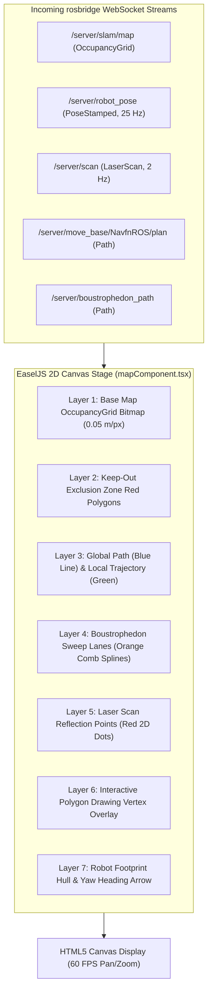

# フロントエンド キャンバス & React 可視化パイプライン

<RoleBadge role="developer" />

このドキュメントでは、HTML5 Canvas、EaselJS、`ROS2D.js` を使用して `ROS-dashboard-next-ts` に実装された 2D レンダリング パイプライン、座標空間変換、レイヤー スタッキング アーキテクチャ、および React ライフサイクル統合について詳しく説明します。

## キャンバス レンダリング パイプライン アーキテクチャ



---

## 座標変換: メートル空間からスクリーン ピクセルへ

ROS の座標フレームはメートル法 (マップ原点が $(0, 0)$ のメートル) ですが、HTML5 Canvas は左上の原点ピクセル座標 $(p_x, p_y)$ を使用します。

マップの解像度 $r$ (ピクセルあたりのメートル)、画像の高さ $H$ (ピクセル)、およびマップの原点 $\mathbf{o} = [x_0, y_0]^T$ を指定すると、次のようになります。

### 1. メトリックからキャンバス ピクセルへの変換:
$$p_x = \frac{x - x_0}{r}$$

$$p_y = H - \frac{y - y_0}{r}$$

*(ROS $Y$ は上向きに増加し、Canvas $Y$ は下向きに増加するため、$y$ 軸は反転しています。)*

### 2. キャンバスのピクセルからメトリックへの変換 (ゴールのディスパッチング用):
$$x = x_0 + (p_x \cdot r)$$

$$y = y_0 + ((H - p_y) \cdot r)$$

---

## `createjs.Stage.prototype` パッチ (`rosScriptLoader.ts`)

最新の React SPA フレームワーク (Next.js 14 以降など) では、ページ遷移中にコンポーネントが急速にマウントおよびアンマウントされます。標準の `ROS2D.js` は、作成時に座標変換関数をステージング インスタンスにバインドします。これは React DOM の再レンダリング時に失われる可能性があり、致命的な `TypeError: this.stage.globalToRos is not a function` エラーを引き起こします。

ゼロクラッシュ視覚化の回復力を保証するために、`rosScriptLoader.ts` はキャンバスのインスタンス化の前に `createjs.Stage.prototype` に動的にパッチを適用します。

```typescript
// scripts/rosScriptLoader.ts
export function patchEaselJSStage(): void {
  if (typeof window === "undefined" || !(window as any).createjs) return;

  const StageProto = (window as any).createjs.Stage.prototype;

  if (!StageProto.globalToRos) {
    StageProto.globalToRos = function (x: number, y: number) {
      const rosX = (x - this.x) / (this.scaleX * this.ros2dViewer.scaleToDimensions);
      const rosY = -(y - this.y) / (this.scaleY * this.ros2dViewer.scaleToDimensions);
      return { x: rosX, y: rosY };
    };
  }

  if (!StageProto.rosToGlobal) {
    StageProto.rosToGlobal = function (rosX: number, rosY: number) {
      const x = rosX * this.scaleX * this.ros2dViewer.scaleToDimensions + this.x;
      const y = -rosY * this.scaleY * this.ros2dViewer.scaleToDimensions + this.y;
      return { x, y };
    };
  }
}
```

---

## インタラクティブなポリゴン描画エンジン

オペレータがエリア カバレッジ スイープ ポリゴンまたは立ち入り禁止ゾーンを定義する場合:
1. **頂点の配置**: キャンバスをクリックすると、メートル座標 $(x_i, y_i)$ が記録されます。
2. **動的ラバーバンディング**: マウスが移動すると、動的一時的なエッジ ラインがカーソル位置にレンダリングされます。
3. **閉じるスナップ**: カーソルが最初の頂点の $15\text{ ピクセル}$ 以内に入ると、ポリゴンは閉じてスナップされ、`/msd700/keepout_grid` またはカバレッジ境界にラスタライズされます。

## 関連ドキュメント

- [rosbridge プロトコル](/ja/development/rosbridge-protocol): WebSocket JSON 操作とストリーミング トピック。
- [Boustrophedon Coverage](/ja/development/boustrophedon-and-alignment): デュアル ジオメトリ スイープ計算。
- [API リファレンス](/ja/development/api-reference): REST エンドポイントをマップしてルーティングします。