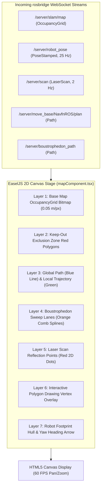

# フロントエンド Canvas & React ビジュアライゼーションパイプライン

<RoleBadge role="developer" />

このドキュメントは、`ROS-dashboard-next-ts` において HTML5 Canvas、EaselJS、`ROS2D.js` を使って実装されている、2D レンダリングパイプライン、座標空間変換、レイヤースタッキングアーキテクチャ、React ライフサイクル統合について詳述します。

## Canvas レンダリングパイプラインアーキテクチャ



---

## 座標変換: メートル空間からスクリーンピクセルへ

ROS の座標フレームはメートル単位(マップ原点が $(0, 0)$)であるのに対し、HTML5 Canvas は左上を原点とするピクセル座標 $(p_x, p_y)$ を使用します。

マップ解像度 $r$(1ピクセルあたりのメートル)、画像高さ $H$(ピクセル)、マップ原点 $\mathbf{o} = [x_0, y_0]^T$ が与えられたとき:

### 1. メートルから Canvas ピクセルへの変換:
$$p_x = \frac{x - x_0}{r}$$

$$p_y = H - \frac{y - y_0}{r}$$

*($y$ 軸が反転しているのは、ROS の $Y$ が上方向に増加するのに対し、Canvas の $Y$ は下方向に増加するためです)。*

### 2. Canvas ピクセルからメートルへの変換(ゴール送信用):
$$x = x_0 + (p_x \cdot r)$$

$$y = y_0 + ((H - p_y) \cdot r)$$

---

## `createjs.Stage.prototype` パッチ(`rosScriptLoader.ts`)

Next.js 14+ のような最新の React SPA フレームワークでは、ページ遷移中にコンポーネントが高速にマウント・アンマウントされます。標準の `ROS2D.js` は座標変換関数を生成時に stage インスタンスへバインドしますが、これは React の DOM 再レンダリング時に失われることがあり、致命的な `TypeError: this.stage.globalToRos is not a function` エラーを引き起こします。

クラッシュのないビジュアライゼーションのレジリエンスを保証するため、`rosScriptLoader.ts` は canvas のインスタンス化前に `createjs.Stage.prototype` を動的にパッチします。

```typescript
// scripts/rosScriptLoader.ts
export function patchEaselJSStage(): void {
  if (typeof window === "undefined" || !(window as any).createjs) return;

  const StageProto = (window as any).createjs.Stage.prototype;

  if (!StageProto.globalToRos) {
    StageProto.globalToRos = function (x: number, y: number) {
      const rosX = (x - this.x) / (this.scaleX * this.ros2dViewer.scaleToDimensions);
      const rosY = -(y - this.y) / (this.scaleY * this.ros2dViewer.scaleToDimensions);
      return { x: rosX, y: rosY };
    };
  }

  if (!StageProto.rosToGlobal) {
    StageProto.rosToGlobal = function (rosX: number, rosY: number) {
      const x = rosX * this.scaleX * this.ros2dViewer.scaleToDimensions + this.x;
      const y = -rosY * this.scaleY * this.ros2dViewer.scaleToDimensions + this.y;
      return { x, y };
    };
  }
}
```

---

## インタラクティブなポリゴン描画エンジン

オペレーターがエリアカバレッジのスイープポリゴンや keep-out ゾーンを定義する際:
1. **頂点の配置**: キャンバスをクリックするとメートル座標 $(x_i, y_i)$ が記録されます。
2. **動的なラバーバンディング**: マウスが動くと、カーソル位置まで動的な仮のエッジラインがレンダリングされます。
3. **クロージングスナップ**: カーソルが最初の頂点から $15\text{ ピクセル}$ 以内に入ると、ポリゴンはスナップして閉じ、`/msd700/keepout_grid` またはカバレッジ境界へとラスタライズされます。

## 関連ドキュメント

- [rosbridge プロトコル](/ja/development/rosbridge-protocol): WebSocket の JSON 操作とストリーミングトピック。
- [ボウストロフェドン・カバレッジ](/ja/development/ros/boustrophedon-and-alignment): デュアルジオメトリのスイープ計算。
- [API リファレンス](/ja/development/api-reference): マップおよびルートの REST エンドポイント。
