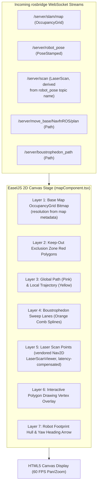

# フロントエンド Canvas & React ビジュアライゼーションパイプライン

<RoleBadge role="developer" />

このドキュメントは、`ROS-dashboard-next-ts` において HTML5 Canvas、EaselJS、`ROS2D.js` を使って実装されている、2D レンダリングパイプライン、座標空間変換、レイヤースタッキングアーキテクチャ、React ライフサイクル統合について詳述します。

## Canvas レンダリングパイプラインアーキテクチャ

すべてのトピックはユニット単位でルート化される。`` `${root}/server/…` ``であり、`root = /unit_<ULID>`である。下記の素の`/server/…`名は略記である。



---

## 座標変換: メートル空間からスクリーンピクセルへ

ROS の座標フレームはメートル単位(マップ原点が $(0, 0)$)であるのに対し、HTML5 Canvas は左上を原点とするピクセル座標 $(p_x, p_y)$ を使用します。

マップ解像度 $r$(1ピクセルあたりのメートル)、画像高さ $H$(ピクセル)、マップ原点 $\mathbf{o} = [x_0, y_0]^T$ が与えられたとき:

### 1. メートルから Canvas ピクセルへの変換:
$$p_x = \frac{x - x_0}{r}$$

$$p_y = H - \frac{y - y_0}{r}$$

*($y$ 軸が反転しているのは、ROS の $Y$ が上方向に増加するのに対し、Canvas の $Y$ は下方向に増加するためです)。*

### 2. Canvas ピクセルからメートルへの変換(ゴール送信用):
$$x = x_0 + (p_x \cdot r)$$

$$y = y_0 + ((H - p_y) \cdot r)$$

---

## `createjs.Stage.prototype` パッチ(`mapComponent.tsx`)

EaselJSは`createjs.Stage`を、プロトタイプから`ROS2D`の座標ヘルパーが消えたまったく新しいコンストラクタとして再評価することがある。その後に構築されたビューアは`stage.globalToRos is not a function`を投げる。修正は`mapComponent.tsx`内の`ensureStagePrototype()`であり、ビューア生成の直前に現在のプロトタイプへ冪等に再適用する(計算は`public/script/ros2d.js`とまったく同じであり、ハッピーパスでの挙動は不変)。なお`rosScriptLoader.ts`は単なる逐次スクリプトローダーであり、パッチはそこには存在しない:

```typescript
// src/components/navigationMap/mapComponent.tsx
const ensureStagePrototype = (): boolean => {
  if (typeof window === 'undefined') return false;
  const cjs = (window as any).createjs;
  const ROSLIB = (window as any).ROSLIB;
  const proto = cjs?.Stage?.prototype;
  if (!proto || !ROSLIB?.Vector3) return false;

  if (typeof proto.globalToRos !== 'function') {
    proto.globalToRos = function (this: any, x: number, y: number) {
      return new ROSLIB.Vector3({
        x: (x - this.x) / this.scaleX,
        y: (this.y - y) / this.scaleY,
      });
    };
  }
  if (typeof proto.rosToGlobal !== 'function') {
    proto.rosToGlobal = function (this: any, pos: any) {
      return {
        x: pos.x * this.scaleX + this.x,
        y: this.y - pos.y * this.scaleY,
      };
    };
  }
  if (typeof proto.rosQuaternionToGlobalTheta !== 'function') {
    proto.rosQuaternionToGlobalTheta = function (this: any, orientation: any) {
      // quaternion -> canvas heading degrees
    };
  }
  return typeof proto.globalToRos === 'function';
};
```

---

## インタラクティブなポリゴン描画エンジン

オペレーターがエリアカバレッジのスイープポリゴンや keep-out ゾーンを定義する際(`customAreaDraw.ts`):
1. **頂点の配置**: キャンバスをクリックするとメートル座標 $(x_i, y_i)$ が記録されます。
2. **動的なラバーバンディング**: マウスが動くと、カーソル位置まで動的な仮のエッジラインがレンダリングされます。
3. **クロージングスナップ**: クリックが最初の頂点から`CLOSE_TOLERANCE_M`(デフォルト$0.5\text{ m}$、`NEXT_PUBLIC_CUSTOM_AREA_CLOSE_TOLERANCE`で上書き可能)以内に落ちた場合 — ピクセルではなくメートル距離 — ループは閉じる。Keep-outポリゴンはオーバーレイとして描画され、`areas`/`exclusions`ペイロードとして送られる。カバレッジポリゴンは`/msd700/coverage_polygon`へ送られる。(ロボット側の`/msd700/keepout_grid`自体は空グリッドの初期化子に過ぎない。)

## 関連ドキュメント

- [rosbridge プロトコル](/ja/development/rosbridge-protocol): WebSocket の JSON 操作とストリーミングトピック。
- [ボウストロフェドン・カバレッジ](/ja/development/ros/boustrophedon-and-alignment): デュアルジオメトリのスイープ計算。
- [API リファレンス](/ja/development/api-reference): マップおよびルートの REST エンドポイント。
