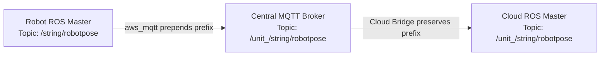
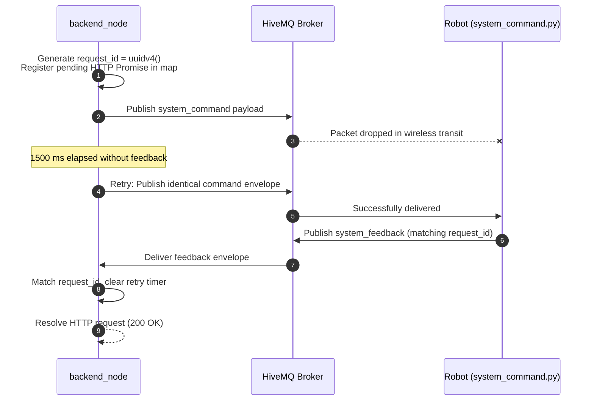
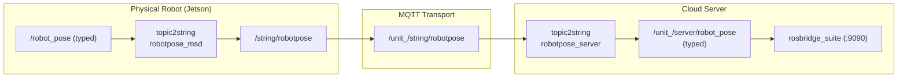
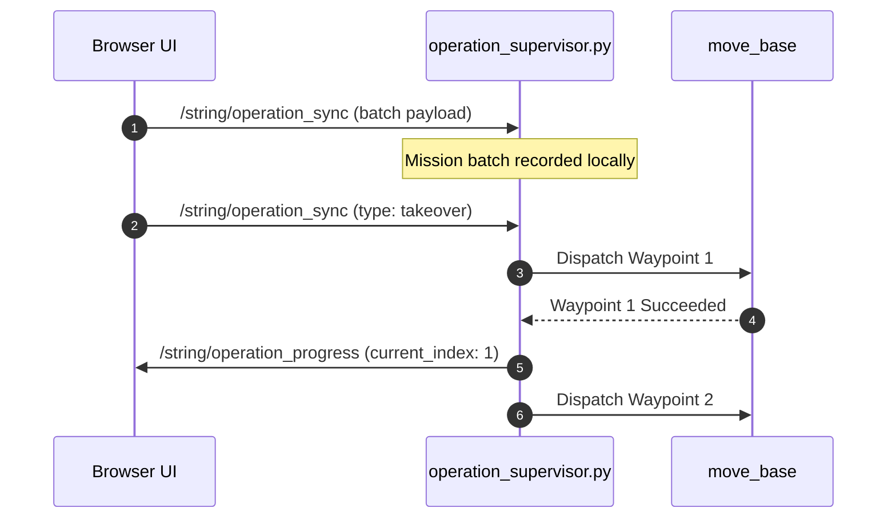
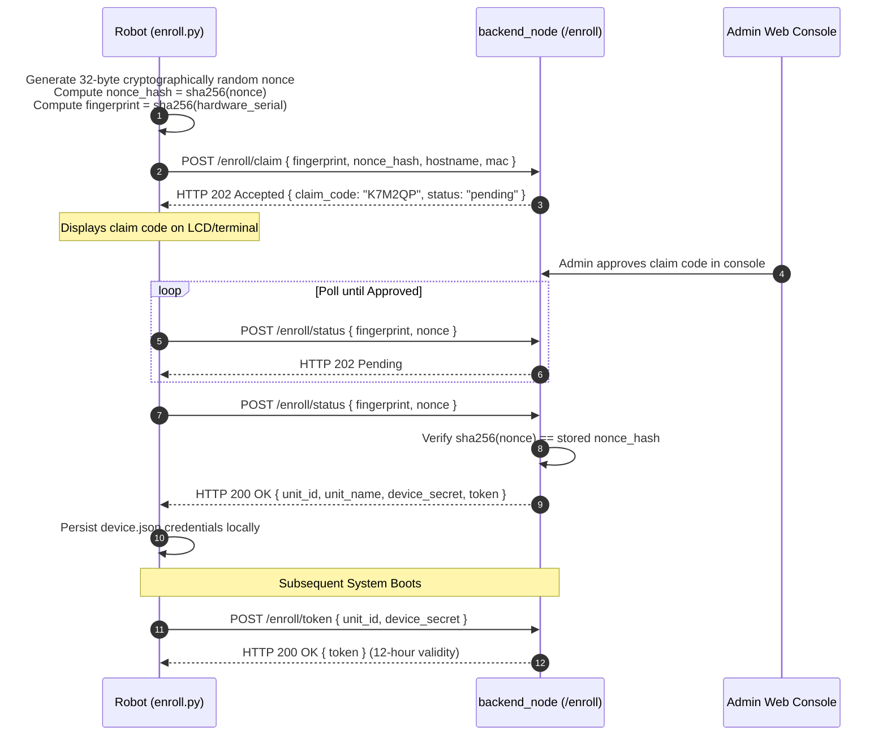

# Message Contracts

<RoleBadge role="developer" />

This document provides the complete, authoritative specification for all machine-to-machine data payloads in the MSD700 system. It covers the MQTT command and feedback channels, serialized ROS streaming topics, the operation supervisor synchronization protocol, WebRTC signalling, and the hardware enrolment exchange.

For the HTTP surface, see [API Reference](/ja/development/api-reference). For finite state machines, see [State and Behavior](/ja/development/state-and-behavior). For the overall system design, see [Architecture](/ja/development/architecture).

::: info Contract Verification Notice
Payload shapes are derived directly from active source code (`backend_node`, `system_command.py`, `operation_supervisor.py`, `topic2string`, `enroll_api.js`). Any field changes in the codebase must be updated here in the same commit.
:::

## Fleet Addressing Scheme

Every physical robot is addressed by a unique prefix: `/unit_<ULID>/...`. The ULID (Universally Unique Lexicographically Sortable Identifier) is the primary key assigned to the robot in the central `units` database table upon registration.



| Hop Location | Topic Format | Engineering Purpose |
| --- | --- | --- |
| **Robot Local ROS Master** | `/string/robotpose` | Unscoped local namespace (one robot per onboard roscore). |
| **Central MQTT Broker** | `/unit_<ULID>/string/robotpose` | Fleet-scoped topic namespace multiplexing all robots over HiveMQ. |
| **Cloud ROS Master** | `/unit_<ULID>/string/robotpose` | Namespaced topic consumed by per-unit cloud relays and rosbridge. |

::: warning Mandatory `unit_` Prefix Rule
ROS graph resource names must begin with an alphabetic character, a tilde, or a forward slash. Because ULIDs begin with numbers (e.g. `01JZ...`), `/01JZ.../string/map` is invalid syntax and rejected by ROS. The `unit_` prefix ensures strict ROS compliance while maintaining a 1:1 mapping with MQTT topics.
:::

## Command and Control Channel

Two dedicated MQTT topics handle all bidirectional request and response interactions between the cloud server and a physical unit:

| MQTT Topic | Direction | Producer Node | Consumer Node | Description |
| --- | --- | --- | --- | --- |
| `/unit_<ULID>/system_command` | Cloud to Robot | `backend_node` (Express) | `system_command.py` (ROS) | Dispatches control commands, navigation goals, and mode changes. |
| `/unit_<ULID>/system_feedback` | Robot to Cloud | `system_command.py` (ROS) | `backend_node` (Express) | Returns execution status, error messages, and telemetry pings. |

### Command Payload Envelope

```json
{
  "header": "navigation",
  "command": "pointstamped",
  "config": {
    "resource": {
      "X": 3.1416,
      "Y": -1.2,
      "Z": 0.0
    }
  },
  "metadata": {
    "timestamp": "2026-08-12T04:11:52.913Z",
    "request_id": "0b0d1f4e-6a2c-4c7e-9a51-1f1b6f7a2f10"
  }
}
```

| Field Name | Type | Mandatory | Description |
| --- | --- | --- | --- |
| `header` | string | Yes | Target subsystem handler: `hardware`, `navigation`, `mapping`, `boustrophedon`, `manual`, `autopilot`, `emergency_stop`, `autoalign`. |
| `command` | string | Yes | Specific action verb within the handler. Unrecognized verbs are logged and dropped. |
| `config` | object | Conditional | Command parameters (typically inside `config.resource`). |
| `data` | object | Conditional | Alternate parameter block used by `hardware.ping`. |
| `metadata.request_id` | UUID v4 | Yes | Unique correlation token generated per HTTP request by `backend_node`. |
| `metadata.timestamp` | ISO 8601 | Yes | Sender timestamp string for diagnostic tracing. |

### Feedback Payload Envelope

```json
{
  "header": "navigation",
  "command": "pointstamped",
  "data": {
    "status": true,
    "message": "Goal published to move_base"
  },
  "metadata": {
    "timestamp": 1786503112.913,
    "request_id": "0b0d1f4e-6a2c-4c7e-9a51-1f1b6f7a2f10"
  }
}
```

| Field Name | Type | Description |
| --- | --- | --- |
| `data.status` | boolean | `true` indicates command accepted/executed; `false` indicates execution rejection. |
| `data.message` | string | Human-readable diagnostic description from the robot. |
| `metadata.timestamp` | float | Wall-clock epoch seconds (`rospy.get_time()`) from the robot. |
| `metadata.request_id` | UUID v4 | Matches the original `request_id` from the command envelope. |

### Command Correlation and Retry Architecture



| Parameter | Default Value | Config Location | Purpose |
| --- | --- | --- | --- |
| `DEFAULT_TIMEOUT` | `30000` ms (30 s) | `backend_node` | Maximum duration an HTTP request waits for feedback before responding with `504 Gateway Timeout`. |
| `COMMAND_RETRY_INTERVAL` | `1500` ms (1.5 s) | `backend_node` | Resend period while a mutating command remains unacknowledged. |

::: danger Ping Heartbeat Exclusion
`header: "hardware", command: "ping"` is transmitted strictly **once** per interval and is never retried. Heartbeat loss is the primary trigger for the robot safety watchdog. Retrying lost pings would mask network dropouts and defeat the automatic emergency stop mechanism.
:::

## Command Reference Catalogue

### 1. Hardware Subsystem (`header: "hardware"`)

```json
// Command: "check"
{ "header": "hardware", "command": "check", "metadata": { ... } }

// Command: "idle"
{ "header": "hardware", "command": "idle", "metadata": { ... } }
```

| Command Verb | Payload Content | Purpose |
| --- | --- | --- |
| `ping` | See [Heartbeat Ping Section](#heartbeat-ping-and-lease-contract) | Heartbeat, lease acquisition, telemetry retrieval, and watchdog refresh. |
| `check` | None | Queries status of low-level motor drivers and microcontrollers. |
| `init` | None | Initialises hardware interfaces and power lines. |
| `stop` | None | Shuts down hardware peripherals and power stages. |
| `idle` | None | Tears down running navigation/mapping nodes while keeping robot powered. |
| `battery_update` | `{ "config": { ... } }` | Manually updates power telemetry levels. |

### 2. Navigation Subsystem (`header: "navigation"`)

```json
// Command: "init"
{
  "header": "navigation",
  "command": "init",
  "config": {
    "resource": {
      "map_name": "01JZ8QK2H0000000000000MAP",
      "default_save_path": "/home/ubuntu/ros_maps",
      "homebase_x": 1.25,
      "homebase_y": -0.5,
      "homebase_z": 0.0,
      "homebase_ox": 0.0,
      "homebase_oy": 0.0,
      "homebase_oz": 0.0,
      "homebase_ow": 1.0
    }
  },
  "ensure_unpaused": true
}

// Command: "pointstamped" (Single Goal)
{
  "header": "navigation",
  "command": "pointstamped",
  "config": {
    "resource": { "X": 3.1416, "Y": -1.2, "Z": 0.0 }
  }
}
```

- `map_name`: The map ULID identifier corresponding to `<ULID>.pgm` and `<ULID>.yaml` on disk.
- `ensure_unpaused: true`: Instructs the robot to automatically clear any standing `/emergency_pause` lock when launching navigation.
- `command: "deactivate"`: Terminates the active navigation stack (takes no payload).

### 3. Mapping Subsystem (`header: "mapping"`)

```json
// Command: "stop" (Save and Upload Map)
{
  "header": "mapping",
  "command": "stop",
  "config": {
    "resource": {
      "map_name": "01JZ8QK2H0000000000000MAP",
      "display_map_name": "Production Hall Level 1",
      "map_ulid": "01JZ8QK2H0000000000000MAP",
      "created_by": "01JZ7YV5CQUSER00000000000",
      "unit_id": "01JZ8P9WZ0UNIT00000000000",
      "homebase_x": 1.2,
      "homebase_y": 0.5,
      "homebase_z": 0.0,
      "homebase_ox": 0.0,
      "homebase_oy": 0.0,
      "homebase_oz": 0.0,
      "homebase_ow": 1.0
    }
  }
}
```

Saving a SLAM map takes longer than the standard 30-second HTTP timeout. Therefore, `mapping stop` immediately returns an HTTP 200 with `{ request_id, map_ulid }`. The frontend connects to an SSE stream on `GET /api/mapping/progress/:request_id` to monitor progress.

#### Mapping Progress Feedback (`header: "mapping_progress"`)

```json
{
  "header": "mapping_progress",
  "command": "stop",
  "data": {
    "status": true,
    "progress": 100,
    "stage": "completed",
    "message": "Saved on the robot and the server.",
    "terminal": true,
    "outcome": "completed"
  },
  "metadata": {
    "timestamp": 1734000000.0,
    "request_id": "..."
  }
}
```

| Outcome Value | Description |
| --- | --- |
| `completed` | Successfully written to both the local Unit media-server and the cloud server. |
| `cloud_pending` | Written to local Unit media-server only. Cloud replication will complete on the next sync interval. |
| `failed` | Mapping save failed. Session remains open for retry. |

### 4. Boustrophedon Area Coverage (`header: "boustrophedon"`)

```json
// Command: "init"
{
  "header": "boustrophedon",
  "command": "init",
  "config": {
    "use_autocover": false,
    "polygon": [
      { "x": 0.0, "y": 0.0 }, { "x": 10.0, "y": 0.0 },
      { "x": 10.0, "y": 5.0 }, { "x": 0.0, "y": 5.0 }
    ],
    "areas": [
      [ { "x": 0.0, "y": 0.0 }, { "x": 10.0, "y": 0.0 }, { "x": 10.0, "y": 5.0 }, { "x": 0.0, "y": 5.0 } ]
    ],
    "exclusions": [
      [ { "x": 3.0, "y": 2.0 }, { "x": 5.0, "y": 2.0 }, { "x": 5.0, "y": 4.0 }, { "x": 3.0, "y": 4.0 } ]
    ],
    "ensure_unpaused": true
  }
}
```

- `areas`: Ordered array of polygons forming the target operation playlist.
- `exclusions`: Keep-out obstacle zones subtracted from coverage sweeps.
- `command: "pause"`: Accepts `{ "pause": true }` or `{ "pause": false }`.
- `command: "deactivate"`: Stops coverage planning.

## Heartbeat Ping and Lease Contract

The heartbeat ping message manages the robot operating lease, the safety watchdog timer, and status telemetry.

### Request Payload (`data` block)

```json
{
  "session_id": "8b1c3f2a-605d-4871-bc01-e28a9b3d1f04",
  "user_id": "01JZ7YV5CQUSER00000000000",
  "claim": true,
  "release": false,
  "page": "navigation",
  "origin": "cloud",
  "force_takeover": false
}
```

| Parameter | Source | Description |
| --- | --- | --- |
| `session_id` | Browser tab | Unique UUID per browser tab. |
| `user_id` | Backend JWT | Extracted strictly from the authenticated JWT token by the server backend. |
| `claim` | Browser | `true` from operational pages (Navigation, Mapping); `false` when browsing the read-only fleet list. |
| `release` | Browser | Explicitly relinquishes the operating lease upon page exit. |
| `page` | Browser | Origin page: `dashboard`, `login`, `navigation`, `mapping`. |
| `origin` | Backend env | `cloud` or `local`, determined by server configuration. |
| `force_takeover` | Browser | `true` when operator confirms taking over an existing lease. |

### Response Payload (`data` block)

```json
{
  "status": true,
  "robot_activity": "navigation_point_published",
  "active_page": "navigation",
  "battery": 87.5,
  "uptime": 42.3,
  "hw_status": "ready",
  "manual_override": false,
  "autopilot": false,
  "active_map_id": "01JZ8QK2H0000000000000MAP",
  "in_use": false,
  "in_use_by": null,
  "origin_conflict": false,
  "origin_conflict_side": null
}
```

| Response Field | Description |
| --- | --- |
| `robot_activity` | Filtered activity state (e.g. `idle`, `navigating`, `mapping`, `stuck`). |
| `active_page` | Raw active page before stuck-detector evaluation, ensuring correct routing. |
| `battery` | Battery state of charge percentage (float). |
| `uptime` | System uptime in minutes. |
| `hw_status` | Status reported by hardware monitoring subsystem (`ready`, `fault`). |
| `manual_override` | `true` when manual teleop mode is engaged. |
| `autopilot` | `true` when autonomous autopilot sequencer is active. |
| `in_use` | Account-level lock: indicates another user account holds the lease. |
| `origin_conflict` | Session-level conflict: indicates another tab of the same account is active. |

## Streaming Telemetry Topics

Streaming telemetry is serialized to JSON strings on the unit via `topic2string`, routed over MQTT, and converted back to typed ROS messages on the server for `rosbridge`.



### Telemetry Stream Definitions

| Robot Topic | Cloud Server Topic | Update Rate | Content Description |
| --- | --- | --- | --- |
| `/string/robotpose` | `/unit_<ULID>/server/robot_pose` | 25 Hz | Robot position and orientation in `map` frame (`geometry_msgs/PoseStamped`). |
| `/string/map` | `/unit_<ULID>/server/slam/map` | On update | Compressed occupancy grid (`base64(zlib(JSON))`). |
| `/string/laserscan` | `/unit_<ULID>/server/scan` | 2 Hz | Compressed 2D laser scan data (`sensor_msgs/LaserScan`). |
| `/string/move_base/NavfnROS/plan` | `/unit_<ULID>/server/move_base/NavfnROS/plan` | On plan | Global path coordinates (`nav_msgs/Path`). |
| `/string/move_base/TebLocalPlannerROS/local_plan` | `/unit_<ULID>/server/move_base/TebLocalPlannerROS/local_plan` | Continuous | Local trajectory trajectory (`nav_msgs/Path`). |
| `/string/boustrophedon_path` | `/unit_<ULID>/server/boustrophedon_path` | On plan | Coverage sweep line coordinates (`nav_msgs/Path`). |
| `/string/operation_snapshot` | `/unit_<ULID>/string/operation_snapshot` | Latched | Full active mission snapshot for reconnect recovery. |

## Operation Supervisor Synchronization

`operation_supervisor.py` manages autonomous mission execution on the robot so that missions continue uninterrupted if the browser tab is closed.



### Operation Sync Payload (`/string/operation_sync`)

```json
{
  "type": "batch",
  "operation": "multi_pinpoint",
  "route_mode": "round-trip",
  "waypoints": [
    {
      "position": { "x": 1.0, "y": 2.0, "z": 0.0 },
      "orientation": { "x": 0.0, "y": 0.0, "z": 0.0, "w": 1.0 }
    },
    {
      "position": { "x": 4.5, "y": 2.0, "z": 0.0 },
      "orientation": { "x": 0.0, "y": 0.0, "z": 0.0, "w": 1.0 }
    }
  ],
  "current_index": 0,
  "map_name": "01JZ8QK2H0000000000000MAP",
  "coverage": null,
  "timestamp": 1786503112.913
}
```

| Action Type (`type`) | Purpose |
| --- | --- |
| `batch` | Uploads full waypoint sequence when mission starts. |
| `progress` | Updates current waypoint index during operator-guided runs. |
| `takeover` | Engages Autopilot mode, handing waypoint sequencing to supervisor. |
| `release` | Disengages Autopilot mode, returning control to browser loop. |
| `pause` | Pauses execution while preserving the waypoint queue. |
| `stop` | Stops mission and clears the waypoint batch. |
| `resync` | Requests an immediate re-broadcast of the mission snapshot. |

## Robot Enrolment Handshake

Unenrolled robots register themselves with the cloud server via a secure three-stage cryptographic handshake.



::: tip Nonce Security Purpose
The 32-byte secret nonce guarantees that MAC address spoofing cannot hijack an approved robot registration while the physical robot is powered off. The device secret is transmitted only when the genuine robot reveals the original plaintext nonce matching the pre-registered hash.
:::

## Related Documentation

- [API Reference](/ja/development/api-reference): REST API endpoints and data schemas.
- [State and Behavior](/ja/development/state-and-behavior): Detailed state machines and failure transitions.
- [Architecture](/ja/development/architecture): High-level system topology and trust boundaries.
