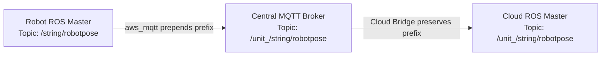
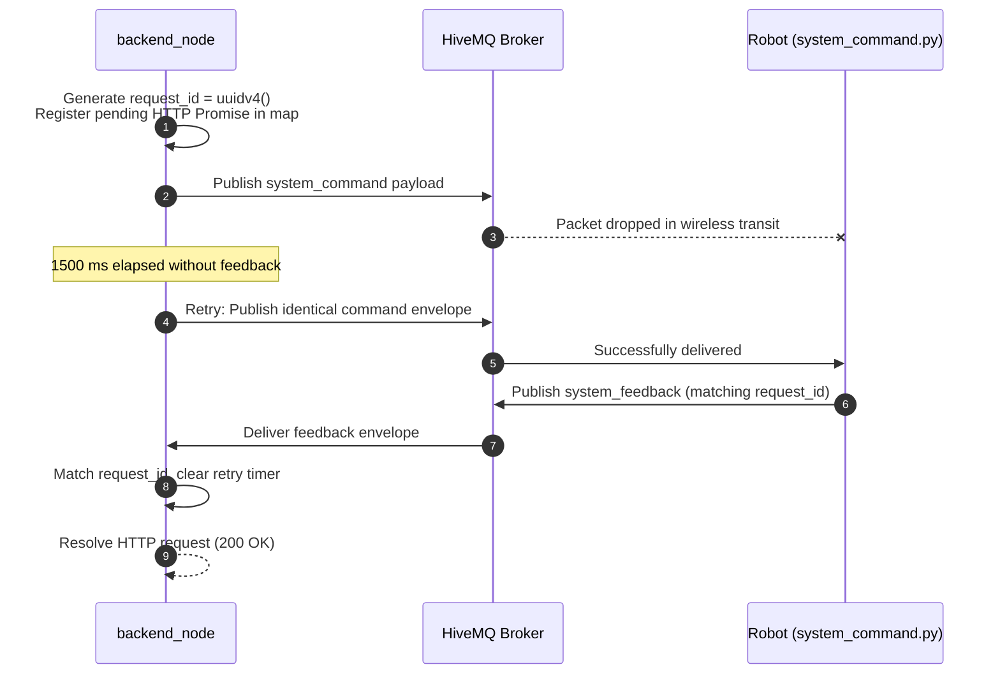
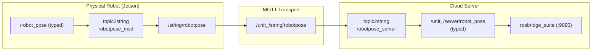
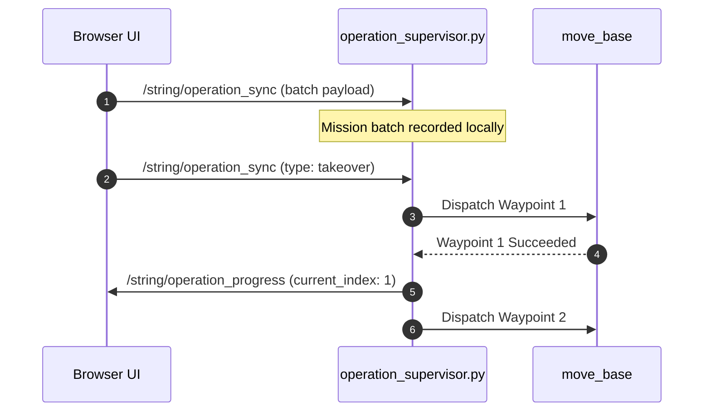

# メッセージ仕様

<RoleBadge role="developer" />

このドキュメントは、MSD700 システムにおけるすべてのマシン間データペイロードについて、完全かつ正典となる仕様を提供します。MQTT のコマンドおよびフィードバックチャネル、シリアライズされた ROS ストリーミングトピック、operation supervisor 同期プロトコル、WebRTC シグナリング、ハードウェア登録のやり取りを扱います。

HTTP サーフェスについては [API リファレンス](/ja/development/api-reference) を、有限状態機械については [State and Behavior](/ja/development/state-and-behavior) を、システム全体の設計については [アーキテクチャ](/ja/development/architecture) を参照してください。

::: info コントラクト検証に関する注意
ペイロードの形は、稼働中のソースコード(`backend_node`、`system_command.py`、`operation_supervisor.py`、`topic2string`、`enroll_api.js`)から直接導出されています。コードベース内でのフィールドの変更は、同じコミットでここも更新しなければなりません。
:::

## フリートアドレス指定方式

すべての物理ロボットは一意のプレフィックス `/unit_<ULID>/...` でアドレス指定されます。ULID(Universally Unique Lexicographically Sortable Identifier)は、登録時に中央の `units` データベーステーブルでそのロボットに割り当てられる主キーです。



| ホップの場所 | トピック形式 | エンジニアリング上の目的 |
| --- | --- | --- |
| **ロボットのローカル ROS Master** | `/string/robotpose` | スコープのないローカル名前空間(オンボードの roscore ごとにロボット1台)。 |
| **中央 MQTT ブローカー** | `/unit_<ULID>/string/robotpose` | HiveMQ 上ですべてのロボットを多重化する、フリートスコープのトピック名前空間。 |
| **クラウド ROS Master** | `/unit_<ULID>/string/robotpose` | ユニット単位のクラウドリレーと rosbridge が消費する、名前空間化されたトピック。 |

::: warning 必須の `unit_` プレフィックスルール
ROS のグラフリソース名は、アルファベット文字、チルダ、またはスラッシュで始まらなければなりません。ULID は数字で始まる(例: `01JZ...`)ため、`/01JZ.../string/map` は無効な構文であり ROS によって拒否されます。`unit_` プレフィックスは、MQTT トピックとの 1:1 マッピングを維持しながら、厳格な ROS 準拠を保証します。
:::

## コマンド & コントロールチャネル

2つの専用 MQTT トピックが、クラウドサーバーと物理ユニットの間のすべての双方向リクエスト・レスポンスのやり取りを処理します。

| MQTT トピック | 方向 | プロデューサーノード | コンシューマーノード | 説明 |
| --- | --- | --- | --- | --- |
| `/unit_<ULID>/system_command` | クラウドからロボットへ | `backend_node`(Express) | `system_command.py`(ROS) | 制御コマンド、ナビゲーションゴール、モード変更をディスパッチする。 |
| `/unit_<ULID>/system_feedback` | ロボットからクラウドへ | `system_command.py`(ROS) | `backend_node`(Express) | 実行ステータス、エラーメッセージ、テレメトリ ping を返す。 |

### コマンドペイロードのエンベロープ

```json
{
  "header": "navigation",
  "command": "pointstamped",
  "config": {
    "resource": {
      "X": 3.1416,
      "Y": -1.2,
      "Z": 0.0
    }
  },
  "metadata": {
    "timestamp": "2026-08-12T04:11:52.913Z",
    "request_id": "0b0d1f4e-6a2c-4c7e-9a51-1f1b6f7a2f10"
  }
}
```

| フィールド名 | 型 | 必須 | 説明 |
| --- | --- | --- | --- |
| `header` | string | Yes | 対象サブシステムハンドラー: `hardware`、`navigation`、`mapping`、`boustrophedon`、`manual`、`autopilot`、`emergency_stop`、`autoalign`。 |
| `command` | string | Yes | ハンドラー内の具体的なアクション動詞。認識されない動詞はログに記録され破棄される。 |
| `config` | object | Conditional | コマンドパラメータ(通常は `config.resource` の中)。 |
| `data` | object | Conditional | `hardware.ping` が使用する代替パラメータブロック。 |
| `metadata.request_id` | UUID v4 | Yes | `backend_node` によって HTTP リクエストごとに生成される一意の相関トークン。 |
| `metadata.timestamp` | ISO 8601 | Yes | 診断トレース用の送信者タイムスタンプ文字列。 |

### フィードバックペイロードのエンベロープ

```json
{
  "header": "navigation",
  "command": "pointstamped",
  "data": {
    "status": true,
    "message": "Goal published to move_base"
  },
  "metadata": {
    "timestamp": 1786503112.913,
    "request_id": "0b0d1f4e-6a2c-4c7e-9a51-1f1b6f7a2f10"
  }
}
```

| フィールド名 | 型 | 説明 |
| --- | --- | --- |
| `data.status` | boolean | `true` はコマンドが受理/実行されたことを示し、`false` は実行が拒否されたことを示す。 |
| `data.message` | string | ロボットからの人間が読める診断説明。 |
| `metadata.timestamp` | float | ロボットからのウォールクロックのエポック秒(`rospy.get_time()`)。 |
| `metadata.request_id` | UUID v4 | コマンドエンベロープの元の `request_id` と一致する。 |

### コマンドの相関とリトライアーキテクチャ



| パラメータ | デフォルト値 | 設定場所 | 目的 |
| --- | --- | --- | --- |
| `DEFAULT_TIMEOUT` | `30000` ms(30秒) | `backend_node` | `504 Gateway Timeout` で応答する前に、HTTP リクエストがフィードバックを待つ最大時間。 |
| `COMMAND_RETRY_INTERVAL` | `1500` ms(1.5秒) | `backend_node` | 状態を変更するコマンドが確認応答されないままである間の再送周期。 |

::: danger Ping ハートビートの除外
`header: "hardware", command: "ping"` は各間隔につき厳密に**1回だけ**送信され、決してリトライされません。ハートビートの喪失は、ロボットのセーフティウォッチドッグの主要なトリガーです。失われた ping をリトライすると、ネットワークの断絶を覆い隠し、自動緊急停止メカニズムを無効化してしまいます。
:::

## コマンドリファレンスカタログ

### 1. ハードウェアサブシステム(`header: "hardware"`)

```json
// Command: "check"
{ "header": "hardware", "command": "check", "metadata": { ... } }

// Command: "idle"
{ "header": "hardware", "command": "idle", "metadata": { ... } }
```

| コマンド動詞 | ペイロード内容 | 目的 |
| --- | --- | --- |
| `ping` | [ハートビート Ping セクション](#ハートビート-ping-とリース契約)参照 | ハートビート、リースの取得、テレメトリの取得、ウォッチドッグのリフレッシュ。 |
| `check` | なし | 低レベルのモータードライバーとマイクロコントローラーのステータスを問い合わせる。 |
| `init` | なし | ハードウェアインターフェースと電源ラインを初期化する。 |
| `stop` | なし | ハードウェア周辺機器と電源段をシャットダウンする。 |
| `idle` | なし | ロボットに電源を入れたまま、稼働中のナビゲーション/マッピングノードを終了する。 |
| `battery_update` | `{ "config": { ... } }` | 電源テレメトリのレベルを手動で更新する。 |

### 2. ナビゲーションサブシステム(`header: "navigation"`)

```json
// Command: "init"
{
  "header": "navigation",
  "command": "init",
  "config": {
    "resource": {
      "map_name": "01JZ8QK2H0000000000000MAP",
      "default_save_path": "/home/ubuntu/ros_maps",
      "homebase_x": 1.25,
      "homebase_y": -0.5,
      "homebase_z": 0.0,
      "homebase_ox": 0.0,
      "homebase_oy": 0.0,
      "homebase_oz": 0.0,
      "homebase_ow": 1.0
    }
  },
  "ensure_unpaused": true
}

// Command: "pointstamped" (Single Goal)
{
  "header": "navigation",
  "command": "pointstamped",
  "config": {
    "resource": { "X": 3.1416, "Y": -1.2, "Z": 0.0 }
  }
}
```

- `map_name`: ディスク上の `<ULID>.pgm` および `<ULID>.yaml` に対応するマップ ULID の識別子。
- `ensure_unpaused: true`: ナビゲーションを開始する際に、残っている `/emergency_pause` ロックを自動的に解除するようロボットに指示する。
- `command: "deactivate"`: アクティブなナビゲーションスタックを終了する(ペイロードは受け取らない)。

### 3. マッピングサブシステム(`header: "mapping"`)

```json
// Command: "stop" (Save and Upload Map)
{
  "header": "mapping",
  "command": "stop",
  "config": {
    "resource": {
      "map_name": "01JZ8QK2H0000000000000MAP",
      "display_map_name": "Production Hall Level 1",
      "map_ulid": "01JZ8QK2H0000000000000MAP",
      "created_by": "01JZ7YV5CQUSER00000000000",
      "unit_id": "01JZ8P9WZ0UNIT00000000000",
      "homebase_x": 1.2,
      "homebase_y": 0.5,
      "homebase_z": 0.0,
      "homebase_ox": 0.0,
      "homebase_oy": 0.0,
      "homebase_oz": 0.0,
      "homebase_ow": 1.0
    }
  }
}
```

SLAM マップの保存には、標準の30秒 HTTP タイムアウトより長い時間がかかります。そのため `mapping stop` は、`{ request_id, map_ulid }` を伴う HTTP 200 を即座に返します。フロントエンドは進捗を監視するために `GET /api/mapping/progress/:request_id` の SSE ストリームへ接続します。

#### マッピング進捗フィードバック(`header: "mapping_progress"`)

```json
{
  "header": "mapping_progress",
  "command": "stop",
  "data": {
    "status": true,
    "progress": 100,
    "stage": "completed",
    "message": "Saved on the robot and the server.",
    "terminal": true,
    "outcome": "completed"
  },
  "metadata": {
    "timestamp": 1734000000.0,
    "request_id": "..."
  }
}
```

| Outcome の値 | 説明 |
| --- | --- |
| `completed` | ローカルユニットの media-server とクラウドサーバーの両方への書き込みに成功した。 |
| `cloud_pending` | ローカルユニットの media-server にのみ書き込まれた。クラウドへのレプリケーションは次回の同期間隔で完了する。 |
| `failed` | マッピングの保存に失敗した。セッションはリトライのために開いたままになる。 |

### 4. ボウストロフェドン・エリアカバレッジ(`header: "boustrophedon"`)

```json
// Command: "init"
{
  "header": "boustrophedon",
  "command": "init",
  "config": {
    "use_autocover": false,
    "polygon": [
      { "x": 0.0, "y": 0.0 }, { "x": 10.0, "y": 0.0 },
      { "x": 10.0, "y": 5.0 }, { "x": 0.0, "y": 5.0 }
    ],
    "areas": [
      [ { "x": 0.0, "y": 0.0 }, { "x": 10.0, "y": 0.0 }, { "x": 10.0, "y": 5.0 }, { "x": 0.0, "y": 5.0 } ]
    ],
    "exclusions": [
      [ { "x": 3.0, "y": 2.0 }, { "x": 5.0, "y": 2.0 }, { "x": 5.0, "y": 4.0 }, { "x": 3.0, "y": 4.0 } ]
    ],
    "ensure_unpaused": true
  }
}
```

- `areas`: 対象の運用プレイリストを構成する、順序付きポリゴンの配列。
- `exclusions`: カバレッジスイープから差し引かれる keep-out 障害物ゾーン。
- `command: "pause"`: `{ "pause": true }` または `{ "pause": false }` を受け取る。
- `command: "deactivate"`: カバレッジプランニングを停止する。

## ハートビート Ping とリース契約

ハートビート ping メッセージは、ロボットの operating lease、セーフティウォッチドッグタイマー、ステータステレメトリを管理します。

### リクエストペイロード(`data` ブロック)

```json
{
  "session_id": "8b1c3f2a-605d-4871-bc01-e28a9b3d1f04",
  "user_id": "01JZ7YV5CQUSER00000000000",
  "claim": true,
  "release": false,
  "page": "navigation",
  "origin": "cloud",
  "force_takeover": false
}
```

| パラメータ | 出所 | 説明 |
| --- | --- | --- |
| `session_id` | ブラウザタブ | ブラウザタブごとの一意な UUID。 |
| `user_id` | バックエンドの JWT | サーバーバックエンドによって、認証された JWT トークンから厳密に抽出される。 |
| `claim` | ブラウザ | 運用ページ(Navigation、Mapping)からは `true`。読み取り専用のフリート一覧を閲覧している場合は `false`。 |
| `release` | ブラウザ | ページを離れる際に operating lease を明示的に解放する。 |
| `page` | ブラウザ | 起点となったページ: `dashboard`、`login`、`navigation`、`mapping`。 |
| `origin` | バックエンドの環境設定 | サーバー設定によって決まる `cloud` または `local`。 |
| `force_takeover` | ブラウザ | オペレーターが既存のリースの引き継ぎを確認したときに `true`。 |

### レスポンスペイロード(`data` ブロック)

```json
{
  "status": true,
  "robot_activity": "navigation_point_published",
  "active_page": "navigation",
  "battery": 87.5,
  "uptime": 42.3,
  "hw_status": "ready",
  "manual_override": false,
  "autopilot": false,
  "active_map_id": "01JZ8QK2H0000000000000MAP",
  "in_use": false,
  "in_use_by": null,
  "origin_conflict": false,
  "origin_conflict_side": null
}
```

| レスポンスフィールド | 説明 |
| --- | --- |
| `robot_activity` | フィルタリングされたアクティビティ状態(例: `idle`、`navigating`、`mapping`、`stuck`)。 |
| `active_page` | stuck-detector の評価前の、生のアクティブページ。正しいルーティングを保証する。 |
| `battery` | バッテリー残量のパーセンテージ(float)。 |
| `uptime` | システムのアップタイム(分)。 |
| `hw_status` | ハードウェア監視サブシステムが報告するステータス(`ready`、`fault`)。 |
| `manual_override` | 手動テレオペモードが有効なとき `true`。 |
| `autopilot` | 自律 autopilot シーケンサーがアクティブなとき `true`。 |
| `in_use` | アカウントレベルのロック: 別のユーザーアカウントがリースを保持していることを示す。 |
| `origin_conflict` | セッションレベルの競合: 同じアカウントの別のタブがアクティブであることを示す。 |

## ストリーミングテレメトリトピック

ストリーミングテレメトリは、ユニット上で `topic2string` によって JSON 文字列にシリアライズされ、MQTT 経由でルーティングされ、サーバー上で `rosbridge` 向けに型付き ROS メッセージへ変換し戻されます。



### テレメトリストリームの定義

| ロボット側トピック | クラウドサーバー側トピック | 更新レート | 内容の説明 |
| --- | --- | --- | --- |
| `/string/robotpose` | `/unit_<ULID>/server/robot_pose` | 25 Hz | `map` フレームにおけるロボットの位置と姿勢(`geometry_msgs/PoseStamped`)。 |
| `/string/map` | `/unit_<ULID>/server/slam/map` | 変化時 + ハートビート | 圧縮された占有グリッド。セルを生の int8 のまま詰めた `base64(zlib(M1))`。旧来の `base64(zlib(JSON))` 形式もデコーダは受け付ける。[マップの配送](#map-delivery)を参照。 |
| `/string/laserscan` | `/unit_<ULID>/server/scan` | 2 Hz | 圧縮された2Dレーザースキャンデータ(`sensor_msgs/LaserScan`)。 |
| `/string/move_base/NavfnROS/plan` | `/unit_<ULID>/server/move_base/NavfnROS/plan` | プラン時 | グローバルパスの座標(`nav_msgs/Path`)。 |
| `/string/move_base/TebLocalPlannerROS/local_plan` | `/unit_<ULID>/server/move_base/TebLocalPlannerROS/local_plan` | 継続的 | ローカル軌跡(`nav_msgs/Path`)。 |
| `/string/boustrophedon_path` | `/unit_<ULID>/server/boustrophedon_path` | プラン時 | カバレッジスイープラインの座標(`nav_msgs/Path`)。 |
| `/string/operation_snapshot` | `/unit_<ULID>/string/operation_snapshot` | ラッチ | 再接続時の復旧のための、完全なアクティブミッションのスナップショット。 |

### マップの配送 {#map-delivery}

マップはこのリンク上で最大のペイロードであり、かつオペレーターがそれなしでは作業できない唯一の
データです。そのため、単純に繰り返し送るということをしない唯一のストリームになっています。ロボッ
トはグリッドをコンテンツハッシュし、実際に変化したときだけ送信します。加えて、誰かが見ている間は
60 秒ごと、誰も見ていない間は 300 秒ごとのハートビートを送ります。ナビゲーションモードではグリッ
ドは `map_server` 由来で一切変化しないため、実際にはハートビートごとに 1 通だけになります。

つまり、ブラウザが絶対に必要とするものを、QoS 0 でブローカーの retain もないホップ上の 1 通の
メッセージが運ぶことになります。それを成立させる仕組みが 3 つあり、どれも省略できません。

| 仕組み | 場所 | カバーする範囲 |
| --- | --- | --- |
| クラウド側リレーが `/unit_<ULID>/string/map` をラッチする | `aws_mqtt/scripts/gen_bridge_params.py` | 2 回の送信の間に接続してきたブラウザ、およびリレーの再起動(フリートのロスターが変わるたびに発生します)。 |
| マップのリセットまたはリタイア後に `burst_interval` 間隔で `burst_sends` 回繰り返す | `topic2string/scripts/map_compression_pipeline.py` | オペレーターが今開いたばかりのマップ。ちょうどロボットがナビゲーションスタックを再起動している最中に配送されます。新しいマッピングの開始もカバーされます。 |
| プルチャネル `/string/map_request` | ブラウザからロボットへ、ACK トピックと同じ経路 | それ以外のすべて。パケット落ち、悪いタイミングでマウントしたダッシュボード、トピック型の学習中に最初のメッセージを飲み込んだローカルモードのリレーなど。 |

ダッシュボードは Navigation キャンバスがマウントされた時点で `/unit_<ULID>/string/map_request` に
`std_msgs/String` を publish し、マップが描画されるまで要求を繰り返します。ロボット側は要求をレート
制限する(`request_min_interval`、既定 2 秒)ため、1 台のユニットに複数タブがあっても追加送信は
タブごとではなく 1 通で済みます。

**0x0 のグリッドは壊れたメッセージではありません。** ロボットは、リレーがラッチしているグリッドを
引退させるためにこれを publish します。これがないと、たった今 *別の* マップを開いたダッシュボードに
前のセッションの部屋が渡され、それを何の疑いもなく描画してしまいます。キャンバスはこれを「まだマッ
プがない」として扱い、読み込み中であることを表示して新しいマップを要求します。

コンプレッサーは 2 つのサービスを advertise します。両者の違いは、どちらの状況なのかという点です。

| サービス | 呼び出し元 | 効果 |
| --- | --- | --- |
| `/map/reset` | マッピングの停止・破棄、ナビゲーションの停止、緊急停止 | ロボットが自分のマップを忘れます。ダッシュボードがすでに描画しているものには触れません。オペレーターはそのページから離れる途中であり、キャンバスを白紙にしても得るものがないためです。 |
| `/map/retire` | `navigation.init` のみ | 上記に加えて 0x0 のセンチネルを送ります。ラッチされたコピーが実際に誤りであるのは、別のマップが開かれたこの 1 ケースだけです。 |

どちらもバーストを armed にします。`/map/retire` を持たない古いロボットでは通常のリセットに
フォールバックするため、ローリングデプロイで失われるのは古いマップの修正であって、リセット自体では
ありません。

::: warning
上記 3 つの仕組みがすべて揃っていることを確認せずに、`topic2string/config/egress.yaml` の
`change_heartbeat` を長くしないでください。変化時送信だけでどれも無い状態では、送信を逃した
ダッシュボードは次の 1 通まで実測で約 52 秒待たされました。
:::

## Operation Supervisor 同期

`operation_supervisor.py` はロボット上で自律ミッションの実行を管理し、ブラウザタブが閉じられてもミッションが中断なく継続するようにします。



### Operation Sync ペイロード(`/string/operation_sync`)

```json
{
  "type": "batch",
  "operation": "multi_pinpoint",
  "route_mode": "round-trip",
  "waypoints": [
    {
      "position": { "x": 1.0, "y": 2.0, "z": 0.0 },
      "orientation": { "x": 0.0, "y": 0.0, "z": 0.0, "w": 1.0 }
    },
    {
      "position": { "x": 4.5, "y": 2.0, "z": 0.0 },
      "orientation": { "x": 0.0, "y": 0.0, "z": 0.0, "w": 1.0 }
    }
  ],
  "current_index": 0,
  "map_name": "01JZ8QK2H0000000000000MAP",
  "coverage": null,
  "timestamp": 1786503112.913
}
```

| アクションタイプ(`type`) | 目的 |
| --- | --- |
| `batch` | ミッション開始時に完全なウェイポイントシーケンスをアップロードする。 |
| `progress` | オペレーター主導の run 中に現在のウェイポイントインデックスを更新する。 |
| `takeover` | Autopilot モードを起動し、ウェイポイントのシーケンシングを supervisor に引き渡す。 |
| `release` | Autopilot モードを解除し、制御をブラウザのループへ戻す。 |
| `pause` | ウェイポイントキューを保持したまま実行を一時停止する。 |
| `stop` | ミッションを停止し、ウェイポイントバッチをクリアする。 |
| `resync` | ミッションスナップショットの即時再ブロードキャストを要求する。 |

## ロボット登録ハンドシェイク

未登録のロボットは、安全な3段階の暗号学的ハンドシェイクを経てクラウドサーバーへ自己登録します。


::: tip Nonce によるセキュリティの目的
32バイトのシークレット nonce は、物理ロボットの電源が切れている間、MAC アドレスのなりすましが承認済みのロボット登録を乗っ取ることができないことを保証します。デバイスシークレットは、実物のロボットが事前登録されたハッシュと一致する元の平文 nonce を明らかにしたときにのみ送信されます。
:::

## 関連ドキュメント

- [API リファレンス](/ja/development/api-reference): REST API エンドポイントとデータスキーマ。
- [State and Behavior](/ja/development/state-and-behavior): 詳細なステートマシンと障害時の遷移。
- [アーキテクチャ](/ja/development/architecture): 高レベルのシステムトポロジーとトラスト境界。
