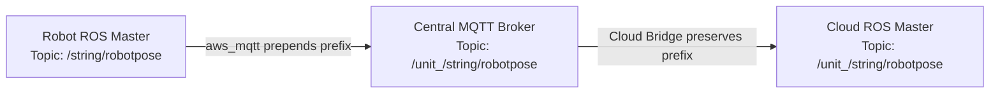
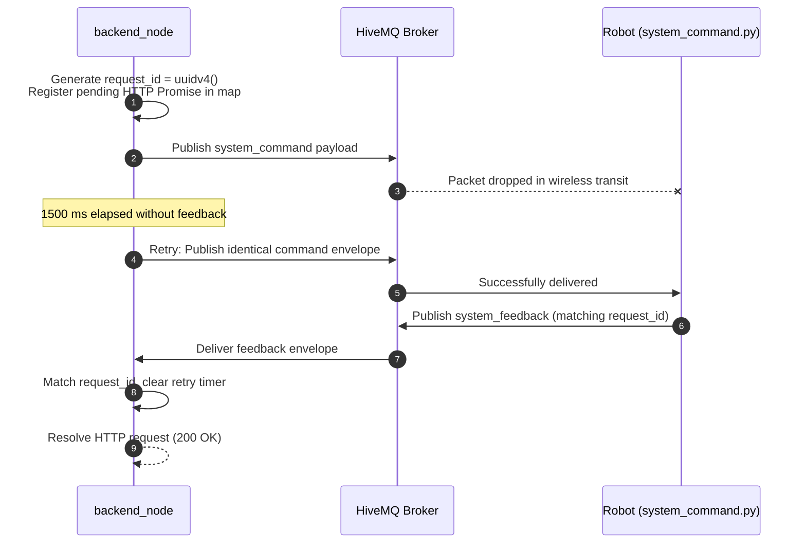
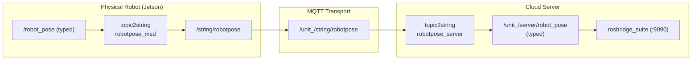
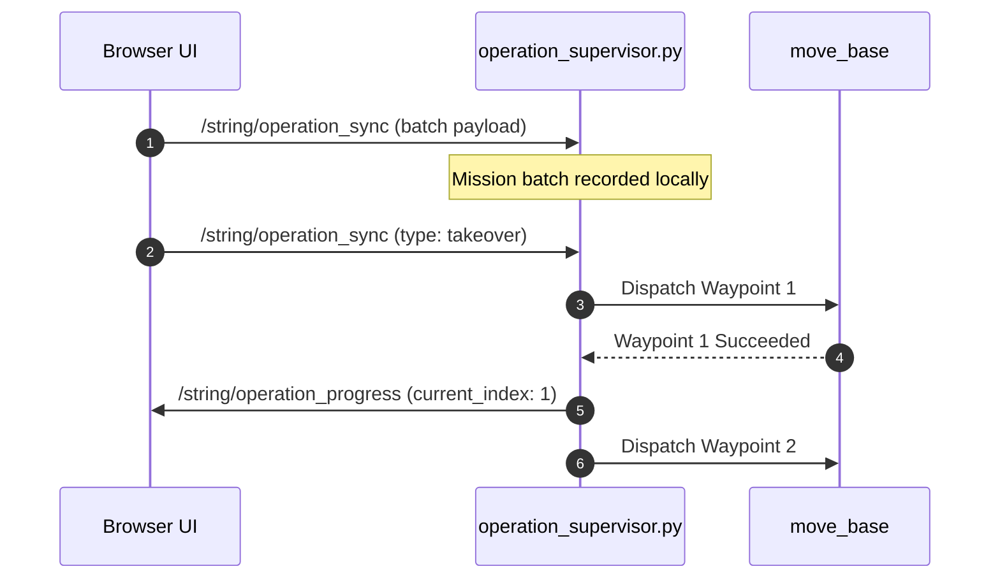
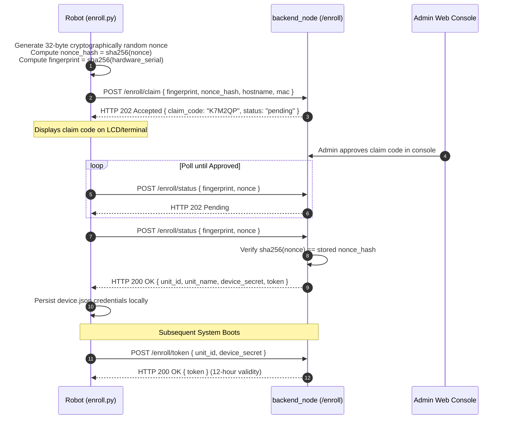

# メッセージコントラクト

<RoleBadge role="developer" />

この文書は、MSD700 システムのすべてのマシン間データ ペイロードに対する完全かつ信頼できる仕様を提供します。 MQTT コマンドとフィードバック チャネル、シリアル化された ROS ストリーミング トピック、オペレーション スーパーバイザ同期プロトコル、WebRTC シグナリング、およびハードウェア登録交換について説明します。

HTTP サーフェスについては、[API リファレンス](/ja/development/api-reference) を参照してください。有限状態マシンについては、[状態と動作](/ja/development/state-and-behavior) を参照してください。システム全体の設計については、[アーキテクチャ](/ja/development/architecture)を参照してください。

::: info Contract Verification Notice
ペイロード形状は、アクティブなソース コード (`backend_node`、`system_command.py`、`operation_supervisor.py`、`topic2string`、`enroll_api.js`) から直接派生します。コードベース内のフィールドの変更はすべて、同じコミットで更新する必要があります。
:::

## フリート アドレス指定スキーム

すべての物理ロボットは、固有のプレフィックス `/unit_<ULID>/...` によってアドレス指定されます。 ULID (Universally Unique Lexicographically Sortable Identifier) は、登録時に中央の `units` データベース テーブル内のロボットに割り当てられる主キーです。



|ホップの場所 |トピックの形式 |エンジニアリングの目的 |
| --- | --- | --- |
| **ロボット ローカル ROS マスター** | `/string/robotpose` |スコープのないローカル名前空間 (オンボード roscore ごとに 1 つのロボット)。 |
| **中央 MQTT ブローカー** | `/unit_<ULID>/string/robotpose` |すべてのロボットを HiveMQ 上で多重化するフリート スコープのトピック名前空間。 |
| **クラウド ROS マスター** | `/unit_<ULID>/string/robotpose` |ユニットごとのクラウドリレーとロスブリッジによって消費される名前空間付きトピック。 |

::: warning Mandatory `unit_` Prefix Rule
ROS グラフのリソース名は、アルファベット、チルダ、またはスラッシュで始まる必要があります。 ULID は数字で始まるため (例: `01JZ...`)、`/01JZ.../string/map` は無効な構文であり、ROS によって拒否されます。 `unit_` プレフィックスは、MQTT トピックとの 1:1 マッピングを維持しながら、厳密な ROS 準拠を保証します。
:::

## コマンドおよび制御チャネル

2 つの専用 MQTT トピックは、クラウド サーバーと物理ユニット間のすべての双方向の要求と応答の対話を処理します。

| MQTT トピック |方向 |プロデューサーノード |コンシューマ ノード |説明 |
| --- | --- | --- | --- | --- |
| `/unit_<ULID>/system_command` |クラウドからロボットへ | `backend_node` (特急) | `system_command.py` (ROS) |制御コマンド、ナビゲーション目標、およびモード変更をディスパッチします。 |
| `/unit_<ULID>/system_feedback` |ロボットからクラウドへ | `system_command.py` (ROS) | `backend_node` (特急) |実行ステータス、エラー メッセージ、テレメトリ ping を返します。 |

### コマンド ペイロード エンベロープ

```json
{
  "header": "navigation",
  "command": "pointstamped",
  "config": {
    "resource": {
      "X": 3.1416,
      "Y": -1.2,
      "Z": 0.0
    }
  },
  "metadata": {
    "timestamp": "2026-08-12T04:11:52.913Z",
    "request_id": "0b0d1f4e-6a2c-4c7e-9a51-1f1b6f7a2f10"
  }
}
```

|フィールド名 |タイプ |必須 |説明 |
| --- | --- | --- | --- |
| `header` |文字列 |はい |ターゲットサブシステムハンドラ: `hardware`、`navigation`、`mapping`、`boustrophedon`、`manual`、`autopilot`、`emergency_stop`、`autoalign`。 |
| `command` |文字列 |はい |ハンドラー内の特定のアクション動詞。認識されない動詞はログに記録され、削除されます。 |
| `config` |オブジェクト |条件付き |コマンドパラメータ (通常は `config.resource` 内)。 |
| `data` |オブジェクト |条件付き | `hardware.ping` によって使用される代替パラメータ ブロック。 |
| `metadata.request_id` | UUID v4 |はい | `backend_node` によって HTTP リクエストごとに生成される一意の相関トークン。 |
| `metadata.timestamp` | ISO8601 |はい |診断トレース用の送信者のタイムスタンプ文字列。 |

### フィードバック ペイロード エンベロープ

```json
{
  "header": "navigation",
  "command": "pointstamped",
  "data": {
    "status": true,
    "message": "Goal published to move_base"
  },
  "metadata": {
    "timestamp": 1786503112.913,
    "request_id": "0b0d1f4e-6a2c-4c7e-9a51-1f1b6f7a2f10"
  }
}
```

|フィールド名 |タイプ |説明 |
| --- | --- | --- |
| `data.status` |ブール値 | `true` はコマンドが受け付けられた/実行されたことを示します。 `false` は実行拒否を示します。 |
| `data.message` |文字列 |ロボットによる人間が読める診断の説明。 |
| `metadata.timestamp` |フロート |ロボットからのウォールクロック エポック秒 (`rospy.get_time()`)。 |
| `metadata.request_id` | UUID v4 |コマンド エンベロープの元の `request_id` と一致します。 |

### コマンド相関および再試行アーキテクチャ



|パラメータ |デフォルト値 |構成の場所 |目的 |
| --- | --- | --- | --- |
| `DEFAULT_TIMEOUT` | `30000` ミリ秒 (30 秒) | `backend_node` | HTTP リクエストが `504 Gateway Timeout` で応答するまでにフィードバックを待機する最大時間。 |
| `COMMAND_RETRY_INTERVAL` | `1500` ミリ秒 (1.5 秒) | `backend_node` |変化するコマンドが未確認のままである間の再送信期間。 |

::: danger Ping Heartbeat Exclusion
`header: "hardware", command: "ping"` は間隔ごとに **1 回**厳密に送信され、再試行されることはありません。ハートビートの喪失は、ロボットの安全監視の主なトリガーです。失われた ping を再試行すると、ネットワークのドロップアウトが隠蔽され、自動緊急停止メカニズムが無効になります。
:::

## コマンドリファレンスカタログ

### 1. ハードウェア サブシステム (`header: "hardware"`)

```json
// Command: "check"
{ "header": "hardware", "command": "check", "metadata": { ... } }

// Command: "idle"
{ "header": "hardware", "command": "idle", "metadata": { ... } }
```

|コマンド動詞 |ペイロードの内容 |目的 |
| --- | --- | --- |
| `ping` | [ハートビート Ping セクション](#heartbeat-ping-and-lease-contract) を参照してください。ハートビート、リースの取得、テレメトリの取得、およびウォッチドッグの更新。 |
| `check` |なし |低レベルのモータードライバーとマイクロコントローラーのステータスを問い合わせます。 |
| `init` |なし |ハードウェア インターフェイスと電力線を初期化します。 |
| `stop` |なし |ハードウェア周辺機器とパワーステージをシャットダウンします。 |
| `idle` |なし |ロボットに電力を供給したまま、実行中のナビゲーション/マッピング ノードを破棄します。 |
| `battery_update` | `{ "config": { ... } }` |電力テレメトリ レベルを手動で更新します。 |

### 2. ナビゲーション サブシステム (`header: "navigation"`)

```json
// Command: "init"
{
  "header": "navigation",
  "command": "init",
  "config": {
    "resource": {
      "map_name": "01JZ8QK2H0000000000000MAP",
      "default_save_path": "/home/ubuntu/ros_maps",
      "homebase_x": 1.25,
      "homebase_y": -0.5,
      "homebase_z": 0.0,
      "homebase_ox": 0.0,
      "homebase_oy": 0.0,
      "homebase_oz": 0.0,
      "homebase_ow": 1.0
    }
  },
  "ensure_unpaused": true
}

// Command: "pointstamped" (Single Goal)
{
  "header": "navigation",
  "command": "pointstamped",
  "config": {
    "resource": { "X": 3.1416, "Y": -1.2, "Z": 0.0 }
  }
}
```

- `map_name`: ディスク上の `<ULID>.pgm` および `<ULID>.yaml` に対応するマップ ULID 識別子。
- `ensure_unpaused: true`: ナビゲーションの起動時に、待機中の `/emergency_pause` ロックを自動的にクリアするようにロボットに指示します。
- `command: "deactivate"`: アクティブなナビゲーション スタックを終了します (ペイロードを受け取りません)。

### 3. マッピング サブシステム (`header: "mapping"`)

```json
// Command: "stop" (Save and Upload Map)
{
  "header": "mapping",
  "command": "stop",
  "config": {
    "resource": {
      "map_name": "01JZ8QK2H0000000000000MAP",
      "display_map_name": "Production Hall Level 1",
      "map_ulid": "01JZ8QK2H0000000000000MAP",
      "created_by": "01JZ7YV5CQUSER00000000000",
      "unit_id": "01JZ8P9WZ0UNIT00000000000",
      "homebase_x": 1.2,
      "homebase_y": 0.5,
      "homebase_z": 0.0,
      "homebase_ox": 0.0,
      "homebase_oy": 0.0,
      "homebase_oz": 0.0,
      "homebase_ow": 1.0
    }
  }
}
```

SLAM マップの保存には、標準の 30 秒の HTTP タイムアウトよりも時間がかかります。したがって、`mapping stop` はすぐに `{ request_id, map_ulid }` を含む HTTP 200 を返します。フロントエンドは `GET /api/mapping/progress/:request_id` の SSE ストリームに接続して、進行状況を監視します。

#### マッピング進行状況のフィードバック (`header: "mapping_progress"`)

```json
{
  "header": "mapping_progress",
  "command": "stop",
  "data": {
    "status": true,
    "progress": 100,
    "stage": "completed",
    "message": "Saved on the robot and the server.",
    "terminal": true,
    "outcome": "completed"
  },
  "metadata": {
    "timestamp": 1734000000.0,
    "request_id": "..."
  }
}
```

|結果の価値 |説明 |
| --- | --- |
| `completed` |ローカル ユニットのメディア サーバーとクラウド サーバーの両方に正常に書き込まれました。 |
| `cloud_pending` |ローカルユニットのメディアサーバーのみに書き込まれます。クラウド レプリケーションは次の同期間隔で完了します。 |
| `failed` |マッピングの保存に失敗しました。セッションは再試行のために開いたままになります。 |

### 4. ボストロフェドンのエリア範囲 (`header: "boustrophedon"`)

```json
// Command: "init"
{
  "header": "boustrophedon",
  "command": "init",
  "config": {
    "use_autocover": false,
    "polygon": [
      { "x": 0.0, "y": 0.0 }, { "x": 10.0, "y": 0.0 },
      { "x": 10.0, "y": 5.0 }, { "x": 0.0, "y": 5.0 }
    ],
    "areas": [
      [ { "x": 0.0, "y": 0.0 }, { "x": 10.0, "y": 0.0 }, { "x": 10.0, "y": 5.0 }, { "x": 0.0, "y": 5.0 } ]
    ],
    "exclusions": [
      [ { "x": 3.0, "y": 2.0 }, { "x": 5.0, "y": 2.0 }, { "x": 5.0, "y": 4.0 }, { "x": 3.0, "y": 4.0 } ]
    ],
    "ensure_unpaused": true
  }
}
```

- `areas`: ターゲット操作プレイリストを形成するポリゴンの順序付き配列。
- `exclusions`: 立ち入り禁止障害物ゾーンがカバレッジ スイープから差し引かれます。
- `command: "pause"`: `{ "pause": true }` または `{ "pause": false }` を受け入れます。
- `command: "deactivate"`: カバレッジの計画を停止します。

## ハートビート Ping とリース契約

ハートビート ping メッセージは、ロボットのオペレーティング リース、安全ウォッチドッグ タイマー、およびステータス テレメトリを管理します。

### リクエストペイロード (`data` ブロック)

```json
{
  "session_id": "8b1c3f2a-605d-4871-bc01-e28a9b3d1f04",
  "user_id": "01JZ7YV5CQUSER00000000000",
  "claim": true,
  "release": false,
  "page": "navigation",
  "origin": "cloud",
  "force_takeover": false
}
```

|パラメータ |出典 |説明 |
| --- | --- | --- |
| `session_id` |ブラウザタブ |ブラウザタブごとに一意の UUID。 |
| `user_id` |バックエンド JWT |サーバー バックエンドによって認証された JWT トークンから厳密に抽出されます。 |
| `claim` |ブラウザ | `true` 操作ページ (ナビゲーション、マッピング) から。 `false` 読み取り専用のフリート リストを参照する場合。 |
| `release` |ブラウザ |ページ終了時にオペレーティング リースを明示的に放棄します。 |
| `page` |ブラウザ |元のページ: `dashboard`、`login`、`navigation`、`mapping`。 |
| `origin` |バックエンド環境 | `cloud` または `local`、サーバー構成によって決まります。 |
| `force_takeover` |ブラウザ | `true` オペレーターが既存のリースの引き継ぎを確認したとき。 |

### 応答ペイロード (`data` ブロック)

```json
{
  "status": true,
  "robot_activity": "navigation_point_published",
  "active_page": "navigation",
  "battery": 87.5,
  "uptime": 42.3,
  "hw_status": "ready",
  "manual_override": false,
  "autopilot": false,
  "active_map_id": "01JZ8QK2H0000000000000MAP",
  "in_use": false,
  "in_use_by": null,
  "origin_conflict": false,
  "origin_conflict_side": null
}
```

|応答フィールド |説明 |
| --- | --- |
| `robot_activity` |フィルタリングされたアクティビティ状態 (例: `idle`、`navigating`、`mapping`、`stuck`)。 |
| `active_page` |スタック検出器の評価前の生のアクティブ ページ。正しいルーティングを保証します。 |
| `battery` |バッテリーの充電状態のパーセンテージ (フロート)。 |
| `uptime` |システムの稼働時間 (分単位)。 |
| `hw_status` |ハードウェア監視サブシステム (`ready`、`fault`) によってステータスが報告されます。 |
| `manual_override` | `true` マニュアル テレオペ モードが有効な場合。 |
| `autopilot` | `true` 自律自動操縦シーケンサーがアクティブな場合。 |
| `in_use` |アカウントレベルのロック: 別のユーザーアカウントがリースを保持していることを示します。 |
| `origin_conflict` |セッションレベルの競合: 同じアカウントの別のタブがアクティブであることを示します。 |

## ストリーミング テレメトリのトピック

ストリーミング テレメトリは、`topic2string` を介してユニット上で JSON 文字列にシリアル化され、MQTT 経由でルーティングされ、`rosbridge` のサーバー上で入力された ROS メッセージに変換されます。



### テレメトリ ストリームの定義

|ロボットトピック |クラウドサーバーのトピック |更新レート |コンテンツの説明 |
| --- | --- | --- | --- |
| `/string/robotpose` | `/unit_<ULID>/server/robot_pose` | 25Hz | `map` フレーム (`geometry_msgs/PoseStamped`) 内のロボットの位置と方向。 |
| `/string/map` | `/unit_<ULID>/server/slam/map` |更新時 |圧縮された占有グリッド (`base64(zlib(JSON))`)。 |
| `/string/laserscan` | `/unit_<ULID>/server/scan` | 2Hz |圧縮 2D レーザー スキャン データ (`sensor_msgs/LaserScan`)。 |
| `/string/move_base/NavfnROS/plan` | `/unit_<ULID>/server/move_base/NavfnROS/plan` |計画中 |グローバル パス座標 (`nav_msgs/Path`)。 |
| `/string/move_base/TebLocalPlannerROS/local_plan` | `/unit_<ULID>/server/move_base/TebLocalPlannerROS/local_plan` |連続 |ローカル軌道軌道 (`nav_msgs/Path`)。 |
| `/string/boustrophedon_path` | `/unit_<ULID>/server/boustrophedon_path` |計画中 |カバレッジ スイープ ラインの座標 (`nav_msgs/Path`)。 |
| `/string/operation_snapshot` | `/unit_<ULID>/string/operation_snapshot` |ラッチ付き |再接続回復のための完全なアクティブ ミッション スナップショット。 |

## 運用監視者の同期

`operation_supervisor.py` はロボットでの自律的なミッションの実行を管理するため、ブラウザーのタブが閉じていてもミッションは中断されずに継続されます。



### オペレーション同期ペイロード (`/string/operation_sync`)

```json
{
  "type": "batch",
  "operation": "multi_pinpoint",
  "route_mode": "round-trip",
  "waypoints": [
    {
      "position": { "x": 1.0, "y": 2.0, "z": 0.0 },
      "orientation": { "x": 0.0, "y": 0.0, "z": 0.0, "w": 1.0 }
    },
    {
      "position": { "x": 4.5, "y": 2.0, "z": 0.0 },
      "orientation": { "x": 0.0, "y": 0.0, "z": 0.0, "w": 1.0 }
    }
  ],
  "current_index": 0,
  "map_name": "01JZ8QK2H0000000000000MAP",
  "coverage": null,
  "timestamp": 1786503112.913
}
```

|アクションの種類 (`type`) |目的 |
| --- | --- |
| `batch` |ミッション開始時に完全なウェイポイントシーケンスをアップロードします。 |
| `progress` |オペレーターガイドによる実行中に現在のウェイポイントインデックスを更新します。 |
| `takeover` |オートパイロット モードを開始し、ウェイポイントのシーケンスをスーパーバイザーに渡します。 |
| `release` |オートパイロット モードを解除し、制御をブラウザ ループに戻します。 |
| `pause` |ウェイポイント キューを保持しながら実行を一時停止します。 |
| `stop` |ミッションを停止し、ウェイポイントのバッチをクリアします。 |
| `resync` |ミッション スナップショットの即時再ブロードキャストを要求します。 |

## ロボット登録ハンドシェイク

未登録のロボットは、安全な 3 段階の暗号化ハンドシェイクを介してクラウド サーバーに自身を登録します。



::: tip Nonce Security Purpose
32 バイトの秘密ノンスにより、物理ロボットの電源がオフになっている間、MAC アドレス スプーフィングが承認されたロボット登録をハイジャックできないことが保証されます。デバイスシークレットは、本物のロボットが事前に登録されたハッシュと一致する元の平文ノンスを明らかにした場合にのみ送信されます。
:::

## 関連ドキュメント

- [API リファレンス](/ja/development/api-reference): REST API エンドポイントとデータ スキーマ。
- [状態と動作](/ja/development/state-and-behavior): 詳細なステート マシンと障害遷移。
- [アーキテクチャ](/ja/development/architecture): 高レベルのシステム トポロジと信頼境界。